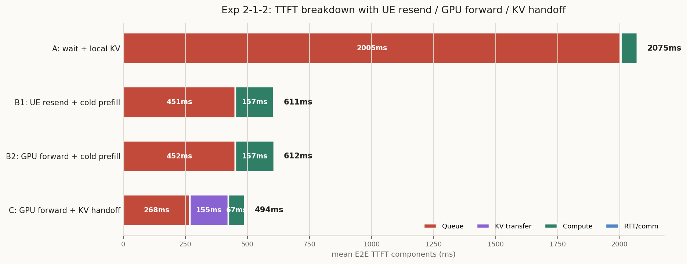

# 2026-07-05: 検証2-1-2(KVキャッシュ考慮) — N=50・1:2負荷・RTX4090

日付: 2026-07-05

## 目的

検証2-1-1ではKVキャッシュを考慮せず、混雑GPUから空いているGPUへ
リダイレクトする効果を見た。今回はKVキャッシュを考慮し、以下の3手法を
同じ1:2負荷ワークロードで比較した。

| 手法 | ポリシー | 想定するTTFT構造 |
| --- | --- | --- |
| 方法A | `NEAREST_KV` | リダイレクトせず最寄りGPUで待つ。`TTFT = キュー待ち(大) + 計算時間(小) + RTT(小)` |
| 方法B | `NEAREST_MIGRATE` | リダイレクトするがKVは引き継がない。`TTFT = キュー待ち(小) + 計算時間(大) + RTT(小)` |
| 方法C | `NEAREST_MIGRATE_KV` | リダイレクトし、KVを引き継ぐ。`TTFT = キュー待ち(小) + KV引き継ぎ + 計算時間(小) + RTT(大)` |

方法Aのために `NEAREST_KV` を追加した。これは `reuse_prefix_toks` で指定された
prefix KVが最寄りGPUに既に存在すると仮定し、ローカルprefix cacheへseedする。
GPU間転送はないためKV転送遅延は0で、prefillは差分のみになる。

## ワークロードと環境

| 項目 | 値 |
| --- | --- |
| ワークロード | `workloads/generated/geo_2gpu100_kv_workload_1to2_n50.jsonl` |
| リクエスト数 | 50 |
| 最近傍GPU割当 | GPU0:GPU1 = 17:33 |
| ハードウェア | `configs/cluster/single_node_multi_instance_rtx4090.json` |
| `max_num_seqs` | 24 |
| UE-GPU通信 | 10Mbps、距離比例遅延 5ns/m |
| GPU-GPU backbone | 1Gbps、5km |
| KV再利用量 | `reuse_prefix_toks`。最大1024 tokens、短いpromptではinput長に丸め込み |

## 実行CSV

- 方法A: `results/exp212-1to2-nearest-kv.csv`
- 方法B: `results/exp212-1to2-nearest-migrate.csv`
- 方法C: `results/exp212-1to2-nearest-migrate-kv.csv`

## 図

作成したNotebookと画像:

- `outputs/image/2026-07-05_exp212_n50_1to2_rtx4090_kv_ttft_plots.ipynb`
- `outputs/image/2026-07-05_exp212_n50_1to2_rtx4090_kv_ttft_breakdown.png`
- `outputs/image/2026-07-05_exp212_n50_1to2_rtx4090_kv_ttft_cdf.png`


## 結果

| 手法 | 割当 | rerouted | Mean E2E TTFT | P50 E2E TTFT | P99 E2E TTFT | Mean total latency |
| --- | --- | ---: | ---: | ---: | ---: | ---: |
| 方法A `NEAREST_KV` | 17:33 | 0/50 | 2075.48ms | 51.77ms | 11717.29ms | 17677.74ms |
| 方法B `NEAREST_MIGRATE` | 26:24 | 9/50 | 613.66ms | 154.43ms | 9342.91ms | 17881.74ms |
| 方法C `NEAREST_MIGRATE_KV` | 26:24 | 9/50 | 495.11ms | 51.77ms | 7277.78ms | 16828.54ms |

TTFT breakdown:

| 手法 | Queue | KV transfer | Compute / Prefill | RTT/comm | Mean E2E TTFT |
| --- | ---: | ---: | ---: | ---: | ---: |
| 方法A `NEAREST_KV` | 2004.54ms | 0.00ms | 67.32ms | 3.62ms | 2075.48ms |
| 方法B `NEAREST_MIGRATE` | 451.56ms | 0.00ms | 156.67ms | 3.63ms | 613.66ms |
| 方法C `NEAREST_MIGRATE_KV` | 267.95ms | 155.36ms | 67.16ms | 3.63ms | 495.11ms |

方法B/Cのリダイレクト対象9件だけを見ると以下になる。

| 手法 | Rerouted mean E2E TTFT | Rerouted queue | Rerouted prefill | Rerouted KV transfer | Rerouted communication |
| --- | ---: | ---: | ---: | ---: | ---: |
| 方法B `NEAREST_MIGRATE` | 2195.68ms | 2068.35ms | 113.61ms | 0.00ms | 3.76ms |
| 方法C `NEAREST_MIGRATE_KV` | 2281.46ms | 1370.41ms | 38.61ms | 863.12ms | 866.88ms |

## 解釈

方法AはKV再利用によりprefillが67.32msまで小さくなっている。一方で
リダイレクトしないため、1:2負荷の混雑側GPUでキュー待ちが支配的になる。
平均E2E TTFT 2075.48msのうち、Queueが2004.54msを占める。
したがって、KV再利用だけでは混雑キューを消せない。

方法BはKVを捨ててcold prefillするため、prefillは156.67msと大きい。
しかしリダイレクトにより割当が17:33から26:24へ均され、平均Queueは
451.56msまで下がる。結果として方法Aより平均TTFTは大幅に改善する。

方法Cはリダイレクトでキューを削りつつ、KV引き継ぎによりprefillも
67.16msまで小さくできた。KV転送は平均155.36msの追加コストになるが、
それでもQueue削減とprefill削減の合計効果が勝ち、平均E2E TTFTは
495.11msで3手法中最良だった。P99 E2E TTFTも7277.78msで最良。

今回の条件では、以下の関係が観測された。

```text
方法A: キュー待ち 大 + 計算時間 小 + RTT 小
方法B: キュー待ち 小 + 計算時間 大 + RTT 小
方法C: キュー待ち 小 + KV引き継ぎ + 計算時間 小 + RTT 大
```

結論として、1:2負荷では「KV再利用のみ」よりも「負荷を逃がす」効果が
大きい。さらに、GPU間KV引き継ぎのコストを払っても、prefill削減と
キュー削減を同時に得られる方法Cが最も良い。

## 追記(2026-07-06): 4手法版(UE差し戻し方式`NEAREST_REJECT`を追加)

上記は方法A/B/Cの3手法比較だったが、その後`NEAREST_REJECT`(UE差し戻し方式、
GPU間転送する`NEAREST_MIGRATE`とは別に、UEが2番目に近いGPUへ送り直す方式)を
追加した4手法版を実行した。ラベルは以下のように対応する。

| 表記 | ポリシー | 説明 |
| --- | --- | --- |
| A: wait + local KV | `NEAREST_KV` | 上記と同じ |
| B1: UE resend + cold prefill | `NEAREST_REJECT` | 新規追加。UEが2番目に近いGPUへ送り直す方式、KV引き継ぎ無し |
| B2: GPU forward + cold prefill | `NEAREST_MIGRATE` | 上記の方法Bと同じ |
| C: GPU forward + KV handoff | `NEAREST_MIGRATE_KV` | 上記の方法Cと同じ |

### 実行コマンド

```bash
cd /Users/taichikondo/LLMServingSim && docker run --rm --platform linux/amd64 \
  -v /Users/taichikondo/LLMServingSim:/app/LLMServingSim \
  -w /app/LLMServingSim \
  astrasim/tutorial-micro2024 \
  bash -lc '
set -e

pip3 install -q rich pyinstrument pyyaml msgspec "protobuf>=6,<7"

export PYTHONPATH=/app/LLMServingSim/astra-sim/extern/graph_frontend/chakra/build/lib
DATASET=workloads/generated/geo_2gpu100_kv_workload_1to2_n50.jsonl
CLUSTER=configs/cluster/single_node_multi_instance_rtx4090.json

for policy in NEAREST_KV NEAREST_REJECT NEAREST_MIGRATE NEAREST_MIGRATE_KV; do
  case "$policy" in
    NEAREST_KV)
      OUT=results/exp212-1to2-nearest-kv.csv
      RUN=exp212-1to2-nearest-kv
      EXTRA=""
      ;;
    NEAREST_REJECT)
      OUT=results/exp212-1to2-nearest-reject.csv
      RUN=exp212-1to2-nearest-reject
      EXTRA="--no-enable-prefix-caching"
      ;;
    NEAREST_MIGRATE)
      OUT=results/exp212-1to2-nearest-migrate.csv
      RUN=exp212-1to2-nearest-migrate
      EXTRA="--gpu-backbone-bandwidth-gbps 1 --gpu-backbone-distance-m 5000 --no-enable-prefix-caching"
      ;;
    NEAREST_MIGRATE_KV)
      OUT=results/exp212-1to2-nearest-migrate-kv.csv
      RUN=exp212-1to2-nearest-migrate-kv
      EXTRA="--gpu-backbone-bandwidth-gbps 1 --gpu-backbone-distance-m 5000"
      ;;
  esac

  echo "=== RUN ${policy} ==="

  python3 -m serving \
    --cluster-config "$CLUSTER" \
    --dataset "$DATASET" \
    --request-routing-policy "$policy" \
    --max-num-seqs 24 \
    --output "$OUT" \
    --run-id "$RUN" \
    --log-level WARNING \
    $EXTRA
done

ls -lh \
  results/exp212-1to2-nearest-kv.csv \
  results/exp212-1to2-nearest-reject.csv \
  results/exp212-1to2-nearest-migrate.csv \
  results/exp212-1to2-nearest-migrate-kv.csv
'
```

出力CSV: `results/exp212-1to2-nearest-kv.csv` / `-reject.csv` / `-migrate.csv` / `-migrate-kv.csv`

図: `outputs/image/2026-07-05_exp212_n50_1to2_rtx4090_kv_with_reject_ttft_breakdown.png` /
`..._with_reject_ttft_cdf.png`



### 結果(4手法)

| 手法 | 割当(GPU0:GPU1) | rerouted | Mean E2E TTFT | P50 E2E TTFT | P99 E2E TTFT | Mean total latency |
| --- | --- | ---: | ---: | ---: | ---: | ---: |
| A `NEAREST_KV` | 17:33 | 0/50 | 2075.48ms | 51.77ms | 11717.29ms | 17674.21ms |
| B1 `NEAREST_REJECT` | 26:24 | 9/50 | 613.66ms | 154.43ms | 9342.91ms | 17875.77ms |
| B2 `NEAREST_MIGRATE` | 26:24 | 9/50 | 613.66ms | 154.43ms | 9342.91ms | 17876.41ms |
| C `NEAREST_MIGRATE_KV` | 26:24 | 9/50 | 495.11ms | 51.77ms | 7277.78ms | 16668.64ms |

TTFT breakdown:

| 手法 | Queue | KV transfer | Compute / Prefill | RTT/comm | Mean E2E TTFT |
| --- | ---: | ---: | ---: | ---: | ---: |
| A `NEAREST_KV` | 2004.54ms | 0.00ms | 67.32ms | 3.62ms | 2075.48ms |
| B1 `NEAREST_REJECT` | 450.92ms | 0.00ms | 156.67ms | 3.63ms | 611.22ms |
| B2 `NEAREST_MIGRATE` | 451.56ms | 0.00ms | 156.67ms | 3.63ms | 611.87ms |
| C `NEAREST_MIGRATE_KV` | 267.95ms | 155.36ms | 67.16ms | 3.63ms | 494.11ms |

### 解釈(追記分)

`NEAREST_REJECT`(UE差し戻し)と`NEAREST_MIGRATE`(GPU間転送)は、リダイレクト
判定ロジック(キャパ超過なら2番目に近いGPUへ)が同じなため、TTFT・リダイレクト
件数(9/50)・GPU割当(26:24)ともにほぼ同一の結果になった。両者の違いは
リダイレクト自体のコストモデル(UE往復 vs GPUバックボーン)だけだが、
どちらも`~0.003〜0.1ms`オーダーとRTT全体(3.6ms程度)に対して無視できる
差でしかなく、結果に有意な違いは出なかった。これは`2026-07-04`〜`07-05`の
一連の実験で繰り返し確認してきた「リダイレクト自体の通信コストはほぼ常に
無視できる」という知見と整合する。

4手法で比較しても、KVキャッシュ引き継ぎを行う方法C(`NEAREST_MIGRATE_KV`)が
Mean E2E TTFT・P99 TTFTとも最良のままだった。UE差し戻し(B1)を追加しても
結論(方法Cが最良)は変わらない。

