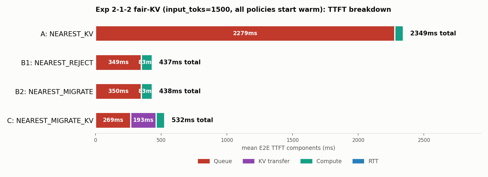
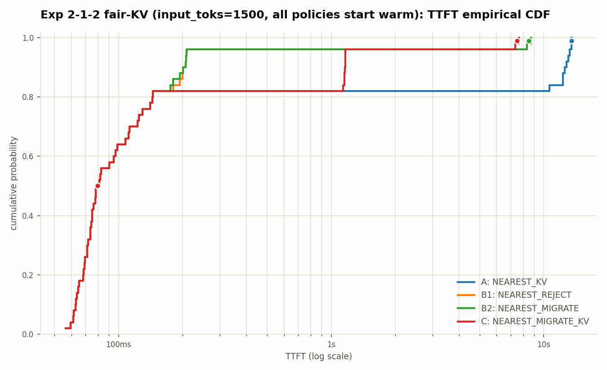

# 2026-07-07: 検証2-1-2 再検証 — 4手法を公平なKV前提に揃える

日付: 2026-07-07

## 問題提起

これまでの`exp212`(および`input1500`統一版)では、4手法の比較が公平ではなかった。

| 手法 | prefix caching | KV再利用の前提 |
| --- | --- | --- |
| A `NEAREST_KV` | 有効 | 全リクエストが最初からローカルKVを持っている前提 |
| B1 `NEAREST_REJECT` | **無効**(`--no-enable-prefix-caching`) | 常にcold prefill |
| B2 `NEAREST_MIGRATE` | **無効**(`--no-enable-prefix-caching`) | 常にcold prefill |
| C `NEAREST_MIGRATE_KV` | 有効 | 全リクエストが最初からローカルKVを持っている前提 |

つまり「リダイレクトするかどうか」という本来比較したい軸に、「KVキャッシュが
最初から溜まっているかどうか」という別の軸が混ざっていた。B1/B2は**リダイレクト
されなかったリクエストまで**毎回コールドprefillを強いられており、これはB1/B2に
とって不利な設定だった。

## 修正方針

**4手法とも「各リクエストは自分のhome GPUに、最初からKVキャッシュが溜まっている」
という前提で揃える。** 違いは、リダイレクトが発生したときにそのキャッシュが
どうなるかだけにする。

- home GPUで処理される限り、4手法とも同じくローカルKV再利用が効く(無料)。
- `NEAREST_REJECT`/`NEAREST_MIGRATE`: リダイレクトされたら、そのキャッシュは
  home GPUに残されたまま移動しない(移送する仕組みが無い方式なので)。よって
  リダイレクトされた分だけはcold prefillになる。これは方式の特性として正しい。
- `NEAREST_MIGRATE_KV`: リダイレクト時にキャッシュ自体をGPU間で移送するので、
  リダイレクトされた分もprefillは短縮されるが、移送コストを payする。

## 実装した変更

`serving/core/router.py`を変更し、`reuse_prefix_toks`のロードと
`_attach_local_kv_reuse()`(ローカルKV再利用、転送コスト無料)の適用を、
従来`NEAREST_KV`/`NEAREST_MIGRATE_KV`だけに限定していたのを、
**「まだリダイレクトされていない(=home GPUにいる)」全リクエスト**に対して
4方式共通で適用するように拡張した。`_reject_resolved`フラグ(そのリクエストが
既にリダイレクト判定を経たか)を使って、リダイレクト後は`NEAREST_REJECT`/
`NEAREST_MIGRATE`にはこの恩恵を与えないようにしている(ソースコード中に
`>>> SPEC: fair-comparison KV baseline ... <<< SPEC`のコメントで差分を明示)。

あわせて、実行コマンドから`NEAREST_REJECT`/`NEAREST_MIGRATE`の
`--no-enable-prefix-caching`を外した。

## 実行コマンド

`workloads/generated/geo_2gpu100_kv_workload_1to2_n50_input1500.jsonl`
(input_toks=1500統一版、`2026-07-07-exp212-input1500-uniform-length-report.md`参照)に対して、

```bash
for policy in NEAREST_KV NEAREST_REJECT NEAREST_MIGRATE NEAREST_MIGRATE_KV; do
  case "$policy" in
    NEAREST_KV)          EXTRA="" ;;
    NEAREST_REJECT)       EXTRA="" ;;
    NEAREST_MIGRATE)      EXTRA="--gpu-backbone-bandwidth-gbps 1 --gpu-backbone-distance-m 5000" ;;
    NEAREST_MIGRATE_KV)   EXTRA="--gpu-backbone-bandwidth-gbps 1 --gpu-backbone-distance-m 5000" ;;
  esac
  python3 -m serving --cluster-config configs/cluster/single_node_multi_instance_rtx4090.json \
    --dataset workloads/generated/geo_2gpu100_kv_workload_1to2_n50_input1500.jsonl \
    --request-routing-policy "$policy" --max-num-seqs 24 \
    --output "results/exp212-input1500-fairkv-nearest-<policy>.csv" \
    --run-id "exp212-input1500-fairkv-<policy>" --log-level WARNING $EXTRA
done
```

出力: `results/exp212-input1500-fairkv-nearest-{kv,reject,migrate,migrate-kv}.csv`

## 図

- `outputs/exp212_input1500_fairkv/ttft_breakdown.png`
- `outputs/exp212_input1500_fairkv/ttft_cdf.png`





## 結果

| 手法 | GPU0:GPU1 | rerouted | Mean E2E TTFT | P99 | Mean latency |
| --- | --- | ---: | ---: | ---: | ---: |
| A `NEAREST_KV` | 17:33 | 0/50 | 2347.71ms | 13509.76ms | 18959.31ms |
| B1 `NEAREST_REJECT` | 26:24 | 9/50 | **438.51ms** | 8519.11ms | 18144.82ms |
| B2 `NEAREST_MIGRATE` | 26:24 | 9/50 | **438.05ms** | 8519.42ms | 18145.50ms |
| C `NEAREST_MIGRATE_KV` | 26:24 | 9/50 | 531.94ms | **7497.80ms** | 17588.67ms |

TTFT breakdown(mean, 全50件):

| 手法 | Queue | KV transfer | Compute | RTT |
| --- | ---: | ---: | ---: | ---: |
| A `NEAREST_KV` | 2278.64ms | 0.00ms | 65.45ms | 5.31ms |
| B1 `NEAREST_REJECT` | 349.38ms | 0.00ms | 82.75ms | 5.32ms |
| B2 `NEAREST_MIGRATE` | 349.84ms | 0.00ms | 82.75ms | 5.32ms |
| C `NEAREST_MIGRATE_KV` | 268.51ms | 193.28ms | 64.93ms | 5.32ms |

リダイレクトされた9件だけの内訳(全体平均に潜っていた本質はここにある):

| 手法 | rerouted件数 | 平均Queue | 平均Compute(prefill) | 平均KV transfer |
| --- | ---: | ---: | ---: | ---: |
| B1/B2 | 9 | 約1866〜1868ms | 162.75ms(cold) | 0ms |
| C | 9 | 1416.61ms | 63.78ms(KV再利用) | 1073.77ms |

非リダイレクト(41件)は3手法とも完全に同一(Queue 16.49ms、Compute 65.19ms) —
公平な前提になっていることの確認。

## 解釈: 結論が逆転した

**修正前(cold prefill前提のB1/B2 vs 常時KV再利用のC)では方式Cが最良だったが、
公平な前提(4手法とも最初はKVが溜まっている)にすると、B1/B2の方がCより速い。**

理由はリダイレクトされた9件の内訳から明らか:

- B1/B2: リダイレクト後はcold prefill(162.75ms)を払うだけで、転送コストは0。
  1件あたりの実質コスト ≈ Queue 1866 + Compute 163 + RTT 5 ≈ **2034ms**
- C: リダイレクト後もKV再利用でprefillは63.78msまで下がるが、KV転送(1024トークン分、
  1Gbps・5km想定)に**1073.77ms**かかる。1件あたりの実質コスト
  ≈ Queue 1417 + KV転送 1074 + Compute 64 + RTT 5 ≈ **2560ms**

つまり「KVキャッシュ1024トークン分を1Gbps・5kmのバックボーンで運ぶコスト
(約1073ms)」が「そのおかげで浮くprefill時間(約99ms、163ms→64ms)」を
**遥かに上回っている**。この設定では、GPU間でKVを移送するより、移送せずに
target GPUで素直にcold prefillした方が速い。

ただしP99 TTFTだけはCが依然優位(7497.80ms vs 8519.11ms)。これはCのリダイレクト分の
Queueがより短い(1416ms vs 1866ms)ことに起因する。KV転送で到着が遅れる分、
target GPU(GPU0)側の先行負荷がその間に捌け、結果的に到着後の待ち時間が短くなる
という副次効果(前回のレポートで指摘した「玉突き」効果の一種)がここでも起きている。

## 結論

- **今回のパラメータ(KV移送1024トークン、1Gbps・5km)では、KV移送は割に合わない。**
  平均TTFTで見る限り、`NEAREST_MIGRATE_KV`より`NEAREST_REJECT`/`NEAREST_MIGRATE`の
  方が速い。
- 以前の結論(「方式Cが最良」)は、B1/B2に不利な条件(prefix caching無効)を
  課していたことによる**比較条件の不公平**が主因だった。
- KV移送が有利になるかどうかは、「移送コスト(移送量・帯域・距離)」対
  「浮くprefill時間」のトレードオフに完全に依存する。今回のように移送コストが
  compute削減効果を上回る設定では、むしろKVを持っていかずcold prefillした方が
  有利になり得る、という一般的な知見が得られた。
- 実機再現(`kondoFolder/exp212_real_hw_requirements.md`)も、この公平な前提
  (4方式ともprefix caching有効、B1/B2はリダイレクト時のみcold)に合わせて
  更新する必要がある。
