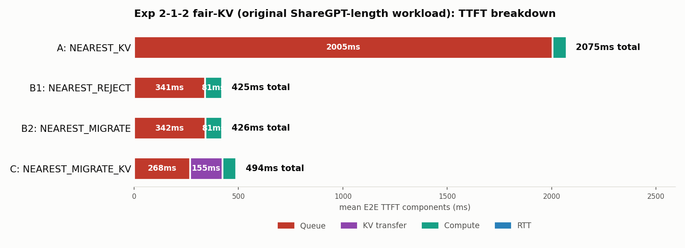
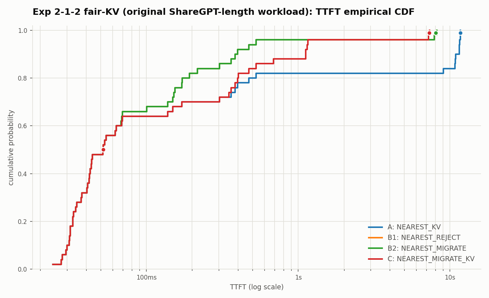

# 2026-07-07: 検証2-1-2 再検証(元のShareGPTワークロード + 公平KV前提)

日付: 2026-07-07

## 背景

`2026-07-07-exp212-fair-kv-baseline-report.md`で、`input_toks=1500`統一版
ワークロードに対して「4方式ともhome GPUでは最初からKVキャッシュが溜まっている」
という公平な前提に揃えたところ、結論が逆転する(B1/B2がCより速くなる)ことを
確認した。

本レポートは、その同じ公平KV前提の修正を、**最初にexp212を実行した元の
ワークロード(ShareGPT由来、input_toks 268〜3452の多様な長さ)** に対しても
適用し、同じ逆転が起きるかを確認したもの。

## 経緯: 元のコマンドはもう実行できない

`Diary/output/2026-07-05-exp212-kv-cache-1to2-routing-report.md`(4手法版の
チャート`outputs/image/2026-07-05_exp212_n50_1to2_rtx4090_kv_with_reject_ttft_breakdown.png`)
を作った際のコマンドは、`NEAREST_REJECT`/`NEAREST_MIGRATE`に
`--no-enable-prefix-caching`を付けていた。その後`router.py`に施した
「公平比較KV前提」の修正により、この`--no-enable-prefix-caching`付きの
コマンドは**実行できなくなった**(`RuntimeError: failover_mode=local_kv
requires --enable-prefix-caching`でクラッシュする)。これは、修正後の
コードが`NEAREST_REJECT`/`NEAREST_MIGRATE`にもローカルKV再利用を
適用しようとするため、prefix cachingが無効だと矛盾するため。

したがって、この元のチャートをそのまま再現することはできない
(その設定自体が現在は不公平・非対応とみなされる)。かわりに、
`--no-enable-prefix-caching`を外し、公平前提のまま元のワークロードで
再実行した。

## 実行コマンド

```bash
DATASET=workloads/generated/geo_2gpu100_kv_workload_1to2_n50.jsonl
CLUSTER=configs/cluster/single_node_multi_instance_rtx4090.json

for policy in NEAREST_KV NEAREST_REJECT NEAREST_MIGRATE NEAREST_MIGRATE_KV; do
  case "$policy" in
    NEAREST_KV)          EXTRA="" ;;
    NEAREST_REJECT)       EXTRA="" ;;
    NEAREST_MIGRATE)      EXTRA="--gpu-backbone-bandwidth-gbps 1 --gpu-backbone-distance-m 5000" ;;
    NEAREST_MIGRATE_KV)   EXTRA="--gpu-backbone-bandwidth-gbps 1 --gpu-backbone-distance-m 5000" ;;
  esac
  python3 -m serving --cluster-config "$CLUSTER" --dataset "$DATASET" \
    --request-routing-policy "$policy" --max-num-seqs 24 \
    --output "results/exp212-1to2-fairkv-nearest-<policy>.csv" \
    --run-id "exp212-1to2-fairkv-<policy>" --log-level WARNING $EXTRA
done
```

出力: `results/exp212-1to2-fairkv-nearest-{kv,reject,migrate,migrate-kv}.csv`

## 図

- `outputs/exp212_fairkv/ttft_breakdown.png`
- `outputs/exp212_fairkv/ttft_cdf.png`





## 結果: 元のチャート(不公平版)との比較

| 手法 | 元のチャート(不公平) | 今回(公平KV) |
| --- | ---: | ---: |
| A `NEAREST_KV` | 2075ms | 2075.48ms(不変) |
| B1 `NEAREST_REJECT` | 611ms | **427.14ms** |
| B2 `NEAREST_MIGRATE` | 612ms | **427.14ms** |
| C `NEAREST_MIGRATE_KV` | 494ms | 495.11ms(不変) |

Cはもともとprefix caching有効だったため、公平前提にしてもほぼ変わらない。
B1/B2は不利な条件(常時cold prefill)が外れたことで611/612ms→427msまで改善し、
**Cを逆転して最速になった。** `input_toks=1500`統一版で確認した逆転
(`2026-07-07-exp212-fair-kv-baseline-report.md`)と完全に同じ傾向であり、
プロンプト長のばらつきの有無に関係なく再現する頑健な結果だと言える。

TTFT breakdown:

| 手法 | Queue | KV transfer | Compute | RTT |
| --- | ---: | ---: | ---: | ---: |
| A `NEAREST_KV` | 2004.54ms | 0.00ms | 67.32ms | 3.62ms |
| B1 `NEAREST_REJECT` | 340.98ms | 0.00ms | 80.69ms | 3.63ms |
| B2 `NEAREST_MIGRATE` | 341.62ms | 0.00ms | 80.69ms | 3.63ms |
| C `NEAREST_MIGRATE_KV` | 267.95ms | 155.36ms | 67.16ms | 3.63ms |

## 結論

- 元のワークロード(プロンプト長多様)・統一長ワークロード(1500トークン)の
  どちらでも、公平なKV前提にすると`NEAREST_REJECT`/`NEAREST_MIGRATE`が
  `NEAREST_MIGRATE_KV`より平均TTFTで優れる、という同じ結論になった。
- 2026-07-05時点の「方式Cが最良」という結論は、B1/B2に不利な比較条件
  (prefix caching無効)によるものであり、公平に揃えると覆る。
- 今後`exp212`系の実験・実機再現は、この公平KV前提(4方式ともprefix caching
  有効、リダイレクト時のみ方式ごとの扱いが分岐)を標準とする。
