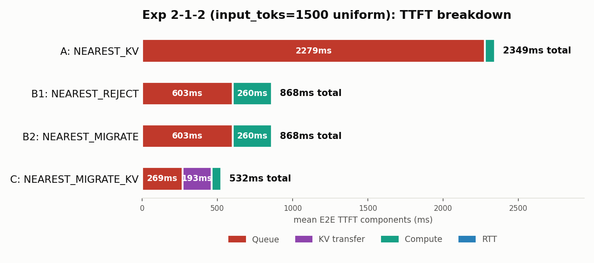
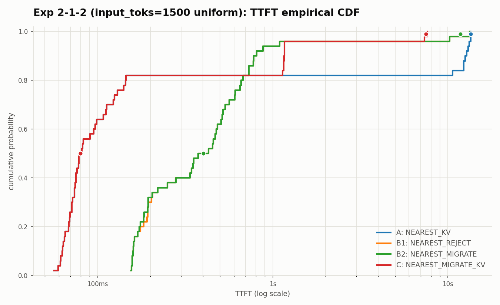

# 2026-07-07: 検証2-1-2 追試 — プロンプト長を1500トークンに統一

日付: 2026-07-07

## 目的

`exp212`(`Diary/output/2026-07-05-exp212-kv-cache-1to2-routing-report.md`)は
ShareGPT由来のプロンプト長(input_toks 268〜3452、平均974)をそのまま使っていた。

この「リクエストごとの長さのばらつき」が結論(方法Cが最良)に影響していないかを
確認するため、**全50件のプロンプト長(input_toks)を1500トークンに統一**した
ワークロードで同じ4方式を再実行した。

## ワークロードの作り方

元のワークロード`workloads/generated/geo_2gpu100_kv_workload_1to2_n50.jsonl`を
そのまま流用し、各行について以下だけを付け替えた(到着時刻・GPU割当・ユーザ座標・
距離など幾何的な項目は一切変更していない)。

- `input_toks` → 全件1500に統一。`input_tok_ids`は元のトークン列を
  切り詰め/循環複製して1500長に揃えた。
- `request_payload_bytes` / `uplink_serialization_latency_ns` /
  `uplink_latency_ns` / `communication_latency_ns` / `gpu_arrival_time_ns` を
  新しい`input_toks=1500`に基づいて再計算した(`workloads/generators/geographic.py`
  と同じ式: `request_payload_bytes = 500 + input_toks*4`、
  `serialization_ns = 8000*bytes/mbps`)。
- `reuse_prefix_toks = min(1024, 1500) = 1024`(全件で統一)。
- `output_toks`(519〜784)は元のまま変更していない。

出力: `workloads/generated/geo_2gpu100_kv_workload_1to2_n50_input1500.jsonl`

### なぜ1500トークンにしたか(2000ではダメだった経緯)

最初に2000トークンで試したところ、GPU1(RTX4090・24GB)がKVキャッシュで
ほぼ100%埋まり、次のエラーでクラッシュした。

```
RuntimeError: [MemoryModel] [node_id=0,inst=1] NPU: tried to load 2.00MB but only 1.49MB is available.
```

全リクエストが2000トークンだと、GPU1で同時に走る24件全てが「大きいプロンプト」に
なり、KVキャッシュの総必要量が元のワークロード(平均974トークン)の約2倍に膨らんで
VRAMを使い切ってしまうため。実機のRTX4090の実容量・`max_num_seqs=24`という前提は
変えたくなかったので、メモリに収まる1500トークンに落として実行した。

## 実行コマンド

```bash
cd /Users/taichikondo/LLMServingSim && docker run --rm --platform linux/amd64 \
  -v /Users/taichikondo/LLMServingSim:/app/LLMServingSim \
  -w /app/LLMServingSim \
  astrasim/tutorial-micro2024 \
  bash -lc '
set -e

pip3 install -q rich pyinstrument pyyaml msgspec "protobuf>=6,<7"

export PYTHONPATH=/app/LLMServingSim/astra-sim/extern/graph_frontend/chakra/build/lib
DATASET=workloads/generated/geo_2gpu100_kv_workload_1to2_n50_input1500.jsonl
CLUSTER=configs/cluster/single_node_multi_instance_rtx4090.json

for policy in NEAREST_KV NEAREST_REJECT NEAREST_MIGRATE NEAREST_MIGRATE_KV; do
  case "$policy" in
    NEAREST_KV)
      OUT=results/exp212-input1500-nearest-kv.csv
      RUN=exp212-input1500-nearest-kv
      EXTRA=""
      ;;
    NEAREST_REJECT)
      OUT=results/exp212-input1500-nearest-reject.csv
      RUN=exp212-input1500-nearest-reject
      EXTRA="--no-enable-prefix-caching"
      ;;
    NEAREST_MIGRATE)
      OUT=results/exp212-input1500-nearest-migrate.csv
      RUN=exp212-input1500-nearest-migrate
      EXTRA="--gpu-backbone-bandwidth-gbps 1 --gpu-backbone-distance-m 5000 --no-enable-prefix-caching"
      ;;
    NEAREST_MIGRATE_KV)
      OUT=results/exp212-input1500-nearest-migrate-kv.csv
      RUN=exp212-input1500-nearest-migrate-kv
      EXTRA="--gpu-backbone-bandwidth-gbps 1 --gpu-backbone-distance-m 5000"
      ;;
  esac

  python3 -m serving \
    --cluster-config "$CLUSTER" \
    --dataset "$DATASET" \
    --request-routing-policy "$policy" \
    --max-num-seqs 24 \
    --output "$OUT" \
    --run-id "$RUN" \
    --log-level WARNING \
    $EXTRA
done
'
```

出力CSV: `results/exp212-input1500-nearest-{kv,reject,migrate,migrate-kv}.csv`

## 図

- `outputs/exp212_input1500/ttft_breakdown.png`
- `outputs/exp212_input1500/ttft_cdf.png`





## 結果

| 手法 | GPU0:GPU1割当 | rerouted | Mean E2E TTFT | P50 | P99 | Mean total latency |
| --- | --- | ---: | ---: | ---: | ---: | ---: |
| A `NEAREST_KV` | 17:33 | 0/50 | 2347.71ms | 79.71ms | 13509.76ms | 18959.31ms |
| B1 `NEAREST_REJECT` | 25:25 | 8/50 | 868.24ms | 401.47ms | 11793.75ms | 19536.36ms |
| B2 `NEAREST_MIGRATE` | 25:25 | 8/50 | 867.52ms | 401.47ms | 11794.94ms | 19537.61ms |
| C `NEAREST_MIGRATE_KV` | 26:24 | 9/50 | 531.94ms | 79.71ms | 7497.80ms | 17588.67ms |

TTFT breakdown:

| 手法 | Queue | KV transfer | Compute | RTT |
| --- | ---: | ---: | ---: | ---: |
| A `NEAREST_KV` | 2278.64ms | 0.00ms | 65.45ms | 5.31ms |
| B1 `NEAREST_REJECT` | 602.95ms | 0.00ms | 259.68ms | 5.31ms |
| B2 `NEAREST_MIGRATE` | 603.16ms | 0.00ms | 259.68ms | 5.32ms |
| C `NEAREST_MIGRATE_KV` | 268.51ms | 193.28ms | 64.93ms | 5.32ms |

## 元の実験(プロンプト長ばらつきあり)との比較

| | 元(input 268〜3452) | 今回(input=1500固定) |
| --- | ---: | ---: |
| A Mean E2E TTFT | 2075.48ms | 2347.71ms |
| B1/B2 Mean E2E TTFT | 613.66ms | 867.52〜868.24ms |
| C Mean E2E TTFT | 495.11ms | 531.94ms |
| 順位 | C < B1≈B2 < A | C < B1≈B2 < A(同じ) |

## 解釈

プロンプト長を1500トークンに統一しても、**方式間の順位(方法Cが最良、方法Aが最悪)は
変わらなかった。** 絶対値は全体的に上振れしている。理由は、元のワークロードでは
input_toksが小さいリクエストも多く混ざっていたのに対し、今回は全リクエストが
「1500トークンの大きめのプロンプト」相当になったため:

- 方法AのQueueが増加(2004.54ms→2278.64ms): GPU1に割り当てられた33件すべてが
  以前より重くなり、キューの滞留がより深刻になった。
- B1/B2のCompute(cold prefill)が増加(156.67ms→259.68ms): 1500トークンの
  cold prefillは元の平均974トークンより単純に重い。
- A/CのCompute(KV再利用あり)はほぼ変わらず(67ms前後→65ms前後):
  `reuse_prefix_toks=1024`で再利用されるトークン数の上限は変わらないため、
  実質的に計算が必要な差分(1500-1024=476トークン程度)がほぼ一定だったため。

このことから、`exp212`で観測された「方法Cが最良」という結論は、ShareGPT由来の
プロンプト長のばらつきに依存した偶然の結果ではなく、**プロンプト長を統一した
条件下でも再現する頑健な傾向**であることが確認できた。
