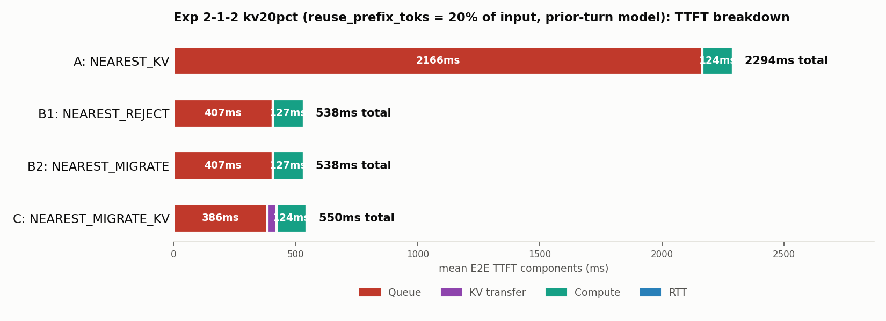
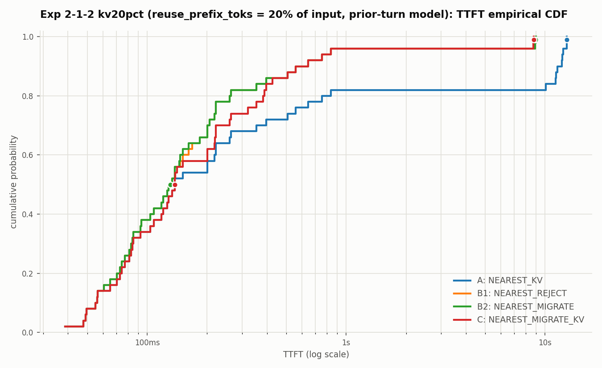

# 2026-07-07: 検証2-1-2 再々検証 — KV再利用率を「前ターン分20%」の現実的な設定に

日付: 2026-07-07

## 問題提起

`2026-07-07-exp212-fair-kv-original-workload-report.md`で公平なKV前提に揃えたが、
その際の`reuse_prefix_toks = min(1024, input_toks)`という設定では、
input_toks≤1024の29/50件で**プロンプト全体が最初からキャッシュ済み**という
扱いになっていた。これは独立した(互いに文面を共有しない)ShareGPT由来の
会話データセットに対しては非現実的な前提である(実際のprefix cacheは
「以前に処理した同一トークン列」にしかヒットせず、新規の独立した会話の
プロンプト全体が最初からキャッシュされていることはあり得ない)。

## 修正: 「前のターン分として全体の20%だけキャッシュ済み」

`reuse_prefix_toks`を、絶対トークン数の上限(1024)ではなく、
**各リクエストのinput_toksに対する一律20%**に変更した
(マルチターン会話で、直前のターンまでの部分は既にキャッシュされているが、
今回の新しい発話部分は未キャッシュ、という状況を模したもの)。

```python
reuse_prefix_toks = round(0.20 * input_toks)  # 全リクエスト共通で20%
```

ワークロード: `workloads/generated/geo_2gpu100_kv_workload_1to2_n50_kv20pct.jsonl`
(`geo_2gpu100_kv_workload_1to2_n50.jsonl`の`reuse_prefix_toks`列だけを
上記の式で再計算したもの。到着時刻・GPU割当・プロンプト内容などは変更なし)

## 実行コマンド

```bash
DATASET=workloads/generated/geo_2gpu100_kv_workload_1to2_n50_kv20pct.jsonl
CLUSTER=configs/cluster/single_node_multi_instance_rtx4090.json

for policy in NEAREST_KV NEAREST_REJECT NEAREST_MIGRATE NEAREST_MIGRATE_KV; do
  case "$policy" in
    NEAREST_KV)          EXTRA="" ;;
    NEAREST_REJECT)       EXTRA="" ;;
    NEAREST_MIGRATE)      EXTRA="--gpu-backbone-bandwidth-gbps 1 --gpu-backbone-distance-m 5000" ;;
    NEAREST_MIGRATE_KV)   EXTRA="--gpu-backbone-bandwidth-gbps 1 --gpu-backbone-distance-m 5000" ;;
  esac
  python3 -m serving --cluster-config "$CLUSTER" --dataset "$DATASET" \
    --request-routing-policy "$policy" --max-num-seqs 24 \
    --output "results/exp212-kv20pct-nearest-<policy>.csv" \
    --run-id "exp212-kv20pct-<policy>" --log-level WARNING $EXTRA
done
```

出力: `results/exp212-kv20pct-nearest-{kv,reject,migrate,migrate-kv}.csv`

## 図

- `outputs/exp212_kv20pct/ttft_breakdown.png`
- `outputs/exp212_kv20pct/ttft_cdf.png`





## 結果

| 手法 | GPU0:GPU1 | rerouted | Mean E2E TTFT | Queue | KV transfer | Compute | RTT |
| --- | --- | ---: | ---: | ---: | ---: | ---: | ---: |
| A `NEAREST_KV` | 17:33 | 0/50 | 2294.05ms | 2166.22ms | 0.00ms | 124.21ms | 3.62ms |
| B1 `NEAREST_REJECT` | 26:24 | 9/50 | **538.65ms** | 406.71ms | 0.00ms | 127.23ms | 3.63ms |
| B2 `NEAREST_MIGRATE` | 26:24 | 9/50 | **538.65ms** | 406.93ms | 0.00ms | 127.23ms | 3.63ms |
| C `NEAREST_MIGRATE_KV` | 26:24 | 9/50 | 551.27ms | 386.00ms | 36.24ms | 124.09ms | 3.63ms |

## これまでの3設定の比較

| KV前提 | reuse_prefix_toks | B1/B2 Mean TTFT | C Mean TTFT | 差 |
| --- | --- | ---: | ---: | ---: |
| 不公平(旧) | B1/B2は常時cold | 611〜612ms | 494ms | Cが117ms速い |
| 公平・絶対上限1024 | min(1024, input) | 427.14ms | 495.11ms | B1/B2が68ms速い |
| **公平・20%(今回)** | **round(0.20×input)** | **538.65ms** | **551.27ms** | **B1/B2が12.6ms速い(ほぼ拮抗)** |

## 解釈

キャッシュ対象を「絶対1024トークン上限」から「一律20%」に変えたことで、
KV移送量そのものが減り(平均転送コストが155.36ms→36.24msまで下がった)、
C側の「移送コストが節約分を上回って損をする」度合いが大きく縮小した。
結果、B1/B2とCの差はわずか12.6ms(2.3%程度)まで縮まり、**ほぼ互角**になった。

これは1024トークン上限モデルで見られた「B1/B2がCより明確に有利」という
結論(差68ms)ほど極端ではなく、より現実的なKV再利用率の下では
**KV移送のペイオフはほぼトントンの境界線上にある**、という結果になった。
どちらの方式が有利かは、実際のマルチターン会話でどれだけの割合が
再利用可能か(会話が長くなるほど再利用率は上がりうる)、GPU間バックボーンの
帯域・距離にかなり敏感に左右される、ということを示している。

なお、Cのリダイレクト時のQueueが依然としてB1/B2よりやや短い(386.00ms vs
406.71/406.93ms)のは、KV転送にかかる時間だけリダイレクト先GPUへの到着が
遅れ、その間に先行負荷が捌ける、という副次効果(過去のレポートで指摘した
「玉突き」効果)が今回も効いているため。

## 結論

- KV再利用率の前提を「絶対1024トークン上限」から「一律20%(前ターン相当)」
  という、より現実的なモデルに変えると、B1/B2とCの差はほぼ無くなる
  (12.6ms、2.3%程度)。
- 「方式Cが優れている」「B1/B2が優れている」のどちらの結論も、
  KV再利用率の設定次第で入れ替わりうる、という点が今回の一連の検証で
  明確になった。実機再現や今後の実験では、このKV再利用率をどう設定するかを
  実際の会話ログ等から見積もる必要がある。
