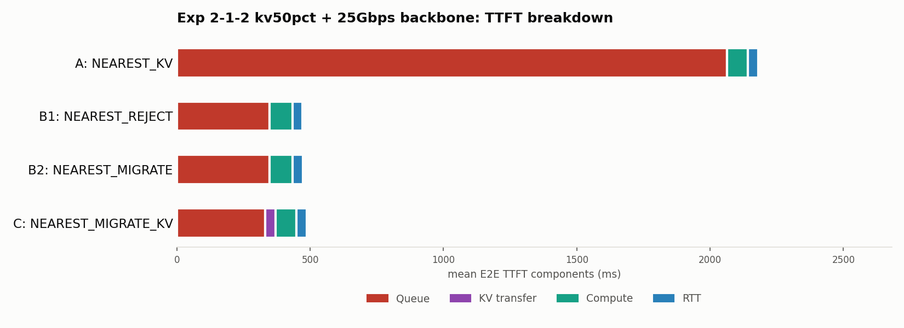
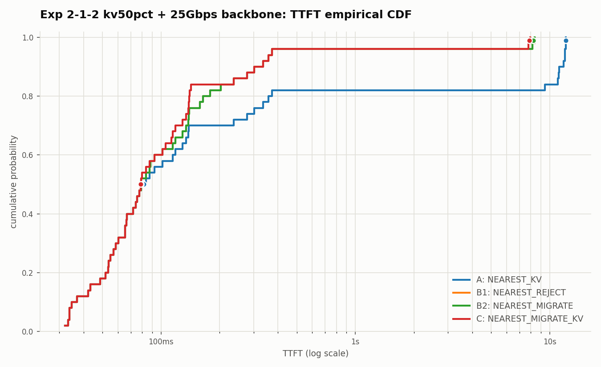

# 2026-07-07: 検証2-1-2 バックボーン帯域25Gbps版

日付: 2026-07-07

## 目的

`2026-07-07-exp212-kv50pct-report.md`で、KV再利用率50%・バックボーン1Gbpsでは
`NEAREST_MIGRATE_KV`(C)が`NEAREST_REJECT`/`NEAREST_MIGRATE`(B1/B2)より
37ms遅いという結果だった。KV再利用率を上げるほどCが不利になる傾向が見えたため、
「移送コストそのものを下げる」方向性として、**GPU間バックボーンの帯域を
1Gbps→25Gbpsに上げた場合**を確認する。

## 作業上の注意: ワークロードJSONLの`kv_migration_bandwidth_gbps`がCLI引数より優先される

最初、`--gpu-backbone-bandwidth-gbps 25`を指定してそのまま
`geo_2gpu100_kv_workload_1to2_n50_kv50pct.jsonl`で実行したところ、結果が
1Gbps版と完全に同一だった。原因は`router.py`の`_attach_kv_handoff()`が

```python
'kv_migration_bandwidth_gbps': float(req_data.get(
    'kv_migration_bandwidth_gbps',
    self.gpu_backbone_bandwidth_gbps or DEFAULT_KV_MIGRATION_BANDWIDTH_GBPS,
)),
```

としており、**ワークロードJSONLの各行に既に`kv_migration_bandwidth_gbps`
フィールドが焼き込まれている場合、そちらがCLI引数より優先される**ため。
今回のワークロードは生成時に`--kv-migration-bandwidth-gbps 1`を指定していたので、
1.0が全行に残っていた。

対応: ワークロードJSONLの`kv_migration_bandwidth_gbps`フィールドを25.0に
書き換えたコピーを作成して実行した。

```python
r["kv_migration_bandwidth_gbps"] = 25.0
```

出力: `workloads/generated/geo_2gpu100_kv_workload_1to2_n50_kv50pct_bw25.jsonl`

## 実行コマンド

```bash
DATASET=workloads/generated/geo_2gpu100_kv_workload_1to2_n50_kv50pct_bw25.jsonl
CLUSTER=configs/cluster/single_node_multi_instance_rtx4090.json

for policy in NEAREST_KV NEAREST_REJECT NEAREST_MIGRATE NEAREST_MIGRATE_KV; do
  case "$policy" in
    NEAREST_KV)          EXTRA="" ;;
    NEAREST_REJECT)       EXTRA="" ;;
    NEAREST_MIGRATE)      EXTRA="--gpu-backbone-bandwidth-gbps 25 --gpu-backbone-distance-m 5000" ;;
    NEAREST_MIGRATE_KV)   EXTRA="--gpu-backbone-bandwidth-gbps 25 --gpu-backbone-distance-m 5000" ;;
  esac
  python3 -m serving --cluster-config "$CLUSTER" --dataset "$DATASET" \
    --request-routing-policy "$policy" --max-num-seqs 24 \
    --output "results/exp212-kv50pct-bw25-nearest-<policy>.csv" \
    --run-id "exp212-kv50pct-bw25-<policy>" --log-level WARNING $EXTRA
done
```

出力: `results/exp212-kv50pct-bw25-nearest-{kv,reject,migrate,migrate-kv}.csv`

## 図

- `outputs/exp212_kv50pct_bw25/ttft_breakdown.png`
- `outputs/exp212_kv50pct_bw25/ttft_cdf.png`





## 結果

| 手法 | GPU0:GPU1 | rerouted | Mean E2E TTFT | Queue | KV transfer | Compute | RTT |
| --- | --- | ---: | ---: | ---: | ---: | ---: | ---: |
| A `NEAREST_KV` | 17:33 | 0/50 | 2144.72ms | 2063.85ms | 0.00ms | 77.24ms | 3.62ms |
| B1 `NEAREST_REJECT` | 26:24 | 9/50 | 438.30ms | 347.78ms | 0.00ms | 85.29ms | 3.63ms |
| B2 `NEAREST_MIGRATE` | 26:24 | 9/50 | 438.30ms | 348.43ms | 0.00ms | 85.29ms | 3.63ms |
| C `NEAREST_MIGRATE_KV` | 26:24 | 9/50 | **418.03ms** | 332.23ms | 3.71ms | 77.03ms | 3.63ms |

## 1Gbps版との比較

| 帯域 | KV transfer(平均) | C Mean TTFT | B1/B2 Mean TTFT | 差 |
| --- | ---: | ---: | ---: | --- |
| 1Gbps | 92.61ms | 475.43ms | 438.30ms | B1/B2が37.1ms速い |
| **25Gbps(今回)** | **3.71ms** | **418.03ms** | **438.30ms** | **Cが20.3ms速い** |

KV転送コストは帯域に反比例して92.61ms→3.71ms(約25分の1)に低下し、
帯域の倍率とほぼ正確に一致する。これによりKV転送コストがほぼ無視できる
水準になり、KV再利用によるCompute削減効果(77ms vs 85ms、約8ms差)が
純粋に活きる形になって、Cが再び最速に戻った。

## 結論

- **同じKV再利用率(50%)でも、GPU間バックボーンの帯域次第でCが有利にも
  不利にもなる**ことが確認できた。1Gbpsでは37ms不利、25Gbpsでは20ms有利、
  と符号が反転する。
- KVキャッシュ移送の得失は「移送するバイト数(≒再利用率)」と
  「バックボーンの実効帯域」の比、すなわち転送時間そのものが、
  浮く計算時間と比べてどれだけ小さいかで決まる。今回の一連の実験
  (kv20pct/kv50pct/1024トークン上限 × 1Gbps/25Gbps)から、この転送時間が
  数十ms以下に収まるかどうかが損益分岐の目安になっていると言える。
- ワークロードJSONLに焼き込まれた`kv_migration_bandwidth_gbps`/
  `kv_migration_distance_m`がCLI引数より優先されるという仕様は、
  今後同様の帯域変更実験を行う際に必ず踏まえておくべき注意点である。
