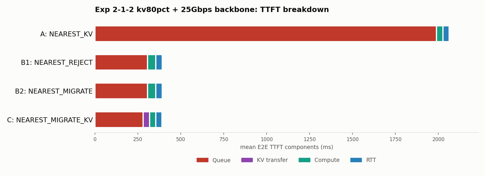
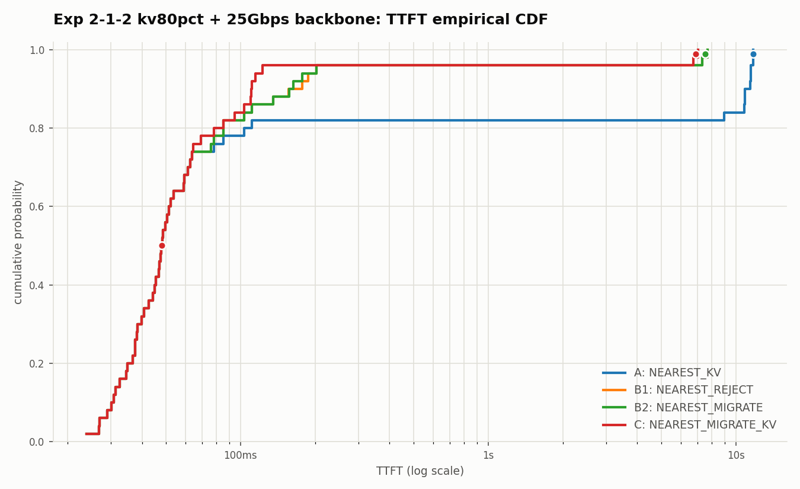

# 2026-07-07: 検証2-1-2 KV再利用率80% + バックボーン25Gbps版

日付: 2026-07-07

## 目的

`2026-07-07-exp212-kv50pct-bw25-report.md`で、KV再利用率50%・バックボーン
25Gbpsでは`NEAREST_MIGRATE_KV`(C)が20.3ms速いという結果だった。KV再利用率を
20%→50%→80%と上げていくと、Compute削減効果と(高帯域下では小さいままの)
KV転送コストの差がどう動くかを確認するため、**再利用率80%・バックボーン
25Gbps**で実行した。

## ワークロード

`geo_2gpu100_kv_workload_1to2_n50.jsonl`の`reuse_prefix_toks`を
`round(0.80 * input_toks)`で再計算し、さらに`kv_migration_bandwidth_gbps`を
25.0に書き換え。

出力: `workloads/generated/geo_2gpu100_kv_workload_1to2_n50_kv80pct_bw25.jsonl`

## 実行コマンド

```bash
DATASET=workloads/generated/geo_2gpu100_kv_workload_1to2_n50_kv80pct_bw25.jsonl
CLUSTER=configs/cluster/single_node_multi_instance_rtx4090.json

for policy in NEAREST_KV NEAREST_REJECT NEAREST_MIGRATE NEAREST_MIGRATE_KV; do
  case "$policy" in
    NEAREST_KV)          EXTRA="" ;;
    NEAREST_REJECT)       EXTRA="" ;;
    NEAREST_MIGRATE)      EXTRA="--gpu-backbone-bandwidth-gbps 25 --gpu-backbone-distance-m 5000" ;;
    NEAREST_MIGRATE_KV)   EXTRA="--gpu-backbone-bandwidth-gbps 25 --gpu-backbone-distance-m 5000" ;;
  esac
  python3 -m serving --cluster-config "$CLUSTER" --dataset "$DATASET" \
    --request-routing-policy "$policy" --max-num-seqs 24 \
    --output "results/exp212-kv80pct-bw25-nearest-<policy>.csv" \
    --run-id "exp212-kv80pct-bw25-<policy>" --log-level WARNING $EXTRA
done
```

出力: `results/exp212-kv80pct-bw25-nearest-{kv,reject,migrate,migrate-kv}.csv`

## 図

- `outputs/exp212_kv80pct_bw25/ttft_breakdown.png`
- `outputs/exp212_kv80pct_bw25/ttft_cdf.png`

数値ラベルは付けず、非ゼロだが小さいセグメント(RTT・KV transfer)も
最小表示幅を設けて4色すべてが視認できるようにしてある。





## 結果

| 手法 | GPU0:GPU1 | rerouted | Mean E2E TTFT | Queue | KV transfer | Compute | RTT |
| --- | --- | ---: | ---: | ---: | ---: | ---: | ---: |
| A `NEAREST_KV` | 17:33 | 0/50 | 2029.86ms | 1989.53ms | 0.00ms | 36.71ms | 3.62ms |
| B1 `NEAREST_REJECT` | 26:24 | 9/50 | 360.54ms | 305.95ms | 0.00ms | 49.00ms | 3.63ms |
| B2 `NEAREST_MIGRATE` | 26:24 | 9/50 | 360.08ms | 306.17ms | 0.00ms | 49.00ms | 3.63ms |
| C `NEAREST_MIGRATE_KV` | 26:24 | 9/50 | **328.09ms** | 281.48ms | 5.94ms | 35.76ms | 3.63ms |

## KV再利用率 × バックボーン帯域の一覧(まとめ)

| KV再利用率 | 帯域 | KV transfer | C Mean TTFT | B1/B2 Mean TTFT | 差(+はCが速い) |
| --- | --- | ---: | ---: | ---: | ---: |
| 20% | 1Gbps | 36.24ms | 551.27ms | 538.65ms | -12.6ms |
| 50% | 1Gbps | 92.61ms | 475.43ms | 438.30ms | -37.1ms |
| 絶対上限1024(実質最大87%) | 1Gbps | 155.36ms | 495.11ms | 427.14ms | -68.0ms |
| 50% | 25Gbps | 3.71ms | 418.03ms | 438.30ms | **+20.3ms** |
| **80%(今回)** | **25Gbps** | **5.94ms** | **328.09ms** | **360.08〜360.54ms** | **+32.0ms** |

25Gbps下では、再利用率を50%→80%に上げてもKV転送コストはほぼ変わらず低い
まま(3.71ms→5.94ms)なのに対し、Compute削減効果は再利用率とともに拡大する
(50%時点でA/C Compute≈77ms・B1/B2≈85ms、80%時点でA/C Compute≈36〜37ms・
B1/B2≈49ms、差が約8ms→約12〜13msに拡大)。結果としてCの優位性は
20.3ms→32.0msへとさらに拡大した。

## 結論

- **バックボーンが高帯域(25Gbps)であれば、KV再利用率を上げるほど
  `NEAREST_MIGRATE_KV`はますます有利になる**(1Gbps下での「再利用率を
  上げるほど不利になる」という傾向とは正反対)。
- これは、高帯域下ではKV転送コストが再利用率に対してほぼ一定(低いまま)で
  頭打ちになる一方、Compute削減効果は再利用率にほぼ比例して増え続けるため。
- まとめると、KV移送方式の有利・不利は「KV再利用率」単体ではなく、
  **「KV再利用率」と「GPU間バックボーンの実効帯域」の組み合わせ**で決まる。
  帯域が十分高ければ再利用率を上げるほど有利、帯域が低ければ再利用率を
  上げるほど不利、という逆転関係がある。実機での妥当な結論を出すには、
  実際のAPN網の実効帯域を計測することが不可欠である。
