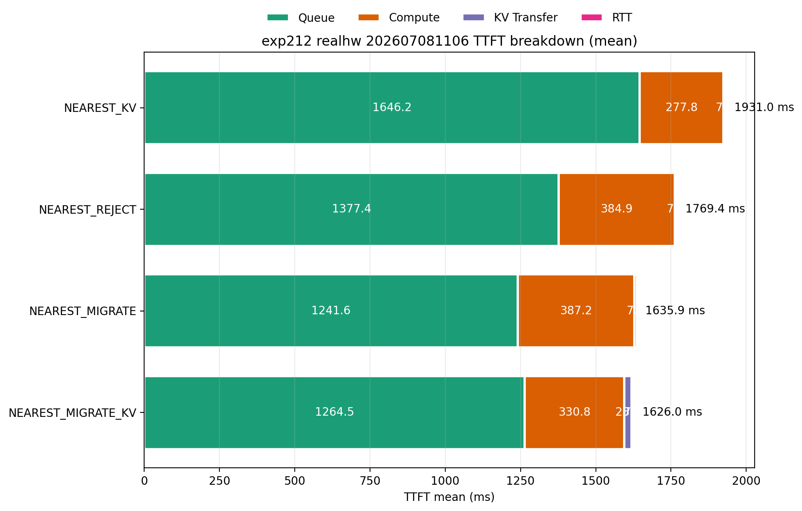
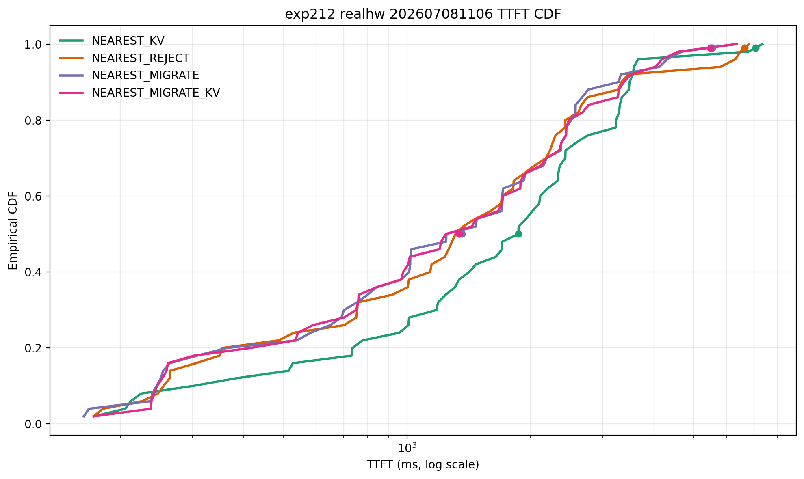

# 2026-07-08: 検証2-1-2 実機再現結果 (202607081106)

日付: 2026-07-08

## 概要

実機2GPU環境(`/Users/taichikondo/adaptive-llm-availability`)で`exp212`を再実行した結果
(`results/202607081106/`)を、シミュレーション側の可視化フォーマットに合わせて整理する。

出力元:
- `exp212_realhw_nearest_kv_20260708_110248.csv`
- `exp212_realhw_nearest_reject_20260708_110431.csv`
- `exp212_realhw_nearest_migrate_20260708_110633.csv`
- `exp212_realhw_nearest_migrate_kv_20260708_110845_enriched.csv`(KV転送ログでenrich済み)

図は実機側の公式ツール`src/exp212_realhw/plot_ttft.py`を`--compute-mode estimated-pure`
(実機側の`kondoFolder/exp212_breakdown_definition.md`が「4手法比較でKV reuseによる
計算量削減を見たい場合に最も適切」と推奨しているモード)で実行して生成したもの。

```bash
python3 -m src.exp212_realhw.plot_ttft \
  --input "NEAREST_KV=results/202607081106/exp212_realhw_nearest_kv_20260708_110248.csv" \
  --input "NEAREST_REJECT=results/202607081106/exp212_realhw_nearest_reject_20260708_110431.csv" \
  --input "NEAREST_MIGRATE=results/202607081106/exp212_realhw_nearest_migrate_20260708_110633.csv" \
  --input "NEAREST_MIGRATE_KV=results/202607081106/exp212_realhw_nearest_migrate_kv_20260708_110845_enriched.csv" \
  --breakdown-output outputs/exp212_realhw_202607081106/ttft_breakdown.png \
  --cdf-output outputs/exp212_realhw_202607081106/ttft_cdf.png \
  --title-prefix "exp212 realhw 202607081106" \
  --compute-mode estimated-pure \
  --aggregate-mode mean
```

## 図

- `outputs/exp212_realhw_202607081106/ttft_breakdown.png`
- `outputs/exp212_realhw_202607081106/ttft_cdf.png`





## 結果

### TTFT breakdown(estimated-pure compute、Mean、breakdownツール集計)

| 手法 | Queue | Compute | KV Transfer | RTT | Total |
| --- | ---: | ---: | ---: | ---: | ---: |
| NEAREST_KV | 1646.2ms | 277.8ms | 0ms | ~7ms | 1931.0ms |
| NEAREST_REJECT | 1377.4ms | 384.9ms | 0ms | ~7ms | 1769.4ms |
| NEAREST_MIGRATE | 1241.6ms | 387.2ms | 0ms | ~7ms | 1635.9ms |
| NEAREST_MIGRATE_KV | 1264.5ms | 330.8ms | ~23ms | ~7ms | **1626.0ms** |

### 生CSVからの集計(参考。`ttft_ms`列を直接集計、上のbreakdown合計とは
定義がやや異なるため厳密には一致しない)

| 手法 | GPU0:GPU1 | rerouted | Mean TTFT | Median | P95 | P99 | Mean latency |
| --- | --- | ---: | ---: | ---: | ---: | ---: | ---: |
| NEAREST_KV | 17:33 | 0/50 | 2030.7ms | 1868.8ms | 3616.3ms | 7070.3ms | 22573.8ms |
| NEAREST_REJECT | 33:17 | 18/50 | 1793.4ms | 1341.4ms | 6079.5ms | 6652.2ms | 22172.5ms |
| NEAREST_MIGRATE | 32:18 | 19/50 | 1646.7ms | 1359.6ms | 4221.3ms | 5535.6ms | 21791.5ms |
| NEAREST_MIGRATE_KV | 32:18 | 19/50 | 1677.2ms | 1340.3ms | **4111.2ms** | **5484.9ms** | 21862.3ms |

## 解釈

- **4方式とも実機で明確なQueueを持つ**(1200〜1650ms程度)。以前の実機試験
  (2026-07-06)で見られた「NEAREST_KVだけQueueがほぼ0ms」という不自然な結果は
  解消されており、コールドスタート/ウォームアップの偏りが是正されたと見られる。
- **Mean TTFTでは`NEAREST_MIGRATE`(1635.9ms)と`NEAREST_MIGRATE_KV`(1626.0ms)が
  ほぼ同着で最良**、`NEAREST_REJECT`(1769.4ms)、`NEAREST_KV`(1931.0ms)の順に悪化する。
  リダイレクトする3方式(REJECT/MIGRATE/MIGRATE_KV)がリダイレクトしない
  NEAREST_KVより明確に優れる、という関係は今回の実機データでも成立している。
- **P95/P99では`NEAREST_MIGRATE_KV`が3方式中でも最良**(P95=4111.2ms、
  P99=5484.9ms)。テール性能ではKV引き継ぎの効果がわずかに見えている。
- 生CSVの`rerouted`件数がシミュレーション側の想定(50件中8〜9件)より多い
  (18〜19件)。また`NEAREST_KV`以外はGPU0:GPU1の実現比率が概ね32:18〜33:17と、
  シミュレーションが前提としていた「1:2」の負荷比率(ホーム割当17:33)から
  離れた形になっている。これは実機のタイミング変動により、シミュレーションが
  想定した閾値よりも実機側でリダイレクトが多く発火していることを示唆しており、
  今後実機・シミュレーション間の量的な突き合わせを行う際に注視すべき点である。

## 今後の確認事項

- リダイレクト件数がシミュレーションの約2倍(18〜19件 vs 8〜9件)になっている
  原因(実機の`max_num_seqs`相当の容量判定タイミング、または実機側のみ生じる
  遅延要因)の特定。
- `compute-mode`による感度確認(`prefill` / `pure-proxy` / `estimated-pure`の
  3モードで結果がどう変わるか)。
