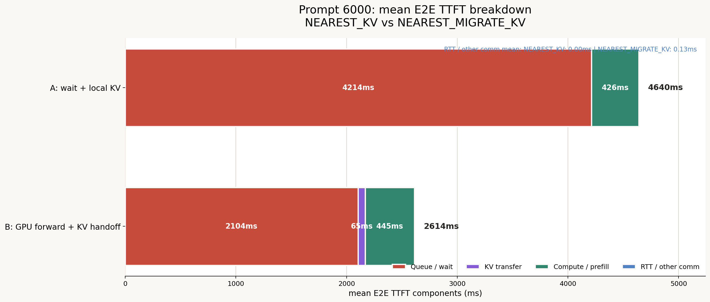
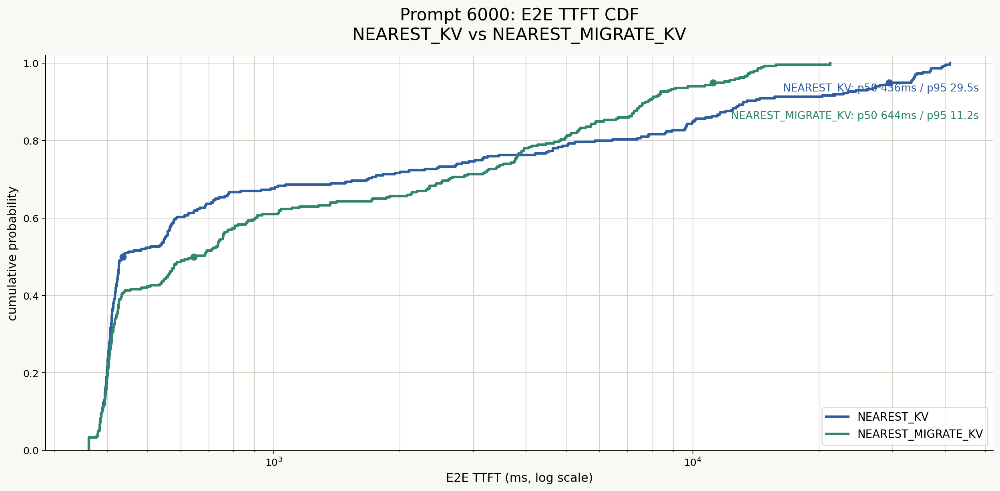

# Prompt 6000 workloadにおけるNEAREST_KVとNEAREST_MIGRATE_KVの比較

## 1. 目的

10台のRTX 4090を10セルへ分散配置した環境で、最寄りGPUに固定してKVを再利用する
`NEAREST_KV`と、容量不足時に第2近傍GPUへリクエストおよびKVを転送する
`NEAREST_MIGRATE_KV`を比較する。

特に、次の点を確認する。

- `max_num_seqs`到達前でもKV容量不足によるredirectが発生するか
- KV migrationがGPU間の負荷偏りを緩和するか
- migrationコストを含めてもTTFT、完了時間、throughputが改善するか
- 改善が中央値とtail latencyのどちらに現れるか

## 2. 比較方式

### 2.1 NEAREST_KV

- 全リクエストを最寄りGPUに固定する
- 最寄りGPUに存在する再利用可能KVを使用する
- 将来KV予約後の容量が不足する場合は、最寄りGPUの容量解放まで待機する
- GPU間のリクエスト転送およびKV転送は行わない

### 2.2 NEAREST_MIGRATE_KV

- 通常は最寄りGPUを使用する
- 最寄りGPUの将来KV予約容量が不足する場合、第2近傍GPUの容量も確認する
- 第2近傍GPUに容量があれば、リクエストと再利用可能KVを転送する
- KV migrationでは、source GPUからCPUへのstaging、APN転送、CPUからtarget GPUへの
  stagingを直列に計上する
- 最寄りGPUと第2近傍GPUの双方が満杯なら、容量解放まで待機して再判定する

## 3. 共通実験条件

| 項目 | 設定 |
|---|---|
| GPU | RTX 4090、24 GB |
| GPU数 | 10 |
| モデル | `meta-llama/Llama-3.1-8B` |
| dtype | bfloat16 |
| KV cache dtype | auto（本設定ではbf16相当） |
| リクエスト数 | 300 |
| 入力長 | 6,000 tokens |
| 出力長 | ShareGPT由来 |
| 到着期間 | 約60秒 |
| KV再利用率 | 約50%（2,992 tokens、block丸め後） |
| `max_num_seqs` | 128 |
| `max_num_batched_tokens` | 2,048 |
| block size | 16 tokens |
| chunked prefill | 有効 |
| prefix caching | 有効 |
| APN帯域 | 10.7 Gbit/s |
| APN固定片道伝搬遅延 | 300,500 ns |
| CPU staging帯域 | 33.8 GB/s |
| CPU staging固定遅延 | 102.9 ns |

使用したデータセットは次のとおりである。

```text
workloads/generated/cell_apn/prompt6000/sharegpt_300_prompt6000_reuse50.jsonl
```

結果CSVは次のとおりである。

```text
experiments/2026-07-13_prompt6000_three_policy/results/NEAREST_KV/requests.csv
experiments/2026-07-13_prompt6000_three_policy/results/NEAREST_MIGRATE_KV/requests.csv
```

両実験とも300件すべてが正常終了した。

## 4. 主要結果

### 4.1 システム全体

| 指標 | NEAREST_KV | NEAREST_MIGRATE_KV | 変化 |
|---|---:|---:|---:|
| Redirect件数 | 0 | 62 | 62件増加 |
| Redirect率 | 0.00% | 20.67% | 20.67ポイント増加 |
| シミュレーションmakespan | 113.89 s | 94.29 s | **17.2%短縮** |
| Request throughput | 2.63 req/s | 3.18 req/s | **20.8%向上** |
| Output token throughput | 1,718.7 tok/s | 2,076.0 tok/s | **20.8%向上** |

`NEAREST_MIGRATE_KV`は、62件を第2近傍GPUへ移すことで負荷集中を緩和し、
クラスタ全体が全リクエストを処理し終えるまでの時間を約17%短縮した。

### 4.2 E2E TTFT

E2E TTFTは、ユーザのrequest send時刻からfirst token受信時刻までを表す。
容量不足時にrouter内で待機した時間やmigration時間も含む。

| 指標 | NEAREST_KV | NEAREST_MIGRATE_KV | 変化 |
|---|---:|---:|---:|
| Mean | 4,639.7 ms | 2,613.8 ms | **43.7%改善** |
| p50 | 435.6 ms | 644.3 ms | 47.9%悪化 |
| p95 | 29,456.9 ms | 11,179.7 ms | **62.0%改善** |
| Max | 41,142.9 ms | 21,289.4 ms | **48.3%改善** |

中央値では`NEAREST_KV`が優れる。一方、p95と最大値では
`NEAREST_MIGRATE_KV`が大幅に優れる。これは、migrationに固定的な追加時間が発生する
一方で、混雑GPUにおける数十秒規模の容量待ちを回避できるためである。

### 4.3 E2E request completion latency

| 指標 | NEAREST_KV | NEAREST_MIGRATE_KV | 変化 |
|---|---:|---:|---:|
| Mean | 23,939.6 ms | 22,278.4 ms | **6.9%改善** |
| p50 | 20,792.3 ms | 22,216.6 ms | 6.9%悪化 |
| p95 | 51,921.6 ms | 32,002.1 ms | **38.4%改善** |
| Max | 63,369.7 ms | 47,321.3 ms | **25.3%改善** |

完了時間でもTTFTと同じ傾向が見られる。migrationは中央値をわずかに悪化させるが、
tail latencyを大きく削減する。

### 4.4 GPU到着後の処理指標

| 指標 | NEAREST_KV | NEAREST_MIGRATE_KV |
|---|---:|---:|
| Simulator TTFT mean | 456.2 ms | 484.8 ms |
| Simulator TTFT p50 | 435.0 ms | 433.5 ms |
| Simulator TTFT p95 | 684.3 ms | 769.9 ms |
| TPOT mean | 29.60 ms | 30.19 ms |
| TPOT p50 | 30.28 ms | 31.04 ms |
| TPOT p95 | 34.31 ms | 34.35 ms |

GPUへ受理された後のTTFTとTPOTは両方式で近い。このため、E2E tail改善の主因は
GPUカーネル速度の変化ではなく、最寄りGPUでの容量待ちをmigrationで回避したことに
あると判断できる。

## 5. メモリ容量によるredirectの確認

`NEAREST_MIGRATE_KV`のredirect 62件はすべて、次の条件を満たした。

- `redirect_capacity_reason = npu_memory`
- 判定時running requestsは10または11件
- `capacity_running_reqs < capacity_max_num_seqs`（128）
- `capacity_required_kv_bytes > capacity_available_kv_bytes`

したがって、62件はsequence数上限ではなく、将来KV予約を含むNPUメモリ容量を理由に
redirectされた。これは、本実験の主要な機能確認条件である
「`max_num_seqs`未満でもメモリ不足ならredirectする」を満たしている。

例としてrequest 146では、次の判定になった。

| 項目 | 値 |
|---|---:|
| Running requests | 11 |
| `max_num_seqs` | 128 |
| KV budget | 9,709,281,280 bytes |
| 既存active KV予約 | 9,602,859,008 bytes |
| 利用可能KV | 106,422,272 bytes |
| 新規リクエスト要求KV | 864,026,624 bytes |

sequence slotには117件分の余裕があるが、KV容量は約106 MBしか残っておらず、
約864 MBを必要とする新規リクエストを受け入れられないためredirectされた。

## 6. GPU負荷分散

### 6.1 GPU別処理リクエスト数

| GPU | NEAREST_KV | NEAREST_MIGRATE_KV |
|---:|---:|---:|
| 0 | 24 | 29 |
| 1 | 30 | 27 |
| 2 | 22 | 22 |
| 3 | 35 | 30 |
| 4 | 49 | 33 |
| 5 | 25 | 37 |
| 6 | 30 | 27 |
| 7 | 29 | 30 |
| 8 | 30 | 33 |
| 9 | 26 | 32 |

| 負荷分散指標 | NEAREST_KV | NEAREST_MIGRATE_KV |
|---|---:|---:|
| 最大処理件数 | 49 | 37 |
| 最小処理件数 | 22 | 22 |
| 最大−最小 | 27 | 15 |
| GPU別件数の標準偏差 | 7.27 | 3.92 |

最も負荷が高かったGPU 4は49件から33件へ減少した。GPU別処理件数の標準偏差も
7.27から3.92へ低下しており、migrationによって負荷が均等化された。

### 6.2 Redirect元

| Redirect元GPU | 件数 |
|---:|---:|
| 0 | 2 |
| 1 | 4 |
| 2 | 0 |
| 3 | 6 |
| 4 | 19 |
| 5 | 13 |
| 6 | 3 |
| 7 | 5 |
| 8 | 9 |
| 9 | 1 |

GPU 4からのredirectが19件で最大であり、地域負荷比率によるhotspotが容量判定に
反映されている。主要な転送ペアはGPU 4からGPU 5への19件であった。

## 7. KV migrationコスト

Redirectされた62件では、すべて同じ2,992-token prefixを転送した。

| 項目 | 値 |
|---|---:|
| 1件あたりKV転送量 | 392,167,424 bytes（約374 MiB） |
| 1件あたりKV migration時間 | 316,715,168 ns（約316.7 ms） |
| Redirect件数 | 62 |
| 総GPU間KV転送量 | 約22.64 GiB |

約22.64 GiBのGPU間転送と1件あたり約316.7 msの追加時間を支払うことで、makespanを
17.2%、E2E TTFT p95を62.0%、completion p95を38.4%改善した。

CSVの`kv_migration_bytes`は、`NEAREST_KV`のlocal KV seedでも値が設定される。
これはローカルに配置したKV量を表し、ネットワーク転送ではない。そのため、実際の
GPU間転送量は`rerouted = 1`のリクエストだけを対象に集計した。

## 8. TTFT可視化

### 8.1 平均E2E TTFT breakdown



平均E2E TTFTを次の4成分に分解した。

| 成分 | 算出方法 |
|---|---|
| Queue / wait | `E2E TTFT - prefill service - communication` |
| KV transfer | `kv_migration_latency_ns` |
| Compute / prefill | `prefill_service_ns` |
| RTT / other comm | `communication_latency_ns - kv_migration_latency_ns` |

`Queue / wait`を残差として算出するのは、最寄りGPUの容量解放を待つ時間がrouter内で
発生し、`queueing_before_ttft_ns`だけでは完全に捕捉できないためである。この定義では
4成分の合計が各リクエストのE2E TTFTと一致する。

| 方式 | Queue / wait | KV transfer | Compute / prefill | RTT / other comm | Mean E2E TTFT |
|---|---:|---:|---:|---:|---:|
| NEAREST_KV | 4,213.77 ms | 0.00 ms | 425.90 ms | 0.00 ms | 4,639.67 ms |
| NEAREST_MIGRATE_KV | 2,103.53 ms | 65.45 ms | 444.69 ms | 0.13 ms | 2,613.80 ms |

`NEAREST_MIGRATE_KV`のKV transfer平均65.45 msは全300件を母数とした値である。
実際にredirectされた62件だけでは1件あたり316.72 msである。migrationによって
約65 msの平均転送コストが追加された一方、平均Queue / waitは約2,110 ms減少した。

### 8.2 E2E TTFT CDF



CDFでは、`NEAREST_KV`が短いリクエスト領域で優位だが、長時間待機するリクエストが
残るため右側のtailが約41秒まで伸びている。`NEAREST_MIGRATE_KV`はmigrationコストに
よりp50が悪化する一方、p95を29.5秒から11.2秒へ短縮し、tailを大きく圧縮した。

図は次のスクリプトから再生成できる。

```bash
MPLCONFIGDIR=/tmp/llmservingsim-matplotlib python3 experiments/2026-07-13_prompt6000_three_policy/scripts/plot_nearest_kv_comparison.py
```

## 9. 解釈

### 9.1 NEAREST_MIGRATE_KVが有効な領域

本実験では、次の目的に対してKV migrationが有効である。

- 地域負荷の偏りによるhotspotを緩和する
- E2E TTFTおよび完了時間のp95・最大値を削減する
- クラスタ全体のthroughputを向上する
- 全リクエストの処理完了時刻を短縮する

### 9.2 トレードオフ

KV migrationには約316.7 msの固定的な追加時間がある。そのため、最寄りGPUで短時間
待つだけで処理できたリクエストまでmigrationすると、中央値が悪化する可能性がある。
今回もE2E TTFT p50は約436 msから約644 msへ悪化した。

したがって、常にmigrationするのではなく、推定待ち時間がmigration時間を上回る場合に
限定する方式には改善余地がある。例えば次の条件が考えられる。

```text
estimated_home_wait_ns > request_forward_ns + kv_migration_ns
```

### 9.3 Queueing指標の注意

`NEAREST_KV`の容量待ちは、schedulerへRequestオブジェクトを渡す前のrouter内で発生する。
この待ち時間は`queueing_before_ttft_ns`には完全には表れず、`request_send_time_ns`から
計測する`e2e_ttft_ns`には含まれる。そのため、両方式の容量待ちを評価する際は
Simulator TTFTやscheduler queueingだけでなく、E2E TTFTを主要指標として使用する必要が
ある。

### 9.4 CPU使用量について

本実験ではCPUを永続的な二層prefix storageとして有効化していないため、ログ上のCPU
memory usageは0 MBである。一方、`NEAREST_MIGRATE_KV`のmigration latencyには、指定した
CPU staging帯域と固定遅延を用いてsource側とtarget側のstaging時間を計上している。

## 10. 結論

Prompt 6000の高KV負荷ワークロードでは、`NEAREST_MIGRATE_KV`は
`NEAREST_KV`と比較して次の効果を示した。

- 300件中62件（20.67%）をメモリ容量を理由にredirect
- GPU別処理件数の標準偏差を7.27から3.92へ削減
- システムmakespanを17.2%短縮
- Requestおよびoutput-token throughputを20.8%向上
- E2E TTFT p95を62.0%改善
- E2E completion p95を38.4%改善

一方で、migrationの固定コストによりE2E TTFT p50は47.9%、completion p50は6.9%
悪化した。したがって、KV migrationは平均的なリクエストを一律に高速化する方式ではなく、
hotspotに起因する長時間待ちを削減し、tail latencyとクラスタ処理能力を改善する方式と
位置付けられる。

本結果から、地域負荷が偏る10-GPU環境において、実装したメモリ容量ベースredirectと
KV migrationは有効に機能していると判断できる。今後は推定待ち時間とmigration時間を
比較する選択的migration条件を追加し、中央値の悪化を抑えながらtail改善を維持できるかを
検証することが望ましい。
