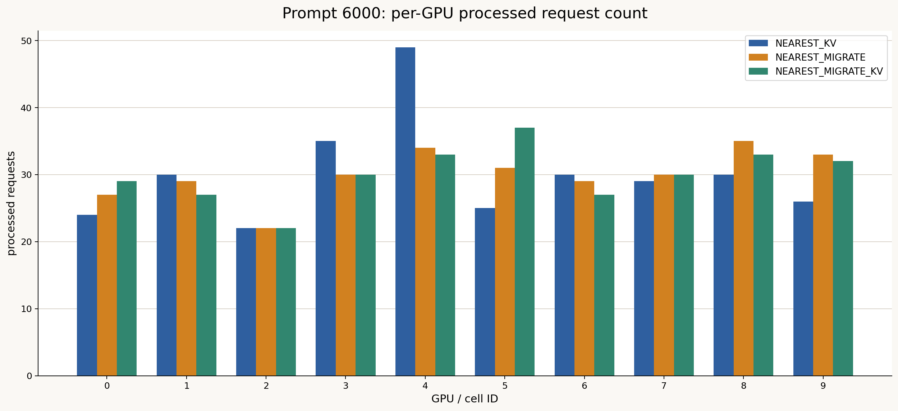

# Prompt 6000 workloadにおける3方式比較

## 1. 概要

10セル・10台のRTX 4090環境で、次の3方式を比較した。

| 方式 | 容量不足時 | Redirect先のprefix |
|---|---|---|
| `NEAREST_KV` | 最寄りGPUで待機 | 最寄りGPUのlocal KVを再利用 |
| `NEAREST_MIGRATE` | 第2近傍GPUへrequest forward | cold prefill |
| `NEAREST_MIGRATE_KV` | 第2近傍GPUへrequest forward | KVをhandoffして再利用 |

共通条件は、300リクエスト、入力6,000 tokens、KV再利用率約50%、
`max_num_seqs=128`、`max_num_batched_tokens=2048`、APN 10.7 Gbit/s、
固定片道伝搬遅延300,500 nsである。

使用した結果CSVは次のとおりである。

```text
experiments/2026-07-13_prompt6000_three_policy/results/NEAREST_KV/requests.csv
experiments/2026-07-13_prompt6000_three_policy/results/NEAREST_MIGRATE/requests.csv
experiments/2026-07-13_prompt6000_three_policy/results/NEAREST_MIGRATE_KV/requests.csv
```

全方式で300件すべてが正常終了した。

## 2. 主要結果

### 2.1 システム全体

| 指標 | NEAREST_KV | NEAREST_MIGRATE | NEAREST_MIGRATE_KV |
|---|---:|---:|---:|
| Redirect件数 | 0 | 64 | 62 |
| Redirect率 | 0.00% | 21.33% | 20.67% |
| Prefix hit率 | 約49.9% | 39.25% | 49.70% |
| Makespan | 113.89 s | **89.18 s** | 94.29 s |
| Request throughput | 2.63 req/s | **3.36 req/s** | 3.18 req/s |
| Output token throughput | 1,718.7 tok/s | **2,195.0 tok/s** | 2,076.0 tok/s |
| GPU別処理件数の標準偏差 | 7.27 | **3.55** | 3.92 |

Request forwardを行う2方式は、最寄りGPUで待つ`NEAREST_KV`より負荷を均等化し、
throughputを向上した。今回のmakespanとthroughputだけを見ると、cold prefillの
`NEAREST_MIGRATE`が最良である。

ただし、`NEAREST_MIGRATE_KV`ではKV handoff時間によってredirectリクエストのGPU到着が
遅れるため、cold prefill方式よりmakespanが5.7%長い。一方、リクエスト単位のTTFTと
完了時間はKV handoff方式の方が優れている。

### 2.2 E2E TTFT

| 指標 | NEAREST_KV | NEAREST_MIGRATE | NEAREST_MIGRATE_KV |
|---|---:|---:|---:|
| Mean | 4,639.7 ms | 3,040.9 ms | **2,613.8 ms** |
| p50 | **435.6 ms** | 762.1 ms | 644.3 ms |
| p95 | 29,456.9 ms | 12,839.6 ms | **11,179.7 ms** |
| Max | 41,142.9 ms | 21,483.3 ms | **21,289.4 ms** |

`NEAREST_KV`はmigrationを行わないためp50が最良であるが、負荷集中時の待機により
p95と最大値が大きい。`NEAREST_MIGRATE`はtailを改善し、さらにKVをhandoffすることで
mean、p50、p95のすべてがcold prefill方式より改善した。

`NEAREST_MIGRATE_KV`は`NEAREST_MIGRATE`に対して次の改善を示した。

- Mean E2E TTFT: 14.0%改善
- p50 E2E TTFT: 15.5%改善
- p95 E2E TTFT: 12.9%改善

### 2.3 E2E request completion latency

| 指標 | NEAREST_KV | NEAREST_MIGRATE | NEAREST_MIGRATE_KV |
|---|---:|---:|---:|
| Mean | 23,939.6 ms | 23,419.8 ms | **22,278.4 ms** |
| p50 | **20,792.3 ms** | 22,979.5 ms | 22,216.6 ms |
| p95 | 51,921.6 ms | 34,896.7 ms | **32,002.1 ms** |
| Max | 63,369.7 ms | 52,334.5 ms | **47,321.3 ms** |

KV handoffはcold prefill方式に対し、平均完了時間を4.9%、p95を8.3%改善した。

### 2.4 GPU到着後の指標

| 指標 | NEAREST_KV | NEAREST_MIGRATE | NEAREST_MIGRATE_KV |
|---|---:|---:|---:|
| Simulator TTFT mean | 456.2 ms | 572.2 ms | **484.8 ms** |
| Prefill service mean | **425.9 ms** | 514.3 ms | 444.7 ms |
| TPOT mean | **29.60 ms** | 31.28 ms | 30.19 ms |

`NEAREST_MIGRATE`ではredirectされた64件がcold prefillとなる。redirectリクエストだけの
prefill service平均は815.8 msである。`NEAREST_MIGRATE_KV`ではKVを再利用するため、
redirectリクエストのprefill service平均は501.2 msまで低下した。

## 3. 平均E2E TTFT breakdown


| 方式 | Queue / wait | KV transfer | Compute / prefill | RTT / other comm | Mean E2E TTFT |
|---|---:|---:|---:|---:|---:|
| NEAREST_KV | 4,213.77 ms | 0.00 ms | 425.90 ms | 0.00 ms | 4,639.67 ms |
| NEAREST_MIGRATE | 2,526.42 ms | 0.00 ms | 514.33 ms | 0.13 ms | 3,040.88 ms |
| NEAREST_MIGRATE_KV | **2,103.53 ms** | 65.45 ms | 444.69 ms | 0.13 ms | **2,613.80 ms** |

成分は次のように定義した。

```text
Queue / wait       = E2E TTFT - prefill service - communication
KV transfer        = kv_migration_latency_ns
Compute / prefill  = prefill_service_ns
RTT / other comm   = communication_latency_ns - kv_migration_latency_ns
```

Queueを残差で算出するのは、router内の容量待ちが`scheduler`の
`queueing_before_ttft_ns`に完全には含まれないためである。

`NEAREST_MIGRATE_KV`は全リクエスト平均で65.45 msのKV転送コストを追加するが、
`NEAREST_MIGRATE`よりQueue / waitを約423 ms、Compute / prefillを約70 ms削減する。
この削減が転送コストを上回り、平均E2E TTFTが約427 ms改善した。

## 4. E2E TTFT CDF


CDFから次の傾向が確認できる。

- 短時間領域ではmigrationコストがない`NEAREST_KV`が優れる
- `NEAREST_KV`は混雑セルで待機するため、CDFの右tailが約41秒まで伸びる
- `NEAREST_MIGRATE`はcold prefillにより中間領域で最も遅い
- `NEAREST_MIGRATE_KV`はcold prefill方式よりCDFが概ね左側に位置する
- p95は29.5秒、12.8秒、11.2秒の順に改善する

## 5. GPU負荷分散



| GPU | NEAREST_KV | NEAREST_MIGRATE | NEAREST_MIGRATE_KV |
|---:|---:|---:|---:|
| 0 | 24 | 27 | 29 |
| 1 | 30 | 29 | 27 |
| 2 | 22 | 22 | 22 |
| 3 | 35 | 30 | 30 |
| 4 | 49 | 34 | 33 |
| 5 | 25 | 31 | 37 |
| 6 | 30 | 29 | 27 |
| 7 | 29 | 30 | 30 |
| 8 | 30 | 35 | 33 |
| 9 | 26 | 33 | 32 |

| 負荷分散指標 | NEAREST_KV | NEAREST_MIGRATE | NEAREST_MIGRATE_KV |
|---|---:|---:|---:|
| 最大件数 | 49 | 35 | 37 |
| 最小件数 | 22 | 22 | 22 |
| 最大−最小 | 27 | 13 | 15 |
| 標準偏差 | 7.27 | **3.55** | 3.92 |

両migration方式で、hotspotだったGPU 4の処理数が49件から33〜34件へ減った。

## 6. Prefix KV再利用の効果

`NEAREST_MIGRATE`のprefix hit率は39.25%であり、約50%の他2方式より低い。これは
redirectされた64件がKVを持たずに第2近傍GPUへ移動し、cold prefillになったためである。

```text
非redirect 236件 × 2,992 tokens = 706,112 hit tokens
```

`NEAREST_MIGRATE_KV`ではredirectされたリクエストにも2,992-token KVを移すため、
ほぼ50%のhit率を維持している。1件あたりのKV migrationは約374 MiB、約316.7 msで、
62件の総転送量は約22.64 GiBである。

## 7. Throughputとlatencyの違い

今回、`NEAREST_MIGRATE`はmakespanとthroughputで最良だが、リクエスト単位のTTFTと
完了時間では`NEAREST_MIGRATE_KV`が最良となった。

これは、KV handoffの約316.7 msがredirectリクエストのtarget到着を遅らせる一方、
到着後のprefillを短縮するためである。cold prefill方式はKV転送を待たずにtarget GPUを
使い始められるので、全体を早く流し切れる場合がある。しかし各redirectリクエストは
6,000-token promptを再計算するため、そのTTFTと完了時間は悪化する。

したがって、本実験では目的に応じて評価が分かれる。

- クラスタの最大throughputを優先: `NEAREST_MIGRATE`
- 個々のリクエストのmean/tail latencyを優先: `NEAREST_MIGRATE_KV`
- migrationを避け、低負荷時のp50を優先: `NEAREST_KV`

## 8. 結論

3方式比較から次のことが確認できた。

1. Request migrationは地域負荷のhotspotを緩和し、`NEAREST_KV`よりthroughputとtailを改善する。
2. KVなしのmigrationではredirect先がcold prefillとなり、prefix hit率が39.25%へ低下する。
3. KV handoffはcold prefill方式より平均TTFTを14.0%、p95 TTFTを12.9%改善する。
4. KV handoffは転送時間のためmakespanではcold prefill方式より5.7%不利だった。
5. KV migrationはthroughput最大化より、redirectされたリクエストの計算量とtail latencyを
   削減する効果が強い。

今後は、home GPUの推定待ち時間、cold prefill時間、KV handoff時間を比較し、リクエスト
ごとにcold forwardとKV handoffを選択するhybrid policyを検討する価値がある。

## 9. 図の再生成

```bash
MPLCONFIGDIR=/tmp/llmservingsim-matplotlib python3 experiments/2026-07-13_prompt6000_three_policy/scripts/plot_three_policy_comparison.py
```
