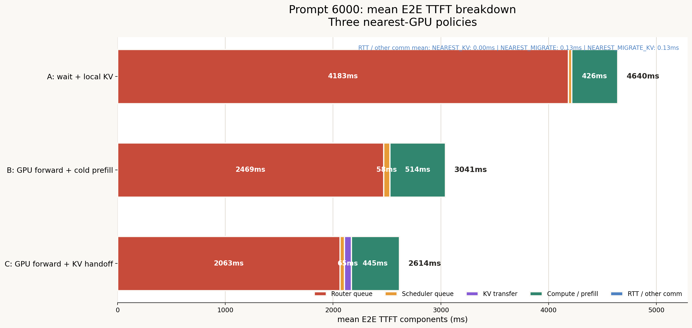
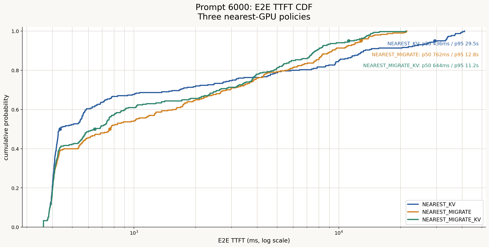
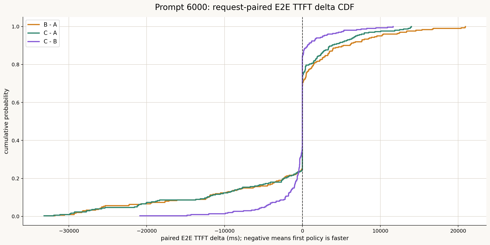
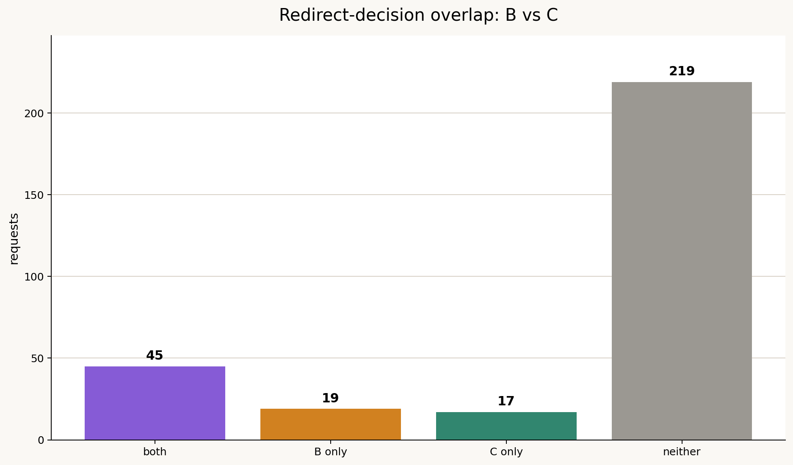
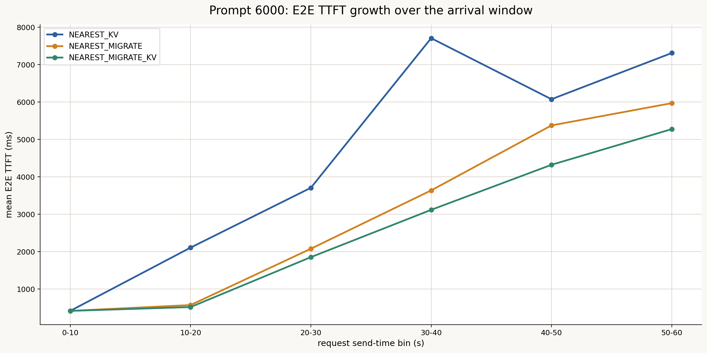
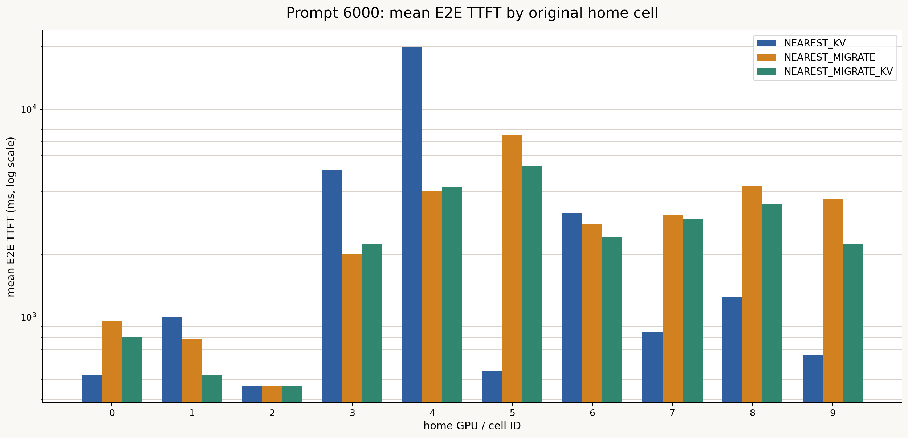

# Prompt 6000・3ルーティング方式 詳細分析レポート

作成日: 2026-07-13

## 1. 結論

今回の60秒・300リクエスト・入力6000 tokens・Prefix再利用率約50%の条件では、総合的には `NEAREST_MIGRATE_KV` が最も良い結果だった。

- 平均E2E TTFTは `NEAREST_KV` の 4639.7 ms に対し、`NEAREST_MIGRATE` は 3040.9 ms、`NEAREST_MIGRATE_KV` は 2613.8 msだった。
- `NEAREST_MIGRATE_KV` は `NEAREST_KV` に対して平均E2E TTFTを 43.7%、`NEAREST_MIGRATE` に対して 14.0%短縮した。
- p95 E2E TTFTも 29456.9 ms → 12839.6 ms → 11179.7 msと改善した。
- 最悪ユーザの平均TTFTは 21459.5 ms → 8578.1 ms → 6192.2 msとなり、地域間公平性も改善した。
- `NEAREST_MIGRATE_KV` では62件がGPUメモリ容量を理由にリダイレクトされ、`max_num_seqs=128` に対して判定時の実行数はおおむね11件だった。したがって、今回実装した「シーケンス上限未満でもKV容量でリダイレクトする」動作は確認できている。

ただし、`NEAREST_MIGRATE` と `NEAREST_MIGRATE_KV` のリダイレクト対象が完全には一致しない。両方式で共通してリダイレクトされたのは45件だけであり、後続の負荷状態も変わる。そのため、両者の全体差をすべて「KV handoff単体の効果」と解釈してはいけない。

## 2. 比較対象

| 略称 | 方式 | 結果ディレクトリ |
|---|---|---|
| A | `NEAREST_KV` | `results/NEAREST_KV/` |
| B | `NEAREST_MIGRATE` | `results/NEAREST_MIGRATE/` |
| C | `NEAREST_MIGRATE_KV` | `results/NEAREST_MIGRATE_KV/` |

3方式とも次の条件が一致していることを確認した。

- 300リクエスト
- 同じリクエストID集合
- 各IDの送信時刻、入力長、出力長、ユーザ、最寄りGPUが一致
- 同一クラスタ設定、同一データセット、同一Git commit
- `max_num_seqs=128`
- `max_num_batched_tokens=2048`
- chunked prefill有効
- prefix caching有効
- 10 GPU、RTX 4090、各GPU 24 GB

このため、リクエスト単位のpaired comparisonが可能である。

## 3. 全体結果

### 3.1 レイテンシとスループット

| 指標 | A: NEAREST_KV | B: NEAREST_MIGRATE | C: NEAREST_MIGRATE_KV |
|---|---:|---:|---:|
| リダイレクト件数 | 0 | 64 | 62 |
| 平均 E2E TTFT | 4639.7 ms | 3040.9 ms | **2613.8 ms** |
| p50 E2E TTFT | **435.6 ms** | 762.1 ms | 644.3 ms |
| p95 E2E TTFT | 29456.9 ms | 12839.6 ms | **11179.7 ms** |
| 最大 E2E TTFT | 41142.9 ms | 21483.3 ms | **21289.4 ms** |
| 平均完了時間 | 23939.6 ms | 23419.8 ms | **22278.4 ms** |
| p95 完了時間 | 51921.6 ms | 34896.7 ms | **32002.1 ms** |
| 平均 TPOT | **29.60 ms** | 31.28 ms | 30.19 ms |
| シミュレーションmakespan | 113.9 s | **89.2 s** | 94.3 s |
| Request throughput | 2.63 req/s | **3.36 req/s** | 3.18 req/s |
| Output token throughput | 1718.7 tok/s | **2195.0 tok/s** | 2076.0 tok/s |
| Prefix cache hit率 | 約50% | 39.25% | 49.70% |

平均・p95・最大TTFTではCが最良である。一方、次の2点はBが有利だった。

- makespanとthroughputはBが最良だった。
- Cは392,167,424 bytes、約374 MiBのKVをリダイレクトごとに転送するため、処理全体を完了する速度では転送を行わないBが若干有利だった。

したがって、今回の結果は「Cが全指標で勝つ」ものではなく、Cはユーザの待ち時間、特にtail latencyを優先し、Bはクラスタ全体の完了速度を優先する関係にある。

### 3.2 Aを基準とした改善率

| 指標 | BのA比 | CのA比 |
|---|---:|---:|
| 平均 E2E TTFT | 34.5%短縮 | **43.7%短縮** |
| p95 E2E TTFT | 56.4%短縮 | **62.0%短縮** |
| 最大 E2E TTFT | 47.8%短縮 | **48.3%短縮** |
| Request throughput | **27.7%増加** | 20.8%増加 |

## 4. TTFT breakdown

全リクエスト平均のE2E TTFTを、次のように分解した。

- Queue / wait: E2E TTFTからprefill、KV transfer、明示的通信を引いた残差
- KV transfer: `kv_migration_latency_ns`
- Compute: prefill service time
- RTT / comm: 明示的に記録された通信時間

| 成分 | A | B | C |
|---|---:|---:|---:|
| Queue / wait | 4213.8 ms | 2526.4 ms | **2103.5 ms** |
| KV transfer | 0.0 ms | 0.0 ms | 65.5 ms |
| Compute / prefill | 425.9 ms | 514.3 ms | 444.7 ms |
| RTT / other comm | 0.0 ms | 0.1 ms | 0.1 ms |
| 合計 | 4639.7 ms | 3040.9 ms | **2613.8 ms** |



主要な観察は、Cが平均65.5 msのKV転送コストを追加で払っても、Aに対して待ち時間を約2110 ms、Bに対して約423 ms減らしていることである。したがって今回の負荷では、KVを転送してprefill再計算を避ける効果と、負荷分散による待ち時間削減が転送コストを上回った。

ただし、CSVの `queueing_before_ttft_ns` はGPU scheduler内の待ちのみを表し、router側で容量が空くまで待った時間を十分に含まない。このため、本レポートではE2Eから既知成分を引いた残差をQueue / waitとして扱った。この値は有用だが、厳密なイベント計測値ではない。

## 5. 分布とリクエスト単位の比較

### 5.1 E2E TTFT CDF



Aは中央値では最も速いが、一部リクエストの待ちが非常に長く、p95と最大値が悪化している。BとCは軽負荷時の一部リクエストにリダイレクト判断の影響を与える一方、長いtailを大きく抑えている。

これは、今回の目的が平均ユーザ体験・tail latencyの改善であればCが有利である一方、無負荷時の最短TTFTだけを重視するならAにも利点があることを示す。

### 5.2 Paired delta CDF



同じリクエストID同士を比較した平均差は次の通りだった。

| 差分 | 平均差 | 解釈 |
|---|---:|---|
| B - A | -1598.8 ms | Bが平均1.60秒短い |
| C - A | -2025.9 ms | Cが平均2.03秒短い |
| C - B | -427.1 ms | Cが平均0.43秒短い |

全300件でCのE2E TTFTがBより短い割合は38.7%だった。多数のリクエストは同等か差が小さいため、平均改善は主に混雑時のリクエストから生じている。

完了時間ではCがBより短いリクエストが62%あり、平均差は -1141.3 ms、中央値差は -587.1 msだった。

## 6. リダイレクトの分析

### 6.1 発生理由

Cの62件はすべて `redirect_capacity_reason=npu_memory` だった。代表的な判定値は次の通りである。

- 判定時の実行リクエスト数: 約11件
- `capacity_max_num_seqs`: 128件
- KV budget: 9,709,281,280 bytes
- 空きKV容量: おおむね数十MiBから約136 MiB
- 新規要求KV: おおむね約816から848 MiB

よって、`max_num_seqs` に達していないにもかかわらず、追加リクエストのKVを収容できないためリダイレクトされた。今回確認したかった新しい容量判定ルールは機能している。

### 6.2 方式間のリダイレクト集合



| グループ | 件数 |
|---|---:|
| BとCの両方でリダイレクト | 45 |
| Bだけでリダイレクト | 19 |
| Cだけでリダイレクト | 17 |
| どちらでもリダイレクトなし | 219 |

Bは64件、Cは62件をリダイレクトしたが、共通集合は45件、Jaccard係数は約0.556にとどまる。CではKV転送時間が追加され、リクエストの進行とGPU容量の時間変化がBと異なるため、その後にどのリクエストが容量不足になるかも変化する。

この動的フィードバックのため、BとCの全体比較には次の両方が含まれる。

1. cold prefillとKV handoffの直接差
2. それによって変化した後続のルーティング、混雑、バッチ構成の間接差

### 6.3 共通リダイレクト45件

より条件を近づけるため、BとCの両方でリダイレクトされた45件だけを比較した。

| 指標 | B | C |
|---|---:|---:|
| 平均 E2E TTFT | 6272.6 ms | **5894.1 ms** |
| p50 E2E TTFT | **2992.1 ms** | 5008.8 ms |
| p95 E2E TTFT | 15861.3 ms | **14281.5 ms** |
| CがBより速い割合 | - | 71.1% |
| paired平均差 C-B | - | -378.5 ms |

Cは共通リダイレクトの71.1%でBより速く、平均とp95も改善した。ただし中央値はBの方が速い。KV handoffは多くのリクエストを助けるが、固定約316.7 msの転送費用があるため、cold prefill回避や待ち時間短縮が小さいケースでは不利になる。

## 7. 到着時間帯別



| 到着時刻 | 件数 | A mean | B mean | C mean | B redirects | C redirects |
|---|---:|---:|---:|---:|---:|---:|
| 0-10 s | 41 | 418.9 ms | 418.9 ms | 418.9 ms | 0 | 0 |
| 10-20 s | 49 | 2109.8 ms | 574.7 ms | **520.6 ms** | 7 | 7 |
| 20-30 s | 62 | 3708.8 ms | 2079.9 ms | **1854.9 ms** | 11 | 9 |
| 30-40 s | 50 | 7708.1 ms | 3638.9 ms | **3119.7 ms** | 17 | 15 |
| 40-50 s | 49 | 6076.6 ms | 5376.0 ms | **4323.5 ms** | 17 | 17 |
| 50-60 s | 49 | 7311.2 ms | 5971.5 ms | **5277.9 ms** | 12 | 14 |

最初の10秒は3方式が完全に同じであり、負荷が低い段階ではルーティング方式の差はない。10秒以降に一部セルのメモリ圧迫と待ちが蓄積し、B/CがAから分かれ始める。CのBに対する効果も後半ほど大きい。

したがってCが有利になる条件は、単に大きいpromptであるだけでなく、「同じセルへの到着が継続し、既存KVが残り、待ちが蓄積する時間」があることである。

## 8. セル別の影響



ここでは各リクエストの元の最寄りGPU、すなわちhome cell別に集計した。

| Home GPU | 件数 | A mean | B mean | C mean | B redirects | C redirects |
|---:|---:|---:|---:|---:|---:|---:|
| 0 | 24 | 526.5 | 958.0 | 803.3 | 5 | 2 |
| 1 | 30 | 997.4 | 778.7 | **524.3** | 5 | 4 |
| 2 | 22 | 466.3 | 466.3 | 466.3 | 0 | 0 |
| 3 | 35 | 5096.8 | **2012.4** | 2246.9 | 6 | 6 |
| 4 | 49 | 19866.7 | **4038.5** | 4196.5 | 18 | 19 |
| 5 | 25 | **546.7** | 7540.2 | 5346.7 | 16 | 13 |
| 6 | 30 | 3158.9 | 2789.5 | **2426.8** | 1 | 3 |
| 7 | 29 | **842.8** | 3100.9 | 2950.2 | 4 | 5 |
| 8 | 30 | **1242.6** | 4286.8 | 3483.7 | 7 | 9 |
| 9 | 26 | **656.5** | 3715.8 | 2233.3 | 2 | 1 |

GPU 4が最大のhotspotであり、Aでは平均約19.9秒まで悪化した。B/Cはこのセルを約4秒まで改善した。一方、GPU 5、7、8、9など、Aでは比較的軽かったセルのユーザはmigration後に悪化している。

これは異常ではなく、hotspotから逃がしたリクエストを他セルが引き受けた結果である。クラスタ全体と最悪セルは改善したが、受け入れ先セルのローカルユーザには負荷転嫁が起きている。

今後は「最寄りGPUが満杯なら最も空いているGPUへ送る」だけでなく、次を含むcost-based destination selectionが必要になる。

- 移動先GPUの予測待ち時間
- 移動によって悪化するローカルユーザ数
- KV転送時間
- cold prefill時間
- 転送中に発生する帯域競合

## 9. 公平性

ユーザごとの平均E2E TTFTを計算し、その分散を比較した。

| 指標 | A | B | C |
|---|---:|---:|---:|
| ユーザ平均TTFTのCV | 1.719 | 0.756 | **0.676** |
| 最小ユーザ平均TTFT | 460.9 ms | 460.9 ms | 460.9 ms |
| 中央ユーザ平均TTFT | **864.3 ms** | 2789.5 ms | 2428.6 ms |
| 最大ユーザ平均TTFT | 21459.5 ms | 8578.1 ms | **6192.2 ms** |

Aは軽いセルのユーザには非常に速いが、hotspotのユーザだけが極端に遅い。B/Cは軽いセルにも負荷を分配するため中央ユーザは悪化するが、最悪ユーザを大幅に改善し、地域間格差を縮小する。

運用上は平均TTFTだけでなく、少なくとも次の2つを併記すべきである。

- 全リクエストp95/p99
- cellまたはuser単位の平均TTFT最大値、あるいはJain fairness index

## 10. 出力長との関係

出力長の四分位別にC-Bを調べたが、改善量は単調には変化しなかった。共通リダイレクト45件でも、C-BのE2E TTFT差と出力長のSpearman相関は `rho=0.072, p=0.636` だった。

今回のpromptは全件6000 tokensで固定され、TTFTは主にprefill、容量判定、到着時の混雑で決まる。そのため、出力長はTTFT差を説明する主要因ではない。ただし、長いdecodeはGPUメモリを長時間占有し、後続リクエストへの間接影響を持つ。単一リクエストの相関が弱いことは、クラスタ状態への影響がないことを意味しない。

## 11. KV転送量とネットワーク仮定

CのKV migrationは次の規模だった。

- 1件あたり: 392,167,424 bytes、約374 MiB
- 1件あたり転送遅延: 約316.7 ms
- 62件合計: 約22.64 GiB

metadata上のネットワークモデルでは、contention、queueing、jitter、packet lossがすべて無効である。したがって、複数KV migrationが重なる場合でも各転送が10.7 Gbit/sを独立に使える近似になっている可能性が高い。

この仮定はCに有利である。現実の共有APNリンクやNICに競合がある場合、転送遅延は増加し、CとBの損益分岐点はより厳しくなる。次の感度試験では帯域だけでなく同時転送数による実効帯域低下も評価すべきである。

## 12. 計測上の注意点

### 12.1 Queue計測

`requests.csv` のscheduler queue時間だけではrouter capacity waitを表現できない。今回のbreakdownでは残差を利用したため、今後は次を別カラムで直接記録することを推奨する。

- `router_capacity_wait_ns`
- `scheduler_wait_ns`
- `redirect_decision_ns`
- `destination_wait_ns`
- `kv_transfer_start_ns` / `kv_transfer_end_ns`

### 12.2 GPU集計CSV

今回の `gpus.csv` では `max_waiting_requests=0` だったが、実際にはrouter側で待ちが発生している。また `max_running_requests` はログ上の瞬時実行数ではなく、結果上は各GPUの総処理件数に近い値になっている。

したがって、現状の `gpus.csv` のこれら2列を最大queue長・最大同時実行数として解釈してはいけない。GPU状態の時系列ログ、またはイベントごとのrunning/waitingカウンタが必要である。

### 12.3 単一トレース

今回の300件はpaired comparisonとして有効だが、乱数seedを変えた反復試験ではない。統計的な一般化には、各条件を少なくとも3から5 seedで実行し、平均と95% confidence intervalを示す必要がある。

## 13. どの条件でCが有利・不利になるか

### Cが有利になりやすい条件

- 特定セルに継続的なhotspotがある
- router待ちがKV転送時間より十分長い
- promptが長く、cold prefill回避価値が高い
- 再利用可能KV割合が高い
- 移動先GPUに十分な余力がある
- GPU間帯域が高く、同時migrationの競合が小さい
- tail latencyや地域間公平性を重視する

### Cが不利になりやすい条件

- 全セルが均等かつ低負荷で待ちがない
- promptが短い、またはKV再利用率が低い
- 移動先も混雑している
- GPU間帯域が低い、RTTが大きい、または同時転送が競合する
- throughputやmakespanをTTFTより重視する
- 転送後すぐにKVがevictされ、handoff費用を回収できない

今回のC-B平均差は427 msであり、1件のKV転送費用約317 msと同程度のオーダーである。したがって、queueを半分にする90秒伸長ではなく到着率を下げる試験、帯域を下げる試験、再利用率を下げる試験では、比較的容易にBとCの順位が逆転する可能性がある。

## 14. 次に実施すべき実験

優先順位は次の通りである。

1. 同一300件を90秒へ伸長し、queueを減らす。
2. 60秒・75秒・90秒・120秒の到着時間sweepでC-Bの損益分岐点を探す。
3. KV再利用率を0%、25%、50%、75%、100%でsweepする。
4. GPU間帯域を5、10.7、25、50 Gbit/sでsweepする。
5. prompt長を1024、3000、6000、12000 tokensでsweepする。
6. 地域負荷を均等、現行skew、より強いhotspotの3段階で比較する。
7. 各条件を複数seedで繰り返す。

また、BとCの直接的な機構差を厳密に測るには、通常の動的ルーティングとは別に次のcounterfactual試験が必要である。

- Bで決まったリダイレクト対象と移動先を保存する。
- Cでも同じ対象・同じ移動先を強制する。
- 逆方向にもCの決定をBへ固定して比較する。

これにより、後続ルーティングの動的差を除外し、cold prefillとKV handoffの純粋な差を測定できる。

## 15. 再現用ファイル

詳細集計と追加グラフは次のスクリプトで再生成できる。

```bash
python3 experiments/2026-07-13_prompt6000_three_policy/scripts/analyze_three_policy.py
```

生成物:

- `analysis/paired_requests.csv`
- `analysis/summary.json`
- `figures/three_policy_paired_delta_cdf.png`
- `figures/three_policy_arrival_bins.png`
- `figures/three_policy_home_gpu_ttft.png`
- `figures/three_policy_redirect_overlap.png`

`paired_requests.csv` には3方式の同一リクエストの結果と差分を横並びで保存しているため、追加の条件抽出や外れ値調査にも利用できる。
