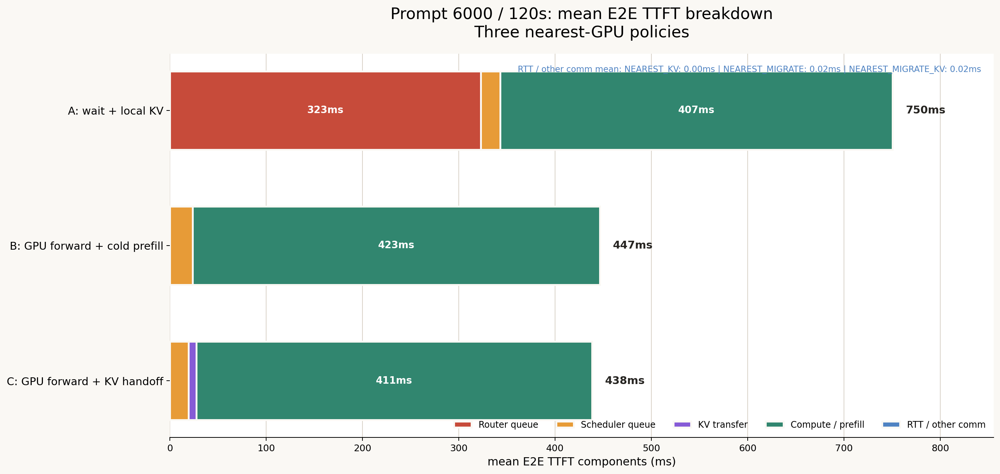
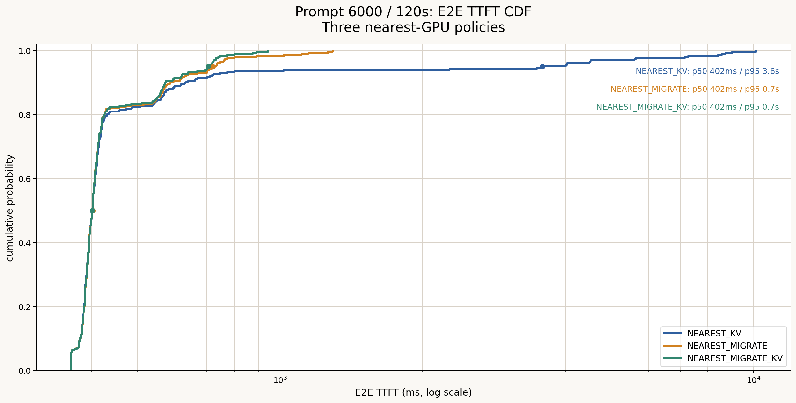
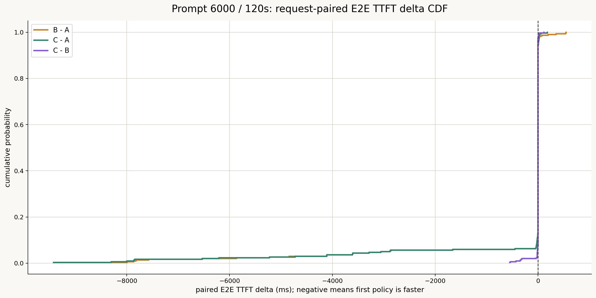
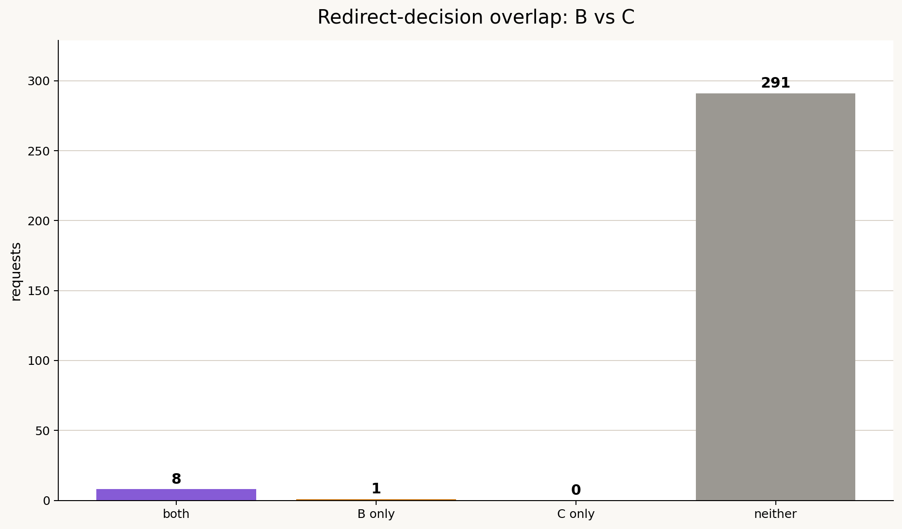
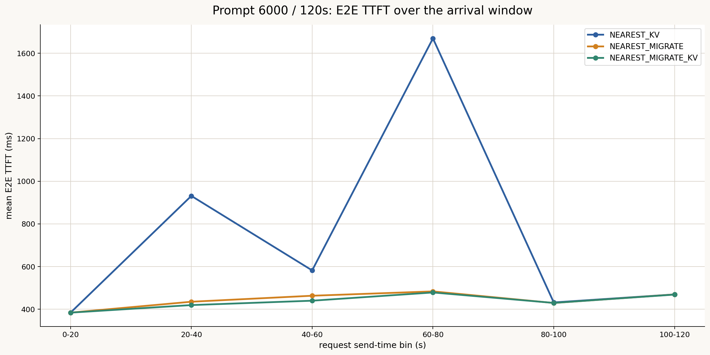
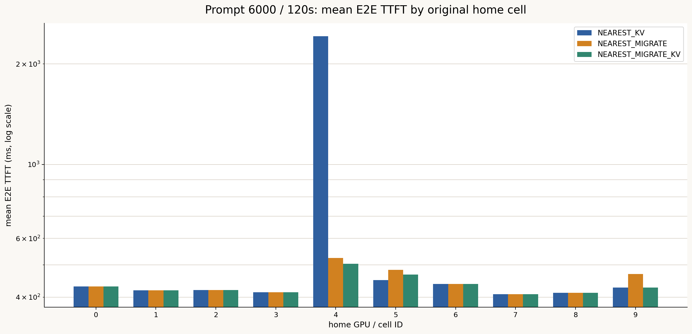
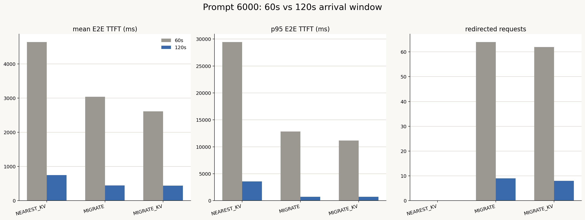

# Prompt 6000・120秒・3方式比較レポート

作成日: 2026-07-14

## 1. 結論

300リクエストの到着ウィンドウを120秒へ伸ばすと、migration方式のqueue待ちは事実上解消され、KV handoffの全体平均上の利得は小さくなった。

- 平均E2E TTFTは `NEAREST_KV` 750.4 ms、`NEAREST_MIGRATE` 446.6 ms、`NEAREST_MIGRATE_KV` 438.4 msだった。
- `NEAREST_MIGRATE_KV` は `NEAREST_MIGRATE` より平均8.2 ms、1.8%短かった。
- p95は721.7 msから705.3 msへ2.3%改善し、最大値は1292.9 msから945.5 msへ26.9%改善した。
- p50は3方式とも約402 msで一致した。
- リダイレクトはBで9件、Cで8件となり、90秒版の各24件からさらに減少した。
- B/Cの共通リダイレクト8件では、Cが75.0%のリクエストで速く、平均127.2 ms短かった。

したがって、120秒条件ではKV handoffの全体平均への効果は限定的だが、実際に容量不足でredirectされたリクエストのtailを抑える効果は残る。負荷低下に伴い、転送費用を回収できる機会が少なくなった領域である。

## 2. データと整合性

3方式とも以下を確認した。

- 各300リクエスト
- 同じrequest ID集合
- IDごとの入力長、出力長、送信時刻、ユーザ、最寄りGPUが一致
- 同じdataset、cluster config、Git commit
- `max_num_seqs=128`
- `max_num_batched_tokens=2048`
- ネットワークcontention、queueing、jitter、packet lossは無効

結果ディレクトリ:

| 方式 | 保存場所 |
|---|---|
| `NEAREST_KV` | `results/NEAREST_KV/` |
| `NEAREST_MIGRATE` | `results/NEAREST_MIGRATE/` |
| `NEAREST_MIGRATE_KV` | `results/NEAREST_MIGRATE_KV/` |

## 3. 全体結果

| 指標 | NEAREST_KV | NEAREST_MIGRATE | NEAREST_MIGRATE_KV |
|---|---:|---:|---:|
| リダイレクト件数 | 0 | 9 | **8** |
| 平均 E2E TTFT | 750.4 ms | 446.6 ms | **438.4 ms** |
| p50 E2E TTFT | **402.1 ms** | 402.2 ms | 402.1 ms |
| p95 E2E TTFT | 3581.7 ms | 721.7 ms | **705.3 ms** |
| 最大 E2E TTFT | 10125.6 ms | 1292.9 ms | **945.5 ms** |
| 平均完了時間 | 16656.4 ms | 16203.5 ms | **16143.4 ms** |
| p95 完了時間 | 25181.4 ms | 22310.0 ms | **22309.8 ms** |
| 平均 TPOT | 24.39 ms | 24.15 ms | **24.07 ms** |
| makespan | **135.4 s** | 135.4 s | 135.4 s |
| Request throughput | **2.22 req/s** | 2.22 req/s | 2.22 req/s |
| Output token throughput | **1445.4 tok/s** | 1445.4 tok/s | 1445.4 tok/s |
| Prefix hit率 | **49.87%** | 48.37% | **49.87%** |
| ユーザ平均TTFTのCV | 0.985 | 0.087 | **0.069** |

120秒版では到着spanがmakespanの大部分を占めるため、3方式のmakespanとthroughputは実質同一である。CはBよりTTFTと完了時間をわずかに改善し、クラスタ全体の完了速度は変えていない。

## 4. TTFT breakdown

| 成分 | NEAREST_KV | NEAREST_MIGRATE | NEAREST_MIGRATE_KV |
|---|---:|---:|---:|
| Router queue | 323.0 ms | 0.0 ms | 0.0 ms |
| Scheduler queue | 20.2 ms | 23.4 ms | **19.2 ms** |
| KV transfer | 0.0 ms | 0.0 ms | 8.4 ms |
| Compute / prefill | **407.2 ms** | 423.2 ms | 410.7 ms |
| RTT / other comm | 0.0 ms | 0.0 ms | 0.0 ms |
| 合計 | 750.4 ms | 446.6 ms | **438.4 ms** |

Cは全リクエスト平均で8.4 msのKV転送費用を払いながら、Bに対してscheduler queueを4.2 ms、prefillを12.5 ms減らし、最終的に8.2 ms改善した。Router queueはB/Cとも約0.03 msであり、90秒版よりさらに低負荷である。

## 5. TTFT分布

全体の97%以上はredirectされておらず、中央値は3方式で一致する。方式差は少数のtailに現れる。

- AはGPU 4のhotspotによりp95が3.58秒、最大が10.13秒まで伸びる。
- Bはp95を0.72秒、最大を1.29秒へ抑える。
- Cは最大値をさらに0.95秒へ抑える。

## 6. リクエスト単位のB/C比較

全300件ではCがBより速い割合は17.7%だった。BとCの両方でリダイレクトされた8件に限定すると次の結果になる。

| 指標 | B | C |
|---|---:|---:|
| 平均 E2E TTFT | 897.6 ms | **770.4 ms** |
| CがBより速い割合 | - | **75.0%** |
| paired平均差 C-B | - | **-127.2 ms** |
| paired中央値差 C-B | - | **-22.1 ms** |

| グループ | 件数 |
|---|---:|
| B/C両方でredirect | 8 |
| Bだけ | 1 |
| Cだけ | 0 |
| どちらもなし | 291 |

## 7. リダイレクト容量判定と転送量

Bの9件、Cの8件はすべて `redirect_capacity_reason=npu_memory` だった。

Cのredirect時:

- 判定時running requests: 平均11、中央値11、最大11
- `max_num_seqs`: 128
- 必要KV容量: 平均833.8 MiB
- 判定時利用可能KV容量: 中央値100.5 MiB
- KV migration: 1件392,167,424 bytes、約374 MiB
- migration latency: 1件平均316.7 ms
- 8件合計転送量: 約2.92 GiB

120秒版でも、sequence数ではなくGPU KV容量がredirect条件になっている。

## 8. 到着時間帯別

| 到着時刻 | 件数 | A mean | B mean | C mean | B redirects | C redirects |
|---|---:|---:|---:|---:|---:|---:|
| 0-20 s | 41 | 384.0 | 384.0 | 384.0 | 0 | 0 |
| 20-40 s | 49 | 931.3 | 435.1 | **419.5** | 4 | 4 |
| 40-60 s | 62 | 582.0 | 463.2 | **440.0** | 1 | 0 |
| 60-80 s | 50 | 1669.7 | 483.6 | **478.5** | 4 | 4 |
| 80-100 s | 49 | 431.9 | **429.3** | 429.6 | 0 | 0 |
| 100-120 s | 49 | 469.4 | 469.2 | **468.6** | 0 | 0 |

redirectは20-80秒に限られ、80秒以降は3方式がほぼ一致する。Aのhotspot待ちは残るが、B/Cでは8-9件のredirectで吸収できる。

## 9. セル別

GPU 4が引き続き唯一の主要hotspotである。

| Home GPU | 件数 | A mean | B mean | C mean | B/C redirects |
|---:|---:|---:|---:|---:|---:|
| 4 | 49 | 2422.9 ms | 524.2 ms | **503.4 ms** | 8 / 8 |
| 5 | 25 | **449.8 ms** | 483.4 ms | 467.9 ms | 1 / 0 |
| 9 | 26 | **428.0 ms** | 469.1 ms | **428.0 ms** | 0 / 0 |

BではGPU 5からGPU 9への追加redirectが1件あり、Cにはない。この動的経路差がB onlyの1件に対応する。

## 10. 60秒版・90秒版との比較

| 方式 | 平均TTFT 60s | 平均TTFT 90s | 平均TTFT 120s | 90→120変化 | redirect 60→90→120 |
|---|---:|---:|---:|---:|---:|
| NEAREST_KV | 4639.7 | 2004.1 | 750.4 | -62.6% | 0 → 0 → 0 |
| NEAREST_MIGRATE | 3040.9 | 518.5 | 446.6 | -13.9% | 64 → 24 → 9 |
| NEAREST_MIGRATE_KV | 2613.8 | 487.1 | 438.4 | -10.0% | 62 → 24 → 8 |

到着ウィンドウを90秒から120秒へ伸ばすと、Aはhotspot queueの減少でなお大幅に改善した。一方B/Cは90秒時点ですでにqueueが小さく、改善幅は小さい。C-B平均差も60秒の-427.1 ms、90秒の-31.5 ms、120秒の-8.2 msと縮小した。

## 11. 解釈

1. `NEAREST_KV` は低負荷でも地域skewを完全には吸収できず、GPU 4のtailが残る。
2. B/Cは全体の約3%だけを移動してp95を1秒未満へ抑える。
3. 低負荷化により、Cの全体平均上の優位は1.8%まで縮小した。
4. 共通redirect対象ではKV handoffがcold prefillより平均127.2 ms速い。
5. 120秒条件ではKV handoffは中央値改善策ではなく、少数の容量不足リクエストのtail保護策である。

## 12. 限界と次の実験

- ネットワーク競合が無効なので、同時KV migrationの転送時間は楽観的である。
- 単一seedの300件であり、confidence intervalは算出できない。
- 120秒版のredirect対象は8件のみで、subgroup統計の不確実性が大きい。

次は75秒・105秒などの中間点と複数seedを追加し、C-B差とredirect件数の信頼区間を求めるのがよい。帯域とPrefix再利用率のsweepも組み合わせることで、KV handoffの損益分岐を定量化できる。

## 13. 再現用ファイル

- `analysis/paired_requests.csv`
- `analysis/summary.json`
- `analysis/comparison_with_60s.json`
- `analysis/routing_flows.csv`
- `scripts/plot_three_policy_comparison.py`
- `scripts/analyze_three_policy.py`
- `scripts/compare_with_60s.py`
- `scripts/summarize_routing_flows.py`
