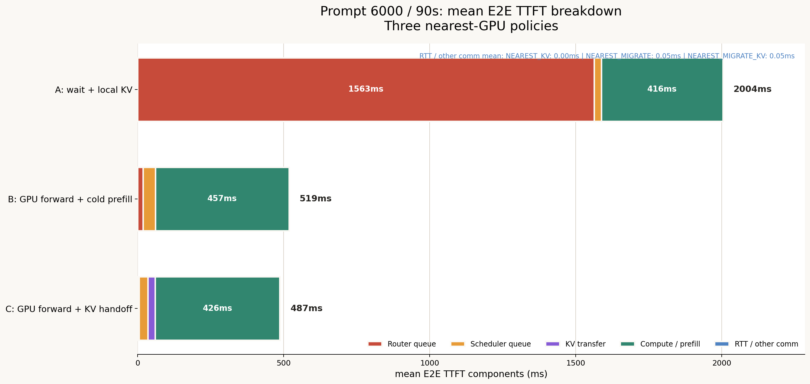
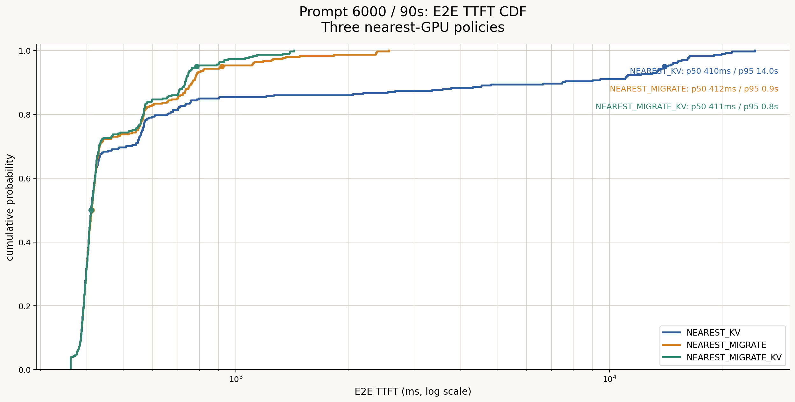
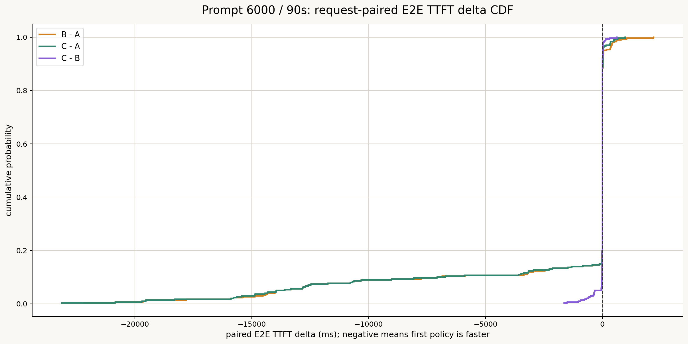
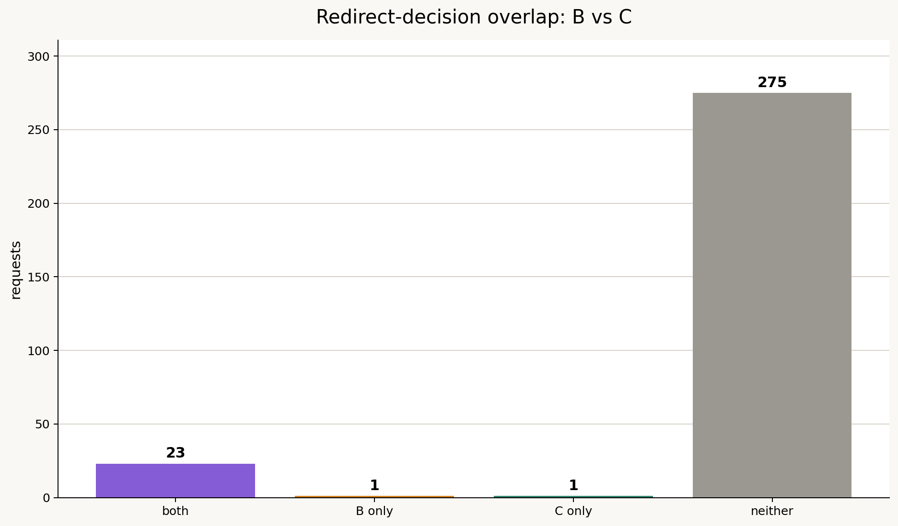
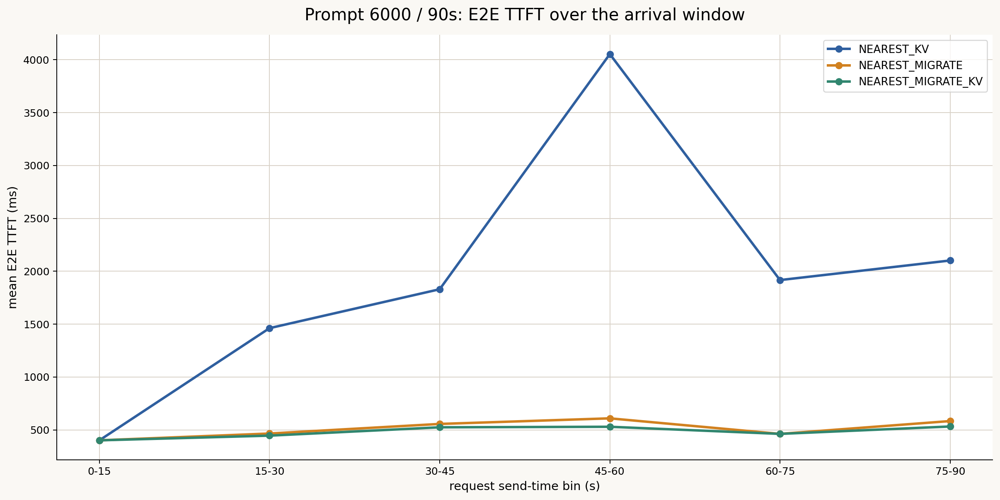
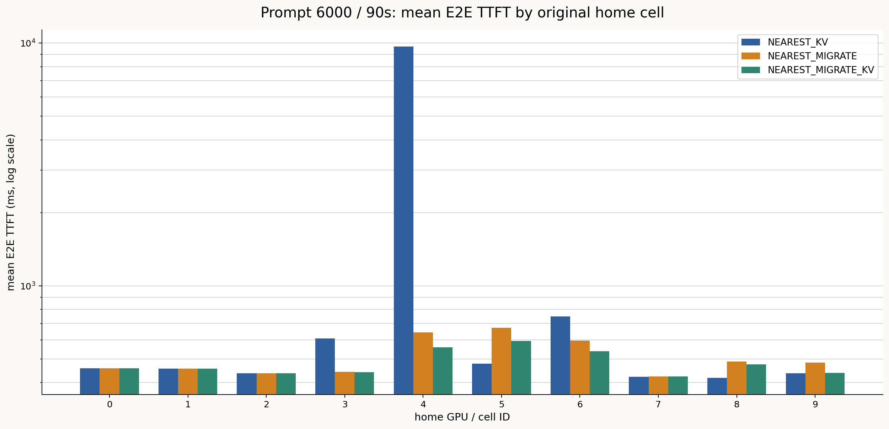
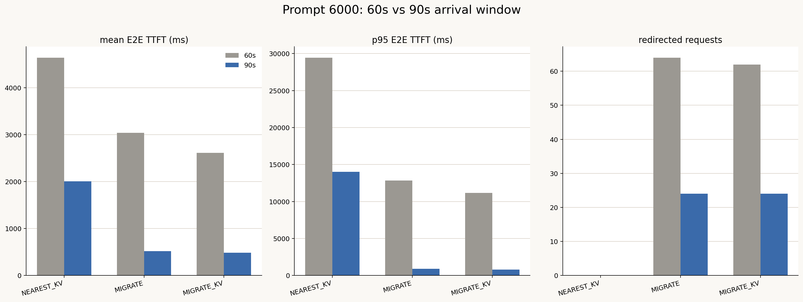

# Prompt 6000・90秒・3方式比較レポート

作成日: 2026-07-14

## 1. 結論

300リクエストの到着ウィンドウを60秒から90秒へ伸ばすと、3方式すべてでTTFTが改善し、特にmigration方式ではqueue待ちがほぼ解消された。

- 平均E2E TTFTは `NEAREST_KV` 2004.1 ms、`NEAREST_MIGRATE` 518.5 ms、`NEAREST_MIGRATE_KV` 487.1 msだった。
- `NEAREST_MIGRATE_KV` は `NEAREST_MIGRATE` より平均31.5 ms、6.1%短かった。
- p95では917.9 msから785.6 msへ14.4%改善し、最大値も2575.1 msから1434.3 msへ44.3%改善した。
- 一方、p50は3方式とも約410から412 msでほぼ同じだった。
- リダイレクトはB/Cとも24件で、60秒版の64件・62件から大幅に減少した。
- B/Cの共通リダイレクト23件では、Cが78.3%のリクエストで速く、平均279.8 ms短かった。

したがって、90秒条件でもKV handoffは有効だが、全体平均での利得は60秒条件の約427 msから約31 msへ縮小した。今回の条件は、KV handoffの転送費用と再計算回避効果の損益分岐点へ近づいた負荷領域と考えられる。

## 2. データと整合性

3方式とも以下を確認した。

- 各300リクエスト
- 同じrequest ID集合
- IDごとの入力長、出力長、送信時刻、ユーザ、最寄りGPUが一致
- 同じdataset、cluster config、Git commit
- `max_num_seqs=128`
- `max_num_batched_tokens=2048`
- ネットワークcontention、queueing、jitter、packet lossは無効

結果ディレクトリ:

| 方式 | 保存場所 |
|---|---|
| `NEAREST_KV` | `results/NEAREST_KV/` |
| `NEAREST_MIGRATE` | `results/NEAREST_MIGRATE/` |
| `NEAREST_MIGRATE_KV` | `results/NEAREST_MIGRATE_KV/` |

## 3. 全体結果

| 指標 | NEAREST_KV | NEAREST_MIGRATE | NEAREST_MIGRATE_KV |
|---|---:|---:|---:|
| リダイレクト件数 | 0 | 24 | 24 |
| 平均 E2E TTFT | 2004.1 ms | 518.5 ms | **487.1 ms** |
| p50 E2E TTFT | **410.2 ms** | 412.1 ms | 410.6 ms |
| p95 E2E TTFT | 14021.0 ms | 917.9 ms | **785.6 ms** |
| 最大 E2E TTFT | 24548.4 ms | 2575.1 ms | **1434.3 ms** |
| 平均完了時間 | 19275.9 ms | 18079.1 ms | **17734.0 ms** |
| p95 完了時間 | 34518.8 ms | 24842.7 ms | **23939.5 ms** |
| 平均 TPOT | 26.48 ms | 26.92 ms | **26.46 ms** |
| makespan | 117.5 s | **106.0 s** | **106.0 s** |
| Request throughput | 2.55 req/s | **2.83 req/s** | **2.83 req/s** |
| Output token throughput | 1665.8 tok/s | **1846.0 tok/s** | **1846.0 tok/s** |
| Prefix hit率 | 49.87% | 45.88% | **49.87%** |
| ユーザ平均TTFTのCV | 1.965 | 0.196 | **0.122** |

90秒版ではB/Cのmakespanとthroughputが同一になった。CはBよりTTFTと完了時間を改善しながら、今回のシミュレーション上ではクラスタ全体の完了速度を落としていない。

## 4. TTFT breakdown

| 成分 | NEAREST_KV | NEAREST_MIGRATE | NEAREST_MIGRATE_KV |
|---|---:|---:|---:|
| Queue / wait | 1587.7 ms | 61.1 ms | **35.2 ms** |
| KV transfer | 0.0 ms | 0.0 ms | 25.3 ms |
| Compute / prefill | 416.3 ms | 457.4 ms | **426.5 ms** |
| RTT / other comm | 0.0 ms | 0.1 ms | 0.1 ms |
| 合計 | 2004.1 ms | 518.5 ms | **487.1 ms** |

Cは全リクエスト平均で25.3 msのKV転送費用を払っている。その一方でBに対してqueue/waitを25.8 ms、prefillを31.0 ms減らし、最終的に31.5 ms改善した。

60秒版ではqueue/waitがBで2526.4 ms、Cで2103.5 msだったため、Cの主な効果は大規模な混雑緩和だった。90秒版ではqueue/waitが61.1 ms、35.2 msまで減少し、Cの利得は主にリダイレクトされた一部リクエストのcold prefill回避へ移っている。

Queue / waitは、E2E TTFTからprefillと明示的通信を引いた残差である。router capacity waitがschedulerのqueue列へ完全には記録されないため、この残差を使用している。

## 5. TTFT分布

全体の92%はリダイレクトされておらず、p50は3方式でほぼ一致する。方式差は主として上位tailに現れる。

- Aはhotspotで長時間待つため、p95が14.0秒まで伸びる。
- Bはp95を0.92秒まで抑える。
- Cはさらにp95を0.79秒、最大を1.43秒まで抑える。

つまりCの価値は、中央値の改善よりもtailの上限を抑える点にある。

## 6. リクエスト単位のB/C比較

全300件ではCがBより速い割合は22.0%だった。大部分は同一またはほぼ同じ経路なので、この割合だけではCの有効性を判断できない。

BとCの両方でリダイレクトされた23件に限定すると次の結果になる。

| 指標 | B | C |
|---|---:|---:|
| 平均 E2E TTFT | 1199.7 ms | **920.0 ms** |
| CがBより速い割合 | - | **78.3%** |
| paired平均差 C-B | - | **-279.8 ms** |
| paired中央値差 C-B | - | **-47.8 ms** |

90秒版ではリダイレクト集合の重なりも大きい。

| グループ | 件数 |
|---|---:|
| B/C両方でredirect | 23 |
| Bだけ | 1 |
| Cだけ | 1 |
| どちらもなし | 275 |

60秒版の共通redirectは45件、Bだけ19件、Cだけ17件だった。90秒版ではB/Cの動的ルーティング状態が近く、KV handoffの直接差を比較しやすい結果になっている。

## 7. リダイレクト容量判定と転送量

B/Cの24件はすべて `redirect_capacity_reason=npu_memory` だった。

Cのredirect時:

- 判定時running requests: 平均10.88、中央値11、最大11
- `max_num_seqs`: 128
- 必要KV容量: 平均837.1 MiB
- 判定時利用可能KV容量: 中央値91.5 MiB
- KV migration: 1件392,167,424 bytes、約374 MiB
- migration latency: 1件平均316.7 ms
- 24件合計転送量: 約8.77 GiB

したがって90秒版でも、`max_num_seqs` 未満でGPU KV容量を理由にredirectする実装が機能している。

## 8. 到着時間帯別

| 到着時刻 | 件数 | A mean | B mean | C mean | B redirects | C redirects |
|---|---:|---:|---:|---:|---:|---:|
| 0-15 s | 41 | 401.7 | 401.7 | 401.7 | 0 | 0 |
| 15-30 s | 49 | 1462.3 | 466.0 | **446.1** | 5 | 5 |
| 30-45 s | 62 | 1830.2 | 556.7 | **524.9** | 6 | 6 |
| 45-60 s | 50 | 4053.7 | 609.5 | **529.9** | 10 | 9 |
| 60-75 s | 49 | 1916.9 | **462.5** | 462.7 | 0 | 1 |
| 75-90 s | 49 | 2102.1 | 583.9 | **532.6** | 3 | 3 |

最初の15秒は完全に同じで、15秒以降にGPU 4を中心とした容量不足が生じる。Aでは到着を90秒へ広げてもhotspot待ちは残るが、B/Cでは局所的な容量不足を少数のredirectで吸収できている。

## 9. セル別

GPU 4が依然として主なhotspotである。

| Home GPU | 件数 | A mean | B mean | C mean | B/C redirects |
|---:|---:|---:|---:|---:|---:|
| 4 | 49 | 9693.5 ms | 644.6 ms | **558.2 ms** | 13 / 13 |
| 5 | 25 | **479.3 ms** | 673.2 ms | 594.3 ms | 5 / 4 |
| 6 | 30 | 748.9 ms | 594.8 ms | **539.2 ms** | 3 / 3 |

B/CはGPU 4を大幅に改善する一方、移動先となるGPU 5などへ負荷を転嫁する。ただし60秒版ほど広範な悪化はなく、Cのユーザ平均TTFT CVは0.122まで低下した。

## 10. 60秒版との比較

| 方式 | 平均TTFT 60s | 平均TTFT 90s | 変化 | p95変化 | redirect変化 |
|---|---:|---:|---:|---:|---:|
| NEAREST_KV | 4639.7 | 2004.1 | -56.8% | -52.4% | 0 → 0 |
| NEAREST_MIGRATE | 3040.9 | 518.5 | -82.9% | -92.9% | 64 → 24 |
| NEAREST_MIGRATE_KV | 2613.8 | 487.1 | -81.4% | -93.0% | 62 → 24 |

300件を60秒から90秒へ伸ばしたため、平均投入率は5.00 req/sから3.33 req/sへ3分の1低下した。この変化はqueueを単純に半減させる以上に大きく、migration方式のtailをほぼ解消した。

C-Bの平均差は60秒版の -427.1 msから90秒版の -31.5 msへ縮小した。一方、共通redirectだけでは -279.8 msであり、KV handoffは容量不足が実際に起きたリクエストには依然有効である。

## 11. 解釈

今回分かったことは次の通りである。

1. `NEAREST_KV` は到着率を下げても地域負荷skewを解消できず、GPU 4のtailが残る。
2. B/Cは24件、全体の8%を移動するだけでp95を1秒未満まで抑えられる。
3. 低負荷になるほどCの全体平均上の優位は小さくなる。
4. ただしredirect対象ではKV handoffがcold prefillより明確に有利である。
5. 90秒版ではB/Cのredirect対象がほぼ一致するため、60秒版より機構差を比較しやすい。

## 12. 限界と次の実験

- ネットワーク競合が無効なので、同時KV migrationの転送時間は楽観的である。
- 単一seedの300件であり、confidence intervalは算出できない。
- Queue / waitは残差であり、router waitを直接計測した値ではない。

次は到着ウィンドウ75秒・105秒・120秒を追加し、C-Bの損益分岐を連続的に調べるのがよい。特に次を同時に記録する。

- C-B平均/p95 TTFT差
- redirect件数
- 共通redirect件数
- KV転送総量
- router capacity wait
- 移動先GPUの負荷増加

また、帯域5、10.7、25 Gbit/sとPrefix再利用率25%、50%、75%のsweepを組み合わせることで、「どの待ち時間・再利用率・帯域ならKV handoffが転送費用を回収できるか」を示せる。

## 13. 再現用ファイル

- `analysis/paired_requests.csv`
- `analysis/summary.json`
- `analysis/comparison_with_60s.json`
- `scripts/plot_three_policy_comparison.py`
- `scripts/analyze_three_policy.py`
- `scripts/compare_with_60s.py`
