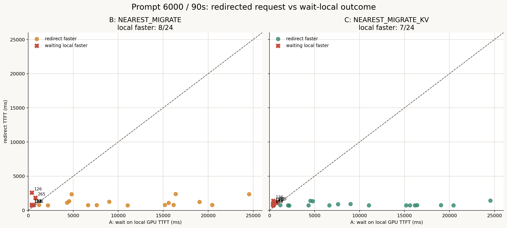
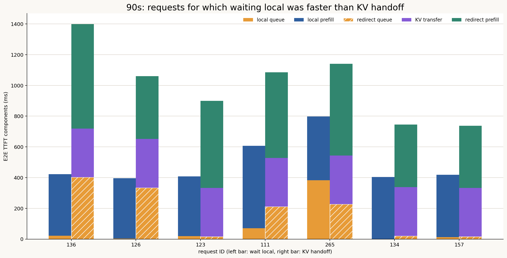
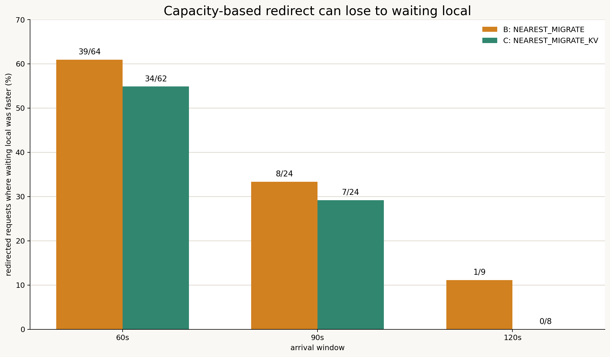

# 容量ベースredirectと最寄りGPU待機の比較分析

作成日: 2026-07-15

## 1. 目的

現在のrouterは、最寄りGPUが新しいリクエストの最大context KVを予約できない場合、別GPUへredirectする。しかし、現在受け入れられないことと、最寄りGPUで待つ方が遅いことは同義ではない。

本分析では、BまたはCでredirectされたrequest IDについて、Aの独立runで同じrequest IDが最寄りGPUに残った場合のE2E TTFTと比較した。特に90秒版を対象に、次の仮説を検証する。

> 容量判定上はredirectが必要でも、KV容量が解放されるまで最寄りGPUで待った方が早いリクエストが存在する。

比較方式:

- A: `NEAREST_KV` — 最寄りGPUで待機し、local KVを利用
- B: `NEAREST_MIGRATE` — 別GPUへredirectし、cold prefill
- C: `NEAREST_MIGRATE_KV` — 別GPUへredirectし、KVをhandoff

## 2. 結論

90秒版には、redirectせず最寄りGPUで待った方が速かった可能性が高いリクエストが存在する。

- Bのredirect 24件中8件、33.3%でAのTTFTが短かった。
- Cのredirect 24件中7件、29.2%でAのTTFTが短かった。
- Cの誤redirect候補7件では、Aが平均493.1 ms、Cが平均1010.4 msだった。
- Cは候補7件を平均517.2 ms、最大977.1 ms悪化させた。
- A側のqueueは候補7件平均72.9 msにすぎず、Cは平均316.7 msのKV転送費用に加えてredirect先で平均175.6 ms待っていた。

したがって、容量不足だけでredirectを決定するのではなく、`localで待つ予測TTFT`、`cold migrationの予測TTFT`、`KV handoffの予測TTFT`を比較する適応型ルーティングが必要である。

## 3. 90秒版のrequest単位比較



破線はAとredirectのTTFTが等しい点を表す。破線より上の赤い点は、redirectした方式の方が遅かったrequestである。

| 方式 | Redirect | Aで待つ方が速い | Redirectが速い |
|---|---:|---:|---:|
| B: cold migration | 24 | **8（33.3%）** | 16（66.7%） |
| C: KV handoff | 24 | **7（29.2%）** | 17（70.8%） |

全redirectの平均ではB/CともAより速い。これはGPU 4の非常に長いlocal queueを回避したリクエストの改善が大きいためである。一方、約3割では転送先を選ばずlocalに残る方が速かった。

## 4. Cの誤redirect候補

| Request | Home→Target | Aで待機 | CでKV handoff | Cの悪化 |
|---:|---|---:|---:|---:|
| 136 | GPU 5→9 | **422.7 ms** | 1399.8 ms | +977.1 ms |
| 126 | GPU 5→8 | **395.4 ms** | 1060.2 ms | +664.8 ms |
| 123 | GPU 5→8 | **407.6 ms** | 900.2 ms | +492.6 ms |
| 111 | GPU 5→8 | **607.1 ms** | 1086.4 ms | +479.2 ms |
| 265 | GPU 6→5 | **797.6 ms** | 1141.7 ms | +344.1 ms |
| 134 | GPU 8→7 | **403.9 ms** | 746.0 ms | +342.2 ms |
| 157 | GPU 8→7 | **417.7 ms** | 738.2 ms | +320.5 ms |



候補7件の平均breakdown:

| 成分 | A: 最寄りGPU待機 | C: KV handoff |
|---|---:|---:|
| Queue / wait | **72.9 ms** | 175.6 ms |
| KV transfer | 0.0 ms | 316.7 ms |
| Compute / prefill | **420.2 ms** | 517.5 ms |
| 合計 | **493.1 ms** | 1010.4 ms |

A側の待ち時間がKV転送時間より短いだけでなく、redirect先にもqueueがあり、prefill時間も増えている。そのためKV handoffの再計算回避効果で転送費用を回収できていない。

### 代表例: request 134と157

| Request | A queue | A total | C queue | C KV transfer | C total |
|---:|---:|---:|---:|---:|---:|
| 134 | 0.7 ms | **403.9 ms** | 20.8 ms | 316.7 ms | 746.0 ms |
| 157 | 12.9 ms | **417.7 ms** | 16.1 ms | 316.7 ms | 738.2 ms |

この2件はAでほぼ待たずに実行できた。Cでは約316.7 msのKV転送費用がほぼそのまま悪化になっている。

### 代表例: request 136

```text
A: queue 21.1 ms + prefill 401.6 ms = 422.7 ms
C: queue 402.7 ms + KV transfer 316.7 ms + prefill 679.7 ms = 1399.8 ms
```

このリクエストではredirect先GPU 9も混雑しており、移動先選択そのものが有利でなかった。

## 5. 容量不足と待ち時間予測の違い

90秒版のredirect理由は全件 `npu_memory` だった。Redirect判定時のrunning requestsは10または11件であり、`max_num_seqs=128`には達していない。

多くのrequestで、新規requestが必要とするKV容量は約816〜878 MiBだったのに対し、判定時の利用可能KV容量は数十MiBしかなかった。Routerがその瞬間に受け入れられないと判定したこと自体は正しい。

しかし、次の2つは異なる。

```text
現在、新規requestの最大context KVを予約できない
最寄りGPUで容量解放を待つよりredirectした方が速い
```

現在のrouterは前者を判定するが、ルーティング最適化には後者の予測が必要である。

## 6. 負荷条件による変化



| 到着window | B: Aの方が速い | C: Aの方が速い |
|---|---:|---:|
| 60秒 | 39/64（60.9%） | 34/62（54.8%） |
| 90秒 | 8/24（33.3%） | 7/24（29.2%） |
| 120秒 | 1/9（11.1%） | 0/8（0.0%） |

この表だけから、高負荷ほどredirectすべきでないとは結論できない。60秒版ではCの全体平均TTFTがAより約2.03秒短く、migrationによるhotspot緩和効果は大きい。個々のrequestをlocalに残すと、そのrequest自身は速くても後続requestのqueueを増やす可能性がある。

高負荷条件ほど独立run間のルーティング履歴差も大きくなるため、60秒版の比率は特に反実仮想の確定値として扱えない。90秒版はB/Cのredirect集合がほぼ一致し、クラスタ全体にも余力があるため、容量ベース判定の局所的な過剰redirectを観察しやすい条件である。

## 7. 適応型ルーティングへの示唆

Routerは候補GPUごとに次の予測を持つべきである。

```text
T_local =
    predicted_capacity_release_wait
    + predicted_local_scheduler_queue
    + predicted_cached_prefill
    + request_communication

T_cold_migrate =
    predicted_remote_reservation_wait
    + predicted_remote_scheduler_queue
    + predicted_cold_prefill
    + request_communication

T_kv_handoff =
    predicted_kv_transfer
    + predicted_remote_reservation_wait
    + predicted_remote_scheduler_queue
    + predicted_cached_prefill
    + request_communication
```

基本選択は次になる。

```text
route = argmin(T_local, T_cold_migrate, T_kv_handoff)
```

ただしrequest自身の予測TTFTだけでは不十分である。高負荷時には、そのrequestをlocalに残した場合の後続requestへの影響も評価する。

```text
routing_score =
    predicted_request_ttft
    + predicted_externality_on_queued_requests
    + uncertainty_margin
```

さらに複数routerが同じremote GPUを同時に選ばないよう、redirect決定時点でremote KV容量とtoken budgetを予約する必要がある。

## 8. 分析上の限界

本分析はA/B/Cを独立して実行した結果をrequest IDで対応させたものである。AとCでは、対象requestが到着するまでのrouting履歴、各GPUのrunning/waiting request、KV配置が異なる。

したがって、候補7件をCの実行状態でlocalに残せば必ずA列のTTFTになる、と断定することはできない。本結果は次の意味を持つ。

- 容量ベースredirectが不利になり得る具体的候補が存在する。
- Local待機、remote queue、KV転送を比較する予測器が必要である。
- 候補7件は同一状態からの反実仮想replayを行う優先対象である。

## 9. 厳密な検証方法

Redirect判断直前のクラスタ状態をcheckpointし、同一状態から次の3分岐をreplayする。

1. 最寄りGPUのwaiting queueへ置く
2. Remote GPUへcold migrationする
3. Remote GPUへKV handoffする

各分岐で対象requestだけでなく、一定時間後までの全requestについて次を測定する。

- 対象requestのTTFT
- 後続requestの平均/p95 TTFT変化
- GPUごとのKV解放時刻
- Remote GPUの予約待ち時間
- KV転送時間とネットワークqueue
- SLO違反request数

これにより、request単位の最短経路とシステム全体の最適経路を区別できる。

## 10. 再現用ファイル

- `analysis/redirect_vs_wait_local_90s.csv`
- `analysis/redirect_vs_wait_local_summary.json`
- `figures/redirect_vs_wait_local_90s_scatter.png`
- `figures/harmful_kv_redirect_90s_breakdown.png`
- `figures/harmful_redirect_rate_by_window.png`
- `scripts/analyze_redirect_counterfactual.py`

再生成コマンド:

```bash
MPLCONFIGDIR=/tmp/llmservingsim-matplotlib python3 experiments/2026-07-14_prompt6000_90s_three_policy/scripts/analyze_redirect_counterfactual.py
```
