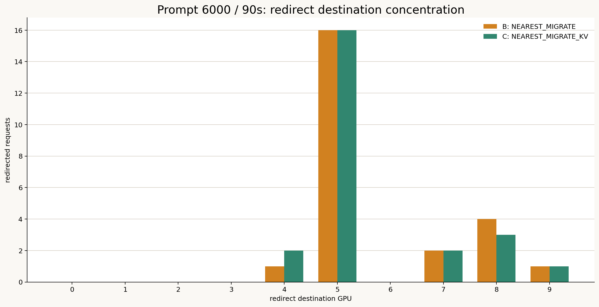
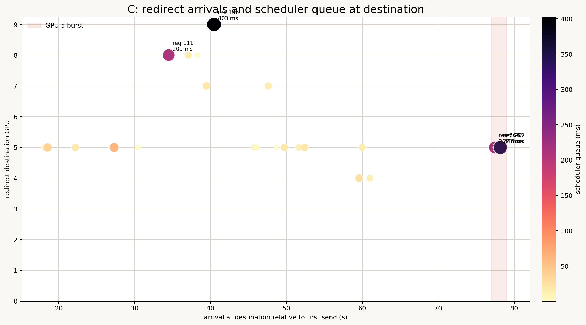
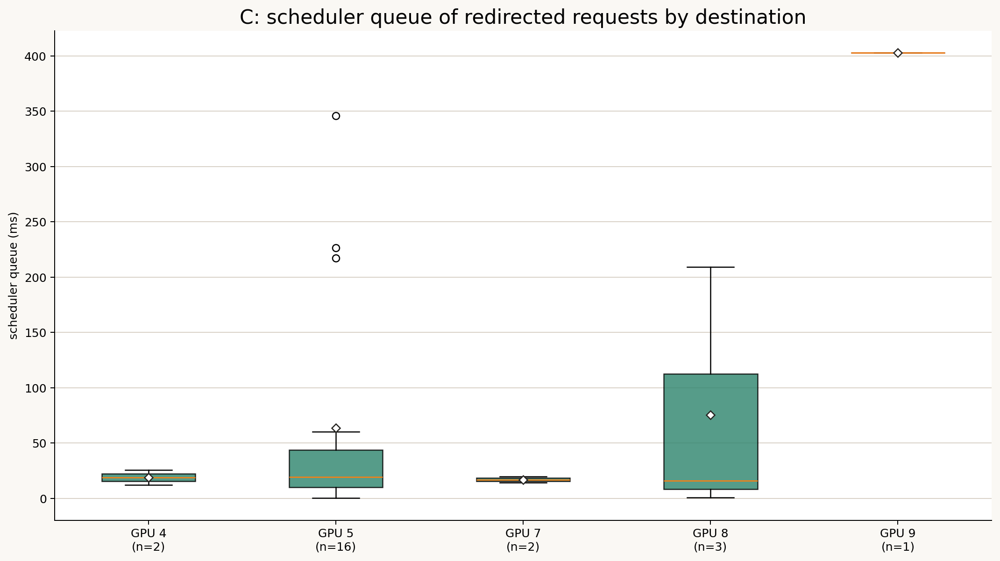

# Redirect先集中とScheduler queueへの影響分析

作成日: 2026-07-15

## 1. 目的

現在のrouting policyは、最寄りGPUに容量がなく、第2近傍GPUに容量があればredirectする。複数requestが同じ第2近傍GPUを持つ場合、空きGPUへredirectが集中し、最終的に移動先でScheduler queueを形成する可能性がある。

本分析では90秒版について、次を定量化する。

- Redirect先GPUの集中度
- 短時間に到着するredirect burst
- 集中先GPUのScheduler queue
- Cにおける全体平均とtailへの寄与
- Bのcold migrationとCのKV handoffの違い

## 2. 結論

Redirect先集中は実際に発生しており、局所的なtail latencyにはcriticalである。一方、Cの全300件の平均TTFTを支配するほどではない。

- B/Cとも24 redirect中16件、66.7%がGPU 5へ集中した。
- Cではredirect requestのScheduler queue総量1,717.1 msのうち、GPU 5が1,016.4 ms、59.2%を占めた。
- 77秒付近では3件が約0.73秒以内にGPU 5へ到着し、Scheduler queueは217.3、226.6、345.8 msになった。
- この3件だけで、Cのredirect Scheduler queue総量の46.0%を占めた。
- ただしGPU 5集中が全300件のScheduler queue総量に占める割合は11.3%で、全体平均換算では3.39 msである。
- Cの最大Scheduler queue 402.7 msはGPU 9への単独redirectであり、すべての長いqueueを集中問題だけでは説明できない。
- BではGPU 5がredirect Scheduler queue総量の96.8%を占め、cold prefillによって集中問題がCより大きく増幅された。

したがって、この問題は「Cの全体的な有効性を否定するボトルネック」ではなく、「少数requestのtailとSLO違反を生む局所的に重要なボトルネック」である。

## 3. Redirect先の集中度



| Destination | B | C |
|---:|---:|---:|
| GPU 4 | 1 | 2 |
| GPU 5 | **16** | **16** |
| GPU 7 | 2 | 2 |
| GPU 8 | 4 | 3 |
| GPU 9 | 1 | 1 |
| 合計 | 24 | 24 |

両方式とも全redirectの3分の2がGPU 5へ向かっている。Destination shareのHHIはBで0.483、Cで0.476だった。10 GPUへ均等なら0.1、実際に使われた5 GPUへ均等でも0.2なので、集中度は高い。

ただし、現在のrouterは「9 GPUを探索して唯一空いているGPUを選ぶ」仕組みではない。各requestに事前設定された第2近傍GPUだけを候補にする。今回の集中は主に、hotspot GPU 4のrequestの第2近傍がGPU 5へ重なったために発生している。

## 4. Cの時系列



円の色と大きさは移動先Scheduler queueを表す。Redirectは18〜78秒に分散しており、24件が完全に同時到着したわけではない。短時間burstの最大値は次の通りだった。

| Window | 最大redirect到着数 |
|---:|---:|
| 1秒 | 3 |
| 2秒 | 3 |
| 5秒 | 5 |

最も明確な集中は77秒付近のGPU 5である。

| Request | GPU 5到着時刻付近 | Scheduler queue | E2E TTFT |
|---:|---:|---:|---:|
| 263 | 77.47 s | 217.3 ms | 1393.3 ms |
| 265 | 78.01 s | 226.6 ms | 1141.7 ms |
| 267 | 78.19 s | 345.8 ms | 1338.0 ms |

3件が約0.73秒以内に同じGPUへ到着し、後続ほどScheduler queueが増えている。この3件のqueue合計は789.7 msで、Cのredirect request全体のScheduler queue 1,717.1 msの46.0%である。

このburstは「複数requestが同じ空き先を選び、移動先で待つ」現象の具体例である。

## 5. 移動先別Scheduler queue



### C: KV handoff

| Target | Requests | Queue合計 | Queue平均 | 中央値 | 最大 |
|---:|---:|---:|---:|---:|---:|
| GPU 4 | 2 | 37.9 ms | 19.0 ms | 19.0 ms | 25.8 ms |
| GPU 5 | 16 | **1,016.4 ms** | 63.5 ms | 19.1 ms | 345.8 ms |
| GPU 7 | 2 | 33.8 ms | 16.9 ms | 16.9 ms | 19.7 ms |
| GPU 8 | 3 | 226.3 ms | 75.4 ms | 16.0 ms | 209.3 ms |
| GPU 9 | 1 | 402.7 ms | 402.7 ms | 402.7 ms | 402.7 ms |

GPU 5は件数とqueue総量の両方で最大である。ただし中央値は19.1 msにすぎず、16件すべてが長時間待ったわけではない。77秒burstなど少数のtailが平均を押し上げている。

また、Cの最大Scheduler queueはrequest 136の402.7 msで、GPU 9への単独redirectだった。到着時点で同じtargetに先行redirectは存在しなかったため、このrequestのqueueはredirect集中だけでは説明できない。Native requestを含む既存負荷やbatch/token budgetも影響している。

## 6. 全体に対するcriticality

### CのScheduler queue総量

| 範囲 | Queue総量 | C全request queueに対する割合 | 全300件平均換算 |
|---|---:|---:|---:|
| C全request | 8,983.0 ms | 100% | 29.94 ms/request |
| Cのredirect 24件 | 1,717.1 ms | 19.1% | 5.72 ms/request |
| GPU 5へのredirect 16件 | 1,016.4 ms | **11.3%** | **3.39 ms/request** |
| 77秒burst 3件 | 789.7 ms | 8.8% | 2.63 ms/request |

GPU 5への集中を完全に除去できたとしても、単純な上限では全体平均への寄与は3.39 msである。Cの平均E2E TTFT 487.1 msに対して約0.7%なので、全体平均では支配的でない。

一方、対象3件ではScheduler queueが217〜346 msあり、E2E TTFTが1.14〜1.39秒へ伸びている。平均では小さいが、個々のSLOとp99には大きい。

## 7. Bでは問題が増幅される

| 指標 | B: cold migration | C: KV handoff |
|---|---:|---:|
| Redirect Scheduler queue平均 | 139.0 ms | **71.5 ms** |
| Redirect Scheduler queue総量 | 3,335.7 ms | **1,717.1 ms** |
| GPU 5 redirect queue平均 | 201.8 ms | **63.5 ms** |
| GPU 5 redirect queue総量 | 3,228.4 ms | **1,016.4 ms** |
| GPU 5のredirect queue占有率 | 96.8% | **59.2%** |

Bではredirectされたrequestがcold prefillを行うため、GPU 5のtoken budgetとcomputeを長く占有する。CはKVをhandoffして残りprefillを減らすため、同じ16件がGPU 5へ集中してもScheduler queueを約68.5%削減している。

したがって、redirect集中はKV handoffそのものが作った問題ではない。第2近傍固定routingが集中を作り、cold prefillがそれを強く増幅し、KV handoffは一部を緩和している。

## 8. 「一斉redirect」の実装上の意味

現在のsimulationはrequestを順次処理し、target GPUの容量を確認する。また、redirect転送後、targetへ最終admitする直前にも容量を再確認する。

```text
Home容量不足
    ↓
第2近傍の現在容量を確認
    ↓
Redirect開始
    ↓
Target到着時に容量を再確認
    ├─ 容量あり: Schedulerへ登録
    └─ 容量なし: Targetが空くまでRouter待機
```

そのため、targetのKV容量を無制限に超えて全requestをSchedulerへ入れることはない。

ただし、最初の容量確認からtarget到着までの間に容量予約を保持していない。複数requestが転送中の場合、同じ空き容量を見て同じtargetへ向かい、到着後に再検査で待たされる可能性がある。また、容量確認に通ってもSchedulerのtoken budgetやbatch順序は保証されないため、今回のようなScheduler queueが生じる。

## 9. 相関分析上の注意

Cの24件全体では、target上の先行active redirect数とScheduler queueに正の単調相関は見られなかった。単独redirectのrequest 136が402.7 ms待つ一方、先行redirectが5〜6件あっても20 ms未満のrequestが存在するためである。

したがって、次の単純な規則は不十分である。

```text
同じtargetへのredirect数が多いほど必ずqueueが長い
```

必要なのはrequest数ではなく、次の将来負荷予測である。

- Target上のactive requestの残りprefill/decode tokens
- Targetの次回KV解放時刻
- `max_num_batched_tokens`の将来利用量
- 転送中だがまだadmitされていない予約request
- Redirect requestのcold/cached prefill量

## 10. 改善案

### 10.1 Redirect決定時のatomic reservation

Targetを選んだ時点で次を予約する。

- 最大context KV容量
- Prefill token budgetの将来枠
- Expected service demand

転送中requestもtarget負荷へ含めることで、複数requestが同じ見かけ上の空き容量を重複利用することを防ぐ。

### 10.2 第2近傍固定から複数候補比較へ変更

近傍上位K台について予測TTFTを比較する。

```text
score(gpu) =
    network_latency
    + kv_transfer_time
    + predicted_capacity_wait
    + predicted_scheduler_queue
    + predicted_prefill_time
```

距離が少し遠くても、GPU 5のような集中先を避けた方が速い場合に分散できる。

### 10.3 Hysteresisと集中ペナルティ

同一targetへの転送中request数に応じてscoreへペナルティを加える。

```text
score += in_transit_requests * congestion_penalty
```

ただし固定ペナルティではなく、各requestのKV量と残りprefill量で重み付けする。

## 11. 最終評価

| 観点 | 評価 |
|---|---|
| Redirect先の集中 | **明確に存在**。Cの66.7%がGPU 5 |
| 常時全requestが一斉集中 | 観測されない。最大3件/1秒、5件/5秒 |
| Cの全体平均への影響 | 限定的。GPU 5集中は平均3.39 ms相当 |
| Redirect対象への影響 | 無視できない。GPU 5平均63.5 ms、最大345.8 ms |
| Tail/SLOへの影響 | **Critical**。77秒burstが1秒超TTFTを形成 |
| Cの有効性を覆すか | 覆さない。CはBより集中queueを大幅削減 |
| Router改善の優先度 | 高い。Reservationと複数候補予測が必要 |

結論として、redirect集中問題はCの平均性能を支配してはいないが、少数requestのtailを生む主要因の一つである。平均TTFT最小化だけなら優先度は中程度だが、1秒SLOや公平性を目標にするならcriticalである。

## 12. 再現用ファイル

- `analysis/redirect_concentration_summary.json`
- `analysis/redirect_concentration_requests.csv`
- `figures/redirect_destination_concentration.png`
- `figures/redirect_concentration_c_timeline.png`
- `figures/redirect_queue_by_target_c.png`
- `scripts/analyze_redirect_concentration.py`

再生成コマンド:

```bash
MPLCONFIGDIR=/tmp/llmservingsim-matplotlib python3 experiments/2026-07-14_prompt6000_90s_three_policy/scripts/analyze_redirect_concentration.py
```
