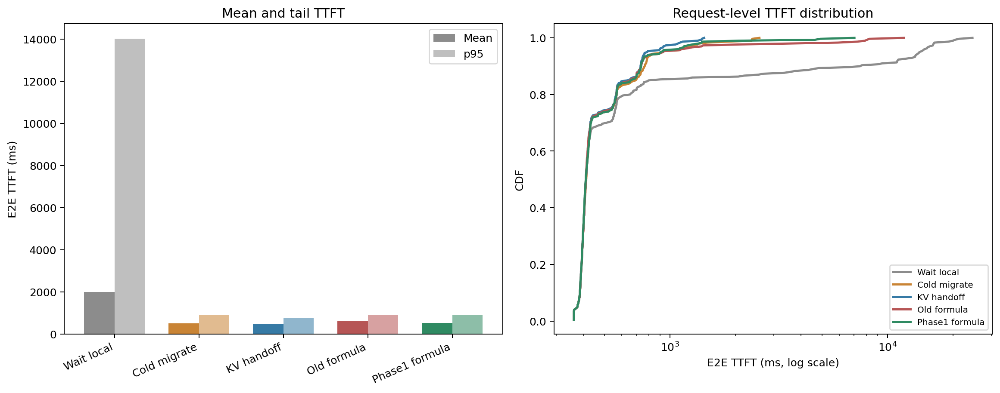
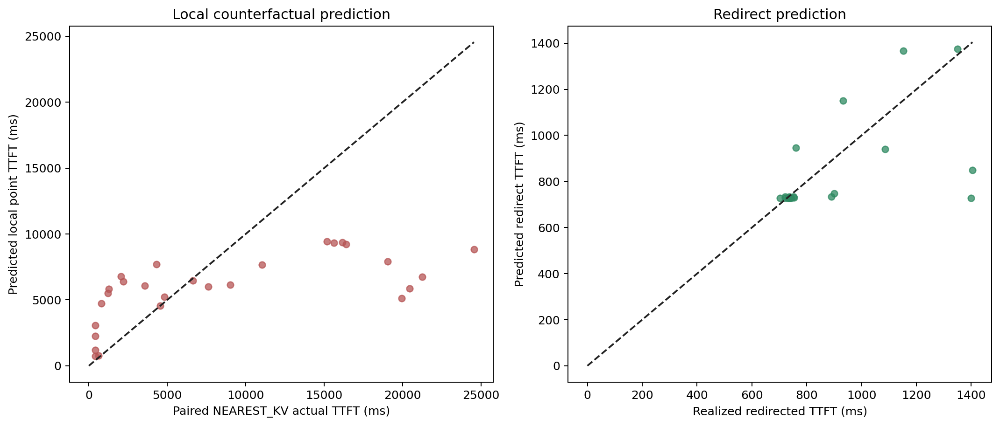
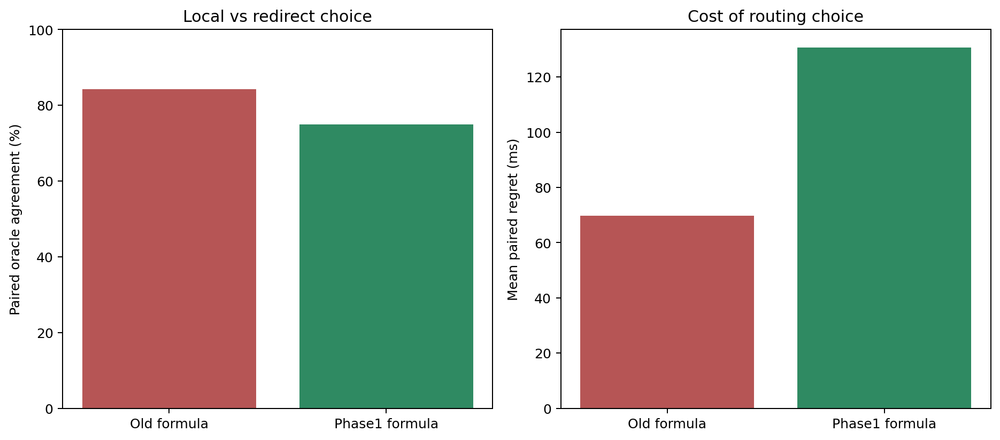

# Phase1学習済みformulate modelのPrompt 6000 / 90s評価

## 結論

Phase1学習済みmodelのmean E2E TTFTは **542.1 ms** で、旧formulateの
646.3 msから **16.1%改善**した。
NEAREST_KV比では73.0%改善し、
NEAREST_MIGRATE_KVとの差は+55.0 msだった。

## E2E性能

| Policy | Mean | p50 | p95 | p99 | Redirects |
|---|---:|---:|---:|---:|---:|
| Wait local | 2004.1 ms | 410.2 ms | 14021.0 ms | 19958.1 ms | 0 |
| Cold migrate | 518.5 ms | 412.1 ms | 917.9 ms | 2369.1 ms | 24 |
| KV handoff | 487.1 ms | 410.6 ms | 785.6 ms | 1338.6 ms | 24 |
| Old formula | 646.3 ms | 410.2 ms | 931.7 ms | 7865.9 ms | 16 |
| Phase1 formula | 542.1 ms | 409.8 ms | 904.7 ms | 2085.3 ms | 20 |

## 予測精度

Capacity判断が必要だった27 requestsを評価した。

- Local point prediction MAE: 5134.6 ms
- Local point prediction bias: -2627.8 ms
- Local上側予測の被覆率: 81.5%
- Redirect prediction MAE: 123.2 ms
- Redirect prediction bias: -54.1 ms

Localの実測には、同一requestをNEAREST_KVで処理した結果を使用した。Redirect側は新formulate
runで実際にredirectされたrequestの実測と比較した。

Redirect予測はMAE 123.2 msと比較的良好だが、
local point predictionはMAE 5134.6 ms、bias
-2627.8 msで、今回のPrompt 6000 / 90s long-tailをまだ大きく過小予測している。
したがって、今回の性能改善はpoint modelが十分正確になった結果ではなく、
held-out residualの上側予測で危険なlocal選択を避けた効果が大きい。

## Routing判断の改善

| Model | Capacity decisions | Redirect | Local | 誤local候補 | Actionable oracle一致率 | Actionable regret |
|---|---:|---:|---:|---:|---:|---:|
| Old formula | 28 | 16 | 12 | 3 | 84.2% | 69.7 ms |
| Phase1 formula | 27 | 20 | 7 | 0 | 75.0% | 130.7 ms |

`誤local候補`は`local_within_margin_and_deadline`でlocalに残した件数である。新modelでは上側予測を
deadline判断に使うため、この経路は解消した。`target_not_admissible`の場合は予測にかかわらず
local待ちとなる。
Actionable指標はredirect先が収容可能で、modelが実際にlocal/redirectを選べたrequestだけを評価する。
新modelは誤local候補を3件から0件へ減らした一方、actionable paired oracle一致率は
84.2%から75.0%へ下がった。
上側予測はfalse-localを避ける保守的な判断であり、requestごとの最適選択精度を上げる
model改良は依然必要である。

## Counterfactualの制約

Paired oracleは同一request IDのNEAREST_KVとNEAREST_MIGRATE_KVを比較している。ただしpolicyが
変わると先行requestの配置とGPU負荷も変わるため、厳密に同一system stateでの反実仮想ではない。
実runのE2E比較を主結果、paired oracleをrouting判断の診断値として扱う。
