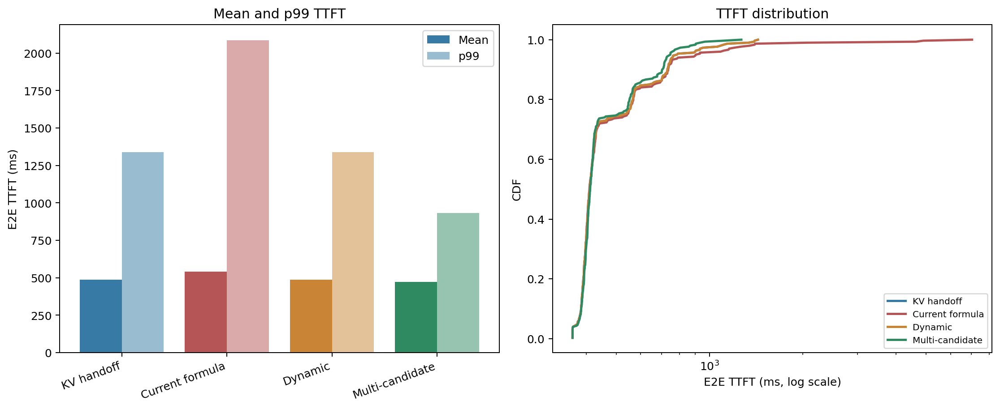
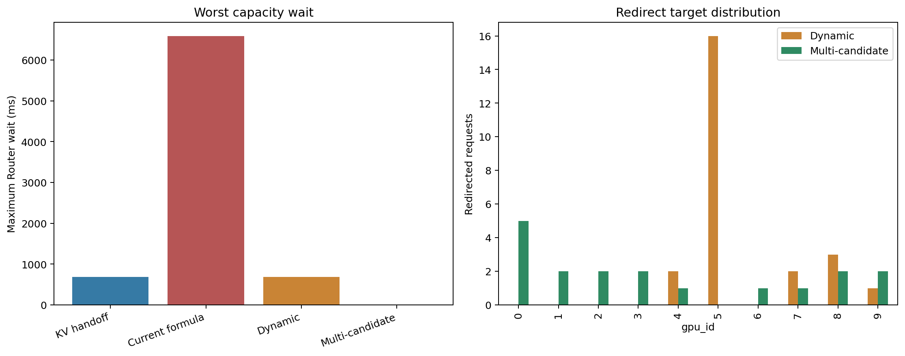

# Dynamic再評価とMulti-candidate formulateの90s評価

## 結論

`target_not_admissible`時のlocal固定を廃止したDynamicは、単純KV handoffと完全に同じ
mean / p50 / p95 / p99 TTFTまで回復した。Multi-candidateはさらにmean **471.7 ms**、
p99 **932.6 ms**となり、単純KV handoffをmeanで
3.2%、p99で30.3%改善した。

## 結果

| Policy | Mean | p50 | p95 | p99 | Redirects | Mean Router wait | Max Router wait |
|---|---:|---:|---:|---:|---:|---:|---:|
| KV handoff | 487.1 ms | 410.6 ms | 785.6 ms | 1338.6 ms | 24 | 5.3 ms | 687.5 ms |
| Current formula | 542.1 ms | 409.8 ms | 904.7 ms | 2085.3 ms | 20 | 63.9 ms | 6591.5 ms |
| Dynamic | 487.1 ms | 410.6 ms | 785.6 ms | 1338.6 ms | 24 | 5.1 ms | 689.1 ms |
| Multi-candidate | 471.7 ms | 412.1 ms | 747.8 ms | 932.6 ms | 18 | 0.0 ms | 0.0 ms |

## 仮説の判定

### 1. `target_not_admissible`時のlocal固定廃止

支持された。Currentは7 requestsを`target_not_admissible`でlocalへ固定し、最大
6591.5 ms待った。Dynamicでは固定が消え、最大待ちは
689.1 msへ減った。

### 2. Homeとtargetの動的再評価

支持された。Dynamicは24 requestsをhandoffし、1 requestは待機中にHomeが収容可能となったため
localで受け入れた。最終TTFT分布は単純KV handoffと一致した。

### 3. Multi-candidate探索

支持された。Multi-candidateは全requestをRouter waitなしで処理し、redirect数も18件まで減った。
Redirect先は9 GPUへ分散し、second-nearestのみを使う場合の集中を避けた。

## 解釈上の注意

- Multi-candidateは固定APN propagation条件で実行した。第3候補以降の実距離をworkloadが持たないため、
  distance-proportional networkに一般化するには候補別距離の追加が必要である。
- DynamicとKV handoffの一致はこの1 workloadでの結果であり、seedと負荷条件の追加検証が必要である。
- Multi-candidateの優位性は、modelの絶対TTFT精度よも「収容可能な別GPUを見落とさない」効果が大い。
