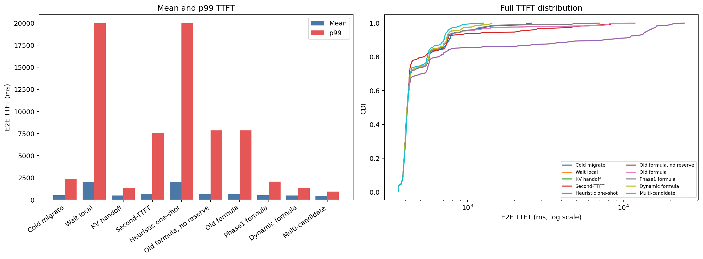
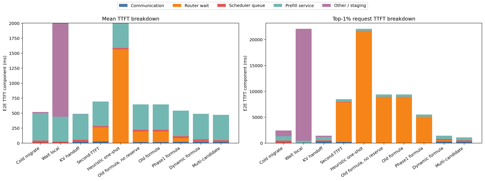
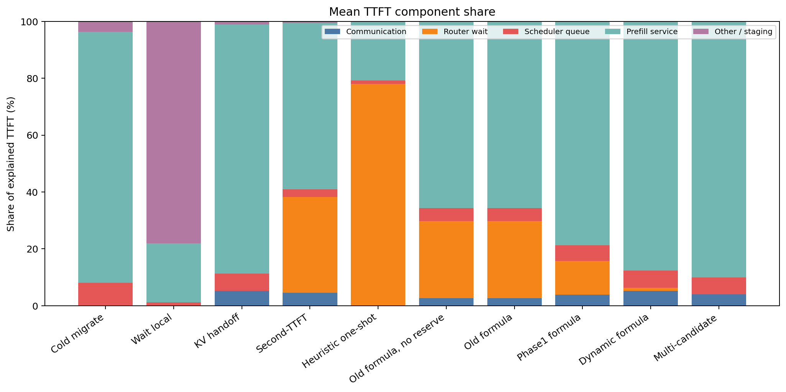

# 全routing policy比較: prompt6000 / 90s

## 結論

Mean TTFT最良は **Multi-candidate (471.7 ms)**、p99最良は **Multi-candidate (932.6 ms)** だった。
Multi-candidateが常に最良かは、この2 workloadの結果を合わせて判断する必要がある。

## TTFT分布

| Policy | Mean | p50 | p95 | p99 | Max | Redirects |
|---|---:|---:|---:|---:|---:|---:|
| Cold migrate | 518.5 | 412.1 | 917.9 | 2369.1 | 2575.1 | 24 |
| Wait local | 2004.1 | 410.2 | 14021.0 | 19958.1 | 24548.4 | 0 |
| KV handoff | 487.1 | 410.6 | 785.6 | 1338.6 | 1434.3 | 24 |
| Second-TTFT | 693.9 | 410.6 | 2121.1 | 7600.6 | 8714.2 | 30 |
| Heuristic one-shot | 2004.1 | 410.2 | 14021.0 | 19958.1 | 24548.4 | 0 |
| Old formula, no reserve | 646.3 | 410.2 | 931.7 | 7865.9 | 11870.0 | 16 |
| Old formula | 646.3 | 410.2 | 931.7 | 7865.9 | 11870.0 | 16 |
| Phase1 formula | 542.1 | 409.8 | 904.7 | 2085.3 | 7039.8 | 20 |
| Dynamic formula | 487.1 | 410.6 | 785.6 | 1338.6 | 1434.3 | 24 |
| Multi-candidate | 471.7 | 412.1 | 747.8 | 932.6 | 1267.7 | 18 |

## TTFT breakdown

`E2E TTFT = Communication + Router wait + Scheduler queue + Prefill service + Other/staging`として集計した。右図は各policyのTTFT上位1%（最低3 requests）の成分平均で、tailの原因を示す。

## Breakdown CSV

- `analysis/all_policy_comparison/performance_summary.csv`
- `analysis/all_policy_comparison/mean_ttft_breakdown.csv`
- `analysis/all_policy_comparison/tail_ttft_breakdown.csv`

## 追加の全手法比較図

- [TTFT quantiles](../figures/all_policy_comparison/ttft_quantiles.png)
- [Component boxplots](../figures/all_policy_comparison/ttft_component_boxplots.png)
- [Arrival-window comparison](../figures/all_policy_comparison/ttft_by_arrival_window.png)
- [GPU request distribution](../figures/all_policy_comparison/gpu_request_distribution.png)
- [Routing behavior](../figures/all_policy_comparison/routing_behavior.png)
- [Paired delta and redirect overlap](../figures/all_policy_comparison/paired_delta_and_redirect_overlap.png)

## 有望手法に絞った比較

Cold migrate、KV handoff、Phase1 formula、Dynamic formula、Multi-candidateを抽出した。

### TTFT統計

| Policy | Mean | p50 | p95 | p99 | Max | Redirects |
|---|---:|---:|---:|---:|---:|---:|
| Cold migrate | 518.5 | 412.1 | 917.9 | 2369.1 | 2575.1 | 24 |
| KV handoff | 487.1 | 410.6 | 785.6 | 1338.6 | 1434.3 | 24 |
| Phase1 formula | 542.1 | 409.8 | 904.7 | 2085.3 | 7039.8 | 20 |
| Dynamic formula | 487.1 | 410.6 | 785.6 | 1338.6 | 1434.3 | 24 |
| Multi-candidate | 471.7 | 412.1 | 747.8 | 932.6 | 1267.7 | 18 |

### Mean TTFT breakdown

| Policy | Communication | Router wait | Scheduler queue | Prefill service | Other/staging |
|---|---:|---:|---:|---:|---:|
| Cold migrate | 0.0 | 0.0 | 42.1 | 457.4 | 19.0 |
| KV handoff | 25.4 | 0.0 | 29.9 | 426.5 | 5.3 |
| Phase1 formula | 21.2 | 63.9 | 30.5 | 426.4 | 0.1 |
| Dynamic formula | 25.4 | 5.1 | 29.9 | 426.5 | 0.2 |
| Multi-candidate | 19.0 | 0.0 | 28.0 | 424.5 | 0.1 |

### Tail上位1% breakdown

| Policy | Communication | Router wait | Scheduler queue | Prefill service | Other/staging |
|---|---:|---:|---:|---:|---:|
| Cold migrate | 0.6 | 0.0 | 473.5 | 842.8 | 1128.8 |
| KV handoff | 317.3 | 0.0 | 213.4 | 648.4 | 230.0 |
| Phase1 formula | 0.0 | 5086.7 | 27.1 | 415.7 | -2.5 |
| Dynamic formula | 317.3 | 229.7 | 213.4 | 648.4 | 0.3 |
| Multi-candidate | 211.6 | 0.0 | 316.4 | 586.5 | 0.9 |

単位はすべてms。TailはTTFT最大の3 requests（300件の上位1%）の成分平均。

- [Shortlist TTFT CDF](../figures/all_policy_comparison/shortlist_ttft_cdf.png)
- [Shortlist TTFT breakdown](../figures/all_policy_comparison/shortlist_ttft_breakdown.png)
