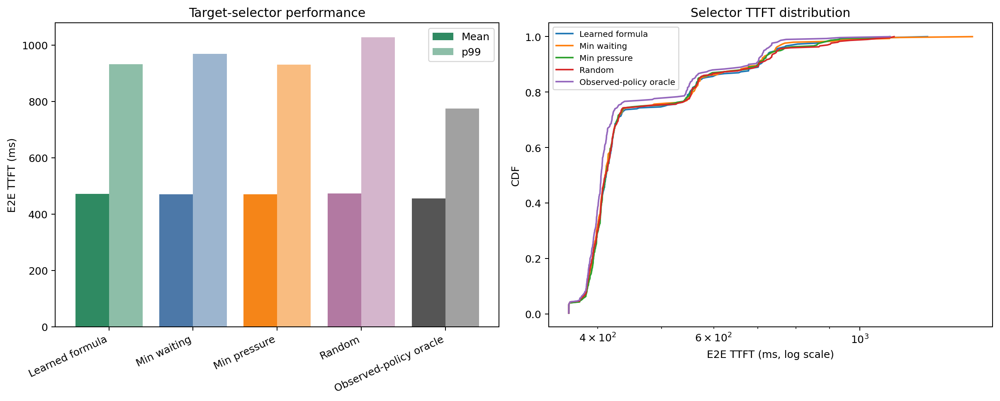

# Multi-candidate target-selector ablation

## 結論

オンラインselectorのMean TTFT最良は **Min waiting (470.1 ms)** だった。ただしp99とMaxの最良はMin pressureであり、学習formulaの一貫した優位性は確認できなかった。

| Selector | Mean | p50 | p95 | p99 | Max | Redirects | Mean regret |
|---|---:|---:|---:|---:|---:|---:|---:|
| Learned formula | 471.7 | 412.1 | 747.8 | 932.6 | 1267.7 | 18 | 15.7 |
| Min waiting | 470.1 | 410.6 | 742.6 | 968.4 | 1482.9 | 18 | 14.1 |
| Min pressure | 470.5 | 411.7 | 758.6 | 931.1 | 1111.4 | 18 | 14.5 |
| Random | 472.9 | 411.4 | 751.2 | 1027.6 | 1127.7 | 17 | 16.9 |
| Observed-policy oracle | 456.0 | 404.9 | 715.6 | 774.2 | 1111.4 | - | 0.0 |

## Oracleの定義

`Observed-policy oracle`はrequest IDごとに4本のcompleted runで観測された最小TTFTを選ぶoffline lower envelopeであり、実行可能なonline policyではない。各runはrouting変更によって後続状態も異なるため、真の候補別counterfactual oracleではなく参考下限として扱う。

## Learned formulaとのpaired差

| Selector | Mean delta | Better | Worse | Same | Different target |
|---|---:|---:|---:|---:|---:|
| Min waiting | -1.6 ms | 93 | 83 | 124 | 12 |
| Min pressure | -1.2 ms | 94 | 96 | 110 | 10 |
| Random | +1.2 ms | 92 | 81 | 127 | 16 |

## Oracle winner counts

同着をすべてwinnerとして数える。括弧内は単独winner数。

- Learned formula: 157 requests (31 exclusive)
- Min waiting: 163 requests (24 exclusive)
- Min pressure: 175 requests (53 exclusive)
- Random: 175 requests (35 exclusive)

92 requestsは4 selectorすべてが同一TTFTだった。したがってwinner件数だけでselectorの能力を判断してはならない。

## 解釈

Min waitingはMeanとp95で最良だが、redirect先がGPU 0と1へ偏り、p99とMaxが悪化した。Min pressureはMeanで学習formulaより1.2 ms良く、p99とMaxも最良で、このworkloadでは最もrobustだった。RandomもMean差は+1.2 msに留まり、候補を広げる効果がselector差より支配的だった。学習formulaが単独で有能だったという仮説は、このablationでは支持されない。
