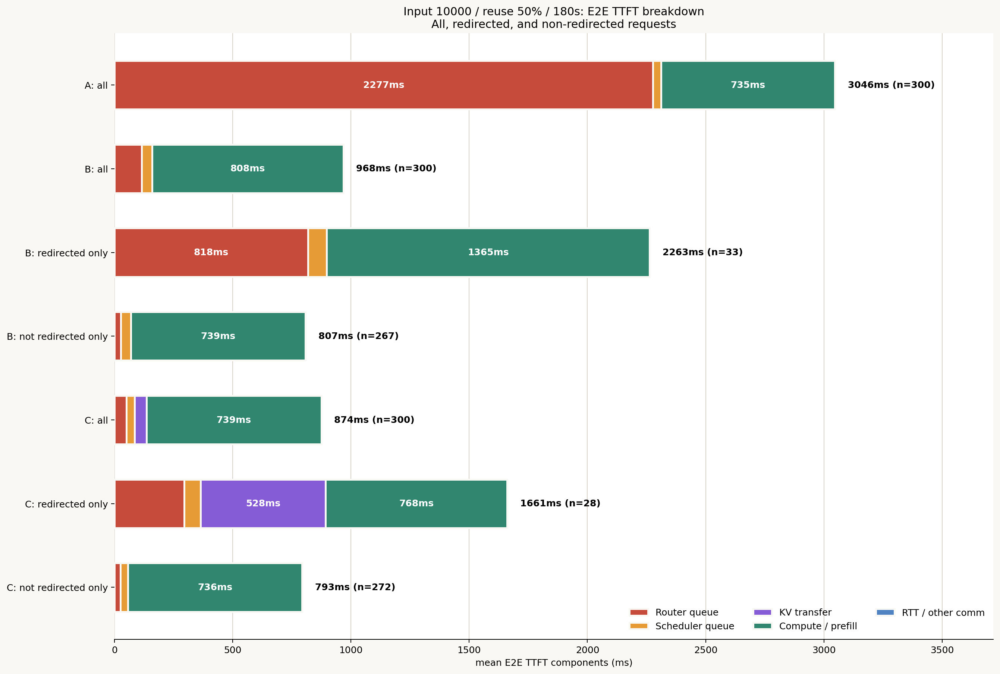
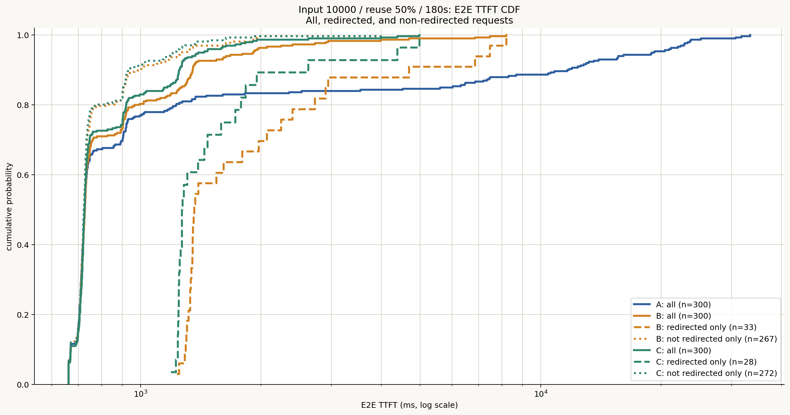
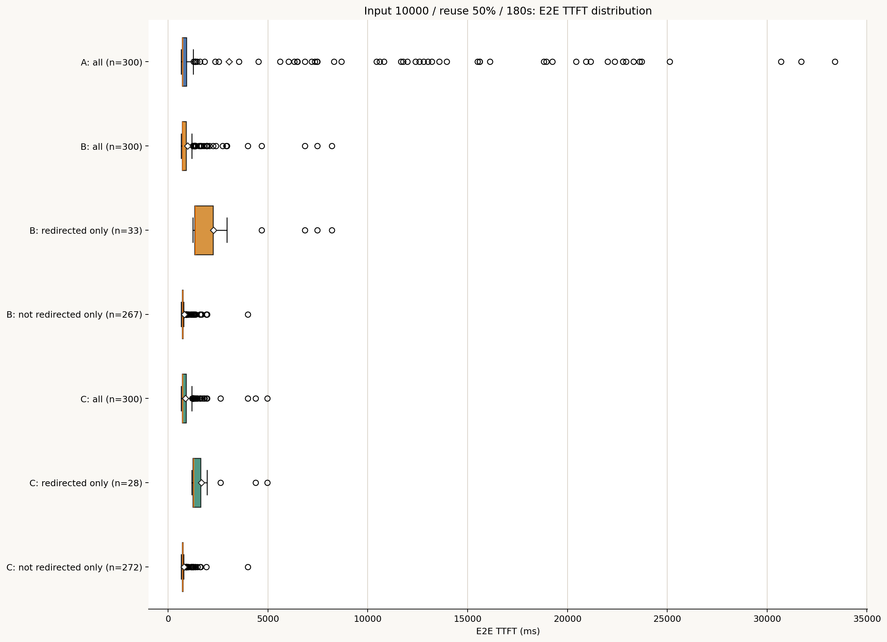
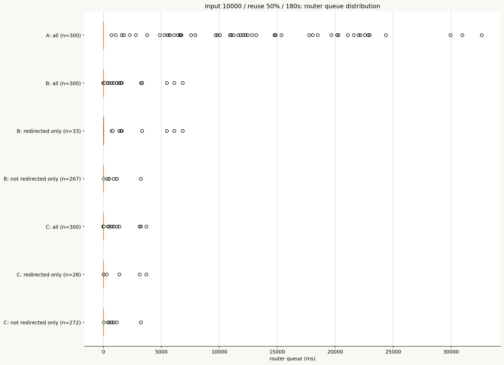
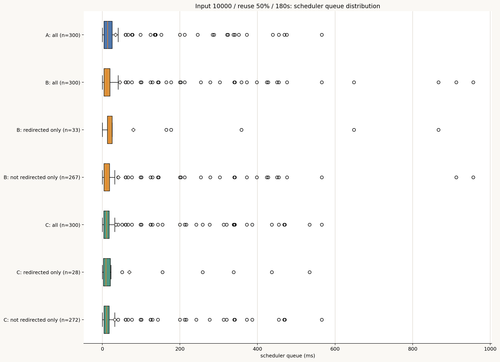
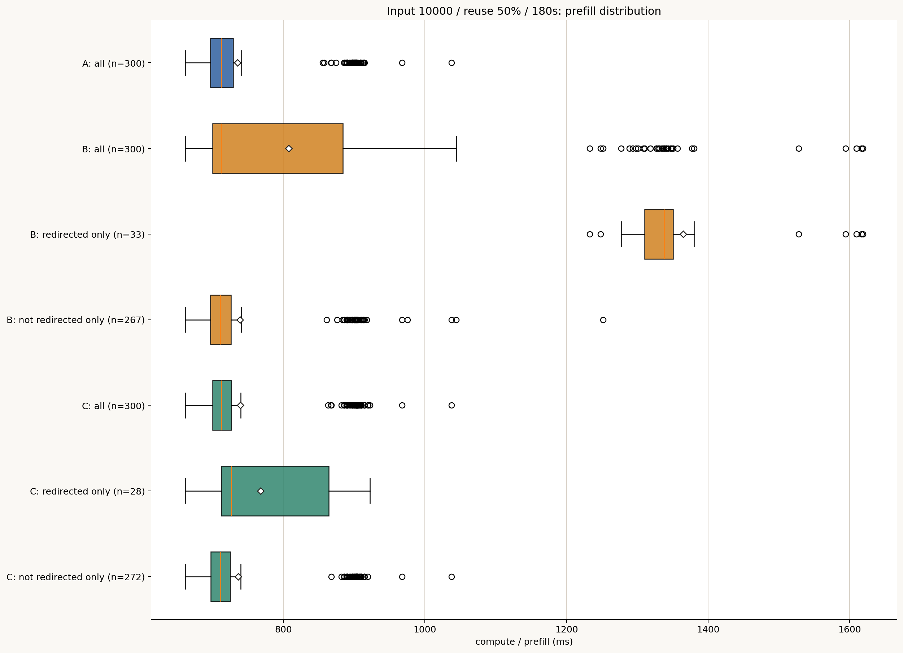
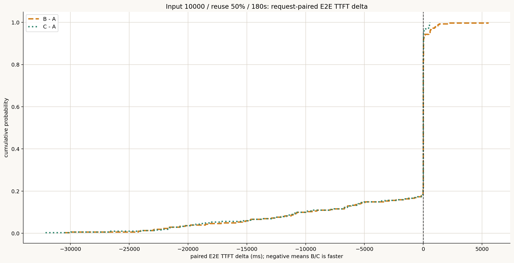
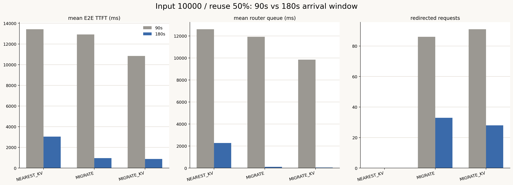

# Input 10000・Prefix reuse 50%・180秒・3方式比較レポート

作成日: 2026-07-16

## 1. 結論

到着windowを90秒から180秒へ広げることで、90秒版を支配していたRouter capacity waitは大幅に解消した。90秒版はInput 10,000条件の定常的なrouting性能を比較するには過負荷であり、180秒版の方が方式固有のprefill・KV転送・局所hotspotの効果を観察しやすい。

- Cの平均Router queueは9.85秒から50.5 msへ99.5%減少した。
- Bも11.92秒から114.3 msへ99.0%減少した。
- Cの平均E2E TTFTは10.84秒から874.4 msへ91.9%改善した。
- Cは180秒版でもAより平均2.17秒、Bより93.2 ms速かった。
- p95はA 18.95秒、B 1.91秒、C 1.39秒で、地域hotspotに対するredirectの価値は残った。
- RedirectはBで86件から33件、Cで91件から28件へ減少した。
- p50は3方式とも約725 msで一致し、非混雑requestではrouting方式差がほぼない。

したがって180秒版はqueue問題を完全には消していないが、B/Cでは平均Router queueを100 ms前後以下へ抑えた。AだけはGPU 4の局所hotspotにより平均2.28秒のRouter queueが残る。

## 2. Workloadと整合性

180秒版は90秒版の300 requestについて、request内容・token ID・output長・user・GPU配置・Prefix reuse量を変更せず、到着間隔だけを2倍にした。

| 項目 | 90秒版 | 180秒版 |
|---|---:|---:|
| Requests | 300 | 300 |
| 到着span | 約89.605秒 | 179.209912秒 |
| 概算投入率 | 約3.33 req/s | 約1.67 req/s |
| Input | 10,000 tokens | 同一 |
| Prefix reuse | 4,992 tokens | 同一 |
| Output分布 | 基準 | 同一 |

Request sendからGPU arrivalまでの通信区間も維持されている。

## 3. 全体結果

| 指標 | A: NEAREST_KV | B: NEAREST_MIGRATE | C: NEAREST_MIGRATE_KV |
|---|---:|---:|---:|
| Redirect | 0 | 33 | **28** |
| 平均E2E TTFT | 3046.3 ms | 967.5 ms | **874.4 ms** |
| p50 | 725.7 ms | 726.2 ms | **725.3 ms** |
| p95 | 18954.1 ms | 1907.9 ms | **1394.8 ms** |
| p99 | 25183.2 ms | 4711.8 ms | **2639.3 ms** |
| 最大 | 33395.5 ms | 8204.6 ms | **4976.0 ms** |
| 平均完了時間 | 19896.4 ms | 17976.7 ms | **17554.3 ms** |
| p95完了時間 | 39098.9 ms | 24101.0 ms | **23400.2 ms** |

CはBより平均TTFTを9.6%、p95を26.9%、p99を44.0%改善した。KV handoffの効果は平均よりtailで大きい。

## 4. E2E TTFT breakdown

| Population | n | Router queue | Scheduler queue | KV transfer | Prefill | Mean TTFT |
|---|---:|---:|---:|---:|---:|---:|
| A: all | 300 | 2277.3 ms | 33.8 ms | 0.0 ms | 735.2 ms | 3046.3 ms |
| B: all | 300 | 114.3 ms | 45.4 ms | 0.0 ms | 807.8 ms | 967.5 ms |
| B: redirected | 33 | 817.8 ms | 80.0 ms | 0.0 ms | 1364.6 ms | 2263.0 ms |
| B: not redirected | 267 | 27.3 ms | 41.1 ms | 0.0 ms | 739.0 ms | 807.4 ms |
| C: all | 300 | **50.5 ms** | **35.2 ms** | 49.3 ms | **739.3 ms** | **874.4 ms** |
| C: redirected | 28 | 294.4 ms | 69.6 ms | 528.2 ms | **767.8 ms** | **1660.7 ms** |
| C: not redirected | 272 | 25.4 ms | 31.7 ms | 0.0 ms | 736.4 ms | 793.4 ms |

Bのredirect対象はPrefix reuseを失うため、prefillが1.365秒へ増える。Cは平均528.2 msのKV転送を支払うが、redirect対象のprefillを767.8 msへ抑える。

## 5. TTFT分布

p50が3方式で一致する一方、Aは上位tailだけが数十秒へ伸びる。B/Cは少数のredirectによってこのtailを抑え、CはKV handoffによりBのcold-prefill tailをさらに短縮する。

## 6. Router queue

| Policy | Mean | p50 | p95 | p99 | Max | `>0` requests |
|---|---:|---:|---:|---:|---:|---:|
| A | 2277.3 ms | 0.0 ms | 18087.1 ms | 24429.5 ms | 32639.6 ms | 52 |
| B | 114.3 ms | 0.0 ms | 6.2 ms | 3349.4 ms | 6843.7 ms | 39 |
| C | **50.5 ms** | 0.0 ms | **2.3 ms** | **1381.9 ms** | **3707.0 ms** | 34 |

B/Cでは95%以上のrequestのRouter queueが数ms以下になった。平均値は少数のcapacity retry tailに押し上げられている。

Aでは52件だけにRouter waitが発生するが、その一部が18〜33秒待つため平均2.28秒になる。180秒へ広げても地域skewと10,000-token requestのKV保持によりGPU 4の局所容量不足は残る。

## 7. Scheduler queueとprefill

平均Scheduler queueはA 33.8 ms、B 45.4 ms、C 35.2 msであり、方式差はRouter queueほど大きくない。180秒版ではクラスタ全体のcompute congestionも緩和されている。

Cのprefillは全体平均739.3 msでAの735.2 msと近い。Prefix KVを移動することで、redirectしてもcold prefill化を避けられている。

## 8. Request-paired比較

| Comparison | Mean delta | Median delta | Faster requests |
|---|---:|---:|---:|
| B − A | −2078.8 ms | 0.0 ms | 94 / 300 |
| C − A | **−2172.0 ms** | 0.0 ms | **110 / 300** |
| C − B | **−93.2 ms** | 0.0 ms | 91 / 300 |

B/Cの両方でredirectされた27件では、Cが22件でBより速く、paired平均差は−755.3 ms、中央値差は−88.6 msだった。

Redirect overlap:

- Both: 27
- B only: 6
- C only: 1
- Neither: 266

## 9. Home GPU別

GPU 4が引き続き主要hotspotである。

| Home GPU | Requests | A mean | B mean | C mean | B/C redirects |
|---:|---:|---:|---:|---:|---:|
| 4 | 49 | 13659.7 ms | 1385.3 ms | **1153.8 ms** | 12 / 11 |
| 5 | 25 | 1093.1 ms | 1055.5 ms | **990.6 ms** | 8 / 7 |
| 6 | 30 | 1515.1 ms | 929.1 ms | **923.9 ms** | 2 / 2 |

Aの全体平均が3秒を超える主因はGPU 4である。B/Cは11〜12件を移動するだけでGPU 4の平均を約92%改善した。

## 10. 90秒版との比較

| Policy | Mean TTFT 90s | Mean TTFT 180s | Router queue 90s | Router queue 180s | Redirect 90→180 |
|---|---:|---:|---:|---:|---:|
| A | 13426.6 ms | 3046.3 ms | 12615.3 ms | 2277.3 ms | 0 → 0 |
| B | 12913.5 ms | 967.5 ms | 11924.6 ms | 114.3 ms | 86 → 33 |
| C | 10835.0 ms | **874.4 ms** | 9852.9 ms | **50.5 ms** | 91 → 28 |

90秒版では3方式ともRouter queueが約10〜13秒あり、方式固有の数百ms規模のprefill・KV転送差より一桁以上大きかった。180秒版ではB/CのRouter queueが50〜114 msまで下がり、KV handoffとcold prefillの差を解釈しやすい。

一方Aには2.28秒が残るため、180秒版は「完全な無混雑」ではなく、「クラスタ全体には余力があるが一部home cellだけが混雑する」条件である。

## 11. 解釈

1. Input 10,000を90秒へ投入する条件は全体的なcapacity overloadに近く、routing比較として過負荷だった。
2. 180秒版ではB/Cのcapacity waitがほぼ解消し、局所hotspotをredirectで吸収できる。
3. Aは低い平均投入率でも地域skewを解消できず、GPU 4のtailが残る。
4. CはBよりredirect件数が少ないにもかかわらず、平均・p95・p99のすべてで優れる。
5. Prefix reuse 50%では、KV handoffは転送費用を払いながらcold prefillとtailを回避する価値がある。

## 12. 限界

- Network contentionとnetwork queueingは無効であり、同時KV transferは楽観的である。
- 単一seedの300 requestである。
- `Router queue`は直接計測列ではなくE2E TTFTから他成分を引いた残差である。
- A/B/Cは独立runであり、paired比較は厳密な同一状態counterfactualではない。

## 13. 再現用ファイル

- `analysis/summary.csv`
- `analysis/summary.json`
- `analysis/seven_series_breakdown.csv`
- `analysis/routing_flows.csv`
- `analysis/comparison_with_90s.csv`
- `scripts/analyze_three_policy.py`
- `scripts/compare_with_90s.py`
