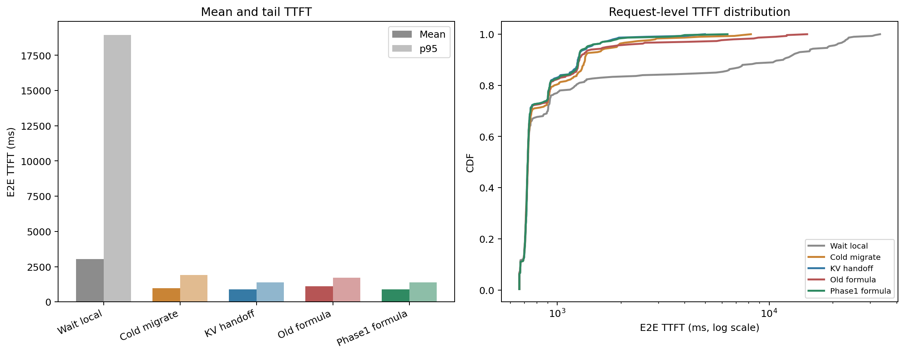
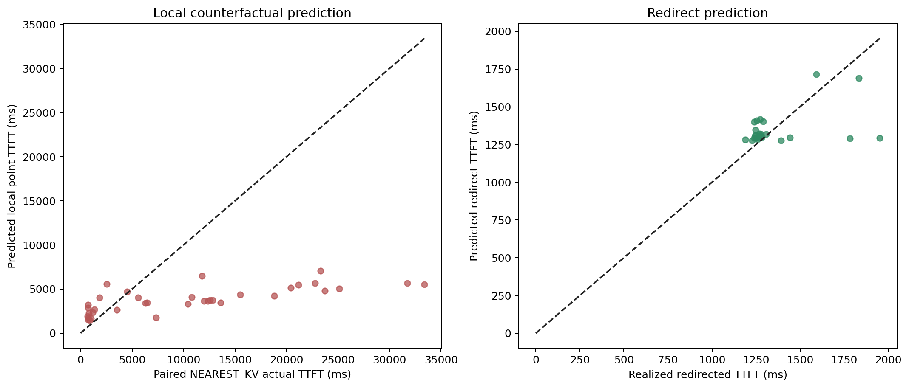
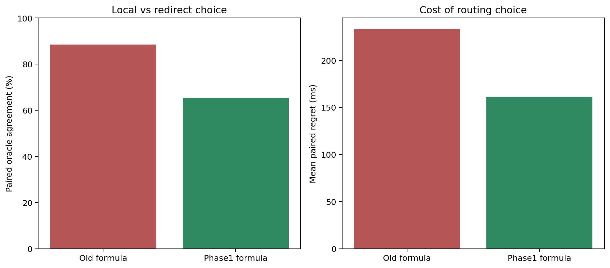

# Phase1学習済みformulate modelのInput 10000 / reuse 50% / 180s評価

## 結論

Phase1学習済みmodelのmean E2E TTFTは **881.4 ms** で、旧formulateの
1104.8 msから **20.2%改善**した。
NEAREST_KV比では71.1%改善し、
NEAREST_MIGRATE_KVとの差は+7.0 msだった。

## E2E性能

| Policy | Mean | p50 | p95 | p99 | Redirects |
|---|---:|---:|---:|---:|---:|
| Wait local | 3046.3 ms | 725.7 ms | 18954.1 ms | 25183.2 ms | 0 |
| Cold migrate | 967.5 ms | 726.2 ms | 1907.9 ms | 4711.8 ms | 33 |
| KV handoff | 874.4 ms | 725.3 ms | 1394.8 ms | 2639.3 ms | 28 |
| Old formula | 1104.8 ms | 725.3 ms | 1716.3 ms | 10739.8 ms | 20 |
| Phase1 formula | 881.4 ms | 724.6 ms | 1375.5 ms | 3328.7 ms | 26 |

## 予測精度

Capacity判断が必要だった36 requestsを評価した。

- Local point prediction MAE: 7761.8 ms
- Local point prediction bias: -6749.6 ms
- Local上側予測の被覆率: 72.2%
- Redirect prediction MAE: 115.1 ms
- Redirect prediction bias: -4.8 ms

Localの実測には、同一requestをNEAREST_KVで処理した結果を使用した。Redirect側は新formulate
runで実際にredirectされたrequestの実測と比較した。

Redirect予測はMAE 115.1 msと比較的良好だが、
local point predictionはMAE 7761.8 ms、bias
-6749.6 msで、今回のInput 10000 / reuse 50% / 180s long-tailをまだ大きく過小予測している。
したがって、今回の性能改善はpoint modelが十分正確になった結果ではなく、
held-out residualの上側予測で危険なlocal選択を避けた効果が大きい。

## Routing判断の改善

| Model | Capacity decisions | Redirect | Local | 誤local候補 | Actionable oracle一致率 | Actionable regret |
|---|---:|---:|---:|---:|---:|---:|
| Old formula | 36 | 20 | 16 | 6 | 88.5% | 233.3 ms |
| Phase1 formula | 36 | 26 | 10 | 0 | 65.4% | 161.3 ms |

`誤local候補`は`local_within_margin_and_deadline`でlocalに残した件数である。新modelでは上側予測を
deadline判断に使うため、この経路は解消した。`target_not_admissible`の場合は予測にかかわらず
local待ちとなる。
Actionable指標はredirect先が収容可能で、modelが実際にlocal/redirectを選べたrequestだけを評価する。
新modelは誤local候補を6件から0件へ減らした一方、actionable paired oracle一致率は
88.5%から65.4%へ下がった。
上側予測はfalse-localを避ける保守的な判断であり、requestごとの最適選択精度を上げる
model改良は依然必要である。

## Counterfactualの制約

Paired oracleは同一request IDのNEAREST_KVとNEAREST_MIGRATE_KVを比較している。ただしpolicyが
変わると先行requestの配置とGPU負荷も変わるため、厳密に同一system stateでの反実仮想ではない。
実runのE2E比較を主結果、paired oracleをrouting判断の診断値として扱う。
