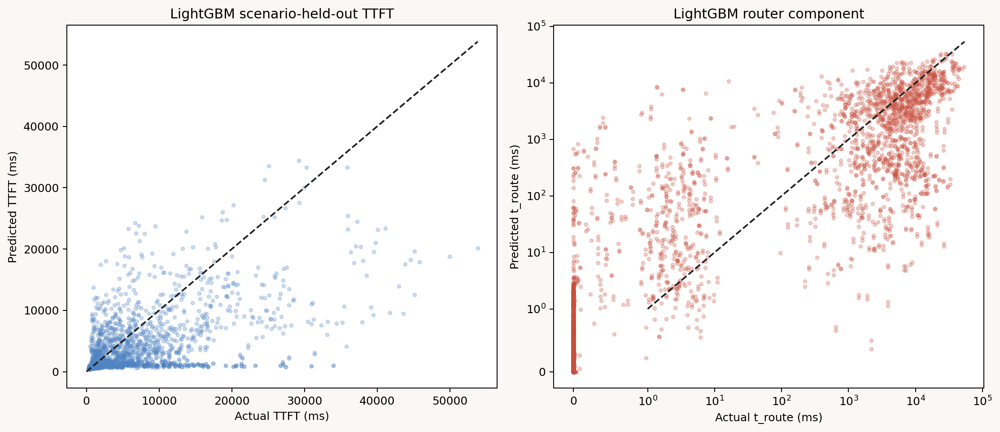

# LightGBMによるTTFT component推定

## 目的

`ttft_formula.md`のcomponent構成を保ったまま、各推定器をLightGBMへ置き換え、
非線形な特徴量間相互作用を使った場合のscenario外挿性能と特徴量重要度を調べた。

元の式でLogistic回帰を使っているのはRouter queue発生分類だけである。その他は、
正値Router queue時間がGradient Boosting、Scheduler queue時間がRidge、Compute/prefill時間が
線形回帰である。本比較では4 componentをすべてLightGBMへ置き換えた。

## モデル構成

最終TTFTは元の式と同様に次で合成する。

$$
\widehat{TTFT}
=p_{route}\hat t_{route,+}
+\hat t_{sched}
+\hat t_{compute}
+\hat t_{comm}
$$

| Component | LightGBM model | Target |
|---|---|---|
| Router queue発生 | `LGBMClassifier` | `router_queue_ms > 0` |
| 正値Router queue時間 | `LGBMRegressor(objective=regression_l1)` | `log1p(router_queue_ms)` |
| Scheduler queue時間 | `LGBMRegressor(objective=regression_l1)` | `scheduler_queue_ms` |
| Compute/prefill時間 | `LGBMRegressor(objective=regression_l1)` | `compute_prefill_ms` |

通信時間は元のpoint formulaと同じく0 msとした。入力は`ttft_formula.md`に記載した
27数値特徴量と3個のpolicy one-hotを全componentで共通に使用した。標準化はtree modelには
不要なので行っていない。

主なparameterは`n_estimators=300`、`learning_rate=0.03`、`num_leaves=15`、
`max_depth=4`、`min_child_samples=40`である。

## Scenario-held-out評価

13,500 requests、15 independent scenariosについて、元の式と同じleave-one-scenario-outで
評価した。値はすべて各requestが属するscenarioを学習から除外したOOF predictionである。

| Metric | 元のformula | LightGBM | 差 |
|---|---:|---:|---:|
| Router queue ROC-AUC | 0.999949 | 0.999998 | +0.000049 |
| Router queue PR-AUC | 0.999707 | 0.999985 | +0.000278 |
| Router component MAE | 630.19 ms | 612.32 ms | −17.87 ms |
| Scheduler component MAE | 56.64 ms | 39.38 ms | −17.26 ms |
| Compute component MAE | 59.68 ms | 69.71 ms | +10.03 ms |
| **TTFT MAE** | **716.08 ms** | **706.81 ms** | **−9.27 ms** |
| **TTFT R²** | **0.46736** | **0.46713** | **−0.00024** |

LightGBMはqueue発生分類、Router時間、Scheduler時間を改善した。一方、元のcompute式は
input token数とcached prefix token数に対する単純な線形式がよく適合しており、LightGBM化で
約10 ms悪化した。結果としてTTFT MAEは約1.3%改善したが、R²は実質的に変わらなかった。

したがって、このデータでは全面的なLightGBM化より、RouterとSchedulerだけをLightGBMにし、
Computeは既存の線形式を維持するhybrid構成が有望である。ただしhybridのOOF値は別途同じfoldで
直接計算して確認する必要がある。



## 特徴量重要度

最終的に全13,500 requestsで学習したmodelから、LightGBMのtotal gainに占める割合を取得した。
上位特徴は次の通りである。

### Router queue発生

| Feature | Gain fraction |
|---|---:|
| `router_initial_capacity_pressure` | 81.33% |
| `router_initial_projected_active_kv_bytes` | 14.12% |
| `router_initial_available_kv_bytes` | 2.22% |
| `router_initial_running_reqs` | 2.00% |

上位4特徴でほぼ全gainを占める。Router queueが発生するかは、request送信時のGPU収容余力、
特に新規requestを含むKV capacity pressureでほぼ決まるという元のLogistic係数の解釈と一致する。

### 正値Router queue時間

| Feature | Gain fraction |
|---|---:|
| `policy_NEAREST_KV` | 19.18% |
| `router_initial_admissible_candidate_count` | 17.02% |
| `home_workload_share` | 10.36% |
| `arrival_offset_s` | 7.10% |
| `router_initial_available_kv_bytes` | 5.15% |
| `router_initial_total_running_reqs` | 5.07% |

Queue発生後の待ち時間では、homeで待つpolicyか、すぐ使える別GPUが存在するか、局所負荷が
継続しているかが重要になった。単純なcapacity値だけでなく、逃げ道と混雑持続時間が効いている。

### Scheduler queue時間

| Feature | Gain fraction |
|---|---:|
| `router_initial_running_reqs` | 32.62% |
| `router_initial_capacity_pressure` | 16.40% |
| `home_arrivals_1s` | 12.76% |
| `router_initial_available_kv_bytes` | 12.29% |
| `policy_NEAREST_KV` | 7.10% |

Schedulerでは対象GPU上の既存running requestsが最大要因で、KV pressureと直近1秒の局所burstが
続いた。既存backlogと短時間arrival burstがscheduler待ちを作るという機構に整合する。

### Compute/prefill時間

| Feature | Gain fraction |
|---|---:|
| `input_tokens` | 33.91% |
| `home_cached_prefix_tokens` | 26.15% |
| `router_initial_required_kv_bytes` | 10.89% |
| `router_initial_capacity_pressure` | 6.44% |
| `home_arrivals_1s` | 3.67% |

Input長とcached prefixが最重要である点は既存の線形式と一致する。追加状態量にもgainが
割り当てられたが、scenario-held-out MAEは線形式より悪いため、これらはscenario固有の
batch状態を学習しただけで、未知scenarioへ安定して一般化していない可能性がある。


### 解釈上の注意

Gain importanceは予測に使われたsplitの損失改善量であり、因果効果ではない。
`capacity_pressure`、`projected_active_kv_bytes`、`available_kv_bytes`のような強相関特徴では、
同じ情報のgainがいずれか一列へ集中する。また、連続値や分岐候補の多い特徴が有利になる場合がある。
全特徴のgainとsplit countは`lightgbm/analysis/feature_importance.csv`に保存した。

## 成果物

- `lightgbm/analysis/summary.json`: OOF metrics
- `lightgbm/analysis/model_comparison.csv`: 元のformulaとの比較
- `lightgbm/analysis/oof_predictions.csv`: 全scenario-held-out予測
- `lightgbm/analysis/feature_importance.csv`: component別gain/split重要度
- `lightgbm/models/ttft_lightgbm.joblib`: 全データで再学習したmodel bundle
- `lightgbm/figures/ttft_lightgbm_oof.png`: OOF actual-predicted plot
- `lightgbm/figures/feature_importance_gain.png`: component別gain重要度

## 再現

実験用venvへLightGBMを導入する。macOSではOpenMP runtimeも必要である。

```bash
brew install libomp
experiments/2026-07-16_ttft_component_regression/.venv/bin/pip install lightgbm
```

学習、scenario-held-out評価、重要度出力をまとめて実行する。

```bash
MPLCONFIGDIR=/tmp/llmservingsim-mpl \
  PYTHONPYCACHEPREFIX=/tmp/llmservingsim-pycache \
  experiments/2026-07-16_ttft_component_regression/.venv/bin/python \
  experiments/2026-07-16_ttft_component_regression/lightgbm/scripts/fit_ttft_lightgbm.py
```
