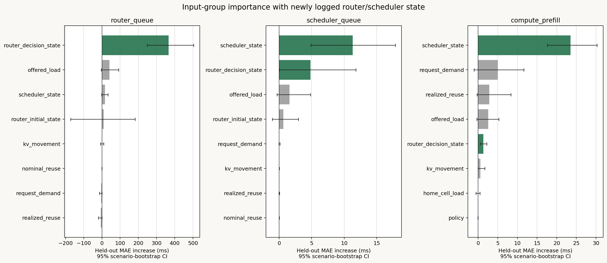
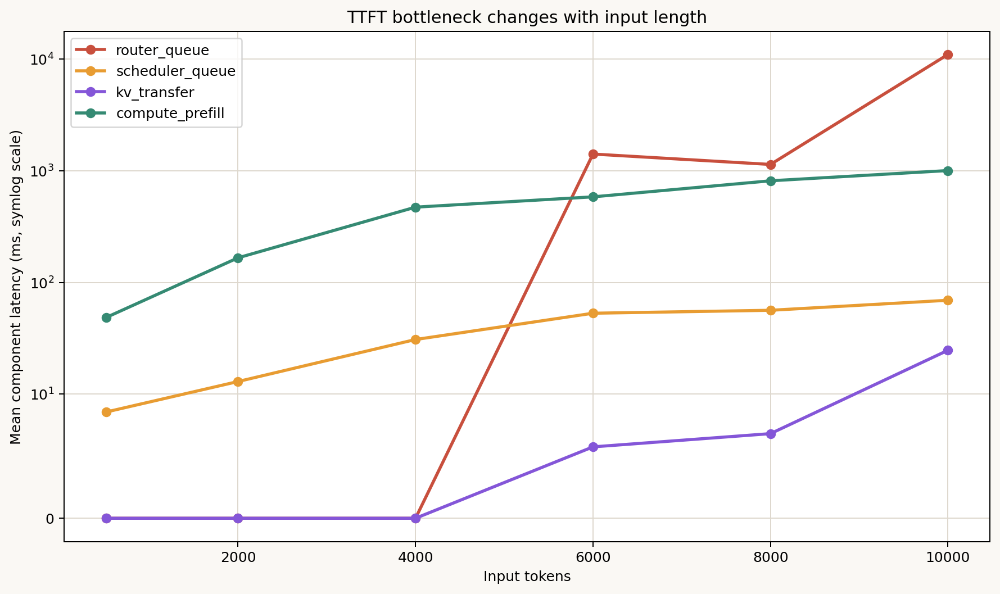

# TTFT component入力因子重要度（最新run反映）

## 結論

最新の62 runs、18,600 requests、21 independent scenariosをscenario単位の
leave-one-scenario-outで再解析した。新しいrouter/scheduler状態列を持つsubsetは
20 runs、6,000 requestsである。

| Target | 最重要の入力情報 | Group ablationによるMAE増加 | 95% CI | 判断 |
|---|---|---:|---:|---|
| `t_route` | 最終routing時の状態 | 365.9 ms | [249.0, 503.9] ms | 明確 |
| `t_sched` | 初回schedule時のbatch状態 | 11.30 ms | [4.88, 17.86] ms | 明確 |
| `t_sched` | 最終routing時の状態 | 4.81 ms | [0.03, 11.81] ms | 弱いが有意 |
| `t_compute` | 初回schedule時のbatch状態 | 23.49 ms | [17.63, 30.26] ms | 明確 |
| `t_compute`（全run） | request demand | 4.54 ms | [0.91, 8.46] ms | 明確 |

ここで重要度は、その入力groupを除いて再学習したときのheld-out MAE増加である。
緑の棒は95% CIが0を跨がない因子、灰色はscenario間で安定しない因子を表す。



## 各componentの解釈

### `t_route`

最も重要なのは、requestの静的な長さやpolicy名ではなく、最終routing decision時点の
混雑・容量状態である。このgroupにはcapacity retry回数、KV capacity pressure、
available/projected active KV bytes、waiting/running requests、sequence slot pressureが
含まれる。標準化係数ではcapacity retry回数が最大だが、状態列同士は強く相関するため、
個別係数の順位よりgroup全体のimportanceを採用する。

初回routing状態の95% CIは0を跨いだ。これは、初回snapshotだけでは、その後のretryを
経て生じるlong-tail queueを十分に決められないことを示す。`t_route`予測には
`router_decision_*`と`router_capacity_retry_count`を優先して保存・入力すべきである。

### `t_sched`

最重要なのは初回schedule時のbatch状態である。具体的にはbatch sequence数、scheduled
prefill/decode tokens、waiting/running/decode request数、prefill tokens aheadである。
最終routing状態にも追加の説明力があり、routerからschedulerへ渡された時点の混雑が
queueingへ連鎖している。

input size、reuse、policyだけからなるcommon modelでは十分に説明できない。状態入力を
加えるとOOF R²は0.122から0.731へ改善した。

### `t_compute`

全runで安定する基本因子はrequest demandであり、特にinput tokens、minimum prefill
chunks、realized uncached tokensが重要である。一方、状態列があるsubsetではbatch状態を
除くことによるMAE悪化が23.49 msと最大である。したがってcomputeは「何token処理するか」
だけでなく、「同じiterationで何sequence・prefill・decodeを一緒に処理するか」に強く
依存する。

input tokens、prefill chunks、uncached tokens、reuseは共線なので、個別の標準化係数の
符号を因果効果として読まず、request demand / realized reuseのgroupとして扱う。

## Bottleneck regime

平均component時間はinput lengthによって支配関係が変わる。512～4,000 tokensでは
`t_compute`が支配し、6,000 tokens付近から`t_route`が上回る。10,000 tokensでは
router queueが11.0 s、computeが1.01 sで、明確なrouter支配となる。



| Input tokens | `t_route` | `t_sched` | KV transfer | `t_compute` | E2E TTFT |
|---:|---:|---:|---:|---:|---:|
| 512 | 0.0 ms | 8.6 ms | 0.0 ms | 48.6 ms | 57.1 ms |
| 2,000 | 0.0 ms | 13.0 ms | 0.0 ms | 166.4 ms | 179.4 ms |
| 4,000 | 0.0 ms | 30.9 ms | 0.0 ms | 473.0 ms | 503.8 ms |
| 6,000 | 1,413.4 ms | 53.1 ms | 5.8 ms | 584.7 ms | 2,057.0 ms |
| 8,000 | 1,140.9 ms | 56.4 ms | 6.8 ms | 814.2 ms | 2,018.4 ms |
| 10,000 | 11,022.1 ms | 69.4 ms | 24.7 ms | 1,005.5 ms | 12,121.9 ms |

6,000から8,000でrouter queueが単調減少しているため、input length単独の因果効果とは
解釈できない。rate、reuse、policyの実験組合せが完全factorialではなく、最終的な
router状態が媒介しているためである。

## 予測に優先すべき入力

1. `t_route`: `router_capacity_retry_count`、`router_decision_capacity_pressure`、
   available/projected active KV bytes、waiting/running requests、slot pressure
2. `t_sched`: batch sequence数、scheduled prefill/decode tokens、初回schedule時の
   waiting/running/decode request数、prefill tokens ahead
3. `t_compute`: realized uncached tokens、input tokens、prefill chunk数に加え、上記batch構成
4. 共通context: request rate、local arrival burst、policy、reroute/KV movementは補助入力

最新state modelのOOF性能は、`t_route` R²=0.524、`t_sched` R²=0.731、
`t_compute` R²=0.973である。`t_route`はzero-inflated long-tailのため、次段階では
queue発生有無のclassifierと正値queue時間のregressorを分けるのが妥当である。

## 再現方法

```bash
MPLCONFIGDIR=/tmp/llmservingsim-mpl python3 experiments/2026-07-16_ttft_component_regression/scripts/analyze_post_routing_all.py
```

集計値は`analysis/post_routing/`、図は`figures/post_routing/`に出力される。
