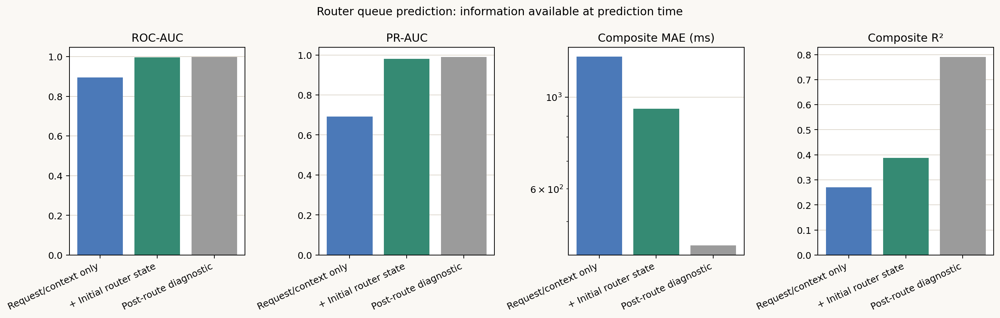
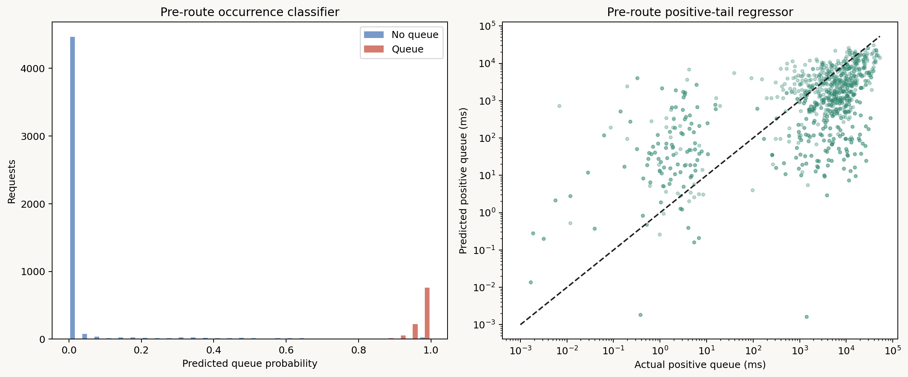

# Request送信時情報によるRouter queue事前予測

## 目的

各requestの`request_send_time_ns`時点で取得可能な情報だけを使い、将来の`t_route`を
どこまで予測できるかを評価した。6,000 requests、7 scenariosをscenario単位の
leave-one-scenario-outで評価した。

## Feature set

### Request/context only

request送信時に既知の次の11列を使用した。

- `input_tokens`
- `output_tokens_actual`（本simulator workloadで事前指定されたtotal target length）
- `request_rate_rps`
- `arrival_offset_s`
- `interarrival_ms`
- `global_arrivals_1s`、`global_arrivals_5s`
- `home_arrivals_1s`、`home_arrivals_5s`
- `home_workload_share`
- `policy`

### Pre-route full

上記へ、request送信時にrouterがGPU telemetryから取得可能と仮定した16個の
`router_initial_*`容量・混雑snapshotを加えた。

- Home GPUのwaiting/running requests
- required、available、projected active KV bytes
- KV capacity pressure、sequence slot pressure
- admissible candidate GPU数
- 全candidateのwaiting/running合計・最大
- 全candidateのavailable KV最小・最大
- 全candidateのcapacity pressure最小・最大

`rerouted`、capacity retry回数、`router_decision_*`、realized reuse、KV movement、
`scheduler_*`はrequest送信後に確定するため除外した。policy横断で構成する
`nominal_reuse_*`も実運用時には未知なので除外した。

## GPU snapshot時刻に関する制約

既存runはsend専用の`router_send_*` snapshotを保存していない。使用した
`router_initial_*`は`route_arrived_requests()`が当該requestを初めて処理した時点で一度だけ
記録され、capacity retry後には更新されない。このため既存ログ中ではsend時GPU状態に最も
近く、未来のretry/decision情報を含まないsnapshotである。

ただしsnapshot自身のtimestampがないため、`request_send_time_ns`と完全な同時刻であることは
検証できない。retryなし5,159 requestsで測ったsend→最終decision時間は中央値0.84 ms、
p95 6.93 ms、p99 11.14 msであり、initial snapshotはこのdecisionより前に取得される。
厳密なsend瞬間の評価には`router_send_snapshot_time_ns`と`router_send_*`を追加してrunを
再実行する必要がある。

## OOF結果

| Feature set | ROC-AUC | PR-AUC | Brier | Positive-tail log-MAE | Composite MAE | Composite R² |
|---|---:|---:|---:|---:|---:|---:|
| Request/context only | 0.894 | 0.691 | 0.1367 | 2.733 | 1,252.7 ms | 0.270 |
| + Initial GPU state | **0.997** | **0.980** | **0.0170** | 2.088 | **936.7 ms** | **0.387** |
| Post-route diagnostic | 0.998 | 0.990 | 0.0131 | **0.445** | 437.8 ms | 0.790 |

Always-zero予測のMAEは1,224.4 msである。initial GPU stateを使う事前モデルはこれを23.5%、
request/context-onlyモデルを25.2%改善した。



## 解釈

### Queueが発生するか

Initial GPU stateを加えるとROC-AUC 0.997、PR-AUC 0.980となり、発生有無はrequest送信時点の
GPU容量・混雑からほぼ判別できる。threshold 0.5でprecision 0.882、recall 1.000だった。

### Queueが何ms続くか

正値tailのlog-MAEは2.088で、post-route diagnosticの0.445より大幅に悪い。発生後の
capacity解放時刻、retry回数、他requestの進行がsend時点では未知だからである。

したがって、send時点モデルは「queueへ入る危険性」の判定には高精度だが、long-tailの正確な
待ち時間推定は限定的である。合成`t_route`はMAE 936.7 ms、R² 0.387に留まる。



## 再現方法

```bash
MPLCONFIGDIR=/tmp/llmservingsim-mpl PYTHONPYCACHEPREFIX=/tmp/llmservingsim-pycache LOKY_MAX_CPU_COUNT=8 python3 experiments/2026-07-16_ttft_component_regression/scripts/analyze_router_queue_preroute.py
```

数値結果は`analysis/router_queue_preroute/`、図は`figures/router_queue_preroute/`に保存する。
