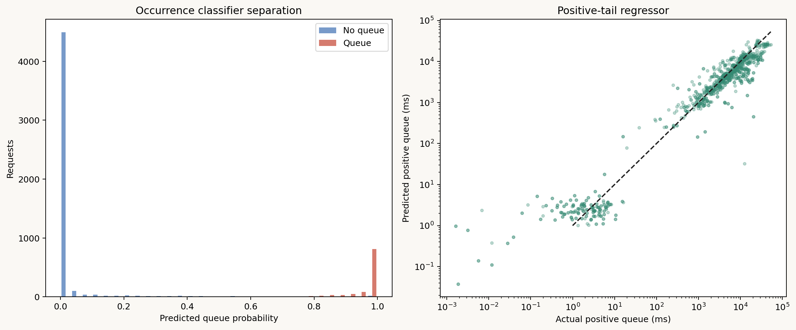
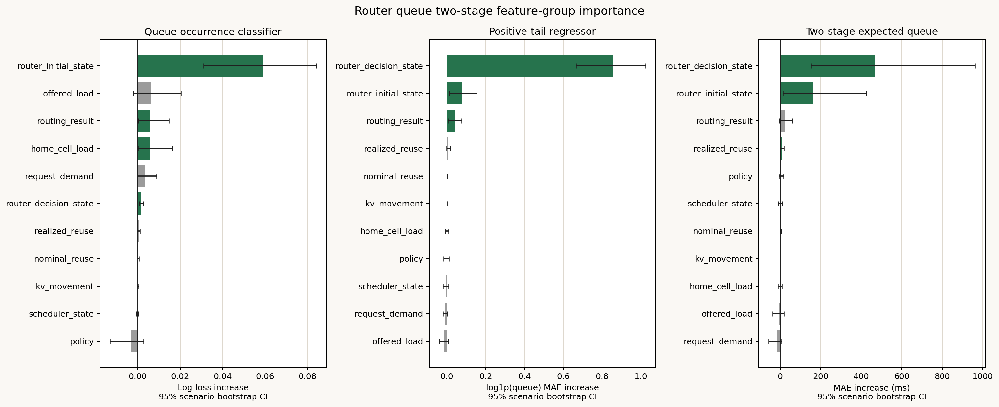
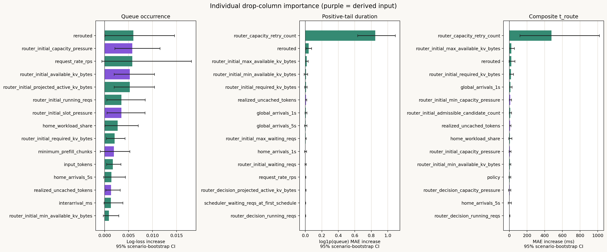

# Router queue二段階モデル解析

## 結論

`t_route`をqueue発生有無と正値queue時間へ分離すると、単一Ridgeより大幅に改善した。
新router状態ログを持つ6,000 requests、7 scenariosをscenario単位の
leave-one-scenario-outで評価した。queue発生は1,057 requests（17.62%）だった。

| Model | OOF MAE | OOF R² |
|---|---:|---:|
| 従来の単一Ridge | 1,293.3 ms | 0.524 |
| 二段階・期待値合成 | 437.8 ms | 0.790 |
| 二段階・0.5閾値合成 | 434.6 ms | 0.791 |

二段階モデルは次の構成である。

1. Logistic regressionで`P(t_route > 0)`を推定
2. 正値requestだけを使い、gradient boostingで`log1p(t_route)`を推定
3. 期待値版は`P(queue) * predicted_positive_queue`として合成

線形log-regressorは未観測scenarioで過大外挿したため採用しなかった。最終版は
absolute-error lossのgradient boostingを使い、学習foldの正値範囲外へは外挿しない。

## Targetと入力パラメータの厳密な定義

### Target `t_route`

本解析の`t_route`は`requests.csv`に直接保存された単一列ではなく、各requestについて
次式で再構成した`router_queue_ms`である。

$$
t_{route}[ms]
=
\max\left(
0,
\frac{
e2e\_ttft\_ns
- queueing\_before\_ttft\_ns
- prefill\_service\_ns
- communication\_latency\_ns
}{10^6}
\right)
$$

`communication_latency_ns`にはKV migrationを含む通信時間が入るため、KV transferは
`t_route`へ重複加算されない。classifierの正例は`router_queue_ms > 1e-9`、負例はそれ以外
と定義した。

以下の`*_state`はCSVの単一列ではない。解析コードの`STATE_GROUPS`で複数列を束ねた
feature groupであり、group ablationでは記載した列をすべて同時に除いて再学習する。

### KV capacity snapshotの共通定義

`router_initial_*`と`router_decision_*`は、同じ`_capacity_snapshot()`を異なる時点・GPUへ
適用した値である。GPU（正確にはprefill scheduler instance）を$i$、今回routingする
requestを$r$とする。

`active requests`は、$i$の`sched.request`にあるadmit済みwaiting requestsと、
`sched.inflight[*].requests`にあるrunning requestsをrequest IDで重複除去した集合である。

各requestのKV bytesは次式で計算する。

$$
blocks(tokens)=\left\lceil\frac{\max(0,tokens)}{block\_size}\right\rceil
$$

$$
fullRequestKV(tokens)=memory.get\_kv(blocks(tokens)\times block\_size)
$$

コード上、今回のrequestの`tokens`には`req_data['output_toks']`、active requestには
`Request.output`を渡す。したがって、ここでいうrequired/projected KVはinput tokensとの
和をこの関数内で作る値ではなく、現在の実装が`output_toks`/`Request.output`から算出した
予約量である。

| Snapshot field | 単位 | 厳密な定義 |
|---|---:|---|
| `waiting_reqs` | requests | `len(sched.request)`。instanceへadmit済みだが、snapshot時点でschedulerのrequest listにいる数 |
| `running_reqs` | requests | 全inflight batchについて`sum(len(batch.requests))` |
| `max_num_seqs` | requests | schedulerに設定された同時sequence上限`int(sched.max_num_seqs)` |
| `required_kv_bytes` | bytes | `fullRequestKV(req_data['output_toks'])` |
| `projected_active_kv_bytes` | bytes | active requests $q$について$\sum_q fullRequestKV(q.output)$ |
| `kv_budget_bytes` | bytes | prefix caching有効時は`memory.mem_for_kv`、無効時は`npu_mem - weight` |
| `free_npu_bytes` | bytes | prefix caching有効時は`memory.avail_size(Device.NPU)`、無効時は`npu_mem - npu_used` |
| `available_kv_bytes` | bytes | $\max(0,kvBudgetBytes-projectedActiveKVBytes)$ |
| `capacity_pressure` | ratio | $(projectedActiveKVBytes+requiredKVBytes)/kvBudgetBytes$。budgetが0以下なら$+\infty$ |
| `slot_pressure` | ratio | $(runningReqs+1)/maxNumSeqs$。上限が0以下なら$+\infty$ |
| `admissible` | 0/1 | `required_kv_bytes <= available_kv_bytes`かつ`running_reqs < max_num_seqs`なら1 |

`free_npu_bytes`はNPU全体の現在のfree bytes、`available_kv_bytes`は上の予約モデルから得る
KV budget内の余裕であり、同じ値ではない。本解析のfeature groupには前者を入れず、後者を
使用した。

### `router_initial_state`

最初のrouting試行時に一度だけ記録する。`assigned_instance_id`で指定されたhome prefill
schedulerのsnapshotと、全`prefill_schedulers`のsnapshot集約で構成する。retryやredirect後
には更新しない。

| 解析入力列 | 単位 | 対象と定義 |
|---|---:|---|
| `router_initial_waiting_reqs` | requests | home instanceの`waiting_reqs` |
| `router_initial_running_reqs` | requests | home instanceの`running_reqs` |
| `router_initial_required_kv_bytes` | bytes | home instanceで算出した今回requestの`required_kv_bytes` |
| `router_initial_available_kv_bytes` | bytes | home instanceの`available_kv_bytes` |
| `router_initial_projected_active_kv_bytes` | bytes | home instanceの`projected_active_kv_bytes` |
| `router_initial_capacity_pressure` | ratio | home instanceの`capacity_pressure` |
| `router_initial_slot_pressure` | ratio | home instanceの`slot_pressure` |
| `router_initial_admissible_candidate_count` | GPUs/instances | 全candidate snapshotsのうち`admissible == 1`の個数 |
| `router_initial_total_waiting_reqs` | requests | 全candidateの`waiting_reqs`の和 |
| `router_initial_max_waiting_reqs` | requests | 全candidateの`waiting_reqs`の最大値 |
| `router_initial_total_running_reqs` | requests | 全candidateの`running_reqs`の和 |
| `router_initial_max_running_reqs` | requests | 全candidateの`running_reqs`の最大値 |
| `router_initial_min_available_kv_bytes` | bytes | 全candidateの`available_kv_bytes`の最小値 |
| `router_initial_max_available_kv_bytes` | bytes | 全candidateの`available_kv_bytes`の最大値 |
| `router_initial_min_capacity_pressure` | ratio | 全candidateの`capacity_pressure`の最小値 |
| `router_initial_max_capacity_pressure` | ratio | 全candidateの`capacity_pressure`の最大値 |

ここでcandidateは距離上の第二候補だけではなく、`self.prefill_schedulers`に含まれる全prefill
instancesである。`router_initial_target_*`として第二候補GPUのsnapshotもCSVへ保存しているが、
今回の`router_initial_state` groupには入れていない。

### `router_decision_state`

最終的に選択されたprefill schedulerへrequestを`add_request()`する直前に記録する。
capacity待ちやretry、redirect、KV reuse/migration処理後の状態である。

| 解析入力列 | 単位 | 厳密な定義 |
|---|---:|---|
| `router_decision_waiting_reqs` | requests | 選択instanceの`waiting_reqs` |
| `router_decision_running_reqs` | requests | 選択instanceの`running_reqs` |
| `router_decision_available_kv_bytes` | bytes | 選択instanceの`available_kv_bytes` |
| `router_decision_projected_active_kv_bytes` | bytes | 選択instanceの`projected_active_kv_bytes` |
| `router_decision_capacity_pressure` | ratio | 選択instanceの`capacity_pressure` |
| `router_decision_slot_pressure` | ratio | 選択instanceの`slot_pressure` |
| `router_capacity_retry_count` | retries | capacity block処理が実行された回数。blockのたびに`_capacity_retry_count += 1` |

`router_decision_required_kv_bytes`、`kv_budget_bytes`、`free_npu_bytes`、`admissible`なども
CSVには保存するが、今回のgroupには入れていない。required KVはrequest demandとほぼ重複し、
budgetやadmissibilityはpressure関連列と決定的に強く相関するためである。

`router_decision_state`とretry countはrouting開始時点では未知である。これは事後説明には
使えるが、最初のrouting試行時点で行うオンライン予測の入力にはそのまま使えない。

### `scheduler_state`

対象requestの`first_schedule_time_ns`が未設定である最初のschedule時だけ記録する。
この時点はrouter decisionおよびscheduler admissionより後である。

| 解析入力列 | 単位 | 厳密な定義 |
|---|---:|---|
| `scheduler_waiting_reqs_at_first_schedule` | requests | `eligible = [q for q in sched.request if q.arrival <= current]`の要素数。対象request自身を含む |
| `scheduler_running_reqs_at_first_schedule` | requests | 全inflight batches中のrequest数の和 |
| `scheduler_running_decode_reqs_at_first_schedule` | requests | inflight中で`not candidate.is_prefill()`となるrequest数 |
| `scheduler_scheduled_prefill_tokens` | tokens | 今回の`batch_req`のうち`is_prefill()`であるrequestについて`scheduled_tokens[id]`を合計 |
| `scheduler_scheduled_decode_tokens` | tokens | 今回の`batch_req`のうちdecode requestについて`scheduled_tokens[id]`を合計 |
| `scheduler_batch_num_seqs` | sequences | `len(batch_req)`。今回batchに含まれるrequest/sequence数 |
| `scheduler_prefill_tokens_ahead` | tokens | arrival順の`eligible`を先頭から対象request直前まで走査し、prefill requestごとに$\max(0,originalInput-numComputedTokens)$を合計 |

`scheduler_token_budget_at_first_schedule = max_num_batched_tokens`もCSVへ保存するが、本datasetでは
固定値で説明力を持たないため今回のgroupから除外した。これらの列も初回schedule後に確定する
事後情報であり、routing開始時点のオンライン予測には利用できない。

### その他のfeature groups

二段階モデルは上記stateだけでなく、次のcommon groupsも同時に入力する。

#### `request_demand`

| 解析入力列 | 単位 | 定義 |
|---|---:|---|
| `input_tokens` | tokens | CSVの`input` |
| `output_tokens_actual` | tokens | CSVの`output` |
| `minimum_prefill_chunks` | chunks | $\lceil\max(0,inputTokens-nominalReuseTokens)/2048\rceil$ |

#### `nominal_reuse`

同一`scenario_id`・request IDのA/B/C policy間で`reuse_prefix_toks`の最大値を取り、policyが
reuseを失わなかった場合に利用できたはずのprefix量として定義する。

| 解析入力列 | 単位 | 定義 |
|---|---:|---|
| `nominal_reuse_tokens` | tokens | 同一scenario・request IDについてpolicy間`reuse_prefix_toks`の最大値 |
| `nominal_reuse_ratio` | ratio | `nominal_reuse_tokens / input_tokens` |

#### `realized_reuse`

| 解析入力列 | 単位 | 定義 |
|---|---:|---|
| `reuse_tokens_realized` | tokens | 当該runのCSV `reuse_prefix_toks` |
| `reuse_preservation_ratio` | ratio | nominalが正なら`realized / nominal`、それ以外は0 |
| `reuse_lost` | 0/1 | nominalが正かつrealizedが0なら1 |
| `realized_uncached_tokens` | tokens | $\max(0,inputTokens-realizedReuseTokens)$ |

#### `offered_load`

arrivalはCSVの`request_send_time_ns`を使う。runのrequest数を$N$、最初と最後のsend time差を
$D$秒とすると、`request_rate_rps = (N-1)/max(D, 1e-9)`である。

| 解析入力列 | 単位 | 定義 |
|---|---:|---|
| `request_rate_rps` | requests/s | 上記run全体の実現request rate |
| `offered_uncached_tokens_per_s` | tokens/s | $\max(0,inputTokens-nominalReuseTokens)\times requestRateRps$ |
| `arrival_offset_s` | s | `(request_send_time_ns - run内最小send time) / 1e9` |
| `interarrival_ms` | ms | send time順で直前requestとの差。先頭requestは0 |
| `global_arrivals_1s` | requests | 当該requestより前かつsend timeが直近1秒以内の全request数 |
| `global_arrivals_5s` | requests | 同じく直近5秒以内の全request数 |

window左端は実装上`prior_time < current_time - window`を除外するため、ちょうど境界上の
prior requestはwindowへ含む。現在request自身は含まない。

#### `home_cell_load`

home GPU IDは`nearest_gpu_id`を使い、欠損時は`gpu_id`へfallbackする。

| 解析入力列 | 単位 | 定義 |
|---|---:|---|
| `home_arrivals_1s` | requests | 直近1秒のprior requestsのうち現在requestとhome GPU IDが同じものの数 |
| `home_arrivals_5s` | requests | 同じく直近5秒の数 |
| `home_workload_share` | ratio | run内全requestsのうち現在requestと同じhome GPU IDを持つ割合。現在request自身を含む |

#### Policy・routing・KV movement

| Group | 解析入力列 | 単位 | 定義 |
|---|---|---:|---|
| `policy` | `policy` | category | run directory名。`NEAREST_KV`、`NEAREST_MIGRATE`、`NEAREST_MIGRATE_KV`をone-hot encoding |
| `routing_result` | `rerouted` | 0/1 | nearest GPUのcapacity不足を契機に第二候補GPUへのredirect処理が実行された場合1、nearest GPUのままなら0。queue発生フラグそのものではない |
| `kv_movement` | `kv_moved` | 0/1 | `kv_migration_latency_ns > 0`かつ`kv_migration_bytes > 0`なら1 |
| `kv_movement` | `migration_tokens_realized` | tokens | CSVの`kv_migration_tokens` |

### 観測時点と利用可能性

| Group | 観測時点 | routing開始時のオンライン予測に利用可能か |
|---|---|---|
| `request_demand`、`nominal_reuse`、`offered_load`、`home_cell_load`、`policy` | routing開始まで | 可。ただしnominal reuseは本解析用のpolicy横断定義なので実装時は事前既知値への置換が必要 |
| `router_initial_state` | 最初のrouting試行 | 可 |
| `routing_result`、`realized_reuse`、`kv_movement` | routing処理後 | 原則不可 |
| `router_decision_state` | 最終admission直前 | 不可 |
| `scheduler_state` | 初回schedule時 | 不可 |

したがって、本レポートのfull modelは支配要因を説明する事後診断モデルであり、全列をそのまま
オンライン予測器へ投入できるという意味ではない。

Request送信時点で利用可能なrequest/contextとinitial GPU snapshotだけへ制限した予測結果は
`router_queue_preroute_prediction.md`に分離した。事前モデルはqueue発生をROC-AUC 0.997で
判別できた一方、合成`t_route`はMAE 936.7 ms、R² 0.387だった。

## Queue発生classifier

| Metric | OOF value |
|---|---:|
| ROC-AUC | 0.9981 |
| PR-AUC | 0.9896 |
| Brier score | 0.0131 |

発生有無を最も強く決めるのは`router_initial_state`だった。groupを除いたときの
log-loss増加は0.0592、95% CIは[0.0311, 0.0841]である。最初のrouting試行時点の
KV capacity pressure、admissible GPU数、waiting/running requestsなどが、queueへ入るか
どうかをほぼ分離している。

`routing_result`、`home_cell_load`、`router_decision_state`にも小さいが95% CIが0を
跨がない追加説明力があった。

## 正値queue時間regressor

正値tailの`log1p` MAEは0.445、実時間MAEは2,465.8 msだった。tail量を最も強く決める
のは`router_decision_state`である。このgroupを除くとlog-MAEが0.859増加し、95% CIは
[0.666, 1.024]だった。

つまり、初回状態は「queueへ入るか」、最終decision状態とretryの結果は「何ms待つか」
を主に説明する。この分離は単一回帰では見えなかった。



## 因子重要度

緑はscenario-bootstrap 95% CIが0を跨がないgroupである。



合成`t_route`のMAEに対して最重要なのは次の順だった。

| Group | MAE increase | 95% CI |
|---|---:|---:|
| `router_decision_state` | 468.0 ms | [152.6, 962.0] ms |
| `router_initial_state` | 164.2 ms | [13.5, 425.8] ms |
| `realized_reuse` | 8.0 ms | [0.2, 17.9] ms |

したがって`t_route`予測入力は、静的なinput sizeやpolicyより、initial/decisionの両時点の
router状態を優先すべきである。

## 個別入力列の重要度

Group名だけでなく、モデルへ入力した49列を1列ずつ除いて再学習するdrop-column解析も
実施した。各importanceは次式で、group解析と同じ7 scenariosのleave-one-scenario-out、
scenario bootstrap 95% CIを使用した。

$$
importance_j
= loss(model\ without\ feature_j)-loss(full\ model)
$$

紫は他の入力から決定的に計算される派生列、緑は直接観測値または複数対象の集約値である。



### Queue発生有無

95% CIが0を跨がなかった個別入力は次の通りである。

| Input feature | 種類 | Log-loss increase | 95% CI |
|---|---|---:|---:|
| `rerouted` | routing結果 | 0.00601 | [0.00002, 0.01457] |
| `router_initial_capacity_pressure` | 派生 | 0.00578 | [0.00212, 0.01154] |
| `router_initial_available_kv_bytes` | 派生 | 0.00526 | [0.00198, 0.01040] |
| `router_initial_projected_active_kv_bytes` | 直接集約 | 0.00526 | [0.00198, 0.01040] |
| `router_initial_running_reqs` | 直接観測 | 0.00351 | [0.00045, 0.00844] |
| `router_initial_slot_pressure` | 派生 | 0.00351 | [0.00048, 0.00843] |
| `home_workload_share` | 集約 | 0.00270 | [0.00005, 0.00699] |
| `router_initial_required_kv_bytes` | 直接算出 | 0.00210 | [0.00038, 0.00424] |
| `input_tokens` | request入力 | 0.00171 | [0.00039, 0.00339] |
| `realized_uncached_tokens` | 派生 | 0.00135 | [0.00021, 0.00325] |
| `router_decision_slot_pressure` | 派生・事後 | 0.00064 | [0.00006, 0.00168] |
| `router_decision_running_reqs` | 直接観測・事後 | 0.00064 | [0.00006, 0.00169] |

`rerouted`は重要度が最大だが、nearest GPUのcapacity判定後、第二候補GPUへのredirectが
実際に成立した時点で1になるrouting結果である。queue発生フラグそのものではなく、redirect
前に両候補が満杯ならcapacity retryを経る場合もある。したがってこれは事後診断には有用だが、
最初のrouting試行時点の予測入力には使用できない。オンライン
classifierで優先すべき利用可能な入力は、initial capacity pressure、available/projected KV、
running requests、required KV、input tokensである。

### 正値queue時間

| Input feature | 種類 | `log1p(queue)` MAE increase | 95% CI |
|---|---|---:|---:|
| `router_capacity_retry_count` | 直接カウント・事後 | 0.84897 | [0.63339, 1.09151] |
| `rerouted` | routing結果・事後 | 0.04031 | [0.00643, 0.07559] |
| `scheduler_batch_num_seqs` | scheduler結果・事後 | 0.00106 | [0.00047, 0.00181] |

正値tailでは`router_capacity_retry_count`が他を大きく上回る。ただしretry countは待ち時間の
進行中に増えるため、初回routing時点では未知である。これは「長いqueueの直接的な進行状況」
を表す説明変数であり、事前に既知の原因変数とは区別する必要がある。

### 合成`t_route`

| Input feature | 種類 | MAE increase | 95% CI |
|---|---|---:|---:|
| `router_capacity_retry_count` | 直接カウント・事後 | 478.0 ms | [118.9, 1,017.7] ms |
| `router_initial_max_available_kv_bytes` | candidate集約 | 23.2 ms | [1.4, 57.5] ms |
| `realized_uncached_tokens` | 派生・事後 | 8.3 ms | [0.7, 18.1] ms |

合成予測でもretry countが支配的である。初回routing時点で利用可能な個別入力のうち、CIが
安定して正だった最大因子は全candidate中の最大available KV bytesだった。

### 共線性による読み方の制約

個別importanceが小さいことは、その情報が不要であることを必ずしも意味しない。残った列が
同じ情報を代替できるためである。本datasetでは特に次の関係が強い。

- `router_initial_available_kv_bytes`と
  `router_initial_projected_active_kv_bytes`は、KV budgetが固定された範囲では一方から他方を
  復元できる。このため両者の個別importanceが同値になった。
- `router_initial_running_reqs`と`router_initial_slot_pressure`も、`max_num_seqs`固定時には
  一対一に対応し、個別importanceがほぼ同値になった。
- `input_tokens`、`minimum_prefill_chunks`、`required_kv_bytes`、
  `realized_uncached_tokens`はrequest size/reuseを共有する。
- `capacity_pressure`はrequired、projected active、budget KVから計算される派生値である。

このため、個別表は「他の全列を残した条件付き追加価値」、group表は「相関した情報一式の
価値」として併読する。個別importanceを単純加算してgroup importanceと比較することは
できない。

### 派生列を除いたraw-input-only比較

決定的な派生列14本を除き、直接観測値または集約値だけで同じモデルを評価した。
下表はscenarioを同じ重みで平均したlossであり、冒頭のrequest-weighted OOF集約とは集計法が
異なる。

| Metric | All 49 inputs | Raw/direct inputs | Raw − all |
|---|---:|---:|---:|
| Classifier log-loss | 0.04898 | 0.07115 | +0.02217 |
| Positive-tail log-MAE | 0.43157 | 0.42682 | −0.00474 |
| Composite MAE | 425.9 ms | 439.0 ms | +13.1 ms |

派生列はqueue発生classifierを改善するが、正値tailでは直接入力だけでも同等だった。合成MAE
への効果は13.1 msであり、モデル全体の中心的情報はraw/direct側にも残っている。

個別の全49列×7 foldsの値は`analysis/router_queue_two_stage/
individual_feature_ablation.csv`、bootstrap集約は`bootstrap_individual_feature_importance.csv`、
raw比較は`raw_vs_all_features.csv`に保存した。

## 注意点

- 7 scenariosのうち1 scenarioには正値queueがなく、そのfold単独のROC-AUCは定義できない。
- 集約ROC-AUCとPR-AUCは全OOF predictionから計算した。
- 正値tailには依然として外れ値があり、tail regressorの実時間MAEは2.47秒である。
- 現在の実験計画は完全factorialではないため、特徴量重要度を介入的な因果効果とは扱わない。

## 再現方法

```bash
MPLCONFIGDIR=/tmp/llmservingsim-mpl PYTHONPYCACHEPREFIX=/tmp/llmservingsim-pycache python3 experiments/2026-07-16_ttft_component_regression/scripts/analyze_router_queue_two_stage.py
```

数値結果は`analysis/router_queue_two_stage/`、図は`figures/router_queue_two_stage/`へ
出力される。
