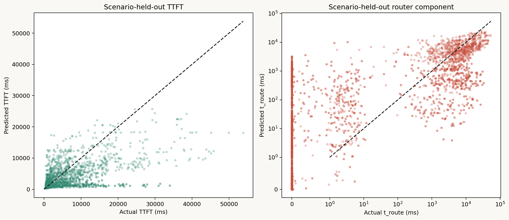

# Request送信時情報によるTTFT定式化

Raw入力から最終TTFTまでを1 requestについて全項展開した独立資料は
`ttft_formula_worked_example.md`を参照する。

## 最終式

Request送信時に既知のrequest/context、home GPU cache情報、initial GPU telemetryから
TTFTを次式で予測する。時間の単位はすべてmsである。

$$
\boxed{
\widehat{TTFT}
=
\hat t_{route}
+\hat t_{sched}
+\hat t_{compute}
+\hat t_{comm}
}
$$

本datasetではsend後のredirectで通信時間が決まるため、point predictionは
$\hat t_{comm}=0$とした。この省略によるOOF MAEは2.88 msで、全体誤差への影響は小さい。

## 入力の標準化

Logistic、route-tail、scheduler式の数値入力は次のz-scoreへ変換する。

$$
z_j=\frac{x_j-\mu_j}{\sigma_j}
$$

$\mu_j,\sigma_j$は`analysis/ttft_formula/numeric_feature_scaling.csv`に全27列を保存した。
policyはone-hot encodingする。学習時に存在したcategoryは`NEAREST_KV`、
`NEAREST_MIGRATE`、`NEAREST_MIGRATE_KV`である。

## 入力特徴量の意味

以下の入力は、いずれもrequestを最初にroutingしようとした時点で取得できる情報である。
`router_initial_*`の`initial`は、redirect後やscheduler投入後ではなく、最初のrouting判断時の
snapshotであることを表す。候補GPUごとに式を評価する場合、「home」はその評価対象の
candidate GPUとして読み替える。

### Requestと到着過程

| Input | 単位 | 意味 |
|---|---:|---|
| `input_tokens` | tokens | Prompt全体のtoken数。prefix cache hitを含む、requestが持つ元の入力長である。 |
| `output_tokens` | tokens | 生成予定の新規token数。内部表現の総sequence長から`input_tokens`を引き、0未満にならないようにした値である。 |
| `home_cached_prefix_tokens` | tokens | Routing判断時にhome/candidate GPUで再利用できるprompt prefixのtoken数。多いほどprefillで再計算する部分が減る。 |
| `request_rate_rps` | requests/s | 当該runまたはworkloadに設定された平均request到着率。瞬間値ではなく、traffic全体のoffered loadを表す。 |
| `arrival_offset_s` | s | Run内の最初のrequest送信時刻から当該request送信時刻までの経過時間。warm-up、混雑蓄積、drainなどrun内の位置を表すproxyでもある。 |
| `interarrival_ms` | ms | 送信時刻順で直前のrequestから当該requestまでの間隔。先頭requestは0である。小さいほど直近にrequestが集中している。 |
| `global_arrivals_1s` | requests | 当該requestより前の直近1秒間に、全home GPU向けに到着したrequest数。現在のrequest自身は含まない。 |
| `global_arrivals_5s` | requests | 同じく直近5秒間に全体へ到着したprior request数。1秒値より持続的なtraffic強度を表す。 |
| `home_arrivals_1s` | requests | 直近1秒間のprior requestsのうち、当該home/candidate GPUをhomeとするrequest数。局所的な短時間burstを表す。 |
| `home_arrivals_5s` | requests | 同じく直近5秒間に当該home/candidate GPUへ割り当てられたprior request数。局所負荷の持続性を表す。 |
| `home_workload_share` | ratio | Run内の全requestsのうち、当該home/candidate GPUをhomeとするrequestの割合。現在のrequest自身を含み、0から1の範囲を取る。 |

`global_arrivals_*`と`home_arrivals_*`は実際にGPUへadmitされた数ではなく、送信されたworkloadの
到着履歴である。前者はsystem全体のburst、後者は特定GPUへ偏ったburstを区別する。

### 対象GPUのqueue、KV、sequence slot

| Input | 単位 | 意味 |
|---|---:|---|
| `router_initial_waiting_reqs` | requests | 対象GPUのscheduler queueに入り、まだ実行batchに含まれていないrequest数。 |
| `router_initial_running_reqs` | requests | 対象GPUでinflight batchに含まれているrequest数。batch数ではなく、全inflight batches内のrequest数の合計である。 |
| `router_initial_required_kv_bytes` | bytes | 新規requestが完了までに必要とすると見積もったKV cache容量。総sequence長をKV block sizeへ切り上げて算出する。 |
| `router_initial_projected_active_kv_bytes` | bytes | 対象GPUですでにwaitingまたはrunningの各requestが完了までに必要とするKV容量の予測合計。重複requestは一度だけ数え、他request向けの予約KVも含む。 |
| `router_initial_available_kv_bytes` | bytes | KV budgetから`projected_active_kv_bytes`を引いた予測空き容量。負値は0へ丸める。これはallocatorの瞬間的なfree bytesではなく、active requestsの将来使用量を見込んだ余力である。 |
| `router_initial_capacity_pressure` | ratio | 新規requestも配置した場合のKV圧力。`(projected active KV + required KV) / KV budget`で、1を超えると予測必要量がbudgetを超える。 |
| `router_initial_slot_pressure` | ratio | 新規requestも含むsequence slot圧力。`(running requests + reserved slots + 1) / max_num_seqs`である。1を超えるとslot上限を超える。 |

`required_kv_bytes`は新規request単体、`projected_active_kv_bytes`は既存request群、
`available_kv_bytes`は既存群を考慮した残量、`capacity_pressure`はそこへ新規requestまで
置いた場合の比率である。この4列は同じKV収容状態から導かれるため、互いに強く相関する。

### 全候補GPUを集約した状態

| Input | 単位 | 意味 |
|---|---:|---|
| `router_initial_admissible_candidate_count` | GPUs | 最初のrouting時点で、新規requestをKV容量とsequence slotの両方について収容可能な候補GPU数。 |
| `router_initial_total_waiting_reqs` | requests | 全候補GPUの`waiting_reqs`の合計。system全体のscheduler backlogを表す。 |
| `router_initial_max_waiting_reqs` | requests | 候補GPUのうち最大の`waiting_reqs`。最も混雑したqueueの状態を表す。 |
| `router_initial_total_running_reqs` | requests | 全候補GPUの`running_reqs`の合計。system全体でinflightなrequest量を表す。 |
| `router_initial_max_running_reqs` | requests | 候補GPUのうち最大の`running_reqs`。最も多くのrequestを実行中のGPUの状態を表す。 |
| `router_initial_min_available_kv_bytes` | bytes | 全候補中で最小の予測空きKV容量。最もKV余力の小さいGPUを表す。 |
| `router_initial_max_available_kv_bytes` | bytes | 全候補中で最大の予測空きKV容量。最もKV余力の大きいGPUを表す。 |
| `router_initial_min_capacity_pressure` | ratio | 全候補中で最小のcapacity pressure。最も収容余力のある逃げ先がどの程度空いているかを表す。 |
| `router_initial_max_capacity_pressure` | ratio | 全候補中で最大のcapacity pressure。最もKV圧力の高いGPUの状態を表す。 |

これらの集約値は、対象GPU単体の状態だけでなく「他GPUへ逃がせるか」「system全体が
同時に混雑しているか」を式へ与える。`min`/`max`はGPU IDではなく、各候補で観測した値の
最小値・最大値である。

### Routing policy

| Input | 値 | 意味 |
|---|---:|---|
| `policy_NEAREST_KV` | 0/1 | Nearest/home GPUで待ち、既存のprefix KV localityを維持するpolicyなら1。 |
| `policy_NEAREST_MIGRATE` | 0/1 | 別GPUへredirectし、KVを引き継がずcold prefillするpolicyなら1。 |
| `policy_NEAREST_MIGRATE_KV` | 0/1 | 別GPUへredirectし、再利用可能なKVをhandoffするpolicyなら1。 |

3列のうち当該policyに対応する1列だけが1となるone-hot表現である。policy入力は、同じ
queue/KV状態でも、homeで待つか、cold redirectするか、KV付きでredirectするかによって
route待ちやscheduler待ちの関係が変わることを表現する。compute式にはpolicy one-hotを
直接使用せず、`input_tokens`と`home_cached_prefix_tokens`だけを使用する。

## Router queue発生確率

$$
p_{route}=\sigma\left(\beta_0+\sum_j\beta_j z_j+
\sum_k\beta^{policy}_k I(policy=k)\right)
$$

ここで$\sigma(a)=1/(1+e^{-a})$、interceptは$\beta_0=-14.013232$である。
絶対値の大きい係数は次の通りである。

| Input | Mean | Scale | Logistic coefficient |
|---|---:|---:|---:|
| `router_initial_capacity_pressure` | 0.60498 | 0.31546 | +2.42623 |
| `router_initial_projected_active_kv_bytes` | CSV参照 | CSV参照 | +2.39727 |
| `router_initial_available_kv_bytes` | CSV参照 | CSV参照 | −2.39727 |
| `router_initial_running_reqs` | 5.403 | 3.226 | +1.74253 |
| `router_initial_slot_pressure` | CSV参照 | CSV参照 | +1.74253 |
| `input_tokens` | 6,300 | 1,307.67 | +1.20034 |
| `router_initial_admissible_candidate_count` | 8.360 | 2.244 | −1.19363 |
| `router_initial_required_kv_bytes` | CSV参照 | CSV参照 | +1.19248 |

正係数はqueue発生確率を上げ、負係数は下げる。ただしavailable/projected KV、
running/slot pressureは決定的に相関するため、個別係数を独立な因果効果とは解釈しない。
全係数は`route_event_logistic_coefficients.csv`に保存した。

## 正値Router queue時間

単純なlog-Ridge係数式はscenario-held-outで外挿に失敗したため、深さ2の回帰木100本による
piecewise係数式を採用した。

$$
g(x)=8.324456+\sum_{m=1}^{100}0.05\,v_{m,leaf_m(x)}
$$

$$
\hat t_{route,+}
=
\exp\left(clip(g(x),0.001642,10.878924)\right)-1
$$

各木は最大3個の分岐条件を持ち、$v_{m,leaf}$がそのleaf係数である。全treeの入力列、
標準化threshold、left/right node、leaf係数を
`route_positive_tree_coefficients.json`に保存した。これはblack-box model artifactだけでなく、
上式をJSONからそのまま再実装できる完全な係数表である。

ゼロ過多を考慮したrouter componentは期待値として次式で合成する。

$$
\boxed{\hat t_{route}=p_{route}\hat t_{route,+}}
$$

## Scheduler queue時間

$$
\hat t_{sched}
=
\max\left(0,\gamma_0+\sum_j\gamma_jz_j+
\sum_k\gamma^{policy}_kI(policy=k)\right)
$$

Ridge penaltyは`alpha=1000`、interceptは$\gamma_0=60.427288$ msである。
絶対値の大きい係数は次の通りである。

| Input | Coefficient (ms per 1 SD) |
|---|---:|
| `router_initial_waiting_reqs` | +52.7343 |
| `home_arrivals_1s` | +50.7336 |
| `home_cached_prefix_tokens` | −17.5240 |
| `home_workload_share` | −8.1111 |
| `home_arrivals_5s` | +7.8022 |
| `router_initial_required_kv_bytes` | +7.6343 |
| `input_tokens` | +7.5137 |
| `router_initial_admissible_candidate_count` | +6.5018 |
| `request_rate_rps` | +4.9866 |
| `router_initial_max_available_kv_bytes` | +4.9657 |

全係数は`scheduler_ridge_coefficients.csv`に保存した。

## Compute/prefill時間

Computeはraw token単位の明示的な線形式となった。

$$
\boxed{
\hat t_{compute}
=
\max\left(
0,
-96.717513
+0.1440215\,inputTokens
-0.1190117\,homeCachedPrefixTokens
\right)
}
$$

`home_cached_prefix_tokens`はrequest送信時にhome GPU上で利用可能なprefix token数である。
現在のCSVはpolicy適用後のreuseしか保持しないため、学習datasetでは同一scenario・requestの
policy間最大`reuse_prefix_toks`から再構成した。実運用ではsend時のhome cache lookup値を
直接入力する必要がある。

例えばinput 6,000、home cache 3,000 tokensなら、

$$
\hat t_{compute}
=-96.72+0.14402(6000)-0.11901(3000)
\approx410.4\;ms
$$

## 完全なTTFT式

以上をまとめると、point predictionは次式である。

$$
\boxed{
\widehat{TTFT}
=
p_{route}\left[\exp(clip(g(x),0.001642,10.878924))-1\right]
+\max(0,\gamma_0+\gamma^Tz)
+\max(0,-96.717513+0.1440215I-0.1190117C)
}
$$

$I$はinput tokens、$C$はhome cached prefix tokensである。policy one-hot項は簡略記法の
$\gamma^Tz$へ含めた。

## 信頼性評価

Phase 1完了後の13,500 requests、15 independent scenariosを
leave-one-scenario-outで再学習・評価した。

| Target | OOF metric |
|---|---:|
| Queue発生 | ROC-AUC 0.99995 |
| Queue発生 | PR-AUC 0.99971 |
| `t_route` | MAE 630.2 ms |
| `t_sched` | MAE 56.6 ms |
| `t_compute` | MAE 59.7 ms |
| `t_comm`省略 | MAE 2.9 ms |
| **TTFT** | **MAE 716.1 ms** |
| **TTFT** | **R² 0.467** |

Absolute TTFT errorの分布はp50 73.2 ms、p90 1,015 ms、p95 4,050 ms、
p99 13,578 msだった。



この式はqueue発生と通常領域には一定の信頼性があるが、高負荷long-tailの時間量を過小予測
する。特に`input6000_rate5p0_reuse00_seed1` scenarioのMAEは3.71秒だった。したがって、
point predictionだけをp95/p99 SLAやhard deadlineの判定に使うことはできない。

### Routing判断用の上側予測

旧formulate版は、home GPUが収容不能と観測済みでも
`p_route * t_route_positive`を1秒deadlineと比較していた。このため旧実験では、実際には
1.4–11.4秒待った9 requestsを0.14–0.64秒と見積もり、誤ってlocalへ残した。

この用途ではpoint predictionとは別に、scenario-held-out residualの90 percentileを加えた
上側予測を使用する。

$$
\hat t_{route,upper}=\hat t_{route,+}+10{,}311.69\;\mathrm{ms}
$$

この補正値とquantileは`route_positive_tree_coefficients.json::upper_prediction`へ保存した。
OOFで正値router waitの89.96%を上から被覆し、1秒超の実待ちを1秒以下と判定した例は0件だった。
Simulatorはpoint estimateを診断列に保持しつつ、local/redirectとdeadlineの判断にはこの上側予測を使う。

## 係数・model artifact

- `numeric_feature_scaling.csv`: $\mu,\sigma$
- `route_event_logistic_coefficients.csv`: $\beta$
- `route_positive_tree_coefficients.json`: $g(x)$の全分岐・leaf係数
- `scheduler_ridge_coefficients.csv`: $\gamma$
- `compute_linear_coefficients.csv`: computeのraw係数
- `models/ttft_formula/ttft_formula.joblib`: fitted model bundle
- `analysis/ttft_formula/oof_predictions.csv`: 全held-out予測

## 入力例を用いた数式の追跡

以下は保存済みmodelへ実際に入力した4例である。Logisticとschedulerについては、各項を
`standardized value × coefficient`へ分解した。紙面に載せない小さい項も含む完全な加算表は
`analysis/ttft_formula/examples/`に保存した。

### 例1：低負荷

主要入力：

```text
input_tokens = 4000
home_cached_prefix_tokens = 0
request_rate_rps = 2.507
policy = NEAREST_MIGRATE_KV
router_initial_running_reqs = 5
router_initial_capacity_pressure = 0.3713
router_initial_slot_pressure = 0.046875
router_initial_admissible_candidate_count = 10
```

Queue発生logitの主要項は次の通りである。

$$
\begin{aligned}
L={}&-14.0132 &&\text{intercept}\\
&-2.2115 &&\text{required KV}\\
&-2.1112 &&\text{input tokens}\\
&-1.7973 &&\text{capacity pressure}\\
&-1.5509 &&\text{projected active KV}\\
&-1.5509 &&\text{available KV}\\
&-1.4733 &&\text{all remaining terms}\\
={}&-24.7085
\end{aligned}
$$

$$
p_{route}=\sigma(-24.7085)=1.8588\times10^{-11}
$$

Positive-tail treeは次の和になった。

$$
g(x)=8.324456+(-7.431511)=0.892945
$$

$$
t_{route,+}=e^{0.892945}-1=1.442311
$$

$$
\hat t_{route}=1.8588\times10^{-11}\times1.442311
\approx0.000000000027\;ms
$$

Scheduler式は、主要6項の和194.3080 ms、残りの項が−5.6959 msだった。

$$
\hat t_{sched}=\max(0,194.3080-5.6959)=188.6122\;ms
$$

Compute式は、

$$
\hat t_{compute}
=-96.7175+0.1440215(4000)-0.1190117(0)
=479.3685\;ms
$$

したがって、

$$
\boxed{
\widehat{TTFT}=0+188.6122+479.3685+0=667.9807\;ms
}
$$

### 例2：6,000 tokens、2,992 cached tokens

主要入力：

```text
input_tokens = 6000
home_cached_prefix_tokens = 2992
request_rate_rps = 3.326
policy = NEAREST_KV
router_initial_running_reqs = 6
router_initial_capacity_pressure = 0.6247
router_initial_admissible_candidate_count = 9
```

Queue発生logitは、

$$
\begin{aligned}
L={}&-14.0132 &&\text{intercept}\\
&-0.3929 &&\text{required KV}\\
&+0.3504 &&\text{maximum candidate capacity pressure}\\
&-0.3405 &&\text{admissible candidate count}\\
&+0.3224 &&\text{home running requests}\\
&+0.3224 &&\text{home slot pressure}\\
&+0.6807 &&\text{all other input terms}\\
={}&-13.0707
\end{aligned}
$$

最後の$+0.6807$は上に個別表示しなかった残り全項の和である。

$$
p_{route}=\sigma(-13.0707)=2.1061\times10^{-6}
$$

$$
g(x)=8.324456-0.919778=7.404678
$$

$$
t_{route,+}=e^{7.404678}-1=1642.6554\;ms
$$

$$
\hat t_{route}=2.1061\times10^{-6}\times1642.6554
=0.003460\;ms
$$

Schedulerは主要6項95.8840 ms、残り7.9694 msである。

$$
\hat t_{sched}=95.8840+7.9694=103.8534\;ms
$$

Computeはcacheによって356.0830 ms短縮される。

$$
\begin{aligned}
\hat t_{compute}
&=-96.7175+0.1440215(6000)-0.1190117(2992)\\
&=-96.7175+864.1290-356.0830\\
&=411.3286\;ms
\end{aligned}
$$

$$
\boxed{
\widehat{TTFT}=0.0035+103.8534+411.3286=515.1854\;ms
}
$$

### 例3：Capacity境界

主要入力：

```text
input_tokens = 6000
home_cached_prefix_tokens = 0
request_rate_rps = 4.733
policy = NEAREST_KV
router_initial_running_reqs = 10
router_initial_capacity_pressure = 0.9854
router_initial_slot_pressure = 0.085938
router_initial_admissible_candidate_count = 5
```

Logitの主要項を展開すると、

$$
\begin{aligned}
L={}&-14.0132 &&\text{intercept}\\
&+2.9822 &&\text{projected active KV}\\
&+2.9822 &&\text{available KV}\\
&+2.9256 &&\text{capacity pressure}\\
&+2.4829 &&\text{slot pressure}\\
&+2.4829 &&\text{running requests}\\
&-0.1001 &&\text{remaining terms}\\
={}&-0.257624
\end{aligned}
$$

available KV項が正なのは、標準化値と係数がともに負だからである。

$$
p_{route}=\sigma(-0.257624)=0.435948
$$

$$
g(x)=8.324456+0.158842=8.483298
$$

$$
t_{route,+}=e^{8.483298}-1=4832.3635\;ms
$$

$$
\hat t_{route}=0.435948\times4832.3635=2106.6587\;ms
$$

$$
\hat t_{sched}=75.9180+3.1517=79.0697\;ms
$$

$$
\hat t_{compute}=-96.7175+0.1440215(6000)=767.4115\;ms
$$

$$
\boxed{
\widehat{TTFT}=2106.6587+79.0697+767.4115=2953.1399\;ms
}
$$

### 例4：収容可能GPUなし

主要入力：

```text
input_tokens = 6000
home_cached_prefix_tokens = 0
request_rate_rps = 4.733
policy = NEAREST_KV
router_initial_running_reqs = 11
router_initial_capacity_pressure = 1.0862
router_initial_slot_pressure = 0.093750
router_initial_admissible_candidate_count = 0
```

$$
\begin{aligned}
L={}&-14.0132 &&\text{intercept}\\
&+4.4478 &&\text{admissible candidate count}\\
&+3.7561 &&\text{projected active KV}\\
&+3.7561 &&\text{available KV}\\
&+3.7014 &&\text{capacity pressure}\\
&+3.0230 &&\text{slot pressure}\\
&+0.7310 &&\text{remaining terms}\\
={}&5.402054
\end{aligned}
$$

admissible countは標準化値が負、係数も負なので、0 GPUsのとき正のlogit寄与になる。

$$
p_{route}=\sigma(5.402054)=0.995513
$$

$$
g(x)=8.324456+0.745152=9.069608
$$

$$
t_{route,+}=e^{9.069608}-1=8686.2176\;ms
$$

$$
\hat t_{route}=0.995513\times8686.2176=8647.2418\;ms
$$

Schedulerの主要6項は−16.4103 msだが、その他の項が+31.8006 msなので、

$$
\hat t_{sched}=\max(0,-16.4103+31.8006)=15.3903\;ms
$$

$$
\hat t_{compute}=767.4115\;ms
$$

$$
\boxed{
\widehat{TTFT}=8647.2418+15.3903+767.4115=9430.0436\;ms
}
$$

### 完全な計算トレース

各例の省略なしの計算値は以下に保存した。

- `examples/example_summary.csv`: 入力、各中間値、最終TTFT
- `examples/route_logistic_contributions.csv`: 全logistic項の`z × coefficient`
- `examples/route_tail_tree_trace.csv`: 100 treesすべての分岐pathとleaf寄与
- `examples/scheduler_contributions.csv`: 全scheduler項の`z × coefficient`

これらを再生成するスクリプトは`trace_ttft_formula_examples.py`である。

## 支配要因の考察

### 何を「支配的」と呼ぶか

支配要因は、係数の絶対値だけでは決められない。本分析では次の3つを分けて解釈する。

1. **component支配度**：実測TTFTのうち、`t_route`、`t_sched`、`t_compute`のどれが最大か
2. **同一モデル内の感度**：標準化線形モデルの「入力が1標準偏差変化したときの寄与」、またはtree importance
3. **機構上の整合性**：その入力がrouter、scheduler、prefill計算を変化させる理由がシミュレータの定義と一致するか

相関する特徴量を同時に入れているため、単一係数を因果効果とはみなさない。例えば、固定KV budgetでは
`available_kv_bytes`と`projected_active_kv_bytes`はほぼ表裏一体であり、
`running_reqs`と`slot_pressure`もほぼ同じ状態を表す。以下では、これらを個別の変数ではなく
**GPU収容余力**という特徴量群として扱う。

### 結論：典型リクエストはcompute、平均と上位tailはrouteが支配する

6,000件の実測で、各リクエストについて最大のcomponentを調べると、

| 最大component | リクエスト比率 |
|---|---:|
| `t_compute` | 86.48% |
| `t_route` | 13.02% |
| `t_sched` | 0.50% |

となる。したがって、**大部分の通常リクエストではprefill computeがTTFTを決める**。
一方、実測平均は`route = 1224.39 ms`、`scheduler = 60.25 ms`、
`compute = 703.60 ms`であり、平均TTFTに対する比率はそれぞれ約61.5%、3.0%、35.3%である。
これは少数のroute queueが非常に長いzero-inflated long-tailであり、平均を強く押し上げるためである。

入力長別にも同じ構造が見える。

| `input_tokens` | route (ms) | scheduler (ms) | compute (ms) | 実測TTFT (ms) | 主成分 |
|---:|---:|---:|---:|---:|---|
| 4000 | 0.0 | 30.9 | 472.9 | 503.8 | compute（約93.9%） |
| 6000 | 1603.9 | 70.4 | 706.2 | 2381.9 | route（約67.3%） |
| 8000 | 1140.9 | 56.4 | 814.2 | 2018.4 | route（約56.5%） |

6,000 tokenの平均が8,000 tokenより遅いことは、入力長を増やすとroute queueが短くなることを意味しない。
rate、policy、prefix reuse、到着時刻などのscenario構成が異なる集計値であるためで、入力長単独の因果比較には使えない。

### 1. `t_compute`の支配要因：入力token数とcached prefix

compute式は

$$
\hat t_{compute}=
\max\left(0,
-96.717513
+0.144021508\,\text{input\_tokens}
-0.119011686\,\text{home\_cached\_prefix\_tokens}
\right)
$$

である。したがって、他の入力を固定したモデル上の感度は、

- `input_tokens`が1 token増えると`+0.1440 ms`
- home GPU上のcached prefixが1 token増えると`-0.1190 ms`

である。入力tokenが増えるとprefillで処理するembedding、attention、MLP等の仕事量が増えるため、
compute時間がほぼ線形に増える。一方、既にhome GPUにあるprefixは再計算を省略できるため、
`home_cached_prefix_tokens`は負の寄与になる。両係数の絶対値が完全には一致しないのは、
cache hitがattentionのKV長やbatch構成にも影響し、単純な「入力tokenからcache tokenを引く」だけでは
全kernel時間を表現できないためである。

通常領域でこの2変数が最重要なのは、queueが発生しない86%超のリクエストでは、
TTFTの大部分が実際にprefillの計算量だからである。

### 2. route queue発生の支配要因：GPU収容余力

queue発生classifierで絶対値の大きい標準化係数は次の通りである。

| 入力 | 標準化係数 | 解釈 |
|---|---:|---|
| `router_initial_capacity_pressure` | +2.426 | 必要KVを含む占有圧力が高いほどqueueしやすい |
| `router_initial_projected_active_kv_bytes` | +2.397 | 既存requestの予測KV占有が大きいほどqueueしやすい |
| `router_initial_available_kv_bytes` | -2.397 | 空きKVが大きいほどqueueしにくい |
| `router_initial_running_reqs` | +1.743 | 実行中requestが多いほどslot不足になりやすい |
| `router_initial_slot_pressure` | +1.743 | request slot圧力が高いほどqueueしやすい |
| `input_tokens` | +1.200 | 新規requestが要求するKV容量が増える |
| `router_initial_admissible_candidate_count` | -1.194 | 収容可能GPUが多いほど待たずにrouteできる |
| `router_initial_required_kv_bytes` | +1.192 | 当該requestの必要KVが大きいほど収容条件が厳しい |

これらは独立な8要因ではなく、中心にあるのは次の収容判定である。

$$
\text{capacity pressure}
=\frac{\text{projected active KV}+\text{required KV}}{\text{KV budget}}
$$

$$
\text{admissible}
\iff
\text{required KV}\leq\text{available KV}
\quad\land\quad
\text{running requests}<\text{max sequences}
$$

つまり、**route queueの発生を最も強く決める潜在要因は、送信時点で少なくとも1台のGPUが
そのrequestをKV容量とsequence slotの両方で収容できるか**である。
長いpromptは必要KVを増やし、既存requestのKV占有と実行数は空き容量を減らす。
その結果、`admissible_candidate_count = 0`に近づくほどqueue確率が急増する。

個々の係数を足して「available KVとprojected KVが別々に約2.4ずつ効く」と解釈してはいけない。
両者は固定budgetを介して強く相関するため、係数の分配は学習データや正則化で変動し得る。
ただし、符号が収容判定と一致し、除外重要度でも同じ特徴量群が上位であることから、
**GPU収容余力というグループの重要性**は信頼できる。

### 3. 正値route時間の支配要因：逃げ道、policy、混雑の持続時間

queueが発生した後の正値時間を推定する100本のdepth-2 treesでは、主なimpurity importanceは次の通りである。

| 入力 | tree importance |
|---|---:|
| `router_initial_admissible_candidate_count` | 0.241 |
| `policy_NEAREST_KV` | 0.167 |
| `home_workload_share` | 0.150 |
| `router_initial_min_capacity_pressure` | 0.091 |
| `arrival_offset_s` | 0.090 |
| `home_arrivals_5s` | 0.050 |
| `router_initial_available_kv_bytes` | 0.038 |
| `request_rate_rps` | 0.035 |
| `router_initial_total_running_reqs` | 0.032 |

queue発生後に重要なのは、単なるrequestサイズよりも、**いつ収容可能なGPUが現れるか**である。

- `admissible_candidate_count`は、直ちに使える逃げ道の数を表す。0台なら既存処理の完了を待つ必要がある。
- `policy_NEAREST_KV`はprefix localityを優先するため、home GPUが満杯でも別GPUへ逃がすpolicyより待ちやすい。
- `home_workload_share`、`home_arrivals_5s`、`request_rate_rps`は、home側の混雑が一時的か継続的かを表す。
- `min_capacity_pressure`とavailable KVは、候補中で最も余裕のあるGPUがどの程度回復に近いかを表す。

`arrival_offset_s`のimportanceは注意が必要である。これは時刻そのものがqueueを生むというより、
runの前半・後半におけるwarm-up、混雑の蓄積、drainを代理している可能性が高い。
したがって、同じ到着過程を持つ実験内では予測に役立つが、run長やtraffic patternが変わる環境への
移植性は低い。tree importance自体も相関特徴量や分割点数の影響を受けるため、値を因果効果とは解釈しない。

なお、送信後に確定する`capacity_retry_count`や`rerouted`を許せば正値tailは大幅に説明しやすくなる。
しかし本式は「request送信時点で予測可能」という条件を守るため、それらを入力していない。
この制約がroute tailの予測誤差が大きく残る主要因である。

### 4. `t_sched`の支配要因：既存waiting queueと直近の到着burst

Scheduler Ridgeで大きい標準化係数は、`router_initial_waiting_reqs = +52.73 ms/SD`と
`home_arrivals_1s = +50.73 ms/SD`である。既に待っているrequestが多いほど先行requestの処理を待ち、
直近1秒の到着が多いほどtoken budget、sequence slot、KV blockの競合が増えるため、これはschedulerの機構と一致する。

次点は`home_cached_prefix_tokens = -17.52 ms/SD`である。prefix cache hitにより必要なprefill tokenが減り、
先行batchと当該requestの双方がschedulerを早く通過しやすくなるため、負の寄与は妥当である。
ただし到着数、waiting数、rateは相互に強く相関するので、ここでも個々の係数より
**既存backlogと短時間burst**というグループとして解釈する。

`t_sched`は重要な機構ではあるが、今回のデータでは最大componentになったrequestは0.5%、
平均寄与も約3%であり、TTFT全体の第一支配要因ではない。

### 5. 支配要因の総合順位

| 順位 | 支配要因群 | 主に効くcomponent | 根拠と解釈 | 信頼度 |
|---:|---|---|---|---|
| 1 | GPU収容余力（KV capacity、slot、admissible GPU数） | route発生、route tail | classifier係数・tree importance・router収容式が一致 | 高 |
| 2 | 入力token数とcached prefix | compute、route発生 | compute式の直接係数とKV要求量の両方に作用 | 高 |
| 3 | 既存backlogと直近arrival burst | scheduler、route tail | waiting数・1秒/5秒到着数が上位 | 中〜高 |
| 4 | routing policyとhome locality/load | route tail | 混雑時に別GPUへ逃げられるかを決定 | 中 |
| 5 | run内の到着位置 `arrival_offset_s` | route tail | 非定常な混雑状態のproxyであり、移植性が低い | 低〜中 |

まとめると、低負荷・通常時のTTFTを短くするには、uncached input tokenを減らすprefix cacheが最も直接的である。
高負荷時の平均・p95/p99を短くするには、KV/slot収容余力を増やすこと、候補GPUを増やすこと、
混雑したhome GPUから逃がせるrouting policyにすることの方が重要になる。

### モデル精度から見た考察の限界

OOF予測のcomponent平均は、`scheduler = 56.71 ms`対実測`60.25 ms`、
`compute = 706.87 ms`対実測`703.60 ms`で、平均値はよく整合する。
一方、routeは予測`509.76 ms`に対して実測`1224.39 ms`であり、長いtailを過小予測している。
したがって本式は、通常領域のcompute時間とqueue発生riskの説明には比較的信頼性があるが、
**極端なroute待ち時間の絶対値**には十分な信頼性がない。
支配要因の結論も「容量不足がtailを生む」点は強いが、「何ms待つか」の細かな順位は今後、
送信時点のGPUごとのremaining work、実行中batchの残りtoken、次の解放見込み時刻などを追加して再検証すべきである。

## 再現・予測

学習と係数export：

```bash
MPLCONFIGDIR=/tmp/llmservingsim-mpl PYTHONPYCACHEPREFIX=/tmp/llmservingsim-pycache LOKY_MAX_CPU_COUNT=8 python3 experiments/2026-07-16_ttft_component_regression/scripts/fit_ttft_formula.py
```

入力CSVへの適用：

```bash
python3 experiments/2026-07-16_ttft_component_regression/scripts/predict_ttft_formula.py \
  <INPUT_FEATURES_CSV> \
  <OUTPUT_PREDICTIONS_CSV>
```
