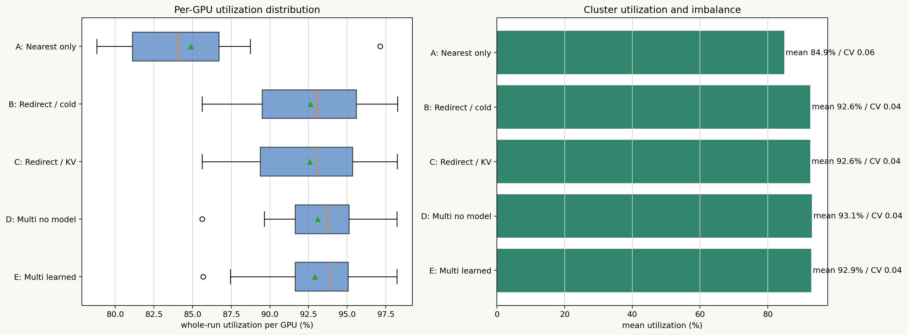
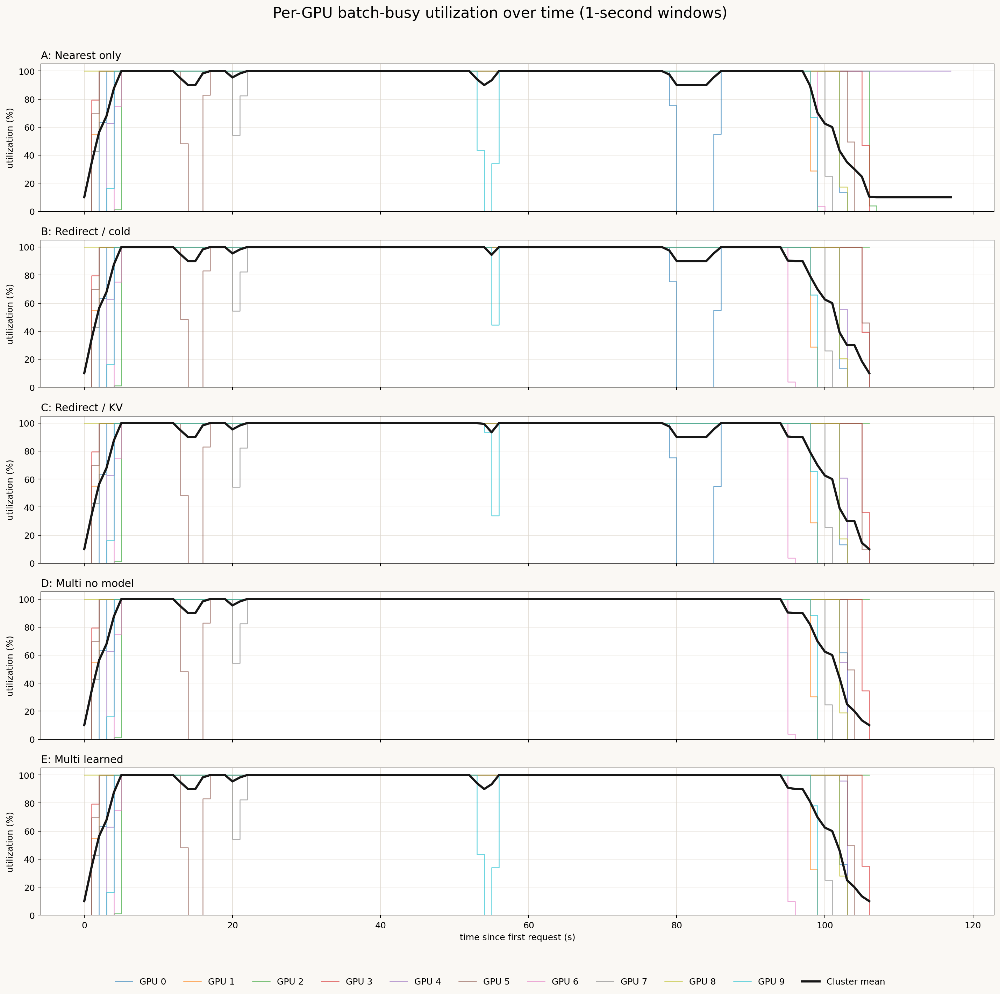
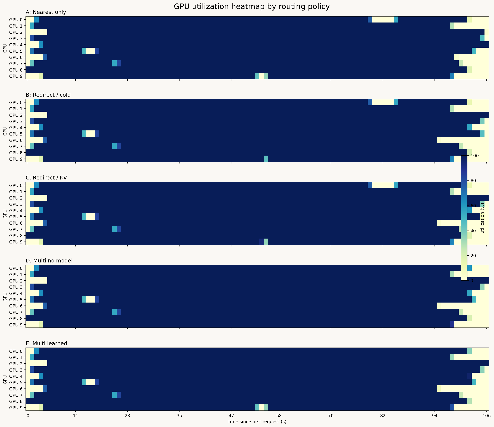
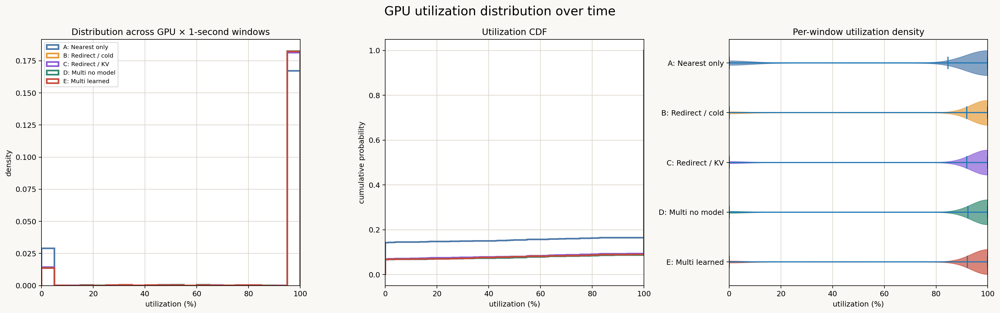

# Five-policy GPU utilization analysis

## Summary

| Policy | Mean TTFT | p95 TTFT | Redirects | Mean GPU util | Min–max util | Util CV |
|---|---:|---:|---:|---:|---:|---:|
| A: Nearest only | 2004.1 ms | 14021.0 ms | 0 | 84.9% | 78.8–97.1% | 0.060 |
| B: Redirect / cold | 518.5 ms | 917.9 ms | 24 | 92.6% | 85.6–98.3% | 0.041 |
| C: Redirect / KV | 487.1 ms | 785.6 ms | 24 | 92.6% | 85.6–98.2% | 0.041 |
| D: Multi no model | 470.5 ms | 758.6 ms | 18 | 93.1% | 85.6–98.2% | 0.037 |
| E: Multi learned | 471.7 ms | 747.8 ms | 18 | 92.9% | 85.7–98.2% | 0.040 |

## Figures

## One-second-window distribution

| Policy | p10 | p50 | p90 | Idle windows | Saturated windows |
|---|---:|---:|---:|---:|---:|
| A: Nearest only | 0.0% | 100.0% | 100.0% | 14.2% | 83.6% |
| B: Redirect / cold | 100.0% | 100.0% | 100.0% | 6.9% | 90.7% |
| C: Redirect / KV | 100.0% | 100.0% | 100.0% | 6.9% | 90.7% |
| D: Multi no model | 100.0% | 100.0% | 100.0% | 6.6% | 91.3% |
| E: Multi learned | 100.0% | 100.0% | 100.0% | 6.7% | 91.0% |

The utilization metric is simulated batch-busy wall-clock coverage, not an SM hardware counter.
