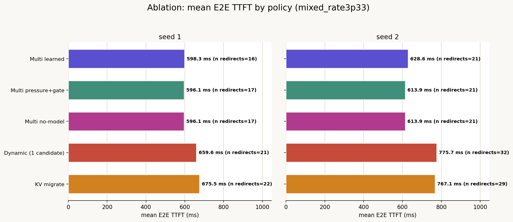
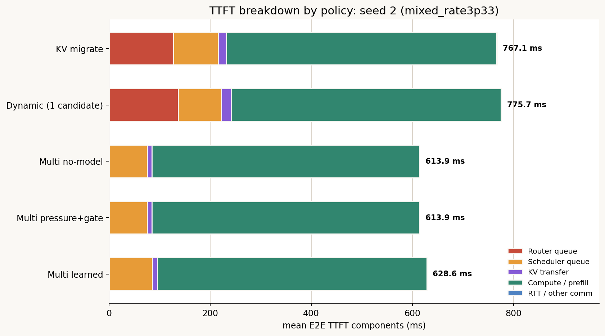
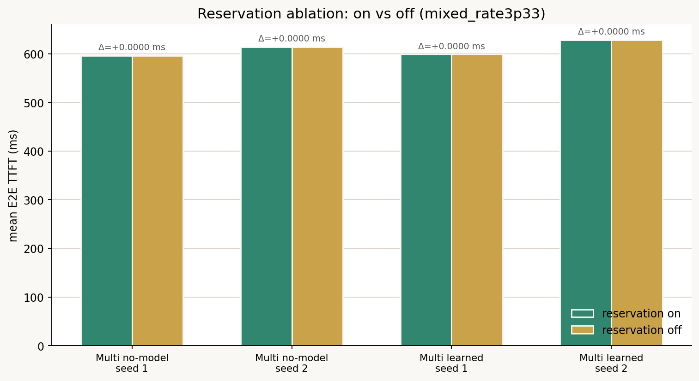

# Multi-candidateのablation: 候補数 vs modelによるgating vs ランキング方式 vs reservation

## 結論

Multi no-modelがKV migrateに勝っている理由は、ほぼ1つの要因**「redirect先の探索を
第二近傍1台から、収容可能な全GPUへ広げたこと」**だけで説明できる。「modelを使う」
という括りに含まれていた残り2つの要素は、この条件では実質効果ゼロだった。
model based のlocal待機vs redirect判断(gate)は一度も「待て」側に倒れておらず、
no-modelの「即redirect」と常に同じ結論になっていた。また対象GPUのatomic reservation
(KV/slot予約)も、複数のredirect判断が同じ空きGPUを取り合う場面が一度も発生しなかった
ため、効果が現れなかった。既報(`final_three_policy_analysis.md`)の「学習modelが
no-modelよりわずかに悪い」という結果は、唯一残る違いである「候補ランキング方式を
capacity pressureからTTFT予測式に変えたこと」だけで説明できる。

## セットアップ

Router実装の`_maybe_capacity_dynamic_formula_route`(dynamic再評価付きredirect判断)を、
可能な限り他2軸を固定した上で3軸に分解して比較した。

| 軸 | 比較したポリシー | 何が変わるか |
|---|---|---|
| 候補数 | `NEAREST_CAPACITY_DYNAMIC_FORMULA_KV_RESERVE`(1候補=第二近傍のみ) vs `NEAREST_CAPACITY_MULTI_FORMULA_KV_RESERVE`(N候補=収容可能な全GPU) | どちらもTTFT式によるgateとreservationは有効。候補集合だけが違う |
| modelによるgate | `NEAREST_CAPACITY_MULTI_PRESSURE_KV_RESERVE`(modelなし。候補が1つでもadmissibleになったら即redirect) vs `NEAREST_CAPACITY_MULTI_PRESSURE_FORMULA_KV_RESERVE`(gateは有効だが、ランキングはpressureのまま) | local待機vsredirectの比較(`margin_wins`/`deadline_exceeded`)をそもそも評価するかどうか |
| ランキング方式 | `NEAREST_CAPACITY_MULTI_PRESSURE_FORMULA_KV_RESERVE`(capacity pressureでランキング) vs `NEAREST_CAPACITY_MULTI_FORMULA_KV_RESERVE`(TTFT予測でランキング) | ランキング指標だけが違う。gateも候補数も固定 |
| reservation | 各`..._KV_RESERVE`ポリシー vs `--no-enable-oneshot-target-reservation`を付けた再実行 | 対象GPUのKV/slotをatomicに予約するかどうか |

`2026-07-21_mixed_workload_model_value`のrate=3.33側2 seed(`mixed_rate3p33_seed1`,
`mixed_rate3p33_seed2`)に絞って実行した。redirectが16〜32件と十分に発生するのはこの
rateだけで、rate=2.5側は2〜6件しか発生せずどのポリシー間でも差が出ない
(`final_three_policy_analysis.md`参照)。クラスタ・ワークロード生成・CLIフラグは
`run_three_policy.sh`と同一。追加分は`run_ablation.sh`で実行した。

## 結果

| ポリシー | seed1 mean | seed1 redirects | seed2 mean | seed2 redirects |
|---|---:|---:|---:|---:|
| KV migrate(1候補・reservationなし・modelなし) | 675.5 ms | 22 | 767.1 ms | 29 |
| Dynamic(1候補・reservationあり・model gate) | 659.6 ms | 21 | 775.7 ms | 32 |
| Multi no-model(N候補・reservationあり・gateなし) | 596.1 ms | 17 | 613.9 ms | 21 |
| Multi no-model, no-reserve | 596.1 ms(完全一致) | 17 | 613.9 ms(完全一致) | 21 |
| Multi pressure+gate(N候補・reservationあり・model gate・pressureランキング) | 596.1 ms | 17 | 613.9 ms | 21 |
| Multi learned(N候補・reservationあり・model gate・TTFT予測ランキング) | 598.3 ms | 16 | 628.6 ms | 21 |
| Multi learned, no-reserve | 598.3 ms(完全一致) | 16 | 628.6 ms(完全一致) | 21 |

「完全一致」のペアは小数点10桁まで一致することを確認済み
(`analysis/ablation_summary.csv`)。元の`requests.csv`は行単位では300行中57行が異なるが、
差分は`oneshot_target_reservation_enabled`のような記録用列のみで、`e2e_ttft_ns`自体は
一度も変わっていない。



### 候補数: 支配的な要因

| | seed1 | seed2 |
|---|---:|---:|
| Dynamic → Multi learned | −61.3 ms(−9.3%) | −147.1 ms(−19.0%) |

TTFT breakdownを見るとメカニズムがそのまま可視化される。候補集合を1台(second-nearest)
からadmissibleな全GPUへ広げた瞬間、Router queueが35〜137ms(KV migrate / Dynamic)から
0.2ms未満(Multi系全て)へ潰れる。Compute・Scheduler queueはほぼ動かない。



### modelによるgate: 効果測定不可(実質ゼロ)

Multi no-modelとMulti pressure+gateは両seedともbit-identicalだった。
`_maybe_capacity_dynamic_formula_route`内のgate(`margin_wins`/`deadline_exceeded`)は、
このworkloadでは一度も「待て」を選ばず、候補がadmissibleになるたびにno-modelの
「即redirect」と同じ結論に達していた。これは、前回の日記で確認した「学習modelの
redirect理由はほぼ全て`predicted_local_wait_exceeds_limit`(deadline側)であり、
`redirect_beats_local_by_margin`(比較で明確に勝った側)はほとんど発生していない」
という観測と整合する。つまりgateのうち実際に仕事をしているのはdeadline側の判定だけで、
margin比較(本来のgateらしい判断)はほぼ機能していない。

### ランキング方式: 「modelが足を引っ張る」の正体そのもの

| | seed1 | seed2 |
|---|---:|---:|
| Multi pressure+gate → Multi learned | +2.2 ms(+0.4%) | +14.7 ms(+2.4%) |

学習modelが実際に挙動を変えているのはここだけであり、しかも一貫して悪化方向である。
`final_three_policy_analysis.md`で報告した「学習modelがno-modelよりわずかに劣る」
という結果は、まるごとこの「ランキング指標の入れ替え」1点に還元できる。model自体が
routing判断に関与していること自体が悪いのではない。



### reservation: 効果測定不可(このworkloadでは)

Multi no-model・Multi learnedのいずれも、reservationのon/offで両seedとも差分ゼロだった。
前回のprompt6000/90s five-policy実験のトレース(`router_decision_capacity_pressure`が
同一GPUへの連続redirectのたびに明確に上昇していた)から、reservationの帳簿自体は
正しく機能していることは既に確認済みなので、これは実装が壊れているのではなく
「このmixed_rate3p33データでは、複数のredirect判断が同じ空きGPUを同時に取り合う
場面が一度も発生しなかった」という真の意味でのnull resultである。

## 留保事項

以上4つの結論は全て`mixed_rate3p33_seed1`/`seed2`(300リクエスト、10 GPU、3.33rps、
入力長・reuse率・トラフィック相が混在)というこの1つのworkload条件に限定される。
特にreservationとmodel gateのnull resultは「衝突の起きやすさ」に依存するため、
単一の空きGPUを複数requestが同時に取り合うような、より競合の激しいworkloadでは
別の結果になる可能性がある。候補数拡大とランキング方式の効果は十分大きく、また
`2026-07-21_multi_pressure_vs_kv_input_reuse_sweep`のinput10000条件での既報とも
方向が一致しているため、workload固有のノイズである可能性は低いと考えられるが、
どちらも別系統のworkloadでの再確認はまだ行っていない。

## 再現方法

```bash
MAX_PARALLEL=8 experiments/2026-07-21_mixed_workload_model_value/run_ablation.sh
python3 experiments/2026-07-21_mixed_workload_model_value/scripts/analyze_ablation.py
```

## 成果物

- `analysis/ablation_summary.csv` — ポリシー×seedごとのmean/p50/p90/p95/p99/redirects/component内訳
- `figures/ablation/ttft_by_policy.png`
- `figures/ablation/reservation_ablation.png`
- `figures/ablation/ttft_breakdown_mixed_rate3p33_seed{1,2}.png`
- `figures/ablation/ttft_cdf_mixed_rate3p33_seed{1,2}.png`
