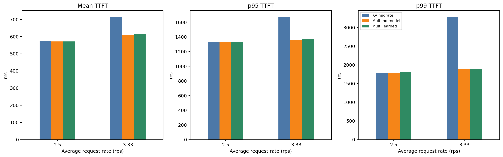
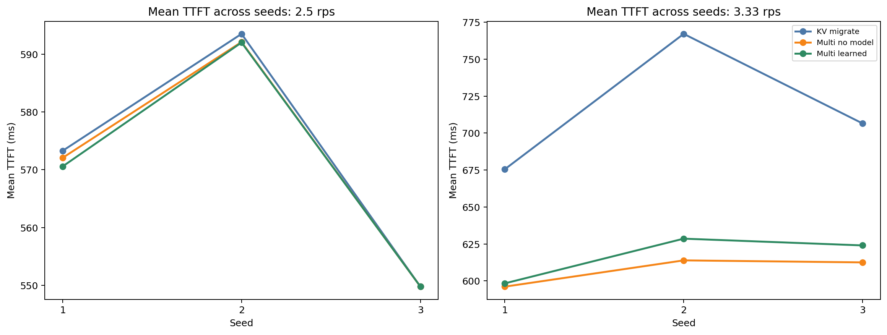
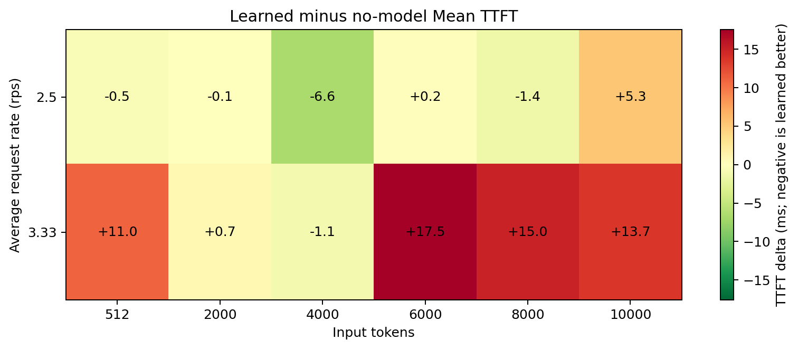

# Mixed workload three-policy analysis

## Conclusion

Multi-candidate routing is clearly useful at 3.33 rps, but the learned model is
not the source of the gain. The no-model capacity-pressure policy is the best
overall policy under load. The learned policy is approximately tied at 2.5 rps
and is consistently worse across all three 3.33-rps seeds.

## Pooled results across three seeds

| Rate | Policy | Mean | p50 | p95 | p99 | Max | Redirects |
|---:|---|---:|---:|---:|---:|---:|---:|
| 2.5 | KV migrate | 572.2 ms | 517.6 ms | 1332.4 ms | 1780.1 ms | 2491.9 ms | 12 |
| 2.5 | Multi no model | 571.3 ms | 511.5 ms | **1327.7 ms** | **1780.0 ms** | 2491.9 ms | 12 |
| 2.5 | Multi learned | **570.8 ms** | **506.2 ms** | 1332.4 ms | 1807.1 ms | 2491.9 ms | 12 |
| 3.33 | KV migrate | 716.4 ms | 550.3 ms | 1677.5 ms | 3294.2 ms | 13020.6 ms | 82 |
| 3.33 | Multi no model | **607.5 ms** | **536.6 ms** | **1353.6 ms** | **1885.2 ms** | 3193.4 ms | 55 |
| 3.33 | Multi learned | 617.0 ms | 539.5 ms | 1374.8 ms | 1891.3 ms | 3193.4 ms | 58 |

At 3.33 rps, no-model Multi improves over KV migrate by 15.2% in mean,
19.3% at p95, and 42.8% at p99. Learned Multi also improves over KV migrate,
but is 9.5 ms slower in mean than no-model Multi and has worse p50, p95, and
p99.

## Seed consistency

Learned minus no-model Mean TTFT:

| Rate | Seed 1 | Seed 2 | Seed 3 |
|---:|---:|---:|---:|
| 2.5 | -1.49 ms | -0.09 ms | +0.01 ms |
| 3.33 | +2.23 ms | +14.70 ms | +11.49 ms |

The low-rate improvement is negligible and not consistently negative. At the
higher rate, learned routing regresses in every seed. This rejects the current
learned-model superiority hypothesis for this workload matrix.

## Normal and burst phases

| Rate | Phase | No-model Mean | Learned Mean | Difference |
|---:|---|---:|---:|---:|
| 2.5 | Normal | 548.5 ms | 549.6 ms | +1.1 ms |
| 2.5 | Burst | 662.8 ms | **655.5 ms** | -7.3 ms |
| 3.33 | Normal | **583.2 ms** | 590.8 ms | +7.6 ms |
| 3.33 | Burst | **704.6 ms** | 721.5 ms | +16.9 ms |

The seed-1 burst improvement does not generalize. Pooled across all seeds, the
learned policy helps bursts only at 2.5 rps and becomes worse during both normal
and burst phases at 3.33 rps.

## Input-length behavior

Learned minus no-model Mean TTFT:

| Rate | 512 | 2000 | 4000 | 6000 | 8000 | 10000 |
|---:|---:|---:|---:|---:|---:|---:|
| 2.5 | -0.5 | -0.1 | **-6.6** | +0.2 | -1.4 | +5.3 |
| 3.33 | +11.0 | +0.7 | -1.1 | +17.5 | +15.0 | +13.7 |

At 2.5 rps, the model helps input 4000 and slightly helps input 8000, but hurts
input 10000. At 3.33 rps, it is worse for nearly every length, especially 6000,
8000, and 10000. The learned benefit is not stable across load or input length.

## Routing behavior

Across all 1800 requests:

- No-model Multi: 67 redirects.
- Learned Multi: 70 redirects.
- Every learned redirect is labeled `predicted_local_wait_exceeds_limit`.
- Every no-model redirect is caused by an inadmissible Home and immediately
  selects the minimum-pressure admissible target.

The learned gate remains saturated: whenever Home is blocked, its upper local
wait prediction exceeds the one-second limit. It does not provide a nuanced
wait-versus-redirect decision in these runs. Its practical effect is mainly
target ranking, plus small trajectory-dependent differences in which later
requests find Home admissible.

## Redirect prediction accuracy

For 70 learned redirects:

| Metric | Value |
|---|---:|
| MAE | 127.3 ms |
| Bias, actual minus predicted | +28.3 ms |
| Median error | -32.3 ms |
| p90 absolute error | 288.1 ms |
| p95 absolute error | 497.8 ms |
| p99 absolute error | 677.9 ms |

The point prediction is useful at typical redirects but has several hundred
milliseconds of tail error. Candidate choices alter subsequent scheduler state,
which the arrival-time snapshot cannot predict. This is large enough to erase
the ranking benefit under 3.33-rps contention.

## Interpretation

The experiment supports three conclusions:

1. Searching all admissible GPUs is valuable. It removes the severe tail seen
   with second-nearest KV migration at 3.33 rps.
2. Minimum capacity pressure is a strong target selector. It beats the learned
   model under sustained and burst contention without prediction artifacts.
3. The current offline formula does not generalize sufficiently to within-run
   input/reuse heterogeneity. It was trained on homogeneous scenarios and its
   one-second local gate saturates on every blocked request.

The next model iteration should train on mixed within-run workloads, predict
candidate-relative regret rather than absolute TTFT, and include future load or
reservation-aware features. Until then, the no-model Multi-pressure policy is
the recommended default for this setting.

## TTFT component breakdown

The component figures use horizontal stacked bars and the same definitions as
the earlier three-policy analysis: Router queue, Scheduler queue, KV transfer,
Compute/prefill, and RTT/other communication. Each rate pools all three seeds.

- [2.5-rps breakdown](../figures/ttft_breakdown_rate2p5.png)
- [3.33-rps breakdown](../figures/ttft_breakdown_rate3p33.png)
- [Breakdown values](../analysis/ttft_breakdown_by_redirect_status.csv)
- [Per-workload breakdown values](../analysis/ttft_breakdown_by_workload.csv)

Per-workload figures:

- [2.5 rps, seed 1](../figures/ttft_breakdown_by_workload/mixed_rate2p5_seed1.png)
- [2.5 rps, seed 2](../figures/ttft_breakdown_by_workload/mixed_rate2p5_seed2.png)
- [2.5 rps, seed 3](../figures/ttft_breakdown_by_workload/mixed_rate2p5_seed3.png)
- [3.33 rps, seed 1](../figures/ttft_breakdown_by_workload/mixed_rate3p33_seed1.png)
- [3.33 rps, seed 2](../figures/ttft_breakdown_by_workload/mixed_rate3p33_seed2.png)
- [3.33 rps, seed 3](../figures/ttft_breakdown_by_workload/mixed_rate3p33_seed3.png)

Two-policy figures excluding no-model Multi:

- [2.5-rps pooled: KV migrate vs Multi learned](../figures/ttft_breakdown_kv_vs_learned/pooled_rate2p5.png)
- [3.33-rps pooled: KV migrate vs Multi learned](../figures/ttft_breakdown_kv_vs_learned/pooled_rate3p33.png)
- [Per-workload two-policy values](../analysis/ttft_breakdown_kv_vs_learned.csv)
- Per-seed figures are under `figures/ttft_breakdown_kv_vs_learned/`.

At 2.5 rps, all-policy Mean TTFT is nearly identical. Among the 12 redirected
requests per policy, KV migrate averages 1003.8 ms, no-model Multi averages
967.7 ms, and learned Multi averages 929.0 ms. The learned policy saves
scheduler queue and compute time in this small redirected subset, but the
overall effect is less than 1.4 ms because redirects are rare.

At 3.33 rps, the main difference is Router queue. Redirected KV-migrate
requests spend 511.4 ms there on average, compared with 2.1 ms for no-model
Multi and 2.2 ms for learned Multi. The proposed policies also redirect fewer
requests: 55 and 58 versus 82. This reduces all-request Mean TTFT from 716.4 ms
to 607.5 ms and 617.0 ms, respectively. Between the proposed policies,
no-model Multi is better because learned Multi has larger redirected scheduler
queue (47.0 versus 31.9 ms), larger redirected compute/prefill time (692.1
versus 669.2 ms), and three additional redirects.

## GPU utilization measurement

The simulator now records the union of completed real-batch execution
intervals for each instance. After rerunning the experiment, `gpus.csv`
contains `busy_time_ns`, `idle_time_ns`, `utilization_pct`, and
`completed_batch_count`. The analyzer then writes:

- `analysis/gpu_utilization_by_run_gpu.csv`
- `analysis/gpu_utilization_summary.csv`
- `figures/gpu_utilization_and_balance.png`

The utilization denominator is the global workload window from the earliest
request send to the latest request completion. Overlapping pipeline intervals
are merged, and DP synchronization-only dummy batches are excluded. Existing
results predate this instrumentation and must be rerun before these outputs are
available.
