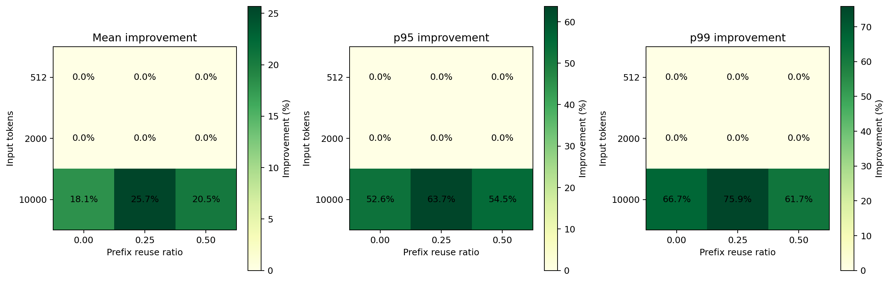
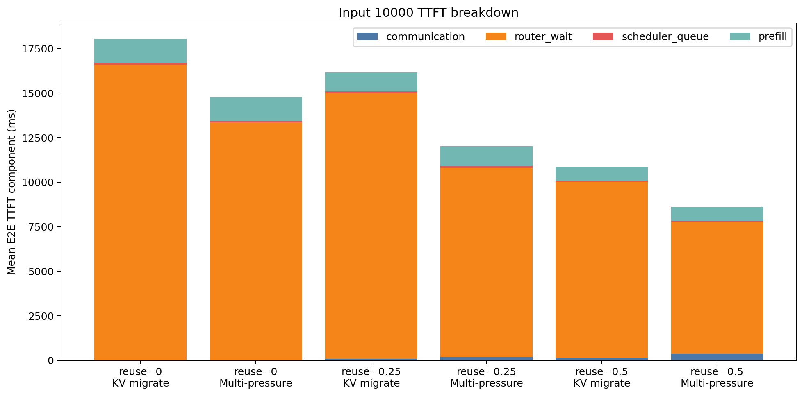

# Multi-pressure versus nearest KV migration sweep

## 結論

Multi-pressureは512/2000-token条件ではKV migrateと完全に一致し、10000-tokenの過負荷条件でのみ差が出た。
10000-token条件ではMeanを18.1–25.7%、p99を61.7–75.9%改善した。したがって、常時高速化ではなく、重負荷時のtail抑制が主要な利点である。

| Condition | Mean KV | Mean Multi | Mean improvement | p50 improvement | p95 improvement | p99 improvement | Redirects KV → Multi |
|---|---:|---:|---:|---:|---:|---:|---:|
| input512_reuse00 | 65.9 | 65.9 | 0.0% | 0.0% | 0.0% | 0.0% | 0 → 0 |
| input512_reuse025 | 53.5 | 53.5 | 0.0% | 0.0% | 0.0% | 0.0% | 0 → 0 |
| input512_reuse05 | 40.7 | 40.7 | 0.0% | 0.0% | 0.0% | 0.0% | 0 → 0 |
| input2000_reuse00 | 233.9 | 233.9 | 0.0% | 0.0% | 0.0% | 0.0% | 0 → 0 |
| input2000_reuse025 | 180.2 | 180.2 | 0.0% | 0.0% | 0.0% | 0.0% | 0 → 0 |
| input2000_reuse05 | 124.0 | 124.0 | 0.0% | 0.0% | 0.0% | 0.0% | 0 → 0 |
| input10000_reuse00 | 18036.4 | 14773.9 | 18.1% | -20.7% | 52.6% | 66.7% | 93 → 231 |
| input10000_reuse025 | 16162.0 | 12012.2 | 25.7% | -39.4% | 63.7% | 75.9% | 99 → 219 |
| input10000_reuse05 | 10835.0 | 8614.9 | 20.5% | -53.3% | 54.5% | 61.7% | 91 → 211 |

## Heavy-load interpretation

10000-token 3条件のMean改善率は平均21.4%、p99改善率は平均68.1%だった。Multi-pressureはredirect先を全GPUへ分散し、Routerでの容量待ちを短縮した。一方、p50は全3条件で悪化し、個別requestでも悪化件数が改善件数を上回る。少数の極端なtail改善がMeanを押し下げている。

## Scope

この結果が支持するのは、固定APN・90s・このarrival traceにおける過負荷耐性である。低負荷での優位性、異なるarrival seed、距離依存networkでの一般的優位性はまだ示していない。
