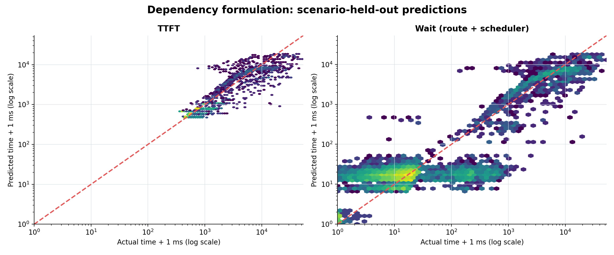
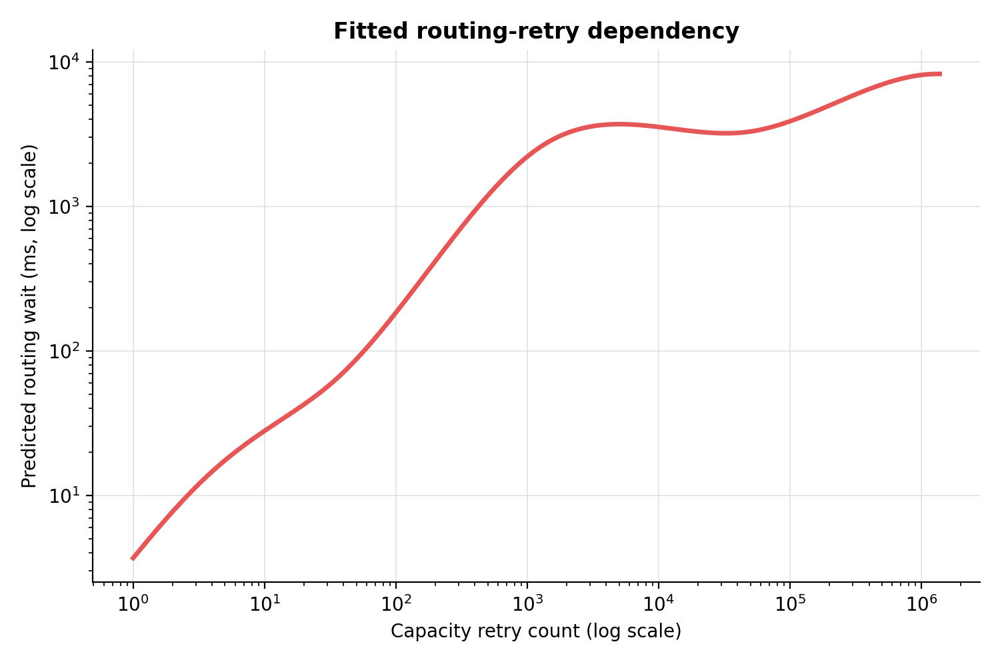
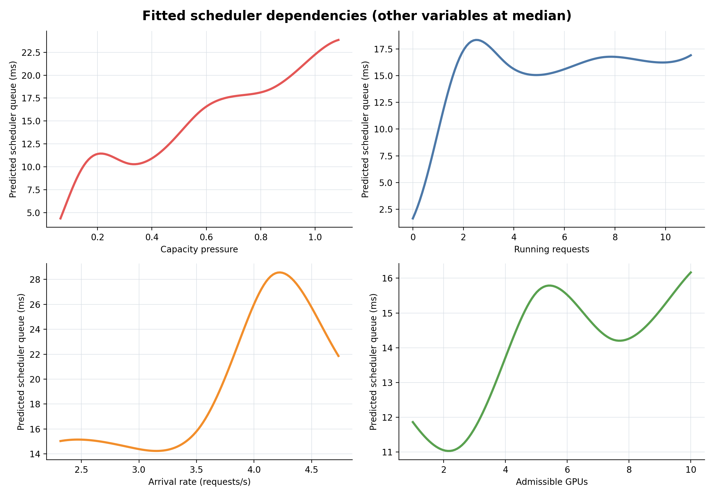
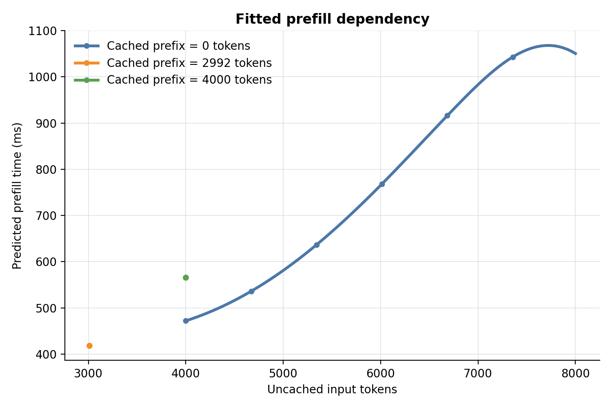
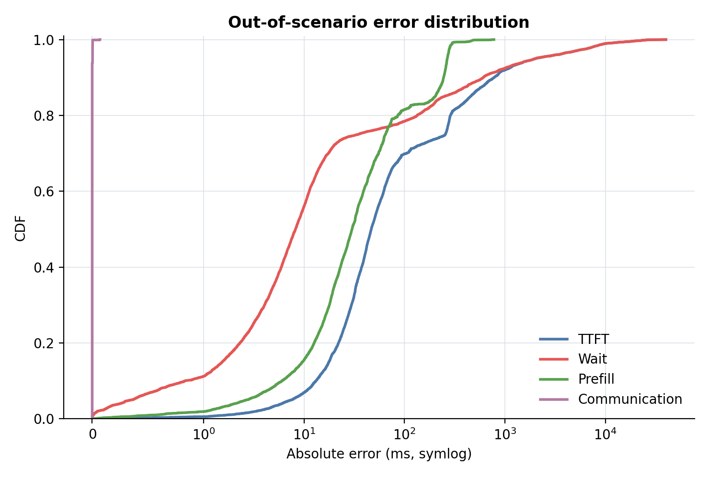
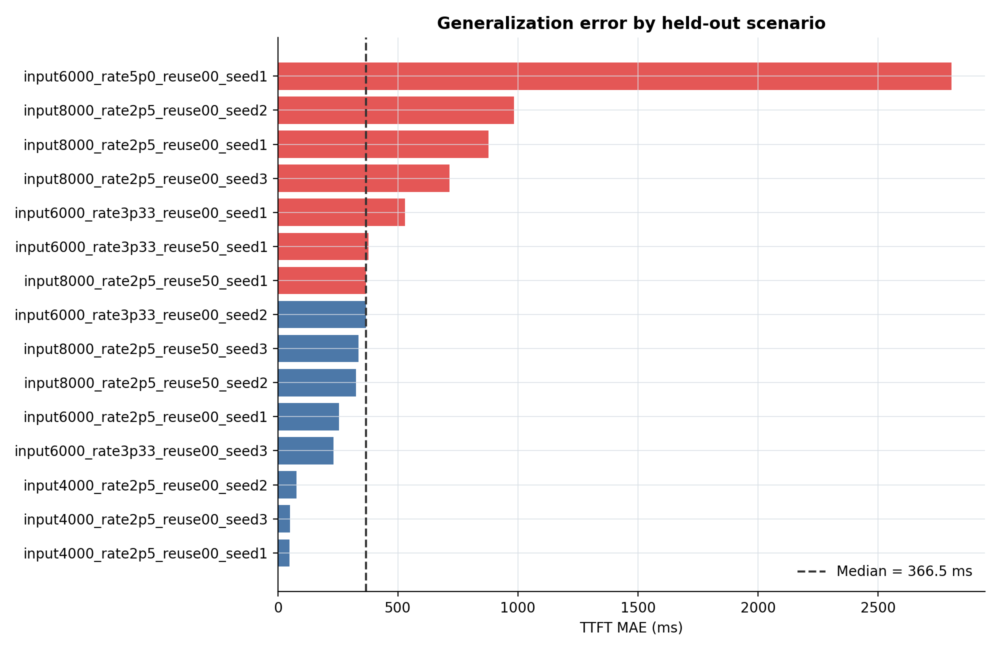

# TTFT依存関係モデルのfitting結果

## 結論

13,500 requests、15 scenariosを用い、scenario単位のleave-one-outで評価した。定式化した依存関係はprefillと通信をよく説明し、routing retryを含むwaitモデルも全体傾向を説明した。

| Target | MAE | $R^2$ | 誤差p50 | 誤差p90 | 誤差p95 | 誤差p99 |
|---|---:|---:|---:|---:|---:|---:|
| Route + scheduler wait | 495.6 ms | 0.601 | 8.2 ms | 608.1 ms | 2,012.4 ms | 10,444.3 ms |
| Prefill | 68.4 ms | 0.763 | 30.0 ms | 245.0 ms | 266.4 ms | 297.8 ms |
| Communication | 0.0003 ms | 1.000 | 0.0 ms | 0.0 ms | 0.0032 ms | 0.0037 ms |
| **TTFT** | **556.4 ms** | **0.607** | **46.6 ms** | **779.7 ms** | **2,035.3 ms** | **10,428.3 ms** |

TTFT全体では$R^2=0.607$であり、依存関係モデルは分散の約61%を説明する。ただしp99誤差は10.4秒残っており、極端なrouting tailを精密に予測するモデルではない。

## モデル

- Route: retry count、capacity pressure、admissible GPU数の加法spline
- Scheduler queue: arrival rate、waiting/running、capacity pressure、admissible GPU数の加法spline
- Prefill: uncached tokensとcached prefix tokensの加法spline
- Communication: redirect、KV move、migrated tokensの非負線形回帰
- 非負時間は`log1p`空間でfitし、`expm1`でmsへ戻した

Routeの`retry count`とcommunicationのrouting結果はrequest送信後に確定する。このfitは定式化した因果構造の説明を目的としており、送信時点だけで行う予測評価ではない。

## Actual vs. predicted



通常領域は対角線付近に分布する。一方、waitが数秒から数十秒になるtailでは過小・過大予測が残る。

## Routing retryへの依存



Retry countが増えるほどrouting waitが増える。増加率は一定ではなく、capacity状態やscenarioによって変化するため、単純な`retry count × 固定時間`だけでは表現できない。

## Scheduler状態への依存



他変数を中央値へ固定したpartial dependencyである。特にcapacity pressureが1付近を超えた領域でqueue予測が急増し、admissible GPU数が増えるほどqueueが短くなる傾向が確認できる。

## Prefillへの依存



Prefill時間はuncached input tokensとともに増加する。Cached prefixは再計算tokenを減らす一方、残りのtokenが既存KVへattentionするため、同じuncached tokensでもcached context量に依存する。

## 誤差分布



Prefillとcommunicationの誤差は比較的小さい。TTFT誤差の主要因はroute + scheduler waitである。

## Scenario別の汎化誤差



Scenario間でMAEに大きな差がある。したがって、係数は単一workloadだけで決めず、input length、arrival rate、reuseを跨いで推定する必要がある。

## 再現

```bash
MPLCONFIGDIR=/tmp/llmservingsim-matplotlib experiments/2026-07-16_ttft_component_regression/.venv/bin/python experiments/2026-07-28_formulation_v2/fit_dependency_formulation.py
```

数値結果は`analysis/dependency_fit/`、学習済みモデルは`models/dependency_fit/`、図は`figures/dependency_fit/`に保存される。
