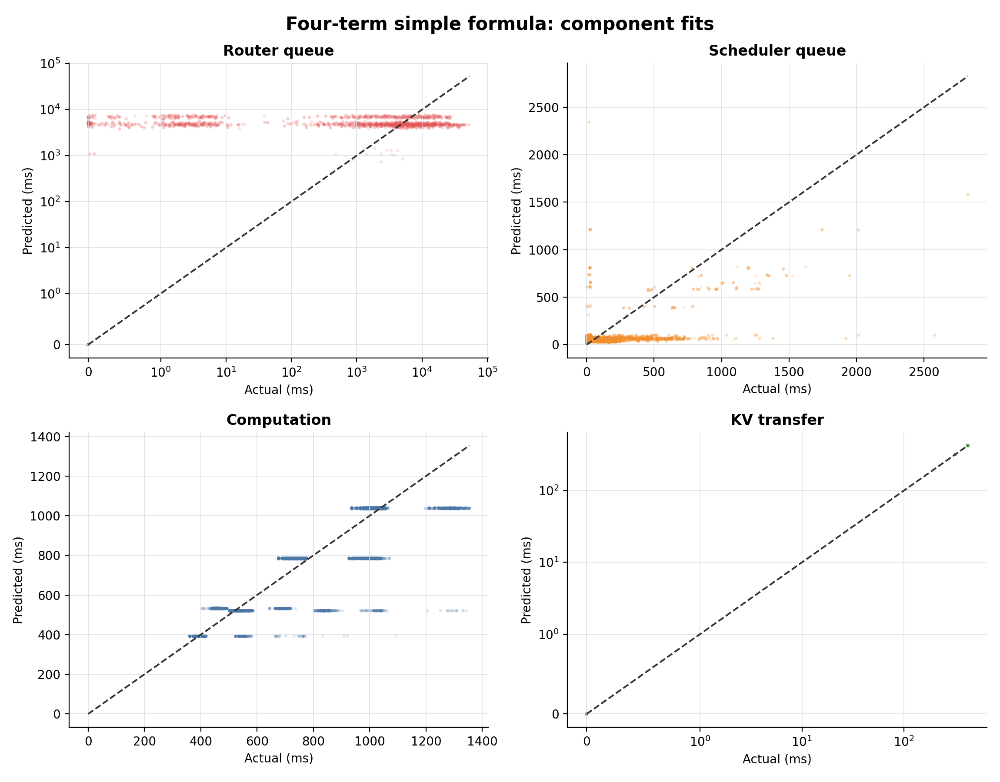
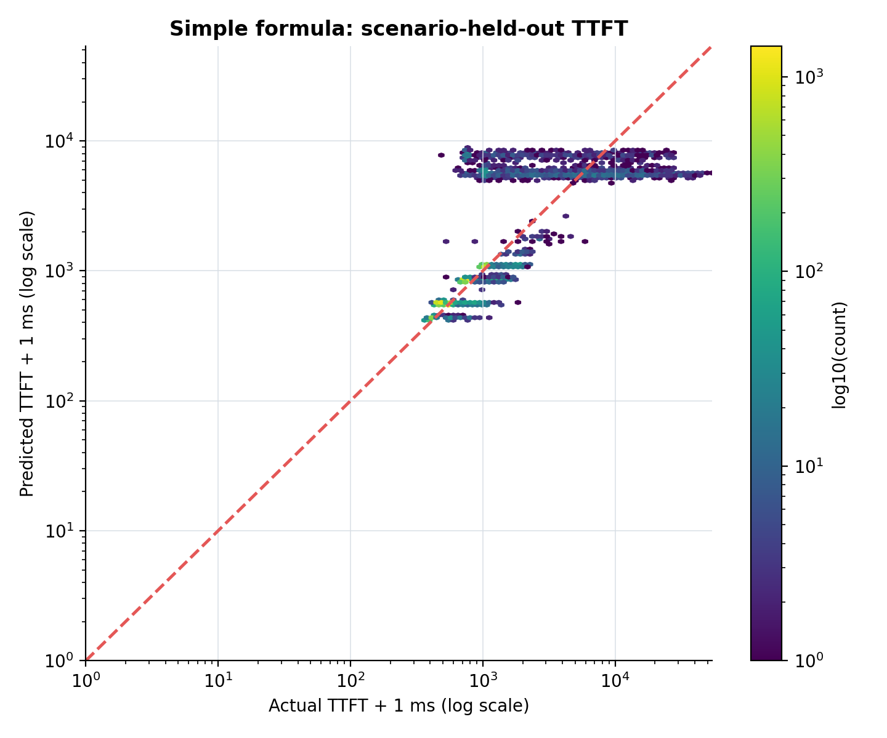
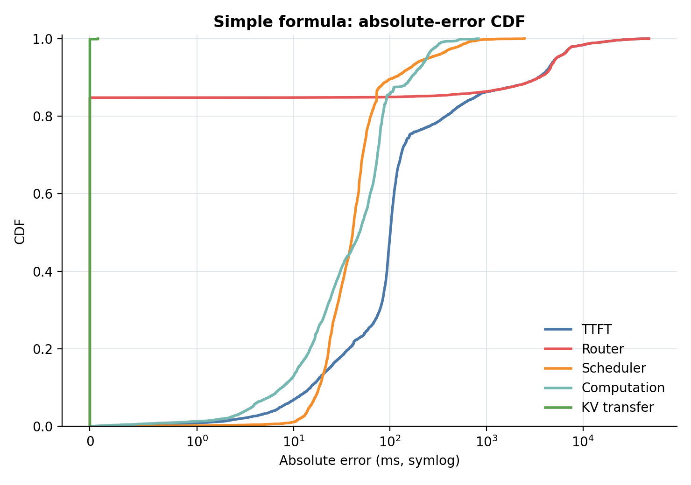
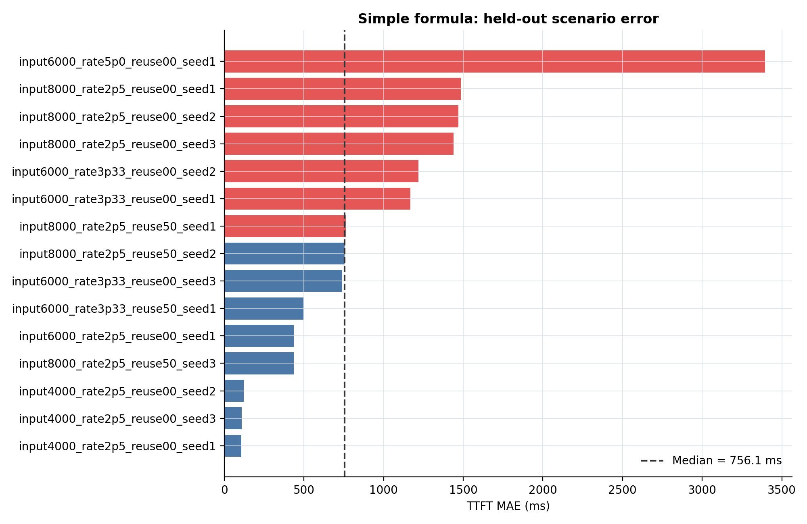

# 単純なTTFT定式化の当てはまり

## 1. 結論

今回の単純な4成分式は、**依存関係を説明する概念モデルとしては妥当だが、TTFTを高精度に予測するモデルとしては十分ではない**。

15シナリオ、13,500リクエストに対してleave-one-scenario-out検証を行った結果、TTFT全体は$R^2=0.296$、MAEは$943.2\,\mathrm{ms}$だった。計算時間は$R^2=0.805$とよく説明できた一方、routing待ちの長い裾を単一のKV不足量では説明しきれず、これがTTFT全体の誤差を支配した。

したがって、修論で示す定式化としては使用できる。ただし「係数をfitすれば正確なTTFT予測器になる」というより、**TTFTを決める主要な依存関係を整理した式**として位置付けるのが適切である。

## 2. 評価した式

出発点は次の分解である。

$$
\boxed{
\mathrm{TTFT}_i
=t_{\mathrm{route},i}
+t_{\mathrm{sched},i}
+t_{\mathrm{com},i}
+t_{\mathrm{KVtransfer},i}
}
$$

各成分には、[`ttft_formulation.md`](ttft_formulation.md)の単純な依存関係を用いた。

$$
\boxed{
t_{\mathrm{route},i}
=t_{0}^{\mathrm{route}}
+\frac{D_{i}^{\mathrm{KV}}}{B_{\mathrm{KVfree}}}
}
$$

$$
\boxed{
t_{\mathrm{sched},i}
=t_{0}^{\mathrm{sched}}
+\frac{W_{i}^{\mathrm{ahead}}}{B_{\mathrm{schedfree}}}
}
$$

$$
\boxed{
t_{\mathrm{com},i}
=t_{0}^{\mathrm{com}}
+\frac{L_i-C_i}{B_{\mathrm{com}}}
}
$$

$$
\boxed{
t_{\mathrm{KVtransfer},i}
=t_{0}^{\mathrm{KVtransfer}}
+\frac{M_{i}^{\mathrm{transfer}}}{B_{\mathrm{net}}}
}
$$

ここでは係数の精密さではなく、各時間がどの量に依存するかを評価対象にした。各項は非負係数を持つ線形モデルとしてfitしている。

## 3. データへの対応付け

使用データは`analysis/post_routing/canonical_requests.csv`である。routing状態を記録できた13,500リクエストを使用した。

| 式の量 | fittingで用いた量 | 備考 |
|---|---|---|
| $L_i-C_i$ | input tokens - nominal reuse tokens | 未計算input token数 |
| $D_i^{\mathrm{KV}}$ | $[M_i^{\mathrm{projected}}+M_i^{\mathrm{req}}-M^{\mathrm{capacity}}]_+$ | capacity pressureからcapacityを復元 |
| $W_i^{\mathrm{ahead}}$ | initial waiting requests $\times (L_i-C_i)$、initial running requests | 厳密な残存prefill token数がないため代理変数 |
| $B_{\mathrm{schedfree}}$の負荷依存 | request rate $\times$ scenario平均未計算token数 | instance当たり流入仕事量の代理変数 |
| $M_i^{\mathrm{transfer}}$ | realized migrated tokens | 実際にKV移動が発生した場合のみ |

特にschedulerについては、各先行requestの残存仕事量がログに含まれない。そのため、今回の結果はscheduler式そのものの限界と、代理変数の粗さの両方を含む。

## 4. 検証方法

- シナリオ数: 15
- リクエスト数: 13,500
- 検証法: leave-one-scenario-out
- 学習: 14シナリオで係数をfit
- 評価: 残した1シナリオを予測
- これを15回繰り返し、全out-of-fold予測を集計

同一シナリオ内のリクエストをランダム分割していないため、未知シナリオへの当てはまりを比較的厳しく評価している。

## 5. 結果

| 成分 | MAE (ms) | $R^2$ | 絶対誤差p50 (ms) | p90 (ms) | p99 (ms) |
|---|---:|---:|---:|---:|---:|
| Routing queue | 850.4 | 0.275 | 0.0 | 3,532.6 | 14,517.8 |
| Scheduler queue | 69.3 | 0.239 | 41.0 | 110.4 | 631.8 |
| Computation | 66.9 | 0.805 | 48.2 | 165.8 | 337.4 |
| KV transfer | 0.000084 | 1.000 | 0.0 | 0.0 | 0.0 |
| **TTFT全体** | **943.2** | **0.296** | **100.7** | **3,421.4** | **14,480.6** |



### 5.1 計算時間

計算時間は最も当てはまりがよい。fitされた関係は概ね次の形だった。

$$
t_{\mathrm{com}}
\approx 8.60
+0.129(L-C)
\quad [\mathrm{ms}]
$$

これは、未計算input token数に対して計算時間がほぼ線形に増えるという、今回の概念式を支持している。

### 5.2 Routing待ち

KV capacity deficitが正かどうかは、routing待ちの発生とデータ上完全に一致した。このため、**routing待ちが発生する条件**としてKV不足を使うのは妥当である。

一方、待ち時間の長さは$R^2=0.275$に留まった。容量不足が解消される速度は、その瞬間の不足量だけでなく、先行requestの終了時刻、各requestが解放するKV量、同時に流入するrequestなどに左右される。単一の一定な$B_{\mathrm{KVfree}}$では、この時間変動と長い裾を表現できない。

### 5.3 Scheduler待ち

Scheduler待ちは$R^2=0.239$だった。先行仕事量と流入負荷への依存は見えるが、初期waiting/running request数から作った代理変数では、各requestの残存token数やbatch形成を直接表現できない。このため、式の妥当性を否定する結果というより、$W_i^{\mathrm{ahead}}$を直接記録する必要性を示す結果である。

### 5.4 KV transfer

KV transferはほぼ完全に線形だった。ただし、説明変数にrouting後の`kv_moved`と実移動token数を使っている。したがって、これはデータ量と転送時間の物理的関係を確認する結果であり、request到着時点で移動の有無まで予測できたことを意味しない。また、KV移動が発生したrequestは96件と少ない。

## 6. TTFT全体の見え方



通常領域では誤差中央値が約$101\,\mathrm{ms}$に収まる一方、混雑時のrouting待ちを過小・過大評価するため、p90以降の誤差が急増する。



シナリオ別にも、軽負荷条件ではMAEがおよそ$107$--$122\,\mathrm{ms}$だが、高負荷条件では最大$3.40\,\mathrm{s}$まで悪化した。



## 7. 定式化としての判断

今回の結果から、次のように判断できる。

1. $\mathrm{TTFT}=t_{\mathrm{route}}+t_{\mathrm{sched}}+t_{\mathrm{com}}+t_{\mathrm{KVtransfer}}$という分解は維持してよい。
2. $t_{\mathrm{com}}\propto L-C$と$t_{\mathrm{KVtransfer}}\propto M^{\mathrm{transfer}}$はデータによく合う。
3. $t_{\mathrm{route}}\propto D^{\mathrm{KV}}/B_{\mathrm{KVfree}}$は、待ちの発生条件を表す式としてはよいが、$B_{\mathrm{KVfree}}$を一定係数にすると待ち時間の裾を表現できない。
4. $t_{\mathrm{sched}}\propto W^{\mathrm{ahead}}/B_{\mathrm{schedfree}}$を検証するには、scheduler queue内の残存prefill token数を直接ログに残す必要がある。

よって、現時点では式を複雑化するよりも、**依存関係を示す概念的な定式化として採用し、routingとschedulerの分母は時変の実効解放速度である**と説明するのが最も自然である。

## 8. 出力物

- 図: [`figures/simple_formula_fit/`](figures/simple_formula_fit/)
- out-of-fold予測: [`analysis/simple_formula_fit/oof_predictions.csv`](analysis/simple_formula_fit/oof_predictions.csv)
- 集計指標: [`analysis/simple_formula_fit/metrics.csv`](analysis/simple_formula_fit/metrics.csv)
- シナリオ別指標: [`analysis/simple_formula_fit/scenario_metrics.csv`](analysis/simple_formula_fit/scenario_metrics.csv)
- fit係数: [`analysis/simple_formula_fit/fitted_coefficients.csv`](analysis/simple_formula_fit/fitted_coefficients.csv)
- 再現スクリプト: [`fit_simple_formula.py`](fit_simple_formula.py)

再実行コマンドは次のとおりである。

```bash
MPLCONFIGDIR=/tmp/llmservingsim-matplotlib experiments/2026-07-16_ttft_component_regression/.venv/bin/python experiments/2026-07-28_formulation_v2/fit_simple_formula.py
```
