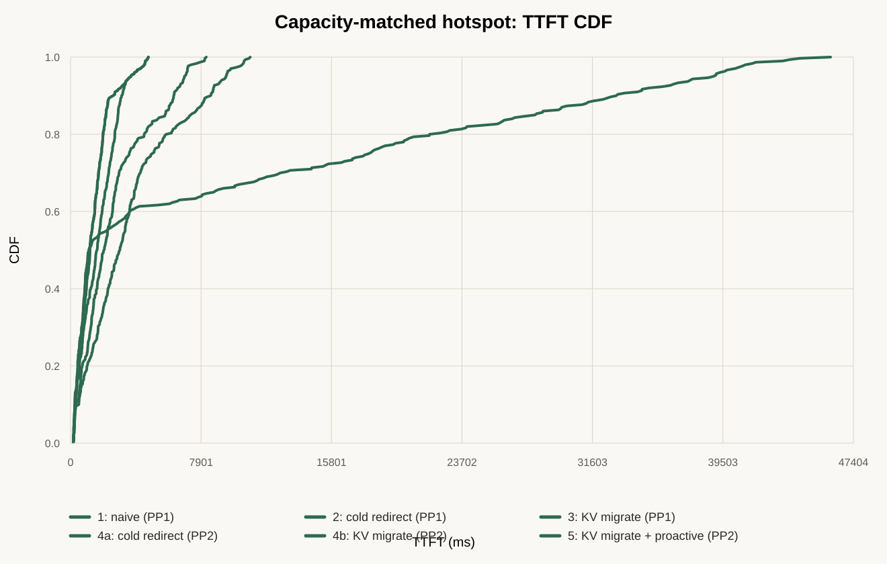
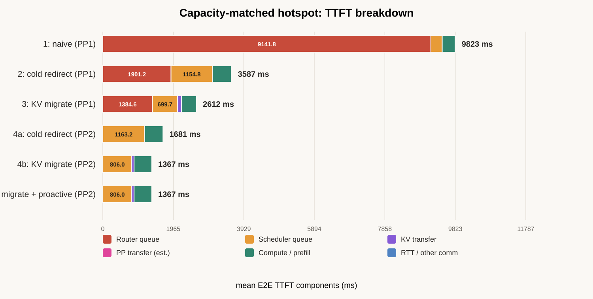

# Capacity-matched hotspotにおける手法比較

## 1. 概要

局所的なKVメモリhotspotが存在する状況で、naive、cold redirect、KV migrate、
PP2、proactive KV prewarmを比較した。PP1とPP2でクラスタ全体のscheduler上限が
一致するよう補正し、PP2側のlogical instance数が半分になることによる不公平を
取り除いた。

主な結果は次のとおりである。

- **PP2 + KV migrateが最良**で、平均TTFTは1367.3 msだった
- PP2だけでもcold redirectの平均TTFTを1681.5 msまで削減した
- PP2にKV migrateを追加すると、平均TTFTがさらに18.7%改善した
- Proactive KV prewarmは36件発火したがhitは0件で、結果は非proactive版と完全一致した
- PP2 + KV migrateは平均とp50を改善したが、PP2 coldに対してp95/p99は改善しなかった
- PP2 + KVが最良である一方、KV migrateの限界改善幅はPP1の方が大きく、
  厳密なPP×KV交互作用は超加算的ではなかった

## 2. ワークロード設定

### 2.1 基本情報

使用したコンテンツと到着時刻は全方式で共通である。

| 項目 | 設定 |
|---|---:|
| リクエスト数 | 300 |
| ユーザー数 | 288 |
| セッション数 | 288 |
| 再訪リクエスト数 | 12 |
| 再訪率 | 4% |
| 到着時間幅 | 約2.76秒 |
| 設定上の到着率 | 108 requests/s |
| 実データ上の到着率 | 約108.8 requests/s |
| 負荷ラベル | 本郷busy hourの12倍 |
| モデル | Meta Llama 3.1 8B |
| 物理GPU | RTX 4090 × 12台 |

### 2.2 リクエスト長

| トークン数 | 平均 | p50 | p95 | 最小 | 最大 |
|---|---:|---:|---:|---:|---:|
| Input | 3860 | 3499 | 5844 | 3004 | 7825 |
| Output | 279.6 | 205.5 | 745.2 | 1 | 1663 |
| 再利用可能prefix | 1922.1 | 1744 | 2915.2 | 1488 | 3904 |

再利用可能prefixはinputのおよそ50%であり、KV block境界への丸めを含む平均比率は
49.8%である。

### 2.3 局所hotspot

PP2ではlogical instance 0へ50%のリクエストを配置し、残りを他の5 instanceへ
均等に配置した。

| PP2 home | リクエスト数 | 割合 |
|---|---:|---:|
| Instance 0 | 150 | 50% |
| Instance 1〜5 | 各30 | 各10% |

PP1では同じ物理GPU範囲に対応するよう、PP2 groupを構成する2 GPUへ均等に展開した。

| PP1 home | リクエスト数 | 割合 |
|---|---:|---:|
| GPU 0、1 | 各75 | 各25% |
| GPU 2〜11 | 各15 | 各5% |

hotspotリクエストは時間軸の前半に固めず、全時間帯に決定論的に分散した。これにより、
hotspot側でKV予約容量が不足する一方、他instanceにはredirect先となる余剰KV容量が
残る条件を作った。

今回発生したredirect理由はすべて`npu_memory`であり、sequence slot上限ではない。

## 3. PP1/PP2のcapacity matching

初回比較ではPP1/PP2ともにlogical instance当たり`max_num_seqs=32`、
`max_num_batched_tokens=2048`としていた。この場合、logical instance数が半分になる
PP2ではクラスタ全体のscheduler上限も半分になり、不公平だった。

補正後は次のようにクラスタ全体の上限を一致させた。

| 設定 | PP1 | PP2 |
|---|---:|---:|
| Logical instance数 | 12 | 6 |
| 物理GPU/instance | 1 | 2 |
| `max_num_seqs`/instance | 32 | 64 |
| Cluster-wide sequence上限 | 384 | 384 |
| `max_num_batched_tokens`/instance | 2048 | 4096 |
| Cluster-wide token budget | 24576 | 24576 |

PP2は12台のGPUを2台ずつ組み合わせ、6個のpipelineとして使用する。

```text
Logical instance 0: physical GPU 0, 1
Logical instance 1: physical GPU 2, 3
Logical instance 2: physical GPU 4, 5
Logical instance 3: physical GPU 6, 7
Logical instance 4: physical GPU 8, 9
Logical instance 5: physical GPU 10, 11
```

## 4. 通信条件

| 項目 | 設定 |
|---|---:|
| PP段間帯域 | 16 GB/s |
| PP段間latency | 20 µs |
| GPU backbone帯域 | 10.7 Gbps |
| APN固定伝搬遅延 | 300.5 µs |
| KV staging帯域 | 33.8 GB/s |
| KV staging latency | 102.9 ns |
| Network contention | 無効 |

## 5. 比較した方式

| # | 方式 | PP | Redirect | KV migrate | Proactive |
|---|---|---:|---|---|---|
| 1 | Naive | 1 | なし | なし | なし |
| 2 | Cold redirect | 1 | あり | なし | なし |
| 3 | KV migrate | 1 | あり | あり | なし |
| 4a | Cold redirect | 2 | あり | なし | なし |
| 4b | KV migrate | 2 | あり | あり | なし |
| 5 | KV migrate + proactive | 2 | あり | あり | あり |

Cold redirectとKV migrateは、どちらも全admissible候補からcapacity pressure最小の
instanceを選ぶ。差はredirect時に再利用可能KVを移送するか、redirect先でprefixを
再計算するかだけである。

Proactive版は次の設定を使用した。

```text
--enable-proactive-kv-prewarm
--proactive-kv-prewarm-pressure-threshold 0.6
--proactive-kv-prewarm-top-k 3
```

## 6. TTFT結果

| 方式 | 平均 | p50 | p95 | p99 | 最大 | Redirect |
|---|---:|---:|---:|---:|---:|---:|
| 1. Naive PP1 | 9822.6 ms | 1111.9 ms | 38919.5 ms | 43137.2 ms | 46023.2 ms | 0 |
| 2. Cold redirect PP1 | 3587.4 ms | 2987.6 ms | 9408.9 ms | 10509.3 ms | 10881.5 ms | 158 |
| 3. KV migrate PP1 | 2611.6 ms | 2036.4 ms | 6895.5 ms | 8100.7 ms | 8219.3 ms | 160 |
| 4a. Cold redirect PP2 | 1681.5 ms | 1609.2 ms | **3659.4 ms** | **4534.9 ms** | **4710.9 ms** | 92 |
| 4b. KV migrate PP2 | **1367.3 ms** | **1170.2 ms** | **3659.4 ms** | **4534.9 ms** | **4710.9 ms** | 92 |
| 5. PP2 + KV + proactive | **1367.3 ms** | **1170.2 ms** | **3659.4 ms** | **4534.9 ms** | **4710.9 ms** | 92 |

Naiveはp50が1111.9 msと比較的短い一方、hotspotで待たされたリクエストのtailが
40秒を超え、平均TTFTも9.8秒まで悪化した。中央値だけではnaiveの深刻な不公平を
見落とす。



CDFでは、PP2方式が分布の大部分で左側に位置する。PP2 coldとPP2 KVの差は主に
中央値付近にあり、上位5%付近では曲線が合流する。これはKV migrateが典型的な
リクエストを改善する一方、最悪tailを決める別の待ち時間には効いていないことを示す。

## 7. TTFT breakdown



平均TTFTの内訳は次のとおりである。

| 方式 | Router queue | Scheduler queue | KV transfer | PP transfer推定 | Compute/prefill | RTT等 |
|---|---:|---:|---:|---:|---:|---:|
| Naive PP1 | 9141.8 | 316.1 | 0.0 | 0.0 | 363.3 | 1.3 |
| Cold redirect PP1 | 1901.2 | 1154.8 | 0.0 | 0.0 | 529.8 | 1.6 |
| KV migrate PP1 | 1384.6 | 699.7 | 107.6 | 0.0 | 418.2 | 1.6 |
| Cold redirect PP2 | 0.5 | 1163.2 | 0.0 | 2.0 | 514.3 | 1.5 |
| KV migrate PP2 | 1.6 | 806.0 | 62.3 | 2.0 | 493.8 | 1.5 |
| PP2 + KV + proactive | 1.6 | 806.0 | 62.3 | 2.0 | 493.8 | 1.5 |

単位はmsである。`Router queue`はTTFTから既知のservice、communication、scheduler
queueを差し引いた残差であり、naiveでは主にhome capacityが空くまでの待ち時間を
表す。`PP transfer`はinput token数、hidden size、帯域、固定latencyから求めた事後
推定値で、ASTRA-Simから個別に計測した値ではない。

### 7.1 Redirectの効果

Naiveからcold redirect PP1へ変更すると、平均TTFTは9822.6 msから3587.4 msへ
63.5%改善した。最大の変化はRouter queueが9141.8 msから1901.2 msへ減ったことで
ある。局所hotspotをhomeで待たせず、他GPUへ逃がすことが支配的に効いている。

### 7.2 PP1におけるKV migrate

PP1 coldからPP1 KVへ変更すると、平均TTFTは975.8 ms、27.2%改善した。KV移送時間を
全体平均107.6 ms支払う一方で、Router queue、Scheduler queue、prefillのすべてが
減った。

### 7.3 PP2の効果

PP1 KVからPP2 coldへ変更しても、平均TTFTは2611.6 msから1681.5 msへ35.6%改善した。
したがって、このcapacity-matched条件ではKV migrateを除いてもPP2自体に大きな
効果がある。

PP2ではRouter queueがほぼゼロになる一方、Scheduler queueが主要成分となる。
Cluster-wide sequence上限とtoken budgetをPP1に揃えたことで、初回の不公平なPP2
比較で観測された3039 msのScheduler queueは1163 msまで減少した。

### 7.4 PP2におけるKV migrate

PP2 coldからPP2 KVへ変更すると、平均TTFTは1681.5 msから1367.3 msへ314.1 ms、
18.7%改善した。p50は27.3%改善したが、p95/p99/maxは変化しなかった。

Cold/KVの両方式でredirectされた92件は完全に同一である。その92件のpaired比較では、
KV migrateにより平均343.7 ms改善した。Redirect 1件当たり平均203.3 msのKV移送時間を
支払っても、prefix再計算と後続queueを減らす利益の方が大きかった。

### 7.5 Proactive KV prewarm

Proactive版では36件の先回り配置が発生したが、実リクエストでのhitは0件だった。
そのため、非proactive PP2 KVと全指標が完全に一致した。

このワークロードは300件中288ユーザーで、再訪は12件しかない。頻出ユーザー予測を
評価するには再訪信号が不足しており、Method Cの否定的結論には使用できない。

## 8. PPとKV migrateは「相乗効果」か

PP2 + KV migrateが全方式中で最良であることは明確である。ただし、厳密な意味で
PPとKVが超加算的な相乗効果を持つわけではない。

| KV migrateの限界改善 | 平均TTFT改善 |
|---|---:|
| PP1: cold − KV | 975.8 ms |
| PP2: cold − KV | 314.1 ms |
| PP×KV交互作用 | −661.6 ms |

交互作用は負であり、KV migrateの追加効果はPP1の方が大きい。PP2が既にRouter queueと
混雑を大きく減らしているため、KV migrateが追加で救える余地が小さくなったと解釈
できる。

したがって、正確な表現は次のとおりである。

> PP2とKV migrateは併用可能であり、その組み合わせが最良だった。KV migrateは
> PP2上でも平均TTFTを18.7%追加改善した。ただし、PPとKV migrateの効果は
> 超加算的ではなく、KV migrateの限界利益はPP2上で小さくなった。

## 9. この結果から言えること

1. **局所hotspotではredirectが不可欠である。** Naiveは一部ユーザーを40秒以上
   待たせ、平均値とtailの双方が破綻した。
2. **KV migrateはPP1/PP2の両方で有効である。** 移送コストよりprefix再計算と
   queueを回避する利益が大きかった。
3. **Capacityを公平に揃えるとPP2が最良になる。** PP2側のper-instance上限を
   PP1と同じにするとcluster-wide capacityが半減し、誤ってPP2を不利に評価する。
4. **PP2 + KVは中央値を強く改善するが、最悪tailは改善しない。** Tail対策には
   別のscheduler/routing条件が必要である。
5. **現行ワークロードではproactive方式を評価できない。** 再訪率の高い2000件版を
   用いた独立評価が必要である。

## 10. 制約

- Hotspot比率50%は機構検証用の人工条件であり、実際の本郷での発生頻度を示さない
- 1 seed・300件のみであり、信頼区間を求めていない
- Network contention、queueing、jitter、packet lossは無効で、KV migrateに有利な
  可能性がある
- PP2の`max_num_seqs`とtoken budgetを2倍にする補正はcluster-wide上限を揃えるが、
  scheduler内部のbatch形成までPP1と等価にするものではない
- Hotspot生成時にlogical home IDを変更したが、ユーザー座標と一部の通信距離は
  再計算していない
- PP transfer時間は事後推定であり、batch内輻輳を反映しない
- Proactive background transferはfreeとしてモデル化されている

## 11. 生成物

- TTFT breakdown図: `figures/corrected_hotspot_ttft_breakdown.svg`
- TTFT CDF図: `figures/corrected_hotspot_ttft_cdf.svg`
- Breakdown CSV: `analysis/corrected_hotspot_ttft_breakdown.csv`
- CDF CSV: `analysis/corrected_hotspot_ttft_cdf.csv`
- 図表生成スクリプト: `scripts/plot_corrected_comparison.py`

