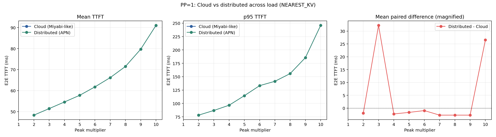
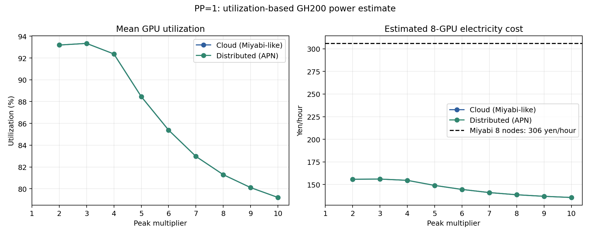

# PP=1: Cloud vs. distributed

## 結論

PP=1では、Cloud（Miyabi-like clustered配置）とDistributed（APN配置）のTTFTは実質的に同じである。比較可能なPeak 2x--10xにおいて、Mean TTFTの差は-0.0027--+0.0322 ms、比率では-0.004%--+0.063%に収まった。

Distributedでは各requestをユーザに近いGPUへ`NEAREST_KV`で送るため、平均communication latencyは1.2843 msであり、Cloudの1.2860 msより約0.00175 ms短い。この差は非常に小さいが、PPを行わない限り、低速なsite間interconnectが推論critical pathへ入らず、地理分散によるTTFTペナルティも観測されないことを示している。

## 比較条件

- RAN workloadおよびRANによるVRAM制約なし
- GH200合計8台
- Llama-3.1-8B-Instruct、BF16 weight/KV
- `max_num_seqs=1024`、`max_num_batched_tokens=8192`
- Prefix cachingおよびchunked prefill有効
- Routing policyは`NEAREST_KV`のみ
- 賢いload balancing、redirect、KV migrationは使用しない
- Cloud interconnect: Miyabi実測相当、183.68 Gbps、16.8 us
- Distributed backbone: APN、10.7 Gbps、300.5 us
- 各条件600 requests、seed 1

PP=1ではmodel replicaが1 GPU内で完結するため、上記interconnect差はmodel executionには使われない。比較される主な差はGPU/user placementに伴うaccess communicationである。

## TTFT結果

| Peak | Cloud mean | Distributed mean | 差（Dist.-Cloud） | Cloud p95 | Distributed p95 |
|---:|---:|---:|---:|---:|---:|
| 2x | 48.332 ms | 48.331 ms | -0.002 ms | 78.118 ms | 78.117 ms |
| 3x | 51.420 ms | 51.452 ms | +0.032 ms | 86.812 ms | 86.853 ms |
| 4x | 54.577 ms | 54.575 ms | -0.002 ms | 96.646 ms | 96.643 ms |
| 5x | 57.756 ms | 57.754 ms | -0.002 ms | 114.496 ms | 114.493 ms |
| 6x | 61.764 ms | 61.763 ms | -0.001 ms | 133.204 ms | 133.218 ms |
| 7x | 66.168 ms | 66.165 ms | -0.003 ms | 141.337 ms | 141.334 ms |
| 8x | 71.482 ms | 71.480 ms | -0.003 ms | 155.766 ms | 155.762 ms |
| 9x | 79.693 ms | 79.691 ms | -0.003 ms | 185.621 ms | 185.618 ms |
| 10x | 90.992 ms | 91.019 ms | +0.027 ms | 245.873 ms | 245.870 ms |



負荷上昇に伴うTTFT増加は両配置でほぼ完全に重なる。このため図の右端に`Distributed - Cloud`のMean TTFT差をus単位で拡大表示した。Peak別CDFも、通常CDFに加えて同じrequest ID同士のTTFT差分CDFを併記している。線種もCloudを破線、Distributedを実線として、重なっていても両系列が存在することを確認できるようにした。Breakdownでもprefillとscheduler queueが一致し、配置差として残るcommunication成分は約1.3 msにすぎない。

## Utilizationから推定した電気料金



`gpus.csv`の`busy_time_ns / observation_time_ns`をGPU utilizationとし、GH200 GPU電力を次の線形近似で推定した。

```text
P_GPU(u) = 117 W + (900 W - 117 W) * u
electricity cost = sum(P_GPU) / 1000 * 23.0 yen/kWh
```

東京の単価23.0円/kWhは`2026-08-02-kagosima-tokyo`の設定を援用した。117 Wと900 WはNVIDIA Aerial資料に掲載されたGH200の低負荷表示値とGPU power limitを用いたproxyであり、今回の実機電力測定ではない。

Peak 2x--10xでは8 GPU平均utilizationが79.2--93.3%、推定電気料金が135.6--156.0円/hourとなった。Miyabi 8 nodeの306円/hourに対して44.3--51.0%である。同じ600 requestの観測時間で正規化した1,000 request当たりでは、推定電気料金1.05--2.70円に対しMiyabi料金2.36--5.31円となる。

本比較は、追加AI workloadをクラウドへ投入する場合に支払うMiyabiのサービス利用料金と、RAN処理のために既に保有しているAI-RAN GPUへ投入する場合の追加運用費を比較するものである。AI-RAN設備の取得費や保守費はRAN設備として既に負担される固定費とみなし、追加AI処理の配置判断に関係する限界費用としてGPU電気料金を評価する。この前提では、AI-RAN側に設備償却費を重ねて加える必要はなく、306円/hourとの比較は妥当である。

## Peak別グラフ

| Peak | TTFT breakdown | TTFT CDF |
|---:|---|---|
| 2x | [breakdown](figures/pp1/peak_2x_ttft_breakdown.png) | [CDF](figures/pp1/peak_2x_ttft_cdf.png) |
| 3x | [breakdown](figures/pp1/peak_3x_ttft_breakdown.png) | [CDF](figures/pp1/peak_3x_ttft_cdf.png) |
| 4x | [breakdown](figures/pp1/peak_4x_ttft_breakdown.png) | [CDF](figures/pp1/peak_4x_ttft_cdf.png) |
| 5x | [breakdown](figures/pp1/peak_5x_ttft_breakdown.png) | [CDF](figures/pp1/peak_5x_ttft_cdf.png) |
| 6x | [breakdown](figures/pp1/peak_6x_ttft_breakdown.png) | [CDF](figures/pp1/peak_6x_ttft_cdf.png) |
| 7x | [breakdown](figures/pp1/peak_7x_ttft_breakdown.png) | [CDF](figures/pp1/peak_7x_ttft_cdf.png) |
| 8x | [breakdown](figures/pp1/peak_8x_ttft_breakdown.png) | [CDF](figures/pp1/peak_8x_ttft_cdf.png) |
| 9x | [breakdown](figures/pp1/peak_9x_ttft_breakdown.png) | [CDF](figures/pp1/peak_9x_ttft_cdf.png) |
| 10x | [breakdown](figures/pp1/peak_10x_ttft_breakdown.png) | [CDF](figures/pp1/peak_10x_ttft_cdf.png) |

Peak 1xは両方式のcompleteな600-request CSVが存在しないため、現時点の比較から除外した。

## 解釈

PP=1の結果から、single-GPU-class modelを各siteのGPUで独立に動かす場合、GPUが地理分散していること自体はTTFTを悪化させないといえる。むしろユーザに近いreplicaを選べるため、access latencyを短縮できる余地がある。ただし今回観測された短縮は約1.75 usと小さく、ユーザ近接性の大きな効果を主張するには、東京・鹿児島とcloud data centerの実際のaccess-network latencyを明示した追加モデルが必要である。

## 再現用データ

- [TTFT summary](analysis/ttft_summary.csv)
- [Paired comparison](analysis/paired_comparison.csv)
- [Result coverage](analysis/coverage.csv)
