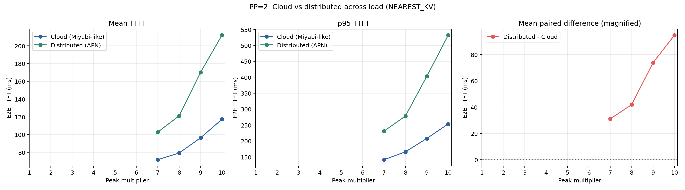
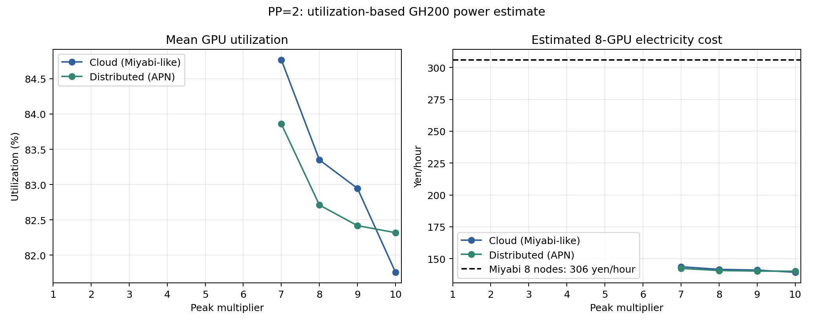

# PP=2: Cloud vs. distributed

> **参考結果（02の主張には使用しない）**  
> この構成は地理分散環境でPPを実装済みと仮定した探索実験であり、02の前提ではない。02-a/02-bの主線はPPなしのsingle-GPU model instanceだけで構成する。PPは04の提案手法でsite内機構として導入する。

## 結論

PP=2では、Distributed（APN）のTTFTがCloud（Miyabi-like）より明確に長い。両方式のcompleteな結果が揃うPeak 7x--10xで、DistributedのMean TTFTはCloud比1.44--1.82倍、p95は1.63--2.10倍となった。負荷が高くなるほど差が拡大している。

この比較ではPP stage間通信に各構成の`link_bw`と`link_latency`が使われる。Cloudは24.8 GB/s・1.45 us、Distributed APNは1.3375 GB/s・300.5 usである。そのため、PP=1ではcritical pathに入らなかったinterconnect差がPP=2のprefill serviceへ現れる。

## 比較条件

基本条件とrouting policyは[PP=1](pp1.md)と同じで、各model instanceを2 GH200へPP分割する。8 GPUから作られる独立instance数は8から4へ減る。Routingは`NEAREST_KV`のみであり、負荷を見た賢い再配置は行わない。

## TTFT結果

| Peak | Cloud mean | Distributed mean | Dist./Cloud | Cloud p95 | Distributed p95 | p95比 |
|---:|---:|---:|---:|---:|---:|---:|
| 7x | 70.453 ms | 101.519 ms | 1.44x | 140.261 ms | 228.979 ms | 1.63x |
| 8x | 77.988 ms | 119.872 ms | 1.54x | 163.491 ms | 277.084 ms | 1.69x |
| 9x | 95.107 ms | 168.909 ms | 1.78x | 206.852 ms | 401.964 ms | 1.94x |
| 10x | 115.983 ms | 210.687 ms | 1.82x | 252.278 ms | 530.264 ms | 2.10x |

Mean TTFTの差はPeak 7xの31.1 msからPeak 10xの94.7 msへ増加した。Breakdownでは、CloudとDistributedの差は主にprefill serviceとscheduler queueに現れる。CSVの`communication_latency_ns`はPP stage間collectiveを独立成分として記録しておらず、その影響はsimulated service time側へ含まれるため、ゼロ表示を「通信がない」と解釈してはならない。

## PP=1からの変化

同じPeak 7x--10xでPP=1と比較すると次のようになる。

| Peak | Cloud PP=1 | Cloud PP=2 | 増加率 | Distributed PP=1 | Distributed PP=2 | 増加率 |
|---:|---:|---:|---:|---:|---:|---:|
| 7x | 66.168 ms | 70.453 ms | +6.5% | 66.165 ms | 101.519 ms | +53.4% |
| 8x | 71.482 ms | 77.988 ms | +9.1% | 71.480 ms | 119.872 ms | +67.7% |
| 9x | 79.693 ms | 95.107 ms | +19.3% | 79.691 ms | 168.909 ms | +112.0% |
| 10x | 90.992 ms | 115.983 ms | +27.5% | 91.019 ms | 210.687 ms | +131.5% |

PPはmodel weight footprintを各GPUで減らせる一方、独立instance数を半減させ、stage間通信を追加する。RAN制約のない本実験ではKV capacity増加の必要性がないため、性能面ではPP=1より不利になる。

## Peak別グラフ

| Peak | TTFT breakdown | TTFT CDF |
|---:|---|---|
| 7x | [breakdown](figures/pp2/peak_7x_ttft_breakdown.png) | [CDF](figures/pp2/peak_7x_ttft_cdf.png) |
| 8x | [breakdown](figures/pp2/peak_8x_ttft_breakdown.png) | [CDF](figures/pp2/peak_8x_ttft_cdf.png) |
| 9x | [breakdown](figures/pp2/peak_9x_ttft_breakdown.png) | [CDF](figures/pp2/peak_9x_ttft_cdf.png) |
| 10x | [breakdown](figures/pp2/peak_10x_ttft_breakdown.png) | [CDF](figures/pp2/peak_10x_ttft_cdf.png) |

Peak 1x--6xは両方式のcompleteな結果が揃っていないため比較から除外した。内訳は[coverage.csv](analysis/coverage.csv)に記録している。

## Utilizationから推定した電気料金

PP=1と同じく、東京23.0円/kWhおよび`P_GPU(u) = 117 + 783u` Wを用いた。現行の`gpus.csv`はPP instanceのbusy timeをlead GPUにのみ記録するため、requestを処理した4 lead GPUのutilizationをそれぞれ2 pipeline stageへ投影し、8台分として集計した。

比較可能なPeak 7x--10xでは、Cloudの推定電気料金は139.3--143.7円/hour、Distributedは140.1--142.3円/hourであり、いずれもMiyabi 8 nodeの306円/hourを下回った。1,000 request当たりではCloud 1.21--1.34円、Distributed 1.29--1.39円、同じ経過時間に対応するMiyabi料金は2.66--3.00円である。これは実測消費電力ではなくutilizationベースのGPU-only推定であるが、既設AI-RAN設備へAI workloadを追加する際の限界費用を評価する目的には適合する。

## 適用範囲

この結果は「PPを地理的に離れたsite間で行うべき」という提案ではない。むしろ低速・高遅延linkを継続的なPP critical pathへ入れる不利益を示す対照実験である。最終提案ではPPをsite内networkへ限定し、site間通信はsession/KV migration時だけ発生させる必要がある。
