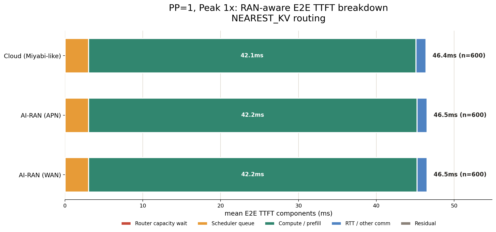
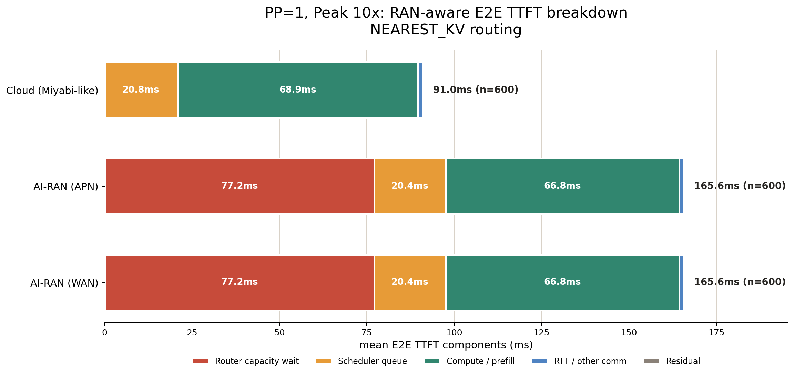
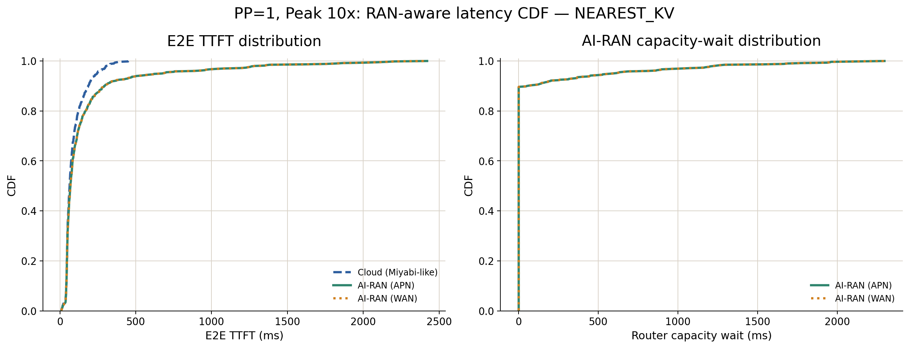

# 02-b: RAN-aware performance and economics

## 結論

PPを用いない主比較では、RANとのVRAM共有が低負荷時には性能へ影響しない一方、高負荷時にはKV cache容量を使い切り、Cloudに対する性能同等性が失われることを確認した。それでも、既設AI-RAN GPUを利用する推定電気料金はMiyabiのサービス利用料金の約45%であり、経済性は維持される。

```text
Peak 1x:
  RAN VRAM制約ありでも全requestを即時収容
  -> CloudとAI-RANのTTFTはほぼ同じ

Peak 10x:
  AI-RANのKV余力がほぼ0 GBまで低下
  -> 63/600 requestsでcapacity retry
  -> Mean TTFTは1.82倍、p99は5.10倍
  -> 性能上の同等性は失われる

Cost:
  AI-RAN推定電気料金は約136.8円/hour
  Miyabi利用料金は306円/hour
  -> 性能は低下しても経済性は残る
```

## 実験条件

- GH200 8台
- Cloud: AI専用VRAM
- AI-RAN: RAN peak時のVRAM制約、38.995416 GB/GPU
- RAN peak: 900 RRC_CONNECTED UE、90 Active TCP UE、最大12 UE/GH200
- RAN VRAM使用率: 59.2%
- AI workload: Peak 1xおよびPeak 10x、各600 requests
- Model: Llama-3.1-8B-Instruct、BF16 weight/KV
- Routing: `NEAREST_KV`
- 主比較: PP=1
- Network: APN 10.7 Gbps・300.5 us、WAN 1.0 Gbps・5 ms

## PP=1の主結果

### TTFT

| Peak | 条件 | Mean TTFT | p95 TTFT | p99 TTFT |
|---:|---|---:|---:|---:|
| 1x | Cloud | 46.370 ms | 77.886 ms | 105.193 ms |
| 1x | AI-RAN APN | 46.507 ms | 77.884 ms | 105.191 ms |
| 1x | AI-RAN WAN | 46.507 ms | 77.884 ms | 105.191 ms |
| 10x | Cloud | 90.992 ms | 245.873 ms | 356.310 ms |
| 10x | AI-RAN APN | 165.646 ms | 674.411 ms | 1,818.390 ms |
| 10x | AI-RAN WAN | 165.646 ms | 674.411 ms | 1,818.390 ms |

Peak 1xではAI-RANとCloudのMean TTFT差は0.137 ms、0.30%にすぎない。RANがVRAMを使用していてもKV cache容量に余裕があるため、RAN制約は推論critical pathへ現れない。

Peak 10xでは、AI-RANのMean TTFTはCloud比1.82倍、p95は2.74倍、p99は5.10倍となった。Meanだけでなくtailほど悪化が大きく、RANとのVRAM共有によるcapacity制約が一部requestへ集中的に影響している。







### Capacity制約

| Peak | 条件 | 最小KV余力 | 初回収容不可request | Retry総数 | Mean capacity wait | 最大capacity wait |
|---:|---|---:|---:|---:|---:|---:|
| 1x | Cloud | 72.361 GB | 0/600 | 0 | 0 ms | 0 ms |
| 1x | AI-RAN | 21.614 GB | 0/600 | 0 | 0 ms | 0 ms |
| 10x | Cloud | 39.331 GB | 0/600 | 0 | 0 ms | 0 ms |
| 10x | AI-RAN | 0.003 GB | 63/600 | 2,632 | 77.193 ms | 2,296.303 ms |

Peak 10xのAI-RANでは、10.5%のrequestが初回routing時に収容できず、capacity retryへ入った。全request平均のcapacity waitは77.193 msであり、CloudとのMean TTFT差74.654 msをほぼ説明する。したがって、性能低下の原因はGPU computeの低速化ではなく、RANがVRAMを占有したことによるKV cache収容不足である。

## APNとWANが同じになる理由

APNとWANの全指標は完全に一致した。これはnetwork設定が無効なのではなく、`NEAREST_KV`によって全requestがlocal GPUで処理され、site間offload、KV migration、rerouteが一度も発生しなかったためである。

したがって02-bからは、APNがWANより優れるとは主張できない。一方、local-only servingではsite間networkの性能差に関係なく、局所的なVRAM不足を解消できないことが分かる。これは03でgeographical offloadを導入し、APN/WAN差を評価する理由になる。

## 経済性

GH200の電力を`P_GPU(u) = 117 + 783u` W、東京の電力単価を23円/kWhとして推定した。

| Peak | AI-RAN推定電気料金 | Miyabi料金 | AI-RAN/Miyabi | AI-RAN円/1,000 req | Miyabi円/1,000 req |
|---:|---:|---:|---:|---:|---:|
| 1x | 139.08円/hour | 306円/hour | 45.5% | 4.478円 | 9.852円 |
| 10x | 136.76円/hour | 306円/hour | 44.7% | 1.056円 | 2.364円 |

この比較は、追加AI workloadをCloudへ投入する際のサービス利用料金と、RAN用として既に保有しているAI-RAN GPUへ投入する際の電気料金を比較する限界費用評価である。Peak 10xではAI-RANのTTFTが悪化するものの、600 requestsを完了し、1,000 requests当たりの推定費用はMiyabiの44.7%に収まる。

したがって02-bの主張は次のように整理できる。

> RANとのVRAM共有によって高負荷時のAI推論性能はCloudより低下するが、既設AI-RAN GPUを利用する経済性は残る。

ただし、117--900 Wの線形電力モデルはutilizationに基づくproxyであり、実測電力ではない。

## PP=2の参考結果

PP=2は02の主張には使用しないが、取得済み結果を将来の04設計確認用として記録する。

| Peak | 条件 | Mean TTFT | p95 TTFT | 初回収容不可request | Mean capacity wait |
|---:|---|---:|---:|---:|---:|
| 1x | Cloud | 44.087 ms | 71.573 ms | 0/600 | 0 ms |
| 1x | AI-RAN | 44.096 ms | 71.417 ms | 0/600 | 0 ms |
| 10x | Cloud | 115.983 ms | 252.278 ms | 0/600 | 0 ms |
| 10x | AI-RAN | 122.810 ms | 271.721 ms | 19/600 | 7.701 ms |

Peak 10xではPP=2のAI-RANもKV余力が0.050 GBまで低下したが、初回収容不可は19 requests、Mean capacity waitは7.701 msに留まった。PP=1の63 requests、77.193 msより小さい。ただし、これはPP=2を02で提案する根拠にはせず、04でsite内PPのcapacity/latency trade-offを正式に評価する際の予備的観測とする。

## 03への接続

02-bにより、問題は全GPUのcompute不足ではなく、RANがVRAMを占有するsiteでの局所的なKV cache容量不足として観測できた。次の03では、capacity waitが発生したsessionを余剰VRAMのあるremote siteへoffloadすることでTTFTを改善できるかを評価する。

APNとWANの差はlocal-onlyでは現れなかったため、03で初めてsite間transferを発生させ、次の条件を検証する。

```text
回避できるlocal capacity wait
  > remote queueing + site間network latency + state再計算または移送cost
```

## 再現用データ

- [Summary CSV](analysis/summary.csv)
- [Analysis script](scripts/analyze.py)
- [Raw results](results/)
