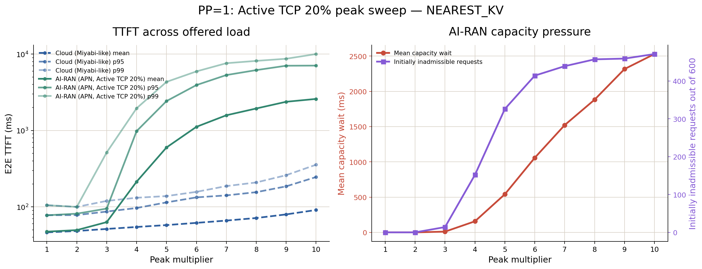
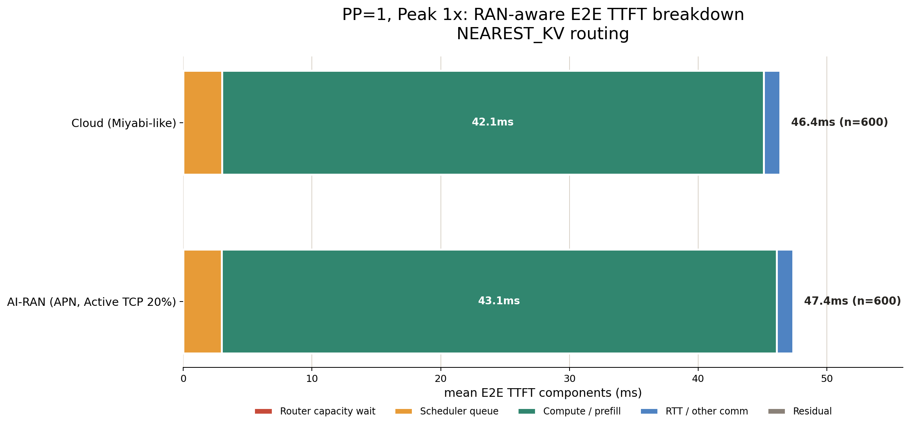
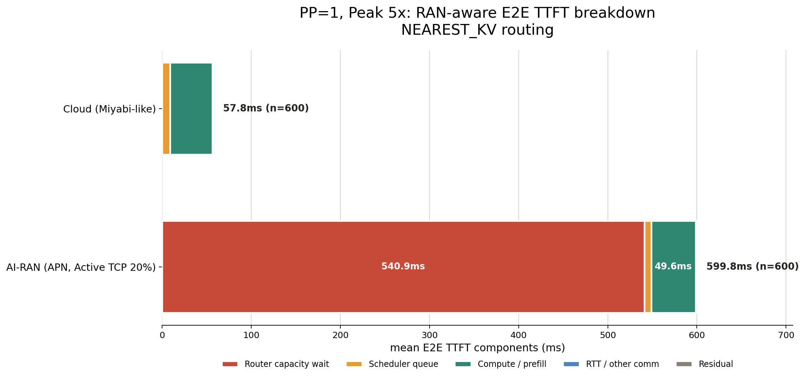
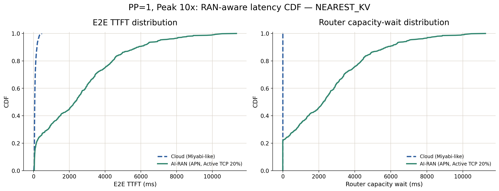
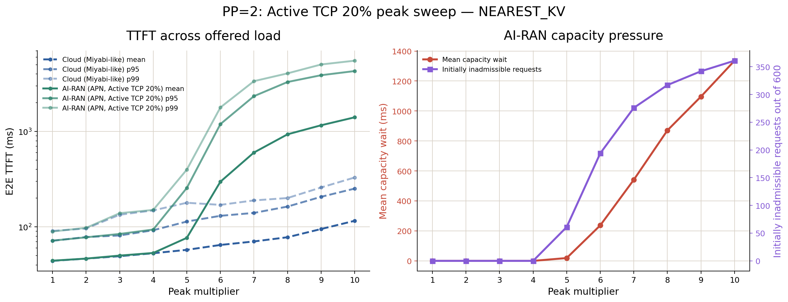

# 02-b: Active TCP UE率20%でのRAN-aware性能・経済性

## 結論

Active TCP UE率を10%から20%へ上げると、PP=1のAI-RANはPeak 2xまではCloudとほぼ同等だが、Peak 3xからVRAM容量待ちが発生し、Peak 4x以降で性能差が急拡大した。したがって、この条件は「RANとのVRAM共有によりAI推論の優位性が薄れる」ことを明確に示せる。

```text
PP=1, Peak 1x--2x:
  capacity waitなし
  AI-RANのMean TTFTはCloud比+2.2%--2.7%

PP=1, Peak 3x:
  14/600 requestsが初回収容不可
  Mean TTFTはCloud比1.23倍

PP=1, Peak 4x:
  152/600 requestsが初回収容不可
  Mean TTFTはCloud比3.91倍、p95は10.16倍

PP=1, Peak 10x:
  471/600 requestsが初回収容不可
  Mean TTFTはCloud比28.48倍

Economics:
  AI-RAN推定電気料金は約139--157円/hour
  Miyabi利用料金は306円/hour
```



## 実験条件

- GH200 8台、Tokyo/Kagoshimaの2 site
- RRC_CONNECTED peak: 900 UE
- Active TCP UE率: 20%、peak 180 UE
- site間でUEを均等配置、最大23 Active UE/GH200
- RAN VRAM使用率: 76.8%
- AI利用可能VRAM: 22.173864 GB/GPU
- AI workload: Peak 1x--10x、各600 requests
- Model: Llama-3.1-8B-Instruct、BF16 weight/KV
- Environment: Cloud、AI-RAN APN
- Routing: `NEAREST_KV`
- 主比較: PP=1、PP=2は参考結果

10%条件から変更した変数はActive TCP UE率と、それにより導出されるAI利用可能VRAMだけである。地理的な一点集中、WAN、賢いload balancingは導入していない。

## PP=1の主結果

| Peak | Cloud Mean | AI-RAN Mean | AI-RAN/Cloud | Cloud p95 | AI-RAN p95 | 初回収容不可 | Mean capacity wait |
|---:|---:|---:|---:|---:|---:|---:|---:|
| 1x | 46.370 ms | 47.381 ms | 1.02x | 77.886 ms | 77.643 ms | 0/600 | 0 ms |
| 2x | 48.332 ms | 49.645 ms | 1.03x | 78.118 ms | 81.489 ms | 0/600 | 0 ms |
| 3x | 51.420 ms | 63.155 ms | 1.23x | 86.812 ms | 94.973 ms | 14/600 | 10.501 ms |
| 4x | 54.577 ms | 213.580 ms | 3.91x | 96.646 ms | 981.624 ms | 152/600 | 157.001 ms |
| 5x | 57.756 ms | 599.810 ms | 10.39x | 114.496 ms | 2,428.219 ms | 326/600 | 540.939 ms |
| 6x | 61.764 ms | 1,117.468 ms | 18.09x | 133.204 ms | 3,933.235 ms | 414/600 | 1,057.998 ms |
| 7x | 66.168 ms | 1,582.124 ms | 23.91x | 141.337 ms | 5,318.686 ms | 439/600 | 1,521.258 ms |
| 8x | 71.482 ms | 1,941.681 ms | 27.16x | 155.766 ms | 6,175.023 ms | 457/600 | 1,882.006 ms |
| 9x | 79.693 ms | 2,377.472 ms | 29.83x | 185.621 ms | 7,049.207 ms | 459/600 | 2,315.934 ms |
| 10x | 90.992 ms | 2,591.581 ms | 28.48x | 245.873 ms | 7,077.388 ms | 471/600 | 2,528.689 ms |

### どこから差が現れるか

Peak 1xではAI-RANの最小KV余力が3.552 GB、Peak 2xでは1.042 GBあり、capacity retryは発生しない。この範囲ではCloudとの差は1.0--1.3 msであり、ほぼ同等とみなせる。

Peak 3xでは最小KV余力が0.071 GBまで低下し、初めて14 requestsが収容待ちに入る。Peak 4xでは最小KV余力が0.006 GBとなり、152 requests、全体の25.3%が初回収容不可になる。したがって、明確な性能差を見る代表点にはPeak 4xが適している。Peak 3xはcapacity制約の発生境界、Peak 10xは過負荷時の破綻挙動を示す点として使い分けられる。







### 性能低下の原因

Cloudでは全Peakでcapacity waitが0 msである。一方、AI-RANとCloudのMean TTFT差は、Peak 3x以降のMean capacity waitとほぼ一致する。たとえばPeak 10xではCloudとの差2,500.588 msに対してcapacity waitは2,528.689 msである。

よって、主因はGPU computeの低速化やAPN通信ではなく、RANがVRAMを占有した結果として生じるKV cache収容不足である。`NEAREST_KV`はlocal GPUだけを選ぶため、別siteに余剰VRAMがあってもこの局所的不足を回避できない。

## 経済性

GH200の電力を `P_GPU(u) = 117 + 783u` W、東京の電力単価を23円/kWhとして推定した。

| Peak | AI-RAN推定電気料金 | Miyabi料金 | AI-RAN/Miyabi | AI-RAN円/1,000 req | Miyabi円/1,000 req |
|---:|---:|---:|---:|---:|---:|
| 1x | 139.092円/hour | 306円/hour | 45.5% | 4.478円 | 9.852円 |
| 4x | 156.549円/hour | 306円/hour | 51.2% | 1.612円 | 3.149円 |
| 10x | 143.132円/hour | 306円/hour | 46.8% | 1.388円 | 2.363円 |

AI-RAN側は既設GPUへAI workloadを追加する際の電気料金、Miyabi側はCloudサービス利用料金である。この研究で意図する限界費用比較では、AI-RANは全PeakでMiyabi料金を下回る。ただし、Peak 4x以降は性能劣化が大きいため、「安価である」ことと「要求SLOを満たす」ことは分けて評価する必要がある。

117--900 Wの線形電力モデルはutilizationに基づくproxyであり、実測電力ではない。

## PP=2の参考結果

PP=2ではKV cache容量が増えるため、capacity waitの発生境界がPeak 3xからPeak 5xへ移動した。

| Peak | Cloud Mean | AI-RAN Mean | AI-RAN/Cloud | 初回収容不可 | Mean capacity wait |
|---:|---:|---:|---:|---:|---:|
| 1x | 44.087 ms | 44.292 ms | 1.01x | 0/600 | 0 ms |
| 4x | 53.007 ms | 53.368 ms | 1.01x | 0/600 | 0 ms |
| 5x | 57.537 ms | 76.823 ms | 1.34x | 61/600 | 18.890 ms |
| 10x | 115.983 ms | 1,408.329 ms | 12.14x | 361/600 | 1,335.634 ms |



これはsite内PPがVRAM capacityを広げる予備的証拠である。ただし02ではPPを提案手法として扱わず、正式なcapacity/latency trade-offは後段で評価する。

## ストーリーラインへの含意

20%条件から、02-bは次のように整理できる。

> RANとのVRAM共有下でも低負荷ではCloudと同等の応答性能を維持し、既設GPUを使う経済性が見込める。一方、AI負荷が増えると局所的なKV cache不足により性能優位性が失われる。

特にPeak 4xは、CloudがMean 54.577 msを維持する一方、AI-RANは213.580 msまで悪化するため、問題設定を示す代表条件に向く。後段では、このcapacity waitをsite内PPまたはremote siteへのsession移動によって緩和できるかを評価する。

## 再現用データ

- [全条件の集計](analysis/summary.csv)
- [Cloud/AI-RAN対応比較](analysis/paired_comparison.csv)
- [解析スクリプト](scripts/analyze.py)
- [Raw results](results/)
