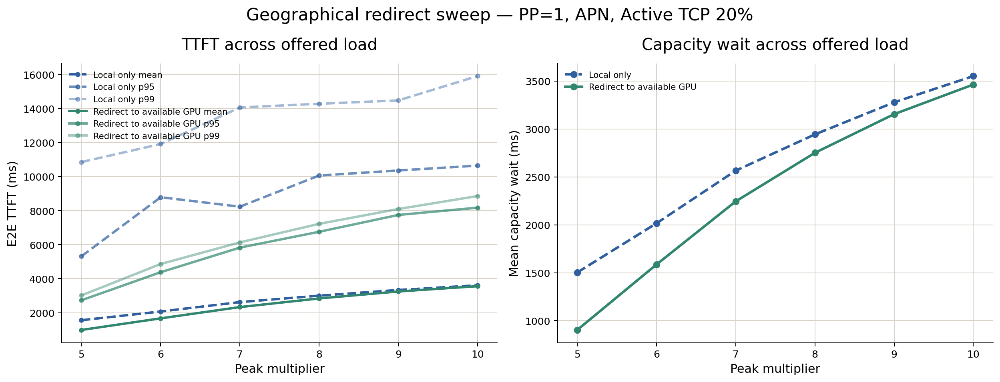
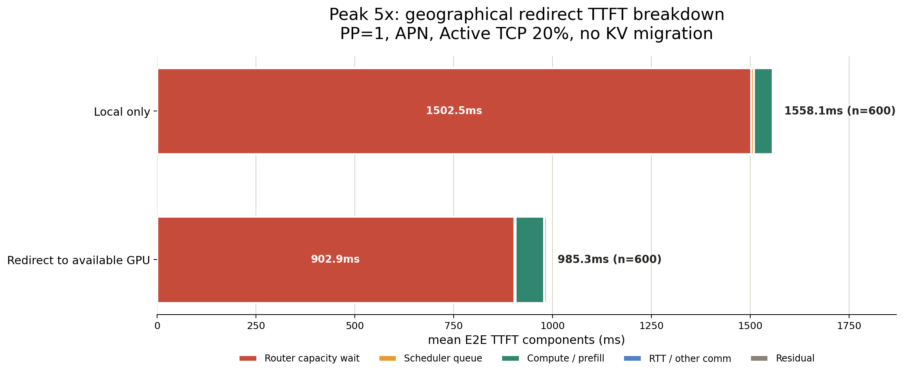
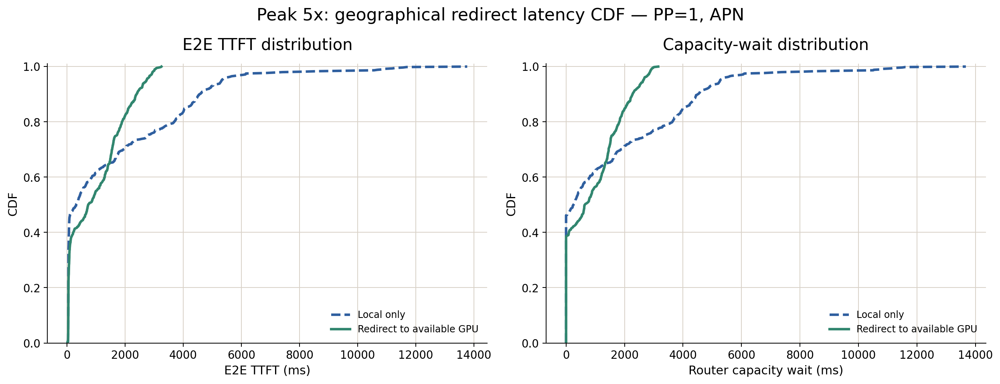
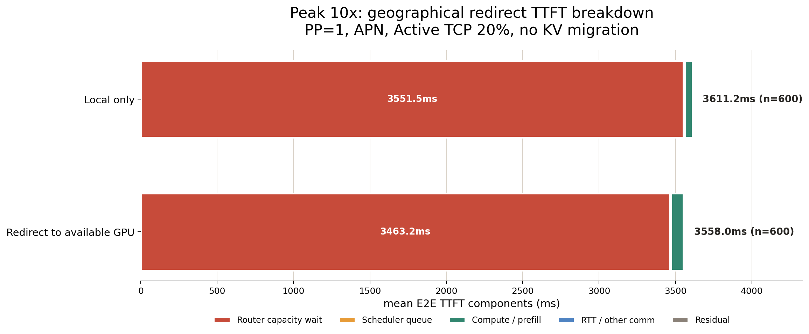
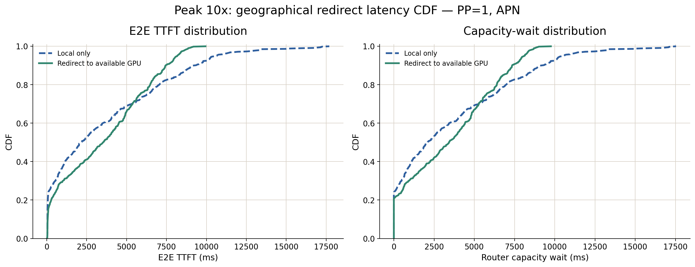

# 03: Geographical offloadのメリットと限界

## 結論

TokyoへAI requestを70%、Kagoshimaへ30%配置した地理的不均衡下では、home GPUだけで待つLocal-onlyより、収容可能なGPUへcold redirectする方が全PeakでTTFTを改善した。特にp95/p99の改善が大きく、地理分散GPUを共有する主な効果はtailを生む局所的なcapacity waitの削減にある。

一方、Peakが高くなるほどremote側の余剰も消費され、Mean TTFT改善率はPeak 5xの36.8%からPeak 10xの1.5%へ縮小した。また、KV cache migrationを行わないため、redirect先では過去prefixを再計算し、Mean compute/prefillが約24--31 ms増えた。

```text
Peak 5x:
  Mean TTFT  1,558 -> 985 ms       (-36.8%)
  p95 TTFT   5,318 -> 2,731 ms     (-48.6%)
  p99 TTFT  10,856 -> 3,016 ms     (-72.2%)

Peak 10x:
  Mean TTFT  3,611 -> 3,558 ms     (-1.5%)
  p95 TTFT  10,645 -> 8,174 ms     (-23.2%)
  p99 TTFT  15,910 -> 8,857 ms     (-44.3%)
```



## 実験条件

- GH200: 8台、PP=1
- Logical site: GPU 0--3をTokyo、GPU 4--7をKagoshimaとする
- AI request: Tokyo 420/600、Kagoshima 180/600
- Site内配置: Tokyo 105 requests/GPU、Kagoshima 45 requests/GPU
- AI workload: Hongo workloadのarrival、session、input/output tokenを維持
- RRC_CONNECTED peak: 全体900 UE
- Active TCP ratio: 20%
- GPU別RAN VRAM: Hongoの登録ユーザー分布から導出
- Network: APN 10.7 Gbps、fixed one-way propagation 300.5 us
- Peak: 5x--10x、各600 requests
- Local-only: `NEAREST_KV`
- Redirect: `NEAREST_CAPACITY_MULTI_PRESSURE_COLD_RESERVE`
- KV cache migrationなし、redirect先ではprefixを再計算

総request数、request内容、token数、arrival time、session、RAN総量、GPU数は両方式で同一であり、比較するのはcapacity不足時にremote GPUを利用するかどうかである。

## TTFT結果

| Peak | Local Mean | Redirect Mean | Mean改善 | Local p95 | Redirect p95 | p95改善 | Local p99 | Redirect p99 | p99改善 |
|---:|---:|---:|---:|---:|---:|---:|---:|---:|---:|
| 5x | 1,558 ms | 985 ms | 36.8% | 5,318 ms | 2,731 ms | 48.6% | 10,856 ms | 3,016 ms | 72.2% |
| 6x | 2,070 ms | 1,667 ms | 19.5% | 8,788 ms | 4,379 ms | 50.2% | 11,915 ms | 4,862 ms | 59.2% |
| 7x | 2,622 ms | 2,330 ms | 11.1% | 8,231 ms | 5,825 ms | 29.2% | 14,065 ms | 6,134 ms | 56.4% |
| 8x | 3,001 ms | 2,837 ms | 5.4% | 10,064 ms | 6,755 ms | 32.9% | 14,281 ms | 7,223 ms | 49.4% |
| 9x | 3,335 ms | 3,247 ms | 2.6% | 10,361 ms | 7,746 ms | 25.2% | 14,479 ms | 8,095 ms | 44.1% |
| 10x | 3,611 ms | 3,558 ms | 1.5% | 10,645 ms | 8,174 ms | 23.2% | 15,910 ms | 8,857 ms | 44.3% |

全Peakで改善しているが、Meanとtailで傾向が異なる。Mean改善は高負荷ほど小さくなる一方、p99はPeak 10xでも44.3%改善する。したがってgeographical offloadは、平均値を一様に下げるというより、局所的な長時間待ちを別GPUで吸収してtailを切り下げる効果が強い。









## Capacity wait削減

| Peak | Local capacity wait | Redirect capacity wait | 削減量 |
|---:|---:|---:|---:|
| 5x | 1,502.5 ms | 903.0 ms | 599.5 ms |
| 6x | 2,015.3 ms | 1,585.7 ms | 429.7 ms |
| 7x | 2,565.1 ms | 2,244.1 ms | 321.0 ms |
| 8x | 2,943.0 ms | 2,751.2 ms | 191.8 ms |
| 9x | 3,277.5 ms | 3,154.3 ms | 123.2 ms |
| 10x | 3,551.5 ms | 3,463.2 ms | 88.3 ms |

TTFT改善量はcapacity wait削減量とほぼ対応している。Peak 5xではcapacity waitを599.5 ms削減した一方、Mean TTFTは572.7 ms改善した。差はcold redirectによる再prefillとAPN通信の増加で説明できる。

高負荷ほど削減量が小さくなるのは、Kagoshima側の45 requests/GPUという初期余剰もredirectによって消費され、全GPUが次第に逼迫するためである。したがってoffloadの有効条件は次の通りである。

```text
回避できるlocal capacity wait
  > remote capacity wait + cold recomputation + APN overhead
```

## Redirectの内訳

| Peak | Redirect | Site間redirect | Site間割合 | Tokyo→Kagoshima |
|---:|---:|---:|---:|---:|
| 5x | 358 | 202 | 56.4% | 148 |
| 6x | 393 | 224 | 57.0% | 155 |
| 7x | 404 | 255 | 63.1% | 183 |
| 8x | 440 | 271 | 61.6% | 193 |
| 9x | 447 | 269 | 60.2% | 183 |
| 10x | 443 | 270 | 60.9% | 187 |

GPU 0--3とGPU 4--7をsite境界として判定すると、redirectの約56--63%がsite間移動である。Tokyo→Kagoshimaがsite間redirectの多数を占め、70/30の需要偏在から余剰siteを利用する意図通りの移動が発生した。

ただし、現在のpolicyは全GPUからcapacity pressure最小のGPUを選ぶため、残り約37--44%は同一site内redirectである。03の結果は厳密には「site間だけ」ではなく、site内とsite間を含むglobal capacity sharingの効果である。

## Cold redirectのオーバーヘッド

RedirectではKV cacheを移送しないため、remote GPUでprefixを再計算する。

| Peak | Local compute/prefill | Redirect compute/prefill | 増加 |
|---:|---:|---:|---:|
| 5x | 47.7 ms | 71.9 ms | 24.2 ms |
| 6x | 46.6 ms | 72.0 ms | 25.3 ms |
| 7x | 48.4 ms | 75.0 ms | 26.7 ms |
| 8x | 48.0 ms | 75.5 ms | 27.5 ms |
| 9x | 48.4 ms | 79.4 ms | 31.0 ms |
| 10x | 49.3 ms | 80.3 ms | 31.0 ms |

APNを含むMean communicationはLocal-onlyの1.28 msに対しRedirectで1.65--1.74 msであり、増加は0.4--0.5 ms程度に留まる。この条件ではnetwork latencyよりcold recomputationの方が大きな追加costである。

## 04への接続

03から次の二点が示された。

1. 地理的不均衡がありremote側に余剰が残る場合、global redirectによってlocal capacity wait、とくにtail TTFTを削減できる。
2. KV cacheを伴わないcold redirectでは再prefillが必要であり、高負荷ではremote capacityも枯渇してMean改善が小さくなる。

したがって04では、次の役割を分離して評価する。

```text
KV cache migration:
  cold recomputationを避ける

Site内PP:
  各siteのKV cache収容能力を増やす

PP + KV cache migration:
  より多くのstateful sessionを低い追加costで再配置する
```

03のLocal-onlyとcold redirectは、04における提案方式のbaselineとしてそのまま利用できる。

## 注意点

- Tokyo/KagoshimaはGPU IDによるlogical site分割である。
- APN fixed propagationはredirectごとに適用されるため、同一site内redirectにもAPN相当costを課している。これは同一site内redirectについては保守的である。
- `NEAREST_CAPACITY_MULTI_PRESSURE_COLD_RESERVE`はoracleではなく、収容可能なGPUのうちcapacity pressure最小を選ぶ単純policyである。
- 旧Hongo自然分布の弱い不均衡条件は`archive_weak_imbalance/`へ分離しており、本結果には含めない。

## 再現用データ

- [Summary CSV](analysis/summary.csv)
- [Figures](figures/)
- [Analysis script](scripts/analyze.py)
- [Raw results](results/)
- [Logs](logs/)
- [Archived preliminary run](archive_weak_imbalance/)
