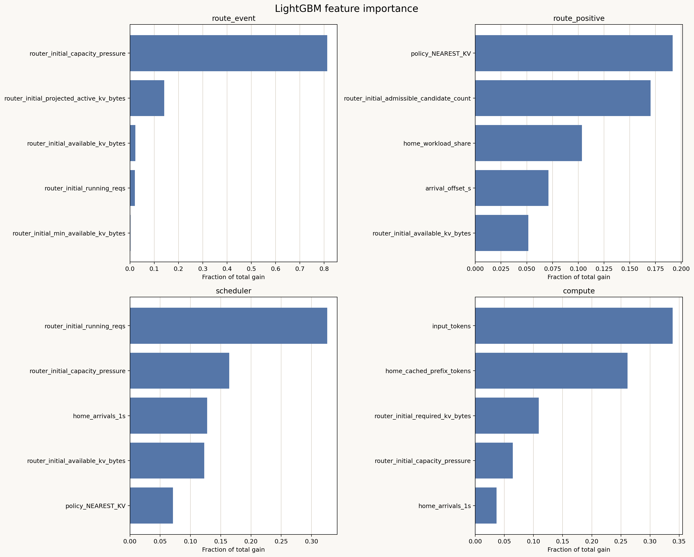
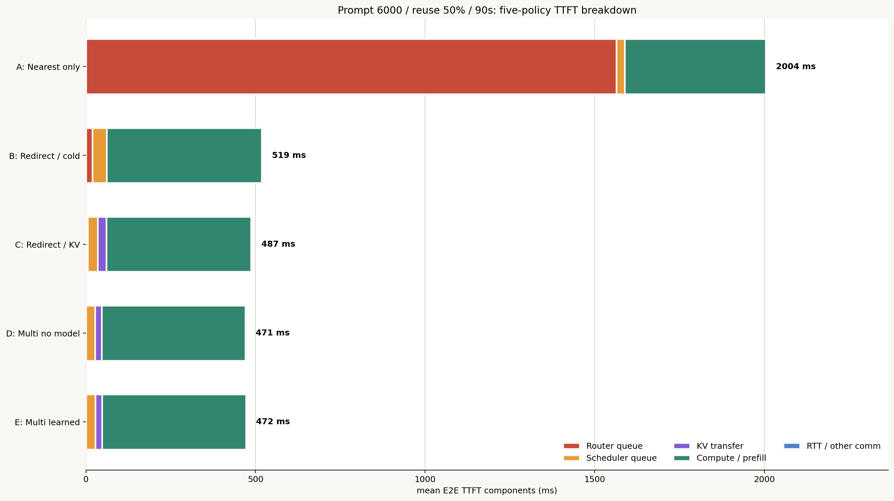
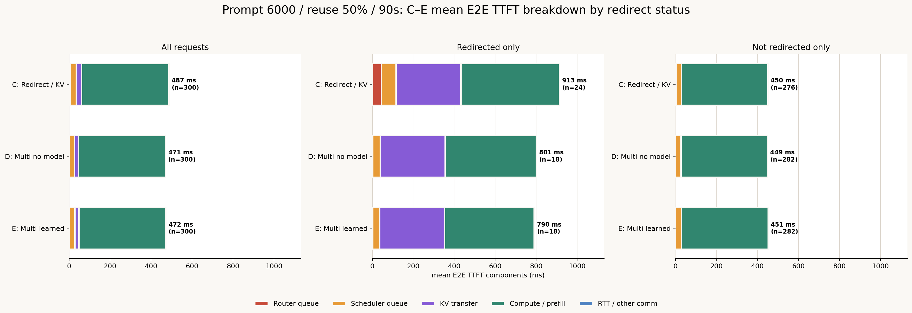

# 2026-07-22時点で確認できたTTFT・Routing挙動の統合まとめ

## 0. この資料の位置づけ

本資料は、2026-07-16から2026-07-22に実施したTTFT component回帰、KV handoff、
Multi-candidate routing、GPU utilization、mixed workload、counterfactual replayの結果を
横断し、現時点で確認できた挙動をまとめたものである。

以下では、シミュレーションと集計から直接確認した内容を「確認済み」、そこから導いた
設計上の説明を「解釈・仮説」として区別する。Counterfactualはまだ実行途中なので、その数値は
暫定値である。

---

## 1. 現時点の主要結論

1. **通常領域のTTFTはCompute/prefillが支配する。** Input token数が増えるほど遅くなり、
   cached prefix token数が増えるほど短くなる。
2. **高負荷時の平均・tail TTFTはRouter queueが支配する。** 特に新規requestを含めた
   KV capacity pressureが、Router queue発生をほぼ決める。
3. **Queue発生後の待機時間は、別GPUへの逃げ道に左右される。** Routing policy、
   admissibleな候補GPU数、homeへの負荷集中が重要である。
4. **全admissible GPUを探索するMulti-candidate方式は有効である。** 2番目に近いGPUへ固定する
   方式よりredirect先の集中を防ぎ、Router queueのtailを大きく削減した。
5. **現時点では学習モデルよりcapacity-pressure最小選択の方が堅牢である。** 学習モデルは
   通常はbest候補に近いが、一部requestで100--270ms級の大きなregretを出す。
6. **学習モデルのlocal待機ゲートは実質的に飽和している。** 固定10.3秒の上側補正により、
   homeがKV不足になったrequestは常に1秒待機上限を超えると評価される。
7. **KV handoffの利益はinput長、reuse率、負荷に依存する。** Inputとreuseがともに大きく、
   Router queueが実際に存在する条件で効果が大きい。
8. **単一の支配要因は存在せず、負荷regimeで切り替わる。** 低負荷ではuncached tokens、
   capacity境界ではKV収容余力、高負荷tailでは逃げ先と負荷持続性が支配的である。

---

## 2. TTFT定式化

Request送信時点の情報から、E2E TTFTを次のcomponentへ分解する。

$$
\boxed{
\widehat{TTFT}
=
\hat t_{route}
+\hat t_{sched}
+\hat t_{compute}
+\hat t_{comm}
}
$$

現行のpoint predictionでは通信時間の平均影響が小さく、redirect後に確定するため
$\hat t_{comm}=0$としている。Router queueはzero-inflatedな二段階モデルである。

$$
p_{route}=\sigma\left(\beta_0+\boldsymbol{\beta}^{\mathsf T}\boldsymbol{h}\right)
$$

$$
\hat t_{route,+}
=
\exp\left(clip(g(\boldsymbol{h}),0.001642,10.878924)\right)-1
$$

$$
\boxed{
\hat t_{route}=p_{route}\hat t_{route,+}
}
$$

$\boldsymbol{h}$は、27個の標準化数値特徴量とrouting policyのone-hot入力を結合した
特徴量ベクトルである。$g$はqueueが発生したrequestだけで学習した深さ2・100本の
Gradient Boosting回帰木である。

Scheduler待ちはRidge回帰で予測する。

$$
\hat t_{sched}
=
\max\left(0,\gamma_0+\boldsymbol{\gamma}^{\mathsf T}\boldsymbol{h}\right)
$$

Compute/prefillはraw token数による線形式である。

$$
\boxed{
\hat t_{compute}
=
\max\left(
0,-96.717513+0.1440215I-0.1190117C
\right)
}
$$

$I$はinput token数、$C$はhome GPU上で利用可能なcached prefix token数である。

### Formulaの評価

13,500 requests、15 independent scenariosのleave-one-scenario-out評価結果は次である。

| Target | OOF metric |
|---|---:|
| Router queue発生 | ROC-AUC 0.99995 |
| Router queue発生 | PR-AUC 0.99971 |
| Router component | MAE 630.2ms |
| Scheduler component | MAE 56.6ms |
| Compute component | MAE 59.7ms |
| **TTFT** | **MAE 716.1ms** |
| **TTFT** | **$R^2=0.467$** |

Queueが発生するかは高精度に分類できる一方、発生後の長いRouter waitは過小予測する。
Absolute TTFT errorはp50 73.2ms、p90 1,015ms、p95 4,050ms、p99 13,578msであり、
long-tailの時間量推定が課題である。

---

## 3. LightGBMで確認した特徴量重要度

既存formulaと同じ入力・scenario-held-out分割で4 componentをLightGBM化した。

### Component別Top 5

| Component | 順位 | 特徴量 | Gain fraction | 意味 |
|---|---:|---|---:|---|
| Route発生 | 1 | `router_initial_capacity_pressure` | 81.3% | 新規requestを含めたKV収容圧力 |
| Route発生 | 2 | `projected_active_kv_bytes` | 14.1% | 既存request群の将来KV使用量 |
| Route発生 | 3 | `available_kv_bytes` | 2.2% | 既存requestを考慮した予測空きKV |
| Route発生 | 4 | `running_reqs` | 2.0% | Inflightなrequest数 |
| Route発生 | 5 | `min_available_kv_bytes` | 0.2%未満 | 全候補中で最も小さいKV余力 |
| 正値Route時間 | 1 | `policy_NEAREST_KV` | 19.2% | Homeで待つpolicyか |
| 正値Route時間 | 2 | `admissible_candidate_count` | 17.0% | 即時に使える逃げ先GPU数 |
| 正値Route時間 | 3 | `home_workload_share` | 10.4% | Homeへの長期的な負荷集中 |
| 正値Route時間 | 4 | `arrival_offset_s` | 7.1% | Run内の混雑蓄積・drainのproxy |
| 正値Route時間 | 5 | `available_kv_bytes` | 5.2% | Home/candidateのKV余力 |
| Scheduler | 1 | `running_reqs` | 32.6% | Sequence/token budget競合 |
| Scheduler | 2 | `capacity_pressure` | 16.4% | KV収容余力 |
| Scheduler | 3 | `home_arrivals_1s` | 12.8% | 直近1秒の局所burst |
| Scheduler | 4 | `available_kv_bytes` | 12.3% | KV解放待ちのproxy |
| Scheduler | 5 | `policy_NEAREST_KV` | 7.1% | Home側へ処理を残すか |
| Compute | 1 | `input_tokens` | 33.9% | 元のprompt量 |
| Compute | 2 | `home_cached_prefix_tokens` | 26.1% | 再計算を省略できるprefix量 |
| Compute | 3 | `required_kv_bytes` | 10.9% | Request sizeの別表現 |
| Compute | 4 | `capacity_pressure` | 6.4% | Batch/混雑状態のproxy |
| Compute | 5 | `home_arrivals_1s` | 3.7% | 局所burstのproxy |

### 解釈

- **通常時**: $I-C\simeq I(1-\rho)$で表されるuncached input量が支配的。
- **Capacity境界**: GPUへrequestを収容できるかを表すKV capacity pressureが支配的。
- **高負荷tail**: Routing policy、admissible GPU数、homeへの負荷集中が支配的。
- **Scheduler**: Running requestsと短時間arrival burstが支配的。

Gain importanceは因果効果ではない。`capacity_pressure`、`projected_active_kv_bytes`、
`available_kv_bytes`は同じKV状態から派生する強相関特徴なので、個別順位ではなく
「KV収容余力」という特徴量群として解釈する。

### LightGBMと既存formulaの比較

| Metric | 既存formula | LightGBM |
|---|---:|---:|
| Route MAE | 630.19ms | 612.32ms |
| Scheduler MAE | 56.64ms | 39.38ms |
| Compute MAE | 59.68ms | 69.71ms |
| TTFT MAE | 716.08ms | 706.81ms |
| TTFT $R^2$ | 0.46736 | 0.46713 |

LightGBMはRouteとSchedulerを改善したがComputeを悪化させ、最終TTFTの改善は9.27msに
留まった。全面的なblack-box化より、Computeは線形式、Route/Schedulerは解釈可能な
GAMまたは小さいtree modelとするhybridが妥当である。

---

## 4. Capacity pressureの定義

`router_initial_capacity_pressure`は、最初のrouting判断時にそのGPUへ新規requestを
配置した場合のKV圧力である。

$$
\boxed{
capacity\ pressure
=
\frac{projected\ active\ KV+required\ KV}{KV\ budget}
}
$$

- `projected_active_kv_bytes`: Waiting/running requestsが完了までに必要とする予測KVと
  他request向け予約KVの合計。
- `required_kv_bytes`: 新規requestが完了までに必要とするblock-rounded KV容量。
- `kv_budget_bytes`: GPU上でKV cacheに利用できる総容量。

1.0を超えると予測必要量がKV budgetを超える。これは瞬間的なGPU memory使用率ではなく、
既存requestと新規requestの将来KV成長を先読みした指標である。

---

## 5. Modelなし・ありのMulti-candidate routing挙動

### 共通のadmissible条件

Homeおよびredirect候補は次の両方を満たす場合にadmissibleとなる。

1. `running_reqs + reserved_slots < max_num_seqs`
2. `required_kv_bytes <= available_kv_bytes`

HomeがadmissibleならD/Eともlocalで処理する。Homeが非admissibleなら、全non-home GPUから
admissible候補を探索する。候補がなければ容量が空くまで待って再評価する。

### D: Modelなし

`NEAREST_CAPACITY_MULTI_PRESSURE_KV_RESERVE`は、admissible候補のうちcapacity pressureが
最小のGPUへ即redirectする。Local待機とのTTFT比較は行わない。

### E: Modelあり

`NEAREST_CAPACITY_MULTI_FORMULA_KV_RESERVE`は、各admissible候補について次を計算する。

$$
predicted\ redirect\ TTFT
=formula(candidate)+request\ migration+KV\ migration+downlink
$$

予測値が最小の候補を選び、次のいずれかを満たせばredirectする。

1. `redirect prediction + 200ms < local prediction`
2. 予測local Router waitが1秒を超える
3. 実際のlocal待機が1秒を超える

### Local待機ゲートの飽和

Router tailの過小予測を防ぐため、localの安全判定には次の上側予測を使う。

$$
\hat t_{route,upper}=\hat t_{route,+}+10{,}311.69\,\mathrm{ms}
$$

10.3秒はモデルがKV不足から直接予測した値ではなく、scenario-held-out residualのp90を
一律に足した安全補正である。Prompt 6000 / 90s実験では、Eでredirectされた18件すべてが
`predicted_local_wait_exceeds_limit`だった。

確認値:

- D/Eのredirect request IDは完全一致（18件）。
- 全18件のhome block理由は`npu_memory`。
- Eの予測local waitは14.4--19.4秒、待機上限は1秒。
- 全18件で`redirect + 200ms < local`も成立。
- Redirect先GPUはD/Eで8/18件だけ一致し、10/18件は異なった。

したがって現在のEは、実質的に「Dと同じredirectゲート＋formulaによる候補ランキング」
として動作している。

---

## 6. Prompt 6000 / reuse約50% / 90sのfive-policy実験

条件は300 requests、20 users、10 RTX 4090、平均約3.33rpsである。「300 users」ではない。

| Policy | Mean TTFT | p95 | p99 | Redirects |
|---|---:|---:|---:|---:|
| A: Nearest only | 2004.1ms | 14021.0ms | 19958.1ms | 0 |
| B: Redirect / cold | 518.5ms | 917.9ms | 2369.1ms | 24 |
| C: Redirect / KV | 487.1ms | 785.6ms | 1338.6ms | 24 |
| D: Multi no model | **470.5ms** | 758.6ms | **931.1ms** | 18 |
| E: Multi learned | 471.7ms | **747.8ms** | 932.6ms | 18 |

確認できた挙動:

1. Nearest固定は少数の長いRouter queueによりmeanとtailが大幅に悪化する。
2. Redirectを許可するとmeanは約2.0秒から約0.5秒へ短縮する。
3. KV handoffはcold redirectよりComputeとRouter queueを削減し、meanを31.5ms改善する。
4. Multi-candidateはさらにRouter queueをほぼ0へ下げる。
5. D/Eの全体性能はほぼ同等で、学習モデルの明確な価値は確認できない。

### C/D/Eのredirect別内訳

| Policy | All | Redirected only | Not redirected only |
|---|---:|---:|---:|
| C: Redirect / KV | 487ms (300) | 913ms (24) | 450ms (276) |
| D: Multi no model | 471ms (300) | 801ms (18) | 449ms (282) |
| E: Multi learned | 472ms (300) | 790ms (18) | 451ms (282) |

Multi-candidateの改善は、非redirect requestの短縮ではなく、redirect件数とredirect先の集中を
抑え、redirect対象と後続requestのcapacity trajectoryを改善したことによる。

---

## 7. Mixed workloadで確認した挙動

1 run内でinput 512/2000/4000/6000/8000/10000（各50件）、reuse 0/25/50%
（各100件）、normal 240件/burst 60件を混在させた。各rateで3 seeds、各policy 900 requestsを
プールした。

### 2.5rps

| Policy | Mean | p50 | p95 | p99 | Redirects |
|---|---:|---:|---:|---:|---:|
| KV migrate | 572.2ms | 517.6ms | 1332.4ms | 1780.1ms | 12 |
| Multi no model | 571.3ms | 511.5ms | 1327.7ms | 1780.0ms | 12 |
| Multi learned | 570.8ms | 506.2ms | 1332.4ms | 1807.1ms | 12 |

低負荷では3手法の差はほぼ無い。

### 3.33rps

| Policy | Mean | p50 | p95 | p99 | Redirects |
|---|---:|---:|---:|---:|---:|
| KV migrate | 716.4ms | 550.3ms | 1677.5ms | 3294.2ms | 82 |
| Multi no model | **607.5ms** | **536.6ms** | **1353.6ms** | **1885.2ms** | 55 |
| Multi learned | 617.0ms | 539.5ms | 1374.8ms | 1891.3ms | 58 |

確認できた挙動:

1. Multi no modelはKV migrateに対しmean 15.2%、p95 19.3%、p99 42.8%改善した。
2. Multi learnedはMulti no modelよりmeanで9.5ms遅く、全3 seedsで一貫して悪化した。
3. 3.33rpsではlearnedはほぼ全input長で悪化し、特に6000/8000/10000で差が大きい。
4. Learned redirectの予測誤差はMAE 127.3ms、p95絶対誤差497.8msだった。
5. 混合workloadでは、均質scenarioで学習した絶対TTFT式が候補ランキングへ十分汎化しない。

各workloadの全件/redirectのみ/非redirectのみCDFは次に出力した。

- [TTFT CDF by workload](../../../experiments/2026-07-21_mixed_workload_model_value/figures/ttft_cdf_by_workload/)
- [CDF quantiles CSV](../../../experiments/2026-07-21_mixed_workload_model_value/analysis/ttft_cdf_by_workload_quantiles.csv)

CDFからも、非redirect requestではpolicy差が小さく、高負荷時のredirect対象とtailで差が付くことが
確認できる。

---

## 8. KV handoffの効果が大きくなる条件

複数実験を横断すると、KV handoffの効果は次の条件に依存する。

1. Redirectが実際に発生するだけのinput長・到着率であること。
2. Reuse率が十分に高く、節約prefill時間が転送時間を上回ること。
3. Input token数が大きく、同じreuse率でも節約できる絶対token数が大きいこと。
4. Router queueが元々存在し、requestの早期完了・KV解放が後続requestへ波及すること。

確認例:

| Input | Reuse | KV handoffの全request平均効果 |
|---:|---:|---:|
| 6000 | 50% | +2.1ms（ほぼ差なし） |
| 8000 | 50% | -139.3ms |
| 10000 | 50% | -2078.4ms |

Input 10000 / reuse 50%では、redirect対象のCompute短縮約577msがKV transfer約528msと
ほぼ相殺されるにもかかわらず、全体meanは約2.07秒改善した。主因は当該requestの直接短縮より、
早期KV解放によって後続requestのRouter queueが連鎖的に減ったことである。

一方、reuse率が低い条件では、転送コストとtrajectory変化によって悪化する場合がある。
KV handoffは常時有効にするのではなく、次の損益条件で選ぶべきである。

$$
predicted\ prefill\ saving
>
KV\ transfer+additional\ communication
$$

---

## 9. Counterfactual replayの暫定結果

18 redirect判断・161候補のうち、baseline選択済み18候補を除く143候補を追加simulationする。
2026-07-22の本資料更新時点では、status fileベースで78 completed、9 running、3 failed、
53未着手である。Resultを直接結合すると98/161候補にactual labelがあり、9/18判断で全候補が
揃っている。

完全9判断の暫定評価:

| Metric | Formula model | Capacity pressure |
|---|---:|---:|
| Top-1 accuracy | 11.1% | 22.2% |
| Mean regret | 71.6ms | 64.5ms |
| Median regret | **7.7ms** | 10.0ms |
| Mean Spearman | 0.156 | **0.404** |

Modelは多くの判断でbestから数msに収まる一方、request 49（+268.1ms）、67（+155.9ms）、
154（+189.5ms）の大外れがmeanを悪化させた。Capacity pressureもrequest 82（+226.1ms）、
154（+189.5ms）、156（+137.1ms）で大きく外しており、完全な解ではない。

現時点の解釈:

- Formulaは通常時のmedian regretは小さいが、候補差を誤って増幅する大外れがある。
- Capacity pressureは候補全体の順位相関がより高い。
- 「Top-1完全一致」だけでは良い候補が数ms差で並ぶ状況を過度に厳しく評価するため、
  regretとTop-$k$/best+10ms率も併用すべき。
- 9/18判断の暫定値であり、全counterfactual完了まではモデル優劣を確定しない。

---

## 10. 全体TTFTを下げるために有効そうな戦略

### 提案手法の整理

現時点の提案は、**routing向け5手法とsystem-level予測向け1手法の合計6手法**に整理できる。
これらはすべて競合する代替案ではなく、手法1を基本routingとし、手法2--5を段階的に
組み合わせる構成である。手法6はrouting用ではなく、実験条件からmean/p95 TTFTを説明する
別目的のモデルである。

| 番号 | 提案手法 | 目的 | 主な入力 | 現状 |
|---:|---|---|---|---|
| 1 | Capacity-aware Multi-candidate | Redirect先GPUを選ぶ基本手法 | Capacity pressure、admissibility | 実装・効果確認済み |
| 2 | 解釈可能なcandidate score / GAM | Pressure単独へrunning・burst・backlogを追加 | Pressure、running、waiting、recent arrivals | 提案・未実装 |
| 3 | Local待機超過確率モデル | Localで待つかredirectするかを判断 | Remaining work、KV解放見込み、queue状態 | 提案・未実装 |
| 4 | KV handoff損益ゲート | KVを移送するかcold prefillするかを判断 | Uncached tokens、KV転送時間、通信時間 | 一部機構あり・損益判定は未実装 |
| 5 | Regime-aware controller | 低負荷/境界/高負荷で重みとpolicyを切替 | Offered load、capacity pressure、burst | 提案・未実装 |
| 6 | System-level TTFT GAM | 実験条件からmean/p95 TTFTを説明 | Input、rps、users、reuse率 | 提案・user数sweep待ち |

最終的なonline routingの理想形は、次の順序で手法1--5を統合する。

1. Homeと全GPUのadmissibilityを確認する。
2. 手法3でHomeが短時間に空く確率を評価する。
3. Redirectする場合は手法2で候補GPUをrankする。
4. 手法4でKV handoffとcold prefillを比較する。
5. 手法5で負荷regimeに応じてlocalityとcapacityの優先度を切り替える。
6. 選択先へKV、slot、prefill tokensを予約する。

### 優先度1: Capacity-aware Multi-candidate

Homeが非admissibleなら全GPUを探索し、少なくともcapacity pressure、running requests、
waiting prefill tokens、直近arrival/reservationを使って候補を比較する。Redirect先を1--2台に
固定しない。

### 優先度2: Prefix localityとKV handoff

低負荷ではlocal prefix reuseを優先する。Redirect時は、節約できるuncached tokensとKV transfer
時間を比較し、利益が見込める場合だけhandoffする。

### 優先度3: Local待機専用モデル

Globalな10.3秒固定補正をcandidate比較に使わず、次を直接推定する。

$$
P(home\ becomes\ admissible\ within\ 1s)
$$

必要特徴は、running requestごとの残りoutput tokens、次の完了予測時刻、解放見込みKV、
waiting prefill tokens、decode構成である。

### 優先度4: 解釈可能な候補score

Black-boxな絶対TTFTより、次の加重scoreまたはGAMを用いる。

$$
Score_g
=
w_KK_g+w_RR_g+w_WW_g+w_BB_g
+T_{KV,g}+T_{uncached\ prefill,g}
$$

- $K_g$: capacity pressure
- $R_g$: running request pressure
- $W_g$: waiting/prefill backlog
- $B_g$: recent arrival・reservation burst
- $T_{KV,g}$: KV handoff時間
- $T_{uncached\ prefill,g}$: 候補上で再計算するprefixを含むprefill時間

### Regime-awareな切り替え

| Regime | 優先する戦略 |
|---|---|
| 低負荷 | Prefix locality、不要なredirect回避 |
| Capacity境界 | Capacity pressureによる全GPU分散とreservation |
| 高負荷・tail | Localityよりadmissibility、Multi-candidate、KV handoff |

---

## 11. 理想とする解釈可能なTTFTモデル

システム設計・what-if分析用には、次のような少数入力の解釈可能モデルを目標とする。

$$
\boxed{
\widehat{TTFT}
=
f(I,\lambda,U,\rho)
}
$$

- $I$: Input token数
- $\lambda$: Arrival rate（rps）
- $U$: User数
- $\rho$: KV reuse率

物理的に意味のある派生量は次である。

$$
I_{uncached}=I(1-\rho)
$$

$$
L_{gpu}=\frac{\lambda I(1-\rho)}{G}
$$

$G$はGPU数である。GAMを用いるなら、例えば次の形にする。

$$
\widehat{TTFT}
=
\beta_0
+s_1(I(1-\rho))
+s_2\left(\frac{\lambda I(1-\rho)}{G}\right)
+s_3\left(\frac{U}{G}\right)
+s_4(\rho)
$$

ただし現在のdatasetではuser数がほぼ20固定なので、$U$の効果はまだ学習できない。
User数を変えた追加sweepが必要である。また、上式はscenario全体のmean/p95予測向けであり、
個々のcandidate routingにはGPU runtime stateを加えた別モデルが必要である。

---

## 12. 未解決事項

1. Counterfactual 143追加simulationを完了し、18判断すべてで候補ランキングを評価する。
2. 固定10.3秒補正を、条件付きquantileまたは1秒超過確率モデルへ置き換える。
3. Candidateごとのremaining work、次回KV解放時刻、decode/prefill構成を記録する。
4. Formula、capacity pressure、解釈可能GAM/scoreを同じcounterfactual正解で比較する。
5. User数を変えたsweepを追加し、$TTFT=f(I,\lambda,U,\rho)$を推定可能にする。
6. Meanだけでなくp50/p90/p95/p99、regret、best+10ms率を評価する。

現時点では、production相当のrouting baselineとしては
`NEAREST_CAPACITY_MULTI_PRESSURE_KV_RESERVE`が最も堅牢であり、学習モデルはlocal待機ゲートと
候補ランキングの両方を再設計してから再評価するのが妥当である。
